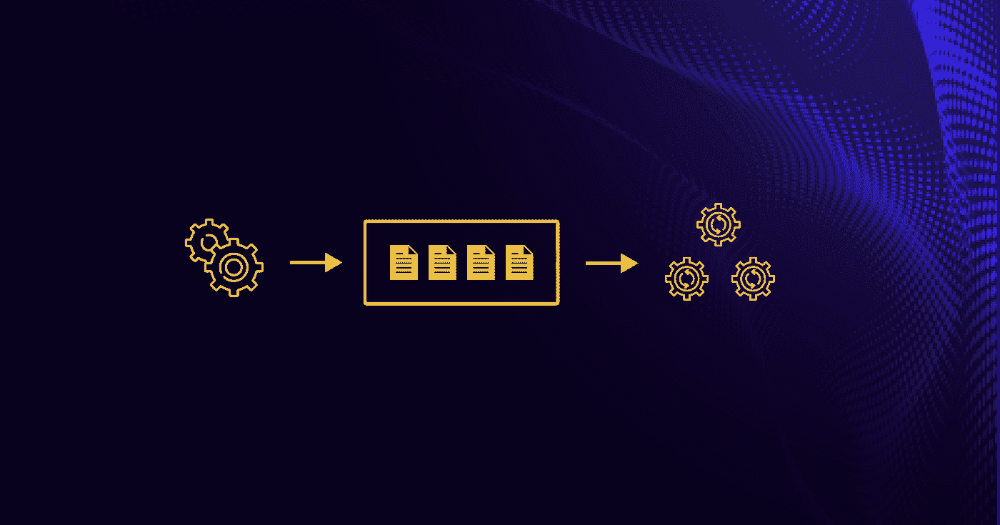
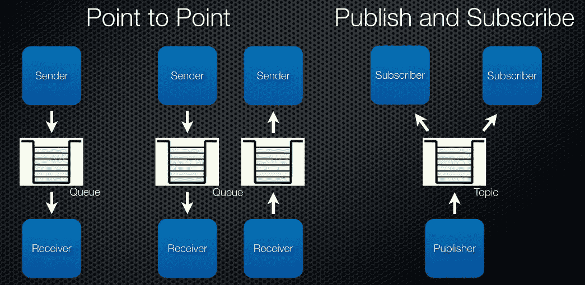
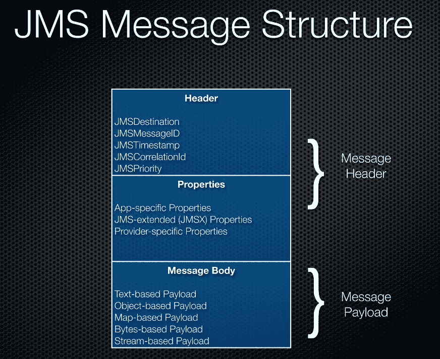
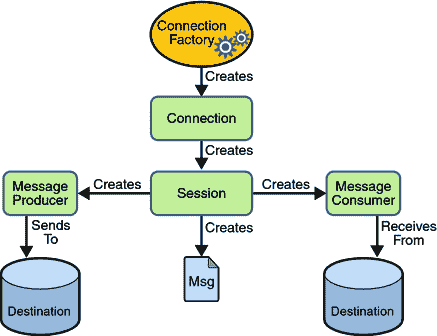
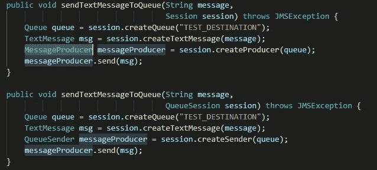
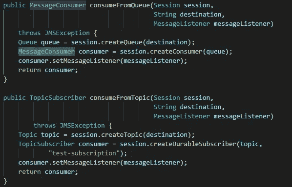
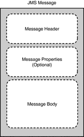
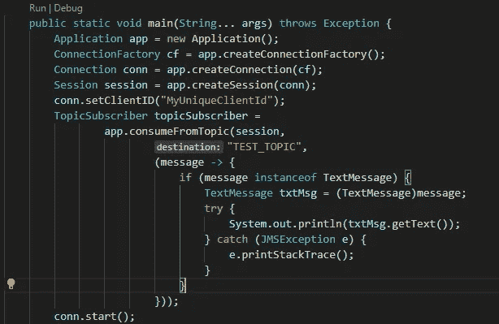
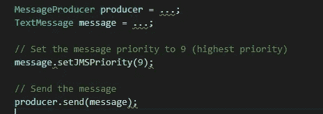
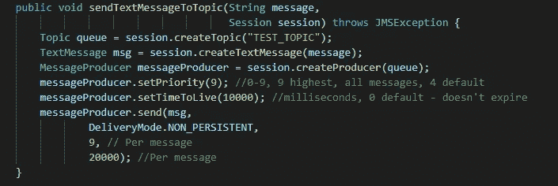

# （同 JavaMessageService）Java 消息服务

> 原文：<https://blog.devgenius.io/jms-676935cd2510?source=collection_archive---------25----------------------->

# **什么是 JMS？**

Java 消息服务(JMS)是一个应用程序接口(API ),它允许 Java 程序使用消息传递提供者的消息传递服务，如 IBM 的 MQSeries 或 Java 2 Platform，Enterprise Edition (J2EE)中包含的 JMS 提供者。JMS 允许应用程序组件以松耦合、可靠和异步的方式创建、发送、接收和读取消息。这使它们能够相互通信，而不需要知道底层消息传递系统或它们与之通信的其他组件的细节。JMS 是 Java Enterprise Edition (Java EE)平台的一部分，它经常用于企业应用程序开发。

# 为什么使用消息传递？

消息传递在 JMS 和 Java EE 应用程序的上下文中有用有几个原因。一些主要的好处包括:

*   **解耦**:消息传递允许不同的应用程序组件相互通信，而不需要知道其他组件或底层消息传递系统的细节。这将组件解耦，使整个系统更加灵活和可伸缩。
*   **可靠性**:消息传递提供了一种可靠的方式来传递消息，即使在消息发送时组件不可用。例如，一条消息可以被传递到一个目标队列，它将一直保留在那里，直到消费者准备好接收它。这消除了发送者重试发送消息或消费者轮询新消息的需要。
*   **异步**:消息传递允许组件之间的通信是异步的，这意味着发送方和接收方不需要同时处于活动状态。这可以提高系统的性能和可伸缩性，因为它允许组件在消息准备就绪时处理消息，而不必等待其他组件的响应。
*   **负载平衡**:在分布式系统中，消息传递可用于在多个消费者进程或机器之间分配工作负载，从而提高系统的整体性能和可伸缩性。
*   **事务支持** : JMS 支持事务，允许多个消息作为一个原子单元发送或接收。这可以确保事务中的所有消息都成功传递，或者都不传递。这对于确保分布式系统中数据的完整性非常有用。

# 混乱模型

JMS 中有两种主要的消息传递模型:点对点(PTP)和发布/订阅(发布/订阅)。

*   **点对点(PTP)** :在 PTP 模型中，每条消息只有一个消费者。这类似于向特定收件人发送电子邮件，只有该收件人可以阅读邮件。发送者将消息发送到目标队列，使用者从该队列接收消息。当发送者和消费者彼此不认识时，或者当消息只需要传递给一个消费者时，通常使用 PTP 模型。
*   **发布/订阅(pub/sub)** :在发布/订阅模型中，每条消息可以有多个消费者。这类似于向邮件列表发送电子邮件，其中多个收件人可以阅读邮件。发送者将消息发送到目的地主题，消费者从该主题接收消息。当多个消费者对同一类型的信息感兴趣时，或者当发送者和消费者彼此不认识时，通常使用发布/订阅模型。

PTP 模型和发布/订阅模型都有各自的优点和缺点，使用哪种模型取决于应用程序的需求。

# JMS 消息

在 JMS 中，消息是包含从发送方发送到接收方的数据的对象。它由标题、属性和主体组成。

*   **消息头包含关于消息的元数据，比如消息 ID、目的地和传递模式。**
*   **属性是可选的名称-值对，可用于提供关于消息的附加信息。**
*   **正文包含消息中发送的实际数据。主体可以是文本、二进制流或序列化的 Java 对象。**

JMS 定义了几种不同的消息类型，可以根据应用程序的需求来使用。一些最常见的消息类型包括:

*   **文本消息**:该消息类型用于发送基于文本的消息。消息体可以是字符串、字符流或字节流。
*   **MapMessage** :该消息类型用于发送包含一组名称-值对的消息。名称和值可以是任何 Java 原语类型。
*   **ObjectMessage** :该消息类型用于发送序列化的 Java 对象。该对象必须是可序列化的，以便在消息中发送。
*   **StreamMessage** :该消息类型用于发送包含原始值流的消息。流可以按照写入的顺序读取。
*   **字节消息**:该消息类型用于发送包含未解释字节流的消息。可以按照写入的顺序读取字节。

每种消息类型都有自己的优点和缺点，使用哪种消息类型取决于应用程序的需求。

# MOM 服务提供商

*   IBM MQSeries : IBM MQSeries 是一个消息传递平台，为应用程序提供高性能和可伸缩的消息传递基础设施。它支持 JMS 和 WebSphere MQ APIs，并且可以在各种环境中使用，包括内部环境、云环境和混合环境。
*   **Apache ActiveMQ**:Apache ActiveMQ 是一个开源的消息传递平台，支持多种协议，包括 JMS、AMQP 和 MQTT。它设计为快速、可扩展和可靠，可用于各种环境，包括内部、云和混合环境。
*   **Solace** : Solace 是一个消息平台，为应用程序提供高性能和可伸缩的消息基础设施。它支持多种协议，包括 JMS、AMQP 和 MQTT，并且可以在多种环境中使用，包括内部环境、云环境和混合环境。
*   RabbitMQ : RabbitMQ 是一个开源消息平台，支持多种协议，包括 JMS、AMQP 和 MQTT。它设计为易于使用和可扩展，可用于各种环境，包括内部、云和混合环境。

还有许多其他可用的 MOM 服务提供者，使用哪个提供者取决于应用程序的需求。

# JMS 组件

JMS 有几个用于创建和使用消息的关键组件。一些最重要的组件包括:

*   **ConnectionFactory** :这是一个用于创建 JMS 连接的工厂对象。连接表示到 JMS 提供者的物理连接，它用于创建会话、生产者和消费者。

*   **目的地**:表示消息的目的地，比如队列或者主题。目的地由 JMS 提供者创建，生产者使用它来指定消息应该发送到哪里。消费者使用目的地来指定它希望从哪里接收消息。
*   **连接**:这表示到 JMS 提供者的物理连接。连接由连接工厂创建，用于创建会话、生产者和消费者。连接可以是事务性的，也可以是非事务性的，这取决于它的配置方式。

*   **Session** :这代表一个单线程上下文，用于发送和接收消息。会话由连接创建，您可以使用会话来创建以下内容:消息生产者、消息消费者、消息、队列浏览器、临时队列和主题。

*   **MessageProducer** :用于向目的地发送消息。生产者由会话创建，用于指定消息应该发送到的目的地，以及消息的传递模式、优先级和生存时间。

*   **MessageConsumer** :用于接收来自目的地的消息。使用者由会话创建，用于指定接收消息的目的地。使用者可以是同步的，也可以是异步的，这取决于它的配置方式。

*   **消息**:这是包含正在发送或接收的数据的对象。消息有头、属性和正文。使用的消息类型取决于应用程序的要求。

## JMS 消息优先级

在 JMS 中，消息优先级用于指示消息的重要性或紧迫性。较高优先级的消息在较低优先级的消息之前被传递，允许应用程序优先传递它们的消息。

JMS 定义了十个级别的消息优先级，其中 0 是最低优先级，9 是最高优先级。默认情况下，消息的优先级为 4，除非应用程序指定了不同的优先级。消息优先级的确切行为可能会因 JMS 提供者而异，但通常情况下，优先级较高的消息会在优先级较低的消息之前交付。

当使用 MessageProducer 接口的 setPriority()方法发送消息时，应用程序可以指定消息的优先级。例如:

应用程序还可以使用 MessageProducer 接口的 setPriority()方法指定生产者发送的消息应该使用的默认优先级。例如:

*在某些情况下，使用消息优先级会很有用，比如当一个应用程序需要优先传递某些消息时。但是，需要注意的是，不能保证所有 JMS 提供者都遵守消息优先级，关键的应用程序功能也不应该依赖消息优先级。*

接下来:**为生产设计 JMS 解决方案**