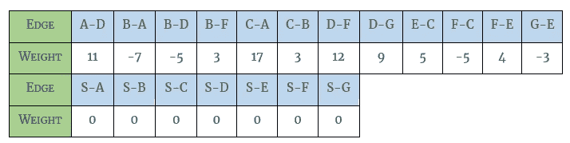

# 约翰逊的算法形象地解释了

> 原文：<https://blog.devgenius.io/johnsons-algorithm-visually-explained-188dbd51ce5c?source=collection_archive---------2----------------------->

J ohnson 的算法寻找有向图中所有顶点对之间的最短路径。它将负边权重转换为非负边链接。它通过使用贝尔曼-福特算法移除所有负权重来实现这一点。然后，它允许 Dijkstra 的算法用于新的图表。

先说个例子。由于这个图包含负边，Dijkstra 的算法还不能应用于它。首先，必须将边链接转换为包含非负数。

约翰逊的算法从选择一个源顶点开始。选择现有顶点的问题是，它可能无法到达图中的所有顶点。为了保证单个源顶点可以到达图中的所有顶点，引入了一个新的顶点。新的顶点 S 被引入到图中的所有顶点。尽管从源到每个顶点的权重并不重要，只要它们都是一致的，但是按照惯例，权重 0 被应用到来自源的每条边。

Johnson 的算法计算从顶点 S 到图上所有顶点的最短路径。Johnson 的算法利用单源最短路径算法来获得新值。由于在有向图中有负的边权重，Bellman-Ford 是用来处理这种计算的算法。

首先，所有出站边都按字母顺序记录在一个表中。

到每个顶点的距离被初始化为无穷大，除了源顶点被初始化为 0。

边缘按顺序放松。边 A-D，B-A，B-D，B-F，C-A，C-B，D-F，D-G，E-C，F-C，F-E 和 G-E 的当前距离为无穷大。如果你把任何一个数加到无穷大，这个数仍然是无穷大。从源顶点 S 开始的边的距离为 0 到 S，因此可以计算到 S 的距离。在第一次迭代中，边 S-A、S-B、S-C、S-D、S-E、S-F 和 S-G 是唯一重要的边。查看该图，从源到所有顶点的距离为 0。第一次迭代后所有顶点的前身是 s。

开始第二次迭代，所有的边再次放松。因为我有一篇关于贝尔曼-福特算法的详细文章，我们将快速浏览一下这个算法的贝尔曼-福特部分。

下表列出了第二次迭代后到每个顶点的最短距离。

您可能已经注意到，从 S 直接计算的所有距离都不会改变，因此在第三次和后续迭代中，从 S 开始的边将不包括在表中。

下表列出了第三次迭代后到每个顶点的最短距离。

贝尔曼-福特从第四次迭代开始。

下表列出了第四次迭代后到每个顶点的最短距离。

贝尔曼-福特从第五次迭代开始。

下表列出了第五次迭代后到每个顶点的最短距离。

在第五次迭代之后，没有变化，所以我们可以结束约翰逊算法的贝尔曼-福特部分。从顶点 S 到每个顶点的距离已经在图上更新。最初，到 S-A 的最短距离是 0，但运行贝尔曼-福特算法后，通过
S-F-C-B-A 到 A 的最短距离是-9。

源顶点对于这个例子的剩余部分是不必要的，所以我们将删除 S 和它的边。

然后，Johnson 的算法应用以下公式进行重新加权计算:

在英语中，新的长度(C'e)等于原来的长度(Ce)加上它尾巴的重量(p *u* )减去它头的重量(p *v* )。约翰逊的算法对每条边都这样做。

对于 A-D，Johnson 的算法从其原始长度 11 开始，加上算法确定为-9 的尾部权重(A ),减去算法确定为-7 的头部权重(D)。

对所有边缘重复该过程。

图表将使用新的权重进行更新。

现在所有的权重都是非负的，Dijkstra 的算法可以应用到每个顶点来计算所有的最短路径。请参阅我关于 Dijkstra 算法的文章，了解它的实际应用。

*如果你喜欢你所读的，看看我的书，***算法说明性介绍。**

**

*迪诺·卡希奇目前是 [LSBio(寿命生物科学公司)](https://www.lsbio.com/)、[绝对抗体](https://absoluteantibody.com/)、 [Kerafast](https://www.kerafast.com/) 、[珠穆朗玛生物科技](https://everestbiotech.com/)、[北欧 MUbio](https://www.nordicmubio.com/) 和[艾阿尔法](https://www.exalpha.com/)的 IT 主管。他还担任我的自动系统的首席执行官。他有十多年的软件工程经验。他拥有计算机科学学士学位，辅修生物学。他的背景包括创建企业级电子商务应用程序、执行基于研究的软件开发，以及通过写作促进知识的传播。*

*你可以在 [LinkedIn](https://www.linkedin.com/in/dinocajic/) 上联系他，在 [Instagram](https://instagram.com/think.dino) 上关注他，或者[订阅他的媒体出版物](https://dinocajic.medium.com/subscribe)。*

*阅读迪诺·卡吉克(以及媒体上成千上万的其他作家)的每一个故事。你的会员费直接支持迪诺·卡吉克和你阅读的其他作家。你也可以在媒体上看到所有的故事。*