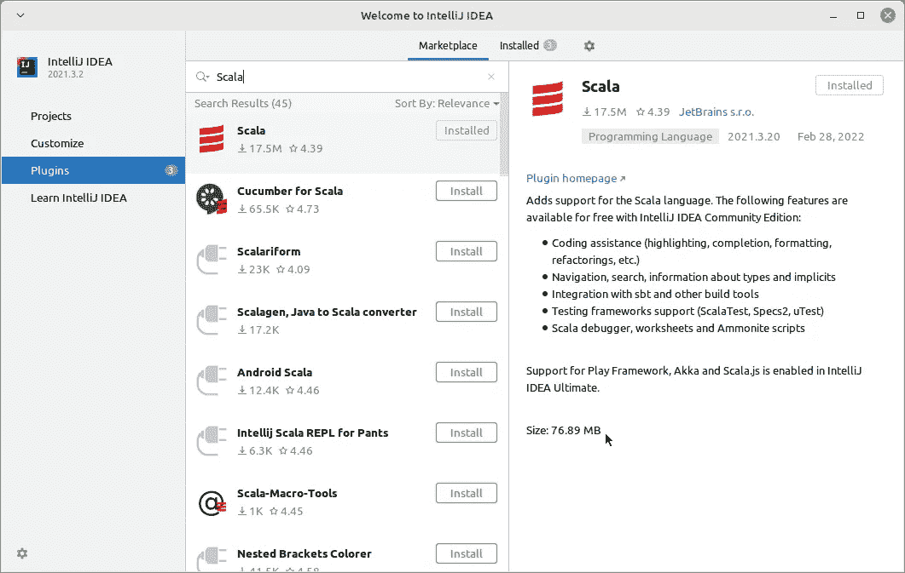
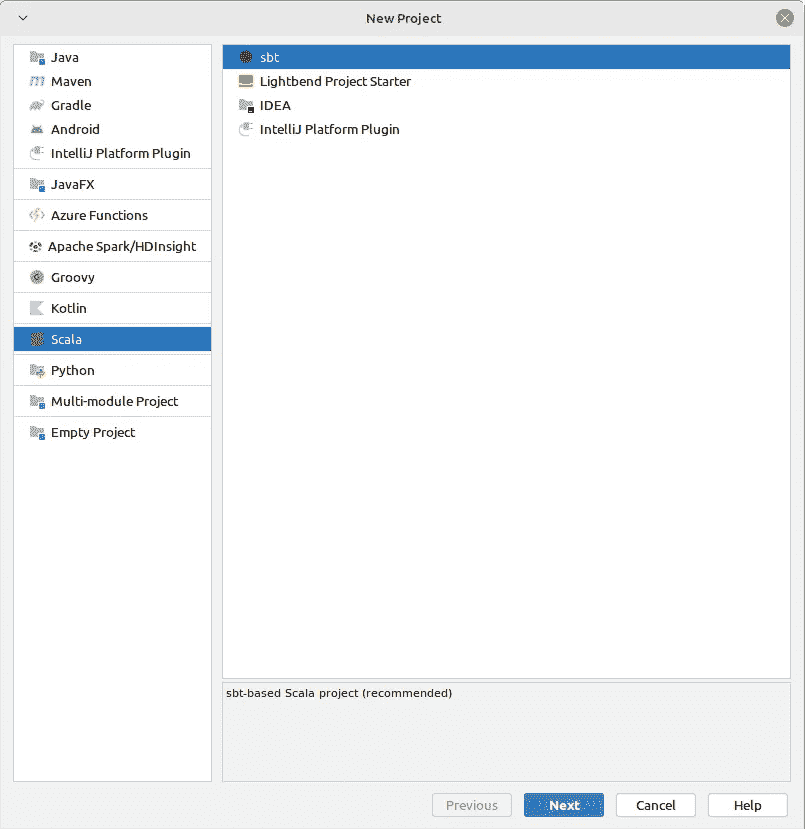

# 使用 Spark 加入流式 Kafka 主题

> 原文：<https://blog.devgenius.io/join-streaming-kafka-topics-using-spark-5072bce6cd45?source=collection_archive---------8----------------------->

## 达达工程

## 基于事件的系统中最常用的功能之一的实际操作体验。


本实用技术指南讲述了如何使用 Spark 引擎连接来自 Kafka 的两个数据流。我们在事件处理系统中使用它，我们希望它们是实时的。

连接流可能很棘手，因为数据没有边界。但是，在本文中，我不会谈论窗口。这是另一篇文章的主题。

# 前方是什么？

这个小型项目的先决条件:

*   码头工人
*   Python 3
*   IntelliJ Idea[用于 Scala IDE]
*   互联网连接
*   【大概是写 Atom，Sublime 等 Python 脚本的 IDE。]

这是一个初学者的动手项目，所以我没有为它使用专用的 Spark 集群。我们将只使用 Intellij 模拟器的火花。我们将在 Docker 中打开 Kafka 和 Zookeeper，并使用 Scala 的 Spark 仿真器读取 Kafka 中的数据。我们还将使用 Python 脚本来生成一个样本数据流，以便我们可以测试我们的管道。

# 开始大吃

首先，您需要为 Zookeeper 和 Kafka 提取 Docker 图像——Zookeeper 需要作为 Kafka 的管弦乐手。我更喜欢 Bitnami 图像，因为它们更紧凑，记录更好。

```
docker pull bitnami/zookeeper:latest
docker pull bitnami/kafka:latest
```

你还必须为 Scala 和 Docker 安装 IntelliJ 插件。进入 IntelliJ，按照下图所示安装插件。



如何搜索和找到 Scala 插件

现在让我们创建一个新项目。我们将使用 Scala 插件和 SBT 构建工具。



如何创建新项目

在下一个窗口中选择名称、位置、JDK、SBT 版本和 Scala 版本。现在，让我们为我们的项目添加 SBT 需求。打开`build.sbt`并将这些行添加到`libraryDependencies`:

```
"org.apache.spark" %% "spark-core" % "3.2.0"
"org.apache.spark" %% "spark-sql" % "3.2.0"
"org.apache.spark" %% "spark-sql-kafka-0-10" % "3.2.0"
"org.apache.spark" %% "spark-streaming-kafka-0-10" % "3.2.0"
"org.apache.spark" %% "spark-streaming-kafka-0-10-assembly" %"3.2.0"
```

然后按窗口右上角的刷新按钮来解决依赖性。一旦解决了这些依赖关系，我们就可以开始编码了——这是最激动人心的部分。

在项目的根目录下创建一个目录，并将其命名为`docker-clusters`。在里面，创建另一个名为`data`的目录。除此之外，创建一个名为`docker-compose.yml`的文件并打开它(IntelliJ 会自动打开它)。你需要在里面写下这些代码:

```
version: "1.0"
services:
  zookeeper:
    image: bitnami/zookeeper:3
    ports:
      - '2181:2181'
    environment:
      - ALLOW_ANONYMOUS_LOGIN=yes
  kafka:
    image: bitnami/kafka:3
    ports:
      - '9092:9092'
    environment:
      - KAFKA_BROKER_ID=1
      - KAFKA_CFG_ZOOKEEPER_CONNECT=zookeeper:2181
      - ALLOW_PLAINTEXT_LISTENER=yes
      - KAFKA_CFG_ADVERTISED_LISTENERS=PLAINTEXT://127.0.0.1:9092
      - KAFKA_CFG_LISTENERS=PLAINTEXT://:9092
    depends_on:
      - zookeeper
    volumes:
      - ./data:/opt/spark-data
```

我们将使用这个脚本在 Docker 中创建我们需要的容器。

是时候创建一个 Python 脚本了，这样我们就可以将样本流数据分成两个主题进行连接。

```
from kafka import KafkaProducer
from datetime import datetime
import time, random

topics = input("Enter topic name: ").strip().split(" ")
producer = KafkaProducer('localhost:9092', api_version=(0, 10, 2))

for i in range(1,100):
   time_ = datetime.now().strftime("%H:%M:%S")
   for topic in topics:
      ran = random.randint(5,15)
      text = f"{ran} topic_{topic}_row_{i} {time_}"
      producer.send(topic, bytes(text, "utf-8"))
   time.sleep(1)
```

该脚本将首先从控制台获取主题名称，然后每秒向每个主题推送一条记录。该记录包括一个作为 ID 的随机数、一个文本和一个时间。我们将在 Spark 中进一步解析这个结构。

现在让我们在卡夫卡中创建 2 个主题。分别命名为`stream-1`和`stream-2`:

```
>  kafka-topics.sh --create --topic stream-1 --bootstrap-server localhost:9092
>  kafka-topics.sh --create --topic stream-2 --bootstrap-server localhost:9092
```

让我们开始编写 Scala 代码。首先，在`src/main/scala/`中你的项目内部创建一个文件，命名为`TwoKafkaStreams`。然后在这个文件里面，创建一个`SparkSession`:

```
val *spark*: SparkSession = SparkSession.*builder*()
  .appName("KafkaStreamsJoin")
  .config("spark.master", "local")
  .getOrCreate()
```

还要为它设置日志级别，因为 Spark 会为流加入操作生成大量日志:

```
*spark*.sparkContext.setLogLevel("WARN")
```

我们将使用`spark`来访问 Spark API。然后，我们可以使用火花引擎进行读取、写入和处理。我们该从题目中读取数据了。我将为此创建一个函数，以便我们可以重用它。首款进口 Spark 隐式转换器:

```
import *spark*.implicits._def readFromKafka(topic: String): DataFrame = *spark*.readStream
  .format("kafka")
  .option("kafka.bootstrap.servers", "localhost:9092")
  .option("subscribe", topic)
  .option("startingOffsets", "earliest")
  .load()
  .selectExpr("CAST(value AS STRING)").as[String]
  .splitKafkaValue()
```

这个管道将 Kafka 数据作为一个流读取，并且每次运行时将从主题的开头开始。它还将记录类型转换为字符串，因此函数的返回类型变成了`Dataset[String]`。最后一个方法`splitKafkaValue()`现在还没有定义，我们来定义一下:

```
implicit class dsUtils[T](ds: Dataset[T]) {
  def consolePrint(mode: String): Unit = ds
    .writeStream
    .format("console")
    .outputMode(mode)
    .start()
    .awaitTermination()

  def splitKafkaValue(): DataFrame = ds
    .withColumn("split_", *split*(*col*("value"), " "))
    .select(
      *col*("split_").getItem(0).as("id"),
      *col*("split_").getItem(1).as("name"),
      *col*("split_").getItem(2).as("time")
    )
}
```

这是一个隐式类，所以每个`DataFrame`都可以使用它的方法。它丰富了`dataframe`并增加了它的功能。

`consolePrint`方法将把流数据打印到控制台中，因此我们可以看到它们。它从用户那里获得写模式。另一个`splitKafkaValue`方法拆分并解析 Kafka 记录，使其成为一个具有 3 列的`dataframe`:`id`、`name`和`time`。如您所见，我们执行了一次拆分，并从该拆分中派生出所有列。

现在我们已经有了所有这些函数，让我们进入`main`程序。我们需要一个管道来读取每个主题，连接它们，然后将结果打印到控制台。

```
val kafkaStream1 = *readFromKafka*("stream-1")
val kafkaStream2 = *readFromKafka*("stream-2")val predicate = kafkaStream1.col("id") === kafkaStream2.col("id")
kafkaStream1.join(kafkaStream2, predicate).consolePrint("append")
kafkaStream1.consolePrint("append")
```

最后，打开 bash 终端，将目录切换到您的`docker-clusters`文件夹，然后执行:

```
docker-compose up
```

这将运行您的容器并为您打开 Kafka 集群。到那时，你就可以运行你的 Scala 程序了。接下来，运行 Python 脚本将数据推入 Kafka 主题。

它会读取你推送到 Kafka 主题中的任何内容，通过 ID 加入它们，并在控制台中打印出来。

# 结尾部分

我们使用 Kafka 和 Spark 来模拟事件处理系统中的一个常见用例。我们构建了两个流源，并加入它们来检查它们的公共 id。你可以用你自己的创新去发现更复杂的用例。

我是一名数据工程师，有电信行业的工作背景。处理大量数据和学习大数据系统的热情将我带到了这个仙境。随时给我写反馈，联系我找到更复杂的挑战[这里](http://www.linkedin.com/in/ali-t-asl/)。