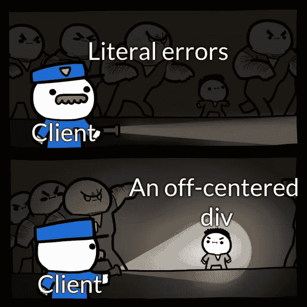

# 每个 IT 人都会讲的笑话

> 原文：<https://blog.devgenius.io/jokes-that-every-it-people-relate-to-b19da68b0d21?source=collection_archive---------2----------------------->

## 最佳编程笑话汇编

普里西拉·杜·普里兹在 [Unsplash](https://unsplash.com?utm_source=medium&utm_medium=referral) 上的照片

在疫情期间，你看到的谈论最多的一个职业是软件开发。当朋友和亲戚看到我们在家工作时，他们觉得我们有最好的生活，因为我们只需盯着电脑 8 个小时。但是作为程序员或 IT 专业人员，我们知道我们内心在想什么。

我们确实有一些不眠之夜，需要投入额外的时间来赶上最后期限，等等。

在这篇文章中，我只是用我在互联网上找到的这些模因来覆盖我作为一名 IT 专业人士的感受。

# 零 bug 后的态度…

图片鸣谢:【https://programmerhumor.io/ 

# 我们沿着小路走..不是结果…

图片鸣谢:[https://programmerhumor.io/](https://programmerhumor.io/)

# 当新的承包商来评论你的代码时…

图片鸣谢:[https://programmerhumor.io/](https://programmerhumor.io/)

# 骄傲的时刻…但是任何人都可以在手机上看到工作代码吗？英雄联盟

图片鸣谢:[https://programmerhumor.io/](https://programmerhumor.io/)

# 如何做到 99.99 的准确率？

图片鸣谢:[https://programmerhumor.io/](https://programmerhumor.io/)

# 没有人...我们确实习惯于每天更新我们所做的事情！就是这样…

图片鸣谢:[https://programmerhumor.io/](https://programmerhumor.io/)

# 不要走到这一步..如果你不想回来…

图片鸣谢:[https://programmerhumor.io/](https://programmerhumor.io/)

# 是的，他们是寻找路线的专家…

图片鸣谢:[https://programmerhumor.io/](https://programmerhumor.io/)

# 谁错过了这个？QA 还是 Dev？责备游戏开始

图片鸣谢:[https://programmerhumor.io/](https://programmerhumor.io/)

# 隐藏在代码中的一个简单的东西..

图片鸣谢:[https://www.facebook.com/yuva.krishna.memes](https://www.facebook.com/yuva.krishna.memes)

# 毫无疑问，电子邮件会创造证据…

图片鸣谢:[https://www.facebook.com/groups/it.humor.and.memes](https://www.facebook.com/groups/it.humor.and.memes)

# 你喜欢哪一个？

图片鸣谢:【https://programmerhumor.io/ 

# 您可能会有这样的代码…

图片鸣谢:【https://www.facebook.com/ProgrammersCreateLife 

# 希望你喜欢这篇文章。请继续关注更多这样的笑声。