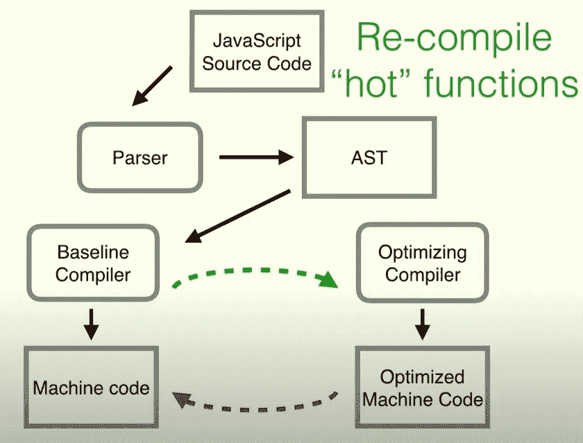

# JavaScript 代码之旅。

> 原文：<https://blog.devgenius.io/journey-of-javascript-code-daa7b5d9da96?source=collection_archive---------4----------------------->


JS 代码的执行分为三个阶段。

*   从语法上分析
*   汇编
*   执行

# 从语法上分析

在解析阶段，代码被分解成标记，语法解析器将这些标记转换成抽象语法树(AST)。

AST 被字节码生成器用来形成字节码，字节码又被解释器用来运行代码。

有两种类型的解析器，它们是懒惰解析器和渴望解析器。

急切解析器做以下事情:

*   用于解析我们想要编译的函数
*   构建 AST
*   构建范围
*   查找所有语法错误

惰性解析器做以下事情:

*   用于跳过我们不想编译的函数
*   找到一组有限的错误

举个例子，IIFE 将由一个急切的解析器解析，而其他函数由一个懒惰的解析器解析。惰性解析器解析一个函数的函数体，当这个函数被调用时，它将被解析并在以后编译。

# 汇编

在编译阶段，当然是完成代码编译。但是还有更多。JavaScript 运行时有自己的 JIT(即时)编译实现。

## JIT(实时)编译

JIT 所做的是，一旦代码开始运行，它就能够在运行时优化它。

每个现代浏览器和运行时都使用自己的 JIT 编译器。与 java 等其他语言提前编译不同，JS 在执行时就完成了编译。

JavaScript 设计了解释语言。解释器是一种逐行执行代码的东西，它不知道下一行会发生什么。

一般来说，现代浏览器会有两个编译器:基准编译器和优化编译器。如果代码的某个部分被重复运行，它将被传递给一个优化编译器，该编译器将优化该代码以加快运行速度。优化编译器使用以前看到的类型信息(不要改变类型！)



重用的函数被标记为“热”

# 执行

编译和执行阶段实际上是同时进行的。当解释器试图一行一行地执行代码时，编译器同时也在试图优化代码(JIT for you！)

执行分两个阶段完成:

*   内存分配阶段
*   代码执行阶段

```
var n = 2; // 1function square(n) { // 2
 var ans = n * n; // 3
 return ans; // 4
} // 5var squareofTwo = sqaure(n); // 6
```

让我们看一下上面的代码例子，在内存执行阶段内存是分配给变量和函数的。在这种情况下，我们有两个变量 n，squareofTwo 和一个函数 square。变量将被赋予未定义的值，函数将被分配内存。

现在变量的状态是，

```
 num = undefined
squareofTwo = undefined
```

## 执行上下文

上例中的内存分配发生在全局执行上下文中。每当进行新的函数调用时，就会创建另一个执行上下文。在上面的例子中，每当函数 square 被调用时，新的执行上下文将被创建，并具有新的内存分配阶段和代码执行阶段。

现在向前看，

*   在代码执行阶段，在第 1 行，值 2 被赋给一个变量。跳过第 2、3、4 行。
*   在第 6 行调用该函数时，将生成正方形并创建一个新的执行上下文。
*   内存将被分配给变量和，其值未定义，在代码执行阶段，将计算和的值并进行分配。
*   第 4 行将把控制权返回给全局执行上下文，值 4 将被赋给变量 squareofTwo。

这就是 JavaScript 代码的执行方式。这个例子很小，但是您可以将这种思路应用于任何代码片段，并且您将有一个很好的代码执行的心理模型。

我提到的谈话和文章将在下面提到，

从语法上分析

汇编

执行

[https://blog . bitsrc . io/the-JIT-in-JavaScript-just-in-time-compiler-798 b66e 44143](https://blog.bitsrc.io/the-jit-in-javascript-just-in-time-compiler-798b66e44143)

我希望这是一本好书。感谢阅读！直到下次👋