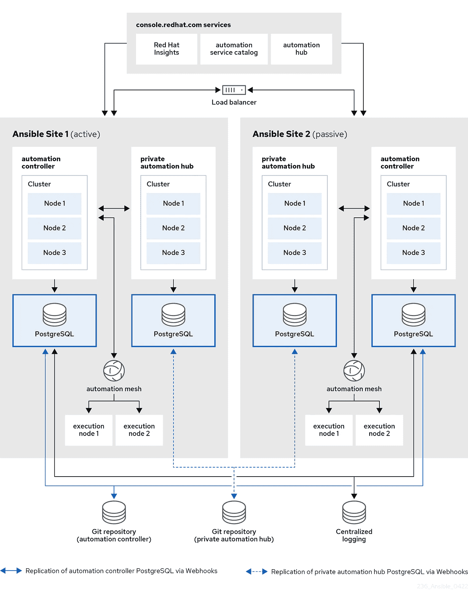

# 逆向工程 OpenShift 运算符之旅

> 原文：<https://blog.devgenius.io/journey-to-reverse-engineer-openshift-operator-20ce938fa74b?source=collection_archive---------3----------------------->

## 如何以正确的方式排除故障

[操作符](https://docs.openshift.com/container-platform/4.7/operators/understanding/olm-what-operators-are.html)是减轻运行另一个软件的操作复杂性的软件。在 Kubernetes/OpenShift 世界中，操作员可以帮助操作应用程序(如[安装](https://catalog.redhat.com/software/operators/detail/5e9872af6c5dcb34dfbb19ee)，升级，高级操作员还可以做[备份](https://docs.ansible.com/automation-controller/4.0.0/html_zh/administration/operator.html#backup-and-restore-operator)，恢复，HA/DR)。

一般来说，我们应该使用提供商提供的 operator/ [自定义资源定义](https://codilime.com/blog/how-to-create-a-custom-resource-with-kubernetes-operator/)，因为它会得到更好的支持，我们不应该重新发明轮子。然而，有时这不是一个选项，我们必须对操作者进行逆向工程，以便安装应用程序。

基本上，操作员/自定义资源定义是本机 [Kubernetes 对象](https://kubernetes.io/docs/concepts/overview/working-with-objects/kubernetes-objects/)的高级抽象(例如，部署、Statefulset、配置图、机密等)。)加上其他功能(例如，当提交新的应用实例时进行监控，并执行升级、备份/恢复)。为了正确地指出问题，在没有 operator 的情况下安装应用程序意味着我们试图对 operator 所做的事情进行逆向工程(例如，创建必要的 Kubernetes 对象，执行必要的初始化)。

我们反向工程的应用是[ansi ble Automation Platform](https://access.redhat.com/documentation/en-us/red_hat_ansible_automation_platform/2.1/html/red_hat_ansible_automation_platform_operator_installation_guide/index)/AAP，它提供了一个使用 [ansible](https://www.ansible.com) 构建和运行 IT 自动化的企业框架。由于我们无法访问 AAP 算子的实际源代码，我们必须在旅途中进行黑盒故障排除，并且我们需要一种结构化的方法来进行故障排除。让我们看看有用的故障排除方法:

1.  定义问题
2.  收集信息以建立可能原因理论
3.  实验和应用
    *根据原因优先级可能性选择解决方案
    *测试您的解决方案
    *衡量结果
4.  迭代潜在解决方案

[](https://www.humorthatworks.com/learning/5-steps-of-problem-solving/) [## 解决问题的 5 个步骤-有效的幽默

### 想提高自己的解题技巧？想完善解题艺术？有效的幽默概述了…

www.humorthatworks.com](https://www.humorthatworks.com/learning/5-steps-of-problem-solving/) [](https://medium.com/@Brslv/how-do-you-debug-code-6e54c7701a85) [## 下面是如何调试一切

### 你有流程吗？你是使用调试器还是用老式的到处打印语句的方式？或者你只是…

medium.com](https://medium.com/@Brslv/how-do-you-debug-code-6e54c7701a85) 

要成功地进行故障诊断，您需要从高层次了解特定应用程序的工作方式，并有一个工作应用程序的基准来观察正常行为。

# Ansible 自动化平台的高层架构

在[高层](https://access.redhat.com/documentation/en-us/reference_architectures/2021/html-single/deploying_ansible_automation_platform_2.1/index)上，AAP 有两大组件[控制器](https://www.ansible.com/products/controller)和[集线器](https://www.ansible.com/products/automation-hub)，各自有自己的 PostgreSQL 数据库。



# 带操作员的 AAP 装置

为了有一个工作应用程序的基线，我们首先使用[操作符](https://access.redhat.com/documentation/en-us/red_hat_ansible_automation_platform/2.1/html-single/red_hat_ansible_automation_platform_operator_installation_guide/index#installing-aap-operator-cli)来安装 AAP，这样我们就可以获得 Kubernetes 原生对象并将其作为参考。控制器是平滑的，但是，集线器没有样本，并且当我们使用操作员 UI 创建集线器实例时，集线器 UI 没有显示。下面是我们用来创建 Hub 实例的 yaml

```
---
apiVersion: automationhub.ansible.com/v1beta1
kind: AutomationHub
metadata:
  namespace: ansible-automation-platform
  name: aap-21-hub
spec:
  route_tls_termination_mechanism: Edge
  ingress_type: Route
  loadbalancer_port: 80
  file_storage_size: 10Gi
  image_pull_policy: IfNotPresent
  web:
    replicas: 1
  file_storage_access_mode: ReadWriteMany
  content:
    log_level: INFO
    replicas: 1
  postgres_storage_requirements:
    limits:
      storage: 10Gi
    requests:
      storage: 8Gi
  api:
    log_level: INFO
    replicas: 1
  postgres_resource_requirements:
    limits:
      cpu: 1000m
      memory: 8Gi
    requests:
      cpu: 500m
      memory: 2Gi
  loadbalancer_protocol: http
  resource_manager:
    replicas: 1
  worker:
    replicas: 1
```

## 第一次尝试

现在是第一次故障排除，这是我们用来记录问题的模板:

```
*Action* Create Hub instance with operator UI*Symptom* The hub web pod shows following errornginx error: `nginx: [emerg] host not found in upstream “aap-hub-content-svc:24816” in /etc/nginx/nginx.conf:20'`
```

从错误来看，nginx 似乎在尝试连接某个主机，但是不可用。从“aap-hub-content-svc”来看，似乎需要创建一些 Kubernets 服务(而且 yaml 中有“content”元素)，但是应该创建哪个服务呢？

在玩了运营商 UI 之后，我们看到“入口类型”有几个选项，所以我们决定尝试一下。然后我们发现有趣的行为，当我们使用 Ingress“Ingress type”时，创建了更多的部署(6 个而不是 3 个), nginx 错误消失了。但是，由于 PVC 绑定，pod 创建被卡住。

## 第二次尝试

```
*Action* Create Hub instance with operator UI*Symptom* 1\. When using Ingress “Ingress type”, 6 deployment objects are created, previous error is gone, and we can see the missing Kubernetes service object, which indicates Route “Ingress type” is issue
2\. However, pod creation is stuck due to PVC binding.*Action tried* When using Route “Ingress type”, only 3 deployment objects are created and seems missing Kubernetes service object
```

然后我们调试 PVC，它是基于 AWS EBS 的，它只支持 [ReadWriteOnce](https://kubernetes.io/docs/concepts/storage/persistent-volumes/#access-modes) ，然而我们原来的 yaml 使用的是 ReadWriteMany。这就是为什么 pod 等待其他 pod 释放 PVC，然而，没有人会释放。解决方法是使用 ReadWriteOnce。

## 第三次尝试

读写一旦解决了这个问题，我们看到所有部署最终都进入了运行状态。但是，我们不能访问 Hub UI，因为它没有公开。当然，解决方案是手动创建路由。

问题摘要:

```
*Action* Create Hub instance with operator UI*Symptom* Hub web instance CrashLoopBackOff*Cause
1\.* Ingress_type: Route fails to create correct number of deployments
2\. AWS EBS does not support ReadWriteMany*Resolution* 1\. Use ingress_type: none
2\. Use file_storage_access_mode: ReadWriteOnce.
```

现在我们有了一个基线工作中心。

# 反向工程

最后，我们为控制器和集线器收集了以下对象:

[部署](https://kubernetes.io/docs/concepts/workloads/controllers/deployment/)

[statefullset](https://kubernetes.io/docs/concepts/workloads/controllers/statefulset/)

[配置图](https://kubernetes.io/docs/concepts/configuration/configmap/)

[秘密](https://kubernetes.io/docs/concepts/configuration/secret/)

[持续量声明](https://kubernetes.io/docs/concepts/storage/persistent-volumes/#reserving-a-persistentvolume)

[服务账户](https://kubernetes.io/docs/reference/access-authn-authz/service-accounts-admin/)

[角色](https://kubernetes.io/docs/reference/access-authn-authz/rbac/)

[角色绑定](https://kubernetes.io/docs/reference/access-authn-authz/rbac/)

[服务](https://kubernetes.io/docs/concepts/services-networking/service/)

[路线](https://docs.openshift.com/container-platform/4.6/networking/routes/route-configuration.html)

# 控制器非操作员部署

我们选择首先测试控制器，因为对象较少(只有 1 个控制器部署和 postgres statefulset)。

真正问题之前的小问题:控制器部署没有“等待 postgres DB”功能，因此我们必须部署 postgres statefulset 并等待 Pod 运行，然后部署控制器部署。

## 第一次尝试

```
*Action*After we deploy controller and wait until controller pod is running, when we try to visit web URL, “page cannot load” error appears. Using*Symptom*Used "oc logs <pod name> -c <container name>" to retrieve log
1\. task container shows "2022-05-04 21:51:39,021 INFO     [-] awx.main.wsbroadcast AWX is currently migrating, retry in 10s."
2\. web container shows "rsyslogd: could not open config file '/var/lib/awx/rsyslog/rsyslog.conf': No such file or directory"
```

所以我们有两个错误，我们应该先解决哪一个？在我们 rsyslogd 错误后，似乎 web 容器发出了其他日志，但对于任务容器，它似乎一直在等待“迁移”。我知道很多 web 框架使用模型和模型迁移 [1](https://docs.djangoproject.com/en/4.0/topics/migrations/) 、 [2](https://edgeguides.rubyonrails.org/active_record_migrations.html) ，你也可以在谷歌搜索错误后到达[数据库方向](https://github.com/ansible/awx/issues/6539)。应用程序在运行之前需要引导数据库模式和数据也是合理的。

因此，我们尝试了一些东西，例如，使用环境变量 AWX _ 跳过 _ 迁移=真/假，但它不起作用。

## 第 n 次尝试

我们最终得出结论，我们需要从操作员安装的自动化控制器 Postgres DB 中获取数据库内容，并恢复到我们的非操作员 Postgres 中(我们在 Postgres DB 中看到 Automation controller 数据库，这证实了我们的猜测)。

在我们恢复数据库后，“AWX 目前正在迁移”消失了，我们终于看到了控制器用户界面。

# 技巧

1.  你需要了解应用程序的基本工作原理，以及具体的应用程序是如何工作的，例如，什么组件，它们是如何连接的，否则你将一无所知。
2.  你需要工具，如果没有日志记录，很难猜测下一步。
3.  排除非问题并缩小故障排除范围非常重要。如果有许多错误，并且信息指示了许多路径，您需要确定哪个是主要错误并逐一尝试解决方案(例如，如果 web 服务器显示数据库连接错误和访问外部 web url 的错误，如果 web 依赖于数据库数据，也许您应该首先解决数据库错误；如果您看到数据库连接错误和网络错误，可能网络更重要，因为如果网络不可用，您将无法访问数据库)
4.  文档。文档非常重要，尤其是对其他团队成员(你不会永远在项目上，所以要让项目在没有你的情况下也能继续)。有结构化的文档，这样其他人就知道了上下文、流程以及决策是如何从文档中做出的，而不是通过与您交谈(如果您在 1 年后重新加入项目，这对您也有好处)。

# 附录

[](https://crestcom.com/blog/2016/09/01/7-steps-to-effective-problem-solving/) [## 有效解决问题的 7 个步骤

### 成为一个成功的领导者并不意味着你没有任何问题。相反，这意味着你知道如何解决…

crestcom.com](https://crestcom.com/blog/2016/09/01/7-steps-to-effective-problem-solving/) [](https://blog.mindmanager.com/blog/2020/07/07/202007problem-solving-tools/) [## 9 个基本的问题解决工具:终极指南| MindManager 博客

### 问题解决软件是在一个平台上利用多种问题解决工具的最佳方式。当……

blog.mindmanager.com](https://blog.mindmanager.com/blog/2020/07/07/202007problem-solving-tools/) [](https://dasein42.medium.com/identifying-debugging-and-preventing-software-problems-that-arise-from-implicit-constraints-at-ce394d503034) [## 识别、调试和预防软件问题，这些问题是由软件开发过程中的隐式约束引起的。

### 识别:

dasein42.medium.com](https://dasein42.medium.com/identifying-debugging-and-preventing-software-problems-that-arise-from-implicit-constraints-at-ce394d503034) [](https://medium.com/@futurice/empirical-methods-of-debugging-ccb1a8127af6) [## 调试的经验方法

### 作为软件开发人员，我们编写代码。代码中有错误。当找到它们时，我们需要调试代码并修复…

medium.com](https://medium.com/@futurice/empirical-methods-of-debugging-ccb1a8127af6) [](https://betterprogramming.pub/all-about-debugging-the-techniques-920b06d61a9e) [## 关于调试的一切:技术

### 调试器工作的不同方式

better 编程. pub](https://betterprogramming.pub/all-about-debugging-the-techniques-920b06d61a9e)  [## 解决问题的一般步骤

### Java 平台，标准版故障排除指南目录上一页下一页当您在运行时遇到问题时…

docs.oracle.com](https://docs.oracle.com/javase/8/docs/technotes/guides/troubleshoot/introclientissues002.html) [](https://hub.packtpub.com/basic-troubleshooting-methodology/) [## 基本故障排除方法| Packt Hub

### Dragos Madarasan 和《Citrix XenApp 故障排除》一书的作者 Suraj Patil 在本文中表示，XenApp…

hub.packtpub.com](https://hub.packtpub.com/basic-troubleshooting-methodology/) [](https://brainbugsecurity.medium.com/what-is-troubleshooting-methodology-40cec6b6494) [## 什么是故障排除方法？

### 有效的故障诊断方法遵循一系列步骤来诊断和修复计算机。

brainbugsecurity.medium.com](https://brainbugsecurity.medium.com/what-is-troubleshooting-methodology-40cec6b6494)  [## 如何解决软件问题

### 作为软件工程师，我们工作的很大一部分是解决软件问题，无论大小。大的软件问题是…

medium.com](https://medium.com/stochastic-stories/how-to-solve-software-problems-d15a1f32a714) [](https://medium.com/hygger-io/methods-and-exercises-for-effective-problem-solving-3503dfabbd02) [## 有效解决问题的方法和练习

### 解决问题激励团队成员取得更好的结果并提高生产力。针对的方法是什么…

medium.com](https://medium.com/hygger-io/methods-and-exercises-for-effective-problem-solving-3503dfabbd02) 

## 排除故障

[](https://isocroft.medium.com/get-better-at-troubleshooting-and-debugging-software-11d0edd4dac5) [## 更好地排除故障和调试软件

### 错误，就其本质而言，基本上是可复制的，说明性的，但也是模糊的指示性的(我确实责怪翻译…

isocroft.medium.com](https://isocroft.medium.com/get-better-at-troubleshooting-and-debugging-software-11d0edd4dac5) [](https://changsin.medium.com/debugging-and-testing-c4e8c92d5186) [## 调试和测试

### 调试和测试是每个开发人员都应该具备的关键技能。但是你如何学习它们呢？

changsin.medium.com](https://changsin.medium.com/debugging-and-testing-c4e8c92d5186) 

## Ansible 自动化平台

[](https://www.redhat.com/en/resources/ansible-automation-platform-datasheet) [## Red Hat Ansible 自动化平台

### 强大的 IT 生态系统支持 Red Hat ansi ble Automation Platform 支持跨服务器、云计算的各种平台

www.redhat.com](https://www.redhat.com/en/resources/ansible-automation-platform-datasheet) [](https://access.redhat.com/documentation/en-us/reference_architectures/2021/html-single/deploying_ansible_automation_platform_2.1/index) [## 部署 Ansible 自动化平台 2.1 参考架构 2021 | Red Hat 客户门户

### Ansible Automation Platform 2.1 参考架构提供了一个部署高度…

access.redhat.com](https://access.redhat.com/documentation/en-us/reference_architectures/2021/html-single/deploying_ansible_automation_platform_2.1/index) [](https://access.redhat.com/documentation/en-us/red_hat_ansible_automation_platform/2.1/html-single/red_hat_ansible_automation_platform_operator_installation_guide/index) [## Red Hat Ansible 自动化平台操作员安装指南 Red Hat Ansible 自动化平台…

### red Hat ansi ble Automation Platform 2.1 本指南为受支持的

access.redhat.com](https://access.redhat.com/documentation/en-us/red_hat_ansible_automation_platform/2.1/html-single/red_hat_ansible_automation_platform_operator_installation_guide/index) [](https://access.redhat.com/documentation/en-us/red_hat_ansible_automation_platform/2.1/html/red_hat_ansible_automation_platform_operator_installation_guide/installing-aap-operator-cli) [## 第五章。正在从 OpenShift 容器平台安装 ansi ble Automation Platform Operator…

### 使用以下说明在 Red Hat OpenShift 容器平台上安装 ansi ble Automation Platform Operator，从…

access.redhat.com](https://access.redhat.com/documentation/en-us/red_hat_ansible_automation_platform/2.1/html/red_hat_ansible_automation_platform_operator_installation_guide/installing-aap-operator-cli) [](https://access.redhat.com/documentation/en-us/red_hat_ansible_automation_platform) [## Red Hat ansi ble Automation Platform 2.1 | Red Hat 客户门户网站的产品文档

### 通过订阅获得 Red Hat 的知识、指导和支持。

access.redhat.com](https://access.redhat.com/documentation/en-us/red_hat_ansible_automation_platform) 

## 姜戈

迁移