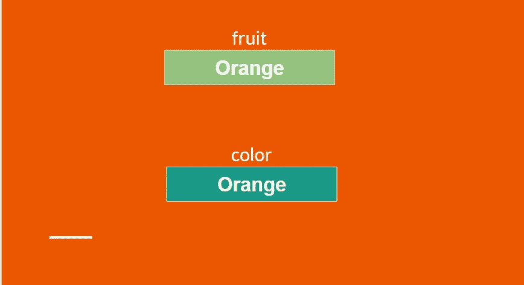
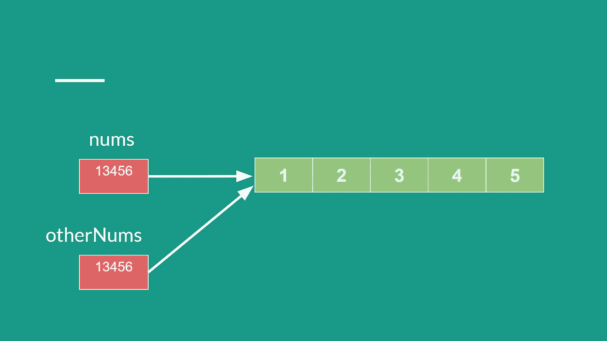

# JS 系列# 8:JS 中的数组

> 原文：<https://blog.devgenius.io/js-series-8-arrays-in-js-41fc9f443cf7?source=collection_archive---------11----------------------->

## 数据收集

到目前为止，大多数人都很熟悉简单的类型，如数字、字符串、用于处理单个值的布尔值。但是在实型应用程序中，我们必须处理更复杂的数据组织。使用数组来组织多个数据元素。

> 数组是值的有序集合…
> 1。购物车中的产品列表
> 2。播放列表中的歌曲

要理解这些数组，请参见下面的药丸容器，其中包含从一周的第一天(星期日)到一周的最后一天(星期六)每天的药丸。


数组中的数据组织

## 创建数组

```
// To make an empty array
let employees = [];// Array of strings
let cars = ['BMW','VW','OODI'];// Array of numbers
let numbers = [95,88,30,99,65];// Mixed array
let employeeInfo = ['Alex',10000,'HR'];
```

# 数组被索引

每个数组项都有一个从 0 开始的相关位置索引。这意味着第一个元素的索引为 0，第二个元素的索引为 1，依此类推，这表明数组是有序集合。

```
let colors = ['Red', 'Green', 'Blue', 'Yellow', 'Pink', 'Black'];console.log(colors.length) // 6console.log(colors[0]) // Redconsole.log(colors[1]) // Greenconsole.log(colors[5]) // Blackconsole.log(colors[6]) // undefinedconsole.log(colors[100]) // undefined
```

## 访问最后一个元素

```
let colors = ['Red', 'Green', 'Blue', 'Yellow', 'Pink', 'Black'];**Step-1:** Get the array length
   **colors.length** // 6 - Returns the array size**Step-2:** Convert length to the last index as index start with 0.
   **colors.length - 1** // 5, Last index of array**Step-3:** Get the last element from the array
    **colors[ colors.length - 1]** // Black
```

## 修改数组

```
let colors = ['Red', 'Blue', 'Green']colors[2] = 'Lime'console.log(colors) // ['Red', 'Blue', 'Lime']console.log(colors[3]) // undefinedcolors[3] = 'Black' // ['Red', 'Blue', 'Lime', 'Black']
```

## 将元素添加到数组的末尾

```
let shoppingCart = [];shoppingCart[0] = 'Mobile'
shoppingCart[1] = 'Earpods'console.log(shoppingCart) // [Mobile, Earpods]**// Adding element to the end of the array**shoppingCart[shoppingCart.length] = 'Mobile Case'
shoppingCart[shoppingCart.length] = 'Jeans'
```

# 引用类型简介

我们都知道原始类型。每当我们创建一个原始变量时，都会在内存中创建一个空间来存储二进制等值。见下图…



内存中的原始变量

对变量的任何更改都将被更新。先前保留的内存位置中的值意味着该值将在内存中被更新。

```
// Creates new variable in memory with label fruit
let fruit = 'Orange'// Create another variable color with same value of fruit
let color = fruitconsole.log(fruit + " - " + color) // Orange Orange// Update value of color variable
color = 'Red'// Notice only color variable's value is changed
console.log(fruit + " - " + color) // Orange Red
```

由于`primitive`变量直接将值存储在内存中，所以它们被称为`Value Type Variable`。

`primitive`值总是按照`LIFO`(后进先出)的顺序存储在内存的`Stack`中。

但是如果我们将`array`和`object`作为类型来讨论，它们与`primitive`类型不同，因为它们不直接在内存中存储值。

创建数组时，数组内存不包含数组值。数组值存储在内存中的其他地方，数组变量包含数组值的引用(地址),如下图所示。

```
let nums = [1,2,3,4,5] /* Creates an array and save the reference(address) of array into a variable called nums.*/
```



内存中的数组存储

当一个数组被复制到另一个变量中时，只复制数组引用，而不是复制所有的数组值。

```
let otherNums = nums // copy array into another array
```

由于只复制数组的引用，所以通过任何引用变量对数组值的任何更改都可以被两个数组变量看到。

看看下面的例子，如果我们改变`otherNums` 数组，它也会影响`nums`数组，因为两者都引用相同的数组值。

```
otherNums[3] = 11 // update the 4th value of arrayconsole.log(nums) // [1,2,3,11,5]console.log(otherNums) // [1,2,3,11,5]
```

所以数组和对象被称为`Reference Types`。

看下面完整的例子…

```
let nums = [1,2,3,4,5]let otherNums = nums // Copy reference of arrayconsole.log(nums) // [1,2,3,4,5]
console.log(otherNums) // [1,2,3,4,5]otherNums[3] = 11 // Update valuesconsole.log(nums) // [1,2,3,11,5]
console.log(otherNums) // [1,2,3,11,5]
```

`Reference types`仅在创建数组或对象的克隆时起作用。具有相同值的数组不会创建引用副本。看下面的例子…

```
let arr1 = [1,2,3,4,5]let arr2 = [1,2,3,4,5]console.log(arr1) // [1,2,3,4,5]
console.log(arr2) // [1,2,3,4,5]arr1[2] = 0
console.log(arr1) // [1,2,0,4,5]
console.log(arr2) // [1,2,3,4,5]
```

如上例所示，`arr1`的变化不会影响`arr2`，因为两者都存储在不同的内存位置。

# 对数组使用常量

正如我们所知，数组不存储值，它只存储数组引用。

```
let fruits = ['Apple','Grapes','Banana']console.log(fruits) // [Apple, Grapes, Banana]
```

在上面的例子中，创建了一个`fruits`变量，它包含了对`['Apple','Grapes','Banana']`数组值的引用。

现在，在数组操作过程中，我们通常会更改数组值，如下所示…

```
fruits.push('papaya') // Adding new item in fruitsconsole.log(fruits) // [Apple,Grapes,Banana,papaya]
```

但是由于我们已经用`let`关键字定义了`fruits`数组，所以允许改变引用，并且`fruits`变量可以被赋予另一个数组引用，如下例所示…

```
fruits = ['BMW','VW','Maruti','Toyoto']console.log(fruits) // [BMW,VW,Maruti,Toyoto]
```

所以在上面的例子中，`fruits`被赋予了包含汽车的新数组值，这在概念上是错误的。

我们可以通过用`const`关键字创建一个变量来防止这种行为，因为 const 不允许变量一旦创建就改变。

```
const fruits = ['Apple','Banana','Grapes']console.log(fruits) // [Apple, Banana, Grapes]fruits.push('Orange') console.log(fruits) // [Apple, Banana, Grapes, Orange]fruits = ['BMW','VW','Maruti'] /* Error, as array is const and reference can't be changed. */
```

如果你喜欢这篇文章，请关注我:

**中:**[https://medium.com/@maheshshittlani](https://medium.com/@maheshshittlani)
**Github:**[https://github.com/maheshshittlani](https://github.com/maheshshittlani)
**LinkedIn:**[https://in.linkedin.com/in/mahesh-shittlani-638b7429](https://in.linkedin.com/in/mahesh-shittlani-638b7429)