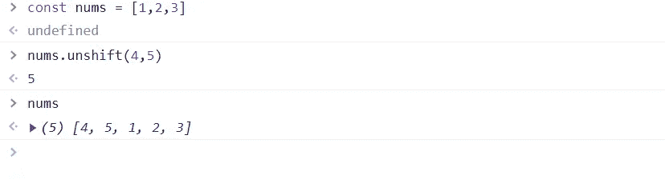
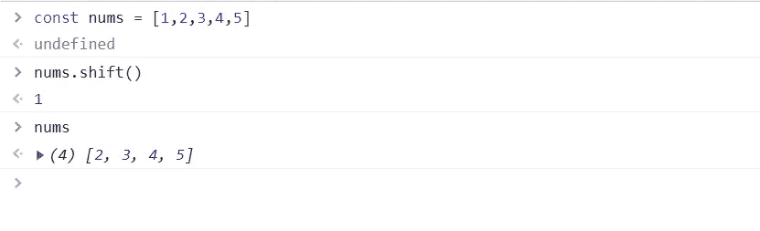
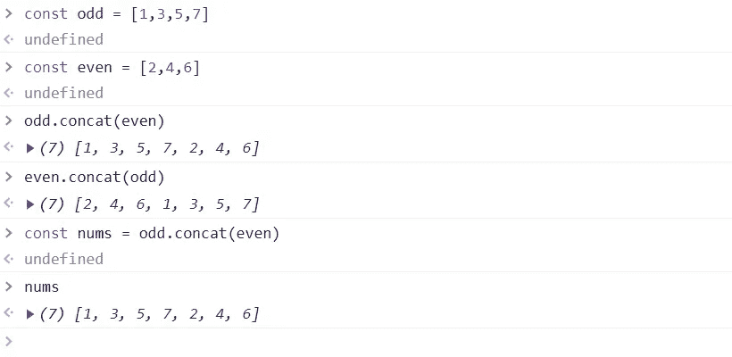
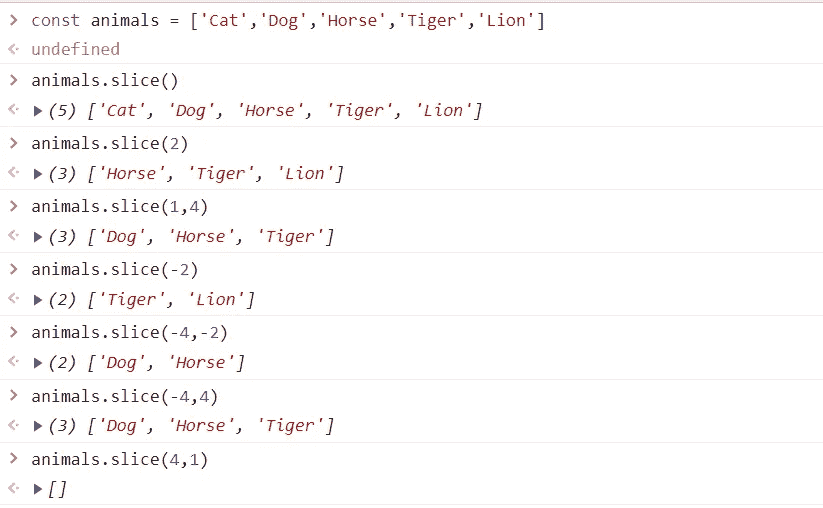
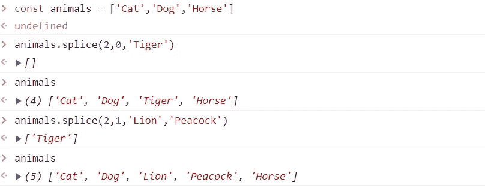

# JS 系列#9:数组方法

> 原文：<https://blog.devgenius.io/js-series-9-array-methods-1f18f760249d?source=collection_archive---------11----------------------->

我们已经看到了如何在 Javascript 中使用[数组。现在，我们将讨论最常用的数组方法，这些方法将 JS 编码经验提升到一个新的水平，并让您能够轻松快速地执行日常编码。](https://medium.com/@maheshshittlani/js-series-8-arrays-in-js-41fc9f443cf7)

## 最常用的数组方法

1.  推
2.  流行音乐
3.  变化
4.  松开打字机或键盘的字型变换键
5.  串联
6.  包含
7.  索引 Of
8.  加入
9.  反面的
10.  薄片
11.  接合
12.  分类

让我们用上面的每一种方法深入探讨一下。在 MDN 中找到[数组方法的完整引用。](https://developer.mozilla.org/en-US/docs/Web/JavaScript/Reference/Global_Objects/Array)


Gabriel Sollmann 在 [Unsplash](https://unsplash.com?utm_source=medium&utm_medium=referral) 上拍摄的照片

# 堆栈和队列操作

上述列表中的前 4 种方法是从最常见的数据结构`Stack`和`Queue`中获得灵感的。

`push()`、`pop()`是用于执行堆栈操作的两种方法，其中`push()`方法在数组末尾添加一个新元素，`pop()`方法从数组末尾删除一个元素。

与`push()`、`pop()`方法一起，组合`shift()`和`unshift()`来执行队列操作。

`unshift()`用于在数组的开头添加一个新的项，`shift()`方法用于从数组的开头删除该项。

## 1.推送()

在数组末尾添加一个新项，并返回数组的新大小。它可以一次添加一个或多个项目。

```
const fruits = ['Apple','Banana']
let size = fruits.push('Cherry')
console.log(size) // 3console.log(fruits.push('Orange','Coconut')) // 5console.log(fruits)// [Apple,Banana,Cherry,Orange,Coconut]
```

## 2.流行()

它从数组末尾移除并返回最后一项，并更改数组的长度。

```
const fruits = ['Apple','Banana','Cherry','Orange','Coconut']
console.log(fruits.pop()) // Coconut
console.log(fruits.length) // 4console.log(fruits) // [Array,Banana,Cherry,Orange]
```

## 3.未移位()

该方法与`push()`方法相同，唯一的区别是它在数组的开头添加了一个或多个项目。



JS 中的 unshift 方法示例

## 4.shift()

该方法与`pop()`相同，唯一的区别是它从数组的开始处移除并返回项目。它还会改变数组的长度。



JS 中的 shift()方法示例

## 5.concat()

它合并两个或多个数组并返回一个新数组。记住它不会改变原始数组。



JS 中的 concat 数组方法

## 6.包括()

> `include(searchTerm)`

`include()`方法检查数组是否包含`searchTerm`并返回 true 或 false。此方法用于在数组中搜索一项。

```
const animals = ['Cat','Dog','Lion']console.log(animals.includes('Dog')) // trueconsole.log(animals.includes(55)) // falseconsole.log(animals.includes('at')) // false
```

## 7.索引 Of()

> `array.indexOf(searchTerm, [startIndex])`

该方法用于搜索数组中的某个值，并返回找到`searchTerm`的第一个索引，否则返回`-1`。

如果给定了`startIndex`，则在`startIndex`之后开始搜索。

`indexOf()`还有一个兄弟方法`lastIndexOf()`，它从数组的末尾开始搜索，其余的和`indexOf()`一样。

```
**Example-1:**const animals = ['Cat','Dog','Lion']console.log(animals.indexOf('Lion')) // 2console.log(animals.indexOf('Peacock')) // -1**Example-2:** const nums = [1,2,3,2,4,1,5,7,2,4,1]console.log(nums.indexOf(2)) // 1
console.log(nums.indexOf(22)) // -1
console.log(nums.indexOf(2,4)) // 9console.log(nums.lastIndexOf(2)) // 9**Uses:**if(animals.indexOf('Tiger') !== -1) {
     console.log('Tiger found')
}if((index = animals.indexOf('Dog'))!== -1) {
     console.log(`Dog found at position ${index + 1}`)
}else {
     console.log(`Dog not found`)
}
```

## 8.反向()

此方法反转数组元素。我实际上改变了原来的数组，把第一个元素换成了最后一个，第二个元素换成了倒数第二个。它不返回任何数组。

```
**Example-1:**
const nums = [1,2,3,4,5]nums.reverse()console.log(nums) // [5,4,3,2,1]**Example-2:**
const animals = ['Cat','Dog','Tiger']const arr = animals.reverse()console.log(animals) // [Tiger,Dog,Cat]animals.push(Lion)console.log(animals) // [Tiger,Dog,Cat,Lion]console.log(arr) // [Tiger,Dog,Cat,Lion] - **Hint: Reference Copy**
```

## 9.加入()

> `array.join([separator])`

`join()`方法通过用给定的`separator`或`comma`连接所有数组元素来返回一个字符串，如果您省略了`separator`。

```
**Example-1:**
const animals = ['Cat','Dog','Horse']let str = animals.join()console.log(str) // Cat,Dog,Horse**Example-2:**
const animals = ['Cat','Dog','Horse']let str = animals.join('-')console.log(str) // Cat-Dog-Horse
```

**10。slice()**

> `slice([start,end])`

`slice()`该方法返回从`start`到`end`(不包括 end)索引中选择的一部分数组。

它返回从`start`索引到`end`索引提取的数组的一个`shallow(reference) copy`。

start 和 end 都是可选参数。

如果省略`start`索引，切片从`0`开始。

如果省略了`end`索引，那么切片提取直到数组的`end(arr.length-1)`元素。

`start`和`end`索引可以是`negative`，然后从序列的最后一个开始计数，即`-1`被认为是数组的`last`索引，`-2`被认为是`second last`索引，以此类推。

`start`索引应该低于`end`索引，否则返回空数组。



切片数组方法示例

## 11.拼接()

`splice()`方法通过移除和替换数组元素来改变数组的内容，并在数组中添加新元素。它返回已删除元素的数组。

> `splice(start, deleteCount, item1, item2, item)`



JS 中的拼接方法示例

如果你喜欢这篇文章，请关注我:

【中:】[https://medium.com/@maheshshittlani](https://medium.com/@maheshshittlani)
**Github:**[https://github.com/maheshshittlani](https://github.com/maheshshittlani)
**LinkedIn:**[https://in.linkedin.com/in/mahesh-shittlani-638b7429](https://in.linkedin.com/in/mahesh-shittlani-638b7429)