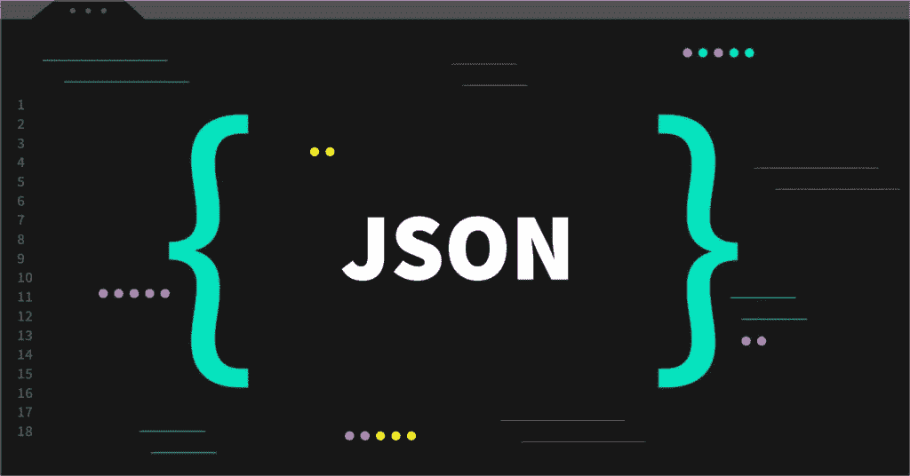
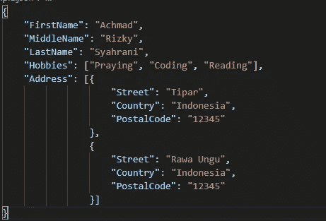

# 围棋中的 JSON

> 原文：<https://blog.devgenius.io/json-in-go-94c2aacc9467?source=collection_archive---------2----------------------->

Golang 中的 JSON 包介绍



来源:https://caraguna.com

# JSON 是什么？

Json 代表 JavaScript 对象符号，JSON 是一种交换数据格式的结构，其格式类似于 JavaScript 中的对象。JSON 是创建 RESTful API 应用程序时最常用的交换数据格式。我不会谈论更多关于 Json 的细节。详情请阅读 Json 官网【https://www.json.org/json-en.html 。

# JSON 代码结构示例



Json 代码结构示例

根据上面的例子，我们可以看到 Jason 对象可以包含一个数组或者一个对象。在看到上面的代码结构后，你可能会发现 Json 是最理想的数据交换格式的原因，因为它容易由人类 **读取&**编写，也容易由机器 **解析&**。

# 围棋中的 JSON

在 Go 中，Json 包在你安装 Go 编译器的时候就已经包含了。你可以在 Go 中把你的数据转换成 Json(编码)或者 reverse(解码)。Json 包的详情可以在官方 go 包网站[**https://pkg.go.dev/encoding/json**](https://pkg.go.dev/encoding/json)看到。

# 编码 JSON

Go 已经提供了一个将数据转换成 Json 格式的函数，你可以使用`json.Marshal(interface{})`将你的数据转换成 Json。可以从任何数据类型转换成 Json，因为 Marshal 函数的参数是一个接口。Marshal 函数将返回两个值，有**编码为字节数组的结果([]byte)** 和**错误。**请看 json 编码的例子。

# 解码 JSON

Decode 是 Encode 的反向操作，可以用`json.Unmarshal(byte[], interface{})`将 Json 转换成 Go 数据类型。也就是 byte[]作为 Json 数据，接口是存储转换结果的地方。解组函数只返回一个错误。要获得解码的数据，您可以调用**接口变量**。有关详细信息，请参见下面的示例。

# JSON 对象

在 Go 中，Json 对象表示为 Struct 数据类型。请参见为 Json 对象创建结构的示例。

```
type Address struct {
    Street string
    Country string
    PostalCode string
}
```

还可以看到如何在 Go 中初始化 Json 对象的例子

```
address := Address{
    Street:     "Tipar",
    Country:    "Indonesia",
    PostalCode: "12345",
}
```

# JSON 数组

Json 中的 Array 类似于 JavaScript 中的 array，可以包含原始数据类型或复杂数据类型(对象或数组)。在 Go Json 数组中表示为一个片。从 Json 到 Json 的转换将由 Json 包使用 slice 数据类型自动完成。请看 Json 中使用数组的例子。

```
type Address struct {
    Street     string
    Country    string
    PostalCode string
}type Customer struct {
    FirstName    string
    MiddleName   string
    LastName     string
    Hobbies      []string
    Addresses    []Address
}
```

上面的代码显示了**的爱好**属性是包含一个数组的字符串而**的地址**属性是包含一个数组的另一个名为**的对象的地址。**

请看如何初始化包含数组& object 的对象的例子

```
customer := Customer{
    FirstName: “Achmad”,
    MiddleName: “Rizky”,
    LastName: “Syahrani”,
    Hobbies: []string{“Praying”, “Coding”, “Reading”},
    Address: []Address{
             {
                 Street: “Tipar”,
                 Country: “Indonesia”,
                 PostalCode: “12345”,
             },
             {
                 Street: “Rawa Ungu”,
                 Country: “Indonesia”,
                 PostalCode: “12345”,
             },
         },
}
```

# JSON 标签

默认情况下，struct 和 Json 的属性将根据相同的属性名进行映射(区分大小写)。有时我们会遇到 Json 和 Struct 在命名属性风格上存在差异的情况，比如我们想在 Json 中使用 snake_case，而在 Struct 中使用 PascalCase 或 camelCase。你可以用**标签反射来解决这个问题。**您可以在结构的属性旁边添加标记反射。通过标签反射，json 包将在解码和编码时自动在 Json 和 struct 之间转换属性名。请举出使用标记反射的例子。

```
type Product struct {
    Id string `json:”id”`
    Name string `json:”name”`
    ImageURL string `json:”image_url”`
}
```

# JSON 地图

有时在使用 Json 时，我们会发现 Json 数据是动态的。这意味着属性是不可预测的。在这种情况下使用 struct 会面临一个困难，因为在 struct 中你必须指定所有的属性。但是不要担心，在这种情况下，您仍然可以使用 map 数据类型。自动地，json 中的属性将作为 map 中的键，而 Json 中的值将作为 map 中的值。但是，因为值是一个接口，所以如果你想得到值，你必须转换值的数据类型。而且地图数据类型不支持 Json 标签。请看下面的例子，我可以用地图添加任意多的密钥。

# 流式解码器

有时 Json 数据来自 io。读者输入，如文件、网络、正文请求。Json 包有一个从流阅读器读取数据的特性。要创建 Json 解码器，你可以使用函数`json.NewDecoder(reader)`，然后如果你想从阅读器中读取输入并转换成 Go 数据类型，你可以使用函数`Decode(interface{})`。请看使用流解码器的例子。

在这种情况下，我想解码来自`product.json`的包含以下数据的 Json

```
{
    “id”: “P001”,
    “name”: “Macbook M1”,
    “image_url”: “https://example.com/images.png"
}
```

您可以使用下面的代码来解码`product.json`Go 数据类型。

# 流式编码器

除了解码器之外，还支持 Json 包将数据从 io.Writer 编码到 Json 中，所以我们不需要将一个 Json 数据存储到一个 string 和[]byte 变量中，可以直接用 io.writer 写。要创建 Json 编码器，您可以使用函数`json.NewEncoder(writer)`，然后如果您想将数据作为 Json 直接写入写入器，您可以使用函数`Encode(interface{})`。请举出使用流式编码器的例子。

在这种情况下，我想用文件名`NewProduct.json`将我的数据编码成一个 Json

使用上面的代码，你将得到一个名为`NewProduct.json`的新 json 文件，其中包含以下数据。

```
{
    “id”:”P001",
    “name”:”Macbook M1",
    “image_url”:”https://example.com/images.png"
}
```

> 参考:
> Golang Json by PZN