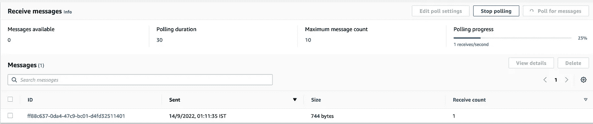

# Golang 的 JSON 到 Apache Parquet 转换器服务

> 原文：<https://blog.devgenius.io/json-to-apache-parquet-convertor-service-in-golang-7eedb91ca8f8?source=collection_archive---------5----------------------->

使用亚马逊 S3 和亚马逊 SQS 服务

Golang 使用亚马逊 S3 和亚马逊 SQS 的拼花转换器服务

在我们进入实现细节之前，让我们简要地看一下使用 Apache Parquet 格式的优点。

> Apache Parquet 是一种开源的、面向列的数据文件格式，旨在实现高效的数据存储和检索。它提供了高效的数据压缩和编码方案，增强了批量处理复杂数据的性能。Parquet 有多种语言版本，包括 Java、C++、Python 等…

1.  这是一种基于列的格式，使用数据压缩技术节省存储空间。
2.  具有高读取性能和吞吐量。

对于这个*转换器服务，*我们使用的是[xitongsys](https://github.com/xitongsys)/[parquet-go](https://github.com/xitongsys/parquet-go)，一个支持读写 parquet 文件的 golang 库。

*注:* [*转换器服务*](https://github.com/gajendarp05/go_json_parquet_convertor) 的 Github 库链接

JSON 到 Parquet 文件转换器服务工作流

工作流程分为 3 个主要部分

1.  [**配置器**](https://docs.aws.amazon.com/AmazonS3/latest/userguide/ways-to-add-notification-config-to-bucket.html) **e 亚马逊 S3 通知亚马逊 SQS 队列新文件创建/上传**

创建一个新的 S3 桶，并添加一个*事件通知*，以便在新文件上传/添加到 S3 桶时发出通知，并添加一个 SQS 队列作为目的地。

*注:授予亚马逊 S3*[*权限*](https://docs.aws.amazon.com/AmazonS3/latest/userguide/grant-destinations-permissions-to-s3.html) *发布消息到 SQS 队列。*

亚马逊 S3 铲斗**转换器-测试**

所有对象的事件通知创建到目的地 SQS 队列**测试**

将新的 JSON 文件添加到 S3 桶，并在 SQS 队列中轮询新消息

2.**轮询器持续轮询 SQS 队列上的新消息**

轮询器 goroutines 不断轮询以从配置的 SQS 队列中检索新消息。为了检索消息，我们使用 SQS [接收消息](https://docs.aws.amazon.com/AWSSimpleQueueService/latest/APIReference/API_ReceiveMessage.html) API。每个 SQS 消息都被写入工作通道进行进一步的处理(我们将在下一节讨论)。

我们需要配置的一些参数是

*MaxNumberOfMessages* :一次请求返回的最大消息数(最大值可以是 10)

*WaitTimeSeconds* :返回前等待消息的时长。([长轮询 vs 短轮询](https://docs.aws.amazon.com/AWSSimpleQueueService/latest/SQSDeveloperGuide/sqs-short-and-long-polling.html))。

轮询器检索 SQS 消息

3.**工人将 JSON 转换为拼花格式**

一旦轮询器在信道上写下 SQS 消息，其中一个可用的工作器就拾取该消息进行处理。处理步骤包括

**a.** 解析 SQS 报文，提取 S3 JSON 文件的路径。*【第 5–16 行】*

**b.** 使用 S3 [下载器](https://docs.aws.amazon.com/sdk-for-go/api/service/s3/s3manager/#Downloader.Download)下载 JSON 文件。*【第 17–28 行】*

**c.** 将 JSON 文件转换成 parquet 文件，并将 Parquet 文件上传回 S3。[xitongsys](https://github.com/xitongsys)/[parquet-go](https://github.com/xitongsys/parquet-go)库支持将拼花文件直接写入已配置的 S3 桶。*【第 30–49 行】*

**d.** 转换成功后删除 SQS 消息。*【第 52–59 行】*

SQS 消息处理工人

*注意:在运行服务之前设置所有的环境变量。*

在上传一个新的 JSON 文件到 S3 桶时，**轮询器**将获得新的 SQS 消息并将其发送到**工作器**进行处理。工人将把 JSON 转换成 Parquet，把文件上传到同一个 S3 桶，并删除 SQS 消息。

新 JSON 文件上传/创建

JSON 到拼花转换

拼花文件存放在同一个 S3 桶中

这一个就到此为止。我希望这是有用的，感谢你的时间。:-)