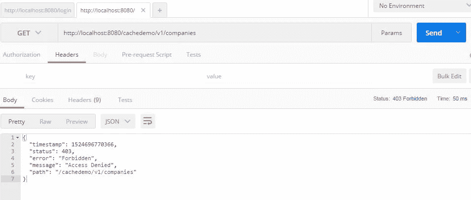

# Json Web Token:如何保护 Spring Boot REST API

> 原文：<https://blog.devgenius.io/json-web-token-how-to-secure-spring-boot-rest-api-4be1369009b0?source=collection_archive---------4----------------------->

亚历山大·德比耶夫在 [Unsplash](https://unsplash.com?utm_source=medium&utm_medium=referral) 上的照片

在这篇文章中，我将展示如何保护基于 REST API 的 spring boot。保护 REST APIs 以避免任何不必要的公共 API 调用已经成为一种趋势。我们将使用一些用于 Spring 安全的 Spring boot 特性，以及用于授权的 JSON WebTokens。

# 这种情况下的用户流量是

1.  用户登录
2.  我们验证用户凭证
3.  令牌被发送回用户代理。
4.  用户试图访问受保护的资源。
5.  用户在访问受保护资源时发送 JWT。我们认可 JWT。
6.  如果 JWT 有效，我们允许用户访问资源。

JSON WebTokens，也称为 jwt，用于为用户形成授权。这有助于我们构建安全的 API，并且易于扩展。在身份验证过程中，会返回一个 JSON web 令牌。每当用户想要访问一个受保护的资源时，浏览器必须在请求的同时在`Authorization`头中发送 jwt。这里需要理解的一点是，保护 REST API 是一个很好的安全实践。

基本上，我们将展示

1.  验证 JSON WebToken
2.  验证签名
3.  检查客户端权限

# 你需要什么？

1.  Java 8，
2.  MySQL 数据库
3.  智能编辑器
4.  格拉德勒

注意——这不会是一个完全成熟的应用，而是基于 Spring boot、Spring security 的 REST APIs。

# 基于 Spring Boot 的 REST API

因为我已经在我的博客上展示过了，所以我不会创建任何新的 API。我将保护我在这篇博文 [REST API](https://betterjavacode.com/2018/02/25/caching-how-to-use-redis-caching-with-spring-boot/) 中创建的`company`的 REST API。这个 API 还包括缓存。一个用户将试图访问`/cachedemo/v1/companies/`，由于 API 是受保护的，他将得到如下响应:

现在我们将实现如何保护这个 API 以及当它被保护时如何访问它。

# 添加用户和用户注册

因为我们想要为 API 添加授权，所以我们需要用户能够登录和发送凭证的地方。将验证这些凭据，并生成一个令牌。然后，这个令牌将在对 API 调用的请求中传输。令牌将在我们将要添加的 Spring 安全授权过滤器中进行验证。如果令牌有效，用户将能够访问 API。

# 创建用户模型

我们将添加一个控制器，用户可以在其中注册`username`和`password`的详细信息。

现在当我们`POST`向`/cachedemo/v1/users/signup`发出请求时，一个用户将被保存在数据库中。当我们使用`BCryptPasswordEncoder`时，用户的密码将以加密格式保存。我们将展示用户如何登录来创建令牌。

# 用户登录

为了处理用户登录，我们将在`FilterChain`中添加一个`AuthenticationFilter`，Spring boot 将适当地处理它的执行。该过滤器如下所示:

基本上，用户将在请求中发送凭证到以`/login`结尾的 URL。该过滤器将有助于对用户进行身份验证，如果身份验证成功，将在响应头中添加一个带有密钥`Authorization`的令牌。

# 令牌验证和授权

我们添加了另一个过滤器`AuthorizationFilter`来验证我们之前通过`AuthenticationFilter`传递的令牌。该过滤器如下所示:

如果令牌验证成功，则返回一个用户并将其分配给一个安全上下文。

为了启用 Spring 安全性，我们将添加一个带有注释`@EnableWebSecurity`的新类`WebSecurityConfiguration`。这个类将扩展标准`WebSecurityConfigurerAdapter`。在这个类中，我们将限制我们的 API，并添加一些白名单中的 URL，我们将需要在没有任何授权令牌的情况下访问它们。这将如下所示:

在方法`configure`中，我们限制了大多数 API，只允许招摇的 URL 和`signup` URL。我们也给`HttpSecurity`加滤镜。我们将添加自己的`UserDetailsServiceImpl`类来验证用户凭证。

# 演示

经过所有的代码修改，现在我们可以创建一个用户，登录并访问安全的 REST APIs 了。从上图可以看出，用户在访问安全 API 时出现了`Access Denied`错误。为了演示这个，我已经用用户名`test1`和密码`test@123`注册了一个用户。

这个 POST 请求将给我们`Authorization`令牌作为响应，如上所示。现在在 GET 请求中使用这个令牌来检索`companies`数据。这个 GET 请求将如下所示:

这样，我们展示了如何使用 JSON web token 保护 REST API。

# 参考

1.  在 Spring Boot API 上实现 JWTs 认证— [JWT 认证](https://auth0.com/blog/implementing-jwt-authentication-on-spring-boot/)
2.  如何保护 REST API—[保护 REST API](https://dzone.com/articles/thoughts-and-ideas-related-to-java-programming)

*原载于 2020 年 8 月 2 日 https://betterjavacode.com***。**