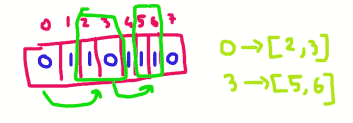

# LeetCode 1871。跳跃游戏 VII

> 原文：<https://blog.devgenius.io/jump-game-vii-simplest-explanation-in-python-3433b401b2b8?source=collection_archive---------12----------------------->

简单又神奇的问题！


## 先看问题提示

给定一个索引为 0 的二进制字符串 s 和两个整数 minJump 和 maxJump。一开始，你站在索引 0，等于' 0 '。如果满足以下条件，您可以从索引 I 移动到索引 j:

(1) i + minJump <= j <= min(i + maxJump, s.length — 1), and
(2) s[j] == '0 '。

如果可以达到索引 s . length-1 in s，则返回 true，否则返回 false。

**提示解释**

*   所以基本上我们得到了一个字符数组(称为字符串),我们在第一个位置。也给定了第一个位置将总是 0。
*   现在使用两个条件，我们需要达到最终位置。此外，最终位置不应为 1。

## 让我们看看例子:

**例 1:**

输入:s = "011010 "，minJump = 2，maxJump = 3
输出:true
解释:
第一步，从索引 0 移动到索引 3。
第二步，从索引 3 移动到索引 5。

**例 2:**
输入:s = "01101110 "，minJump = 2，maxJump = 3
输出:false

## 让我们来理解这两个例子

**例:1**

所以，对于从 0 开始的第一个例子。我们可以移动到[2，3]的范围


现在，因为在 2 处有 1，所以我们不能从那个位置开始跳。而 3 是 0，所以我们可以跳跃。从 3，我们可以跳到[5，6]。5 是最后一个索引，也是在 5，我们有' 0 '，所以我们到达了目的地。


**例 2:**

同样，这里我们有 minJump 和 maxJump。首先，我们从 0 移动到位置[2，3]，如上例。现在，从 3，我可以达到[5，6]，但在这里 5 和 6 我们都有' 1 '，所以我们不能再跳了。因此这是死胡同。因此，我们返回错误。



*我希望从以上两个例子中，问题是清楚的！！！*

所以，让我们直接进入代码。我将逐行解释每个步骤。

首先，我们在索引 0 处，利用条件，我们得到了必须跳转的位置。

```
index = 0
a1, a2 = index+minJump, min(index+maxJump, len(s)-1)
```

现在，我们从 a1 和 a2 开始迭代，得到 0。但是等一下，我们需要一些东西来存储所有索引，以便进行回溯。

因此，我们有两种选择，要么使用堆栈，要么使用队列。如果我们使用堆栈，那么该算法被称为深度优先搜索，如果我们使用队列，那么它被称为广度优先搜索。

**让我们看看如果使用 DFS 会面临什么问题**

```
index = 0
stack = []
a1, a2 = index+minJump, min(index+maxJump, len(s)-1)
for j in range(a1,a2+1):
    if s[j] == '0':
        stack.append(j)
```

现在，当我们想移动到下一个位置时，我们获取最后一个位置，并为该值指定 index。我们重复这个过程，直到堆栈不再为空。所以我们的代码会变成这样。

```
class Solution(object):
    def canReach(self, s, minJump, maxJump):
        """
        :type s: str
        :type minJump: int
        :type maxJump: int
        :rtype: bool
        """
        if s[-1]=='1':
            return False
        stack = [0]
        index = 0

        while index < len(s) and len(ls) > 0:
            index = stack.pop()
            a1, a2 = index+minJump,min(index+maxJump, len(s)-1)
            for j in range(a1, a2+1):
                if s[j] == '0':
                    stack.append(j)
            if index == len(s)-1 and s[index] == '0':
                return True

        return(False)
```

这个代码是 100%有效的，它可以工作。


但是等一下，当你回溯的时候，你是在栈中重新访问和添加已经访问过的元素。因此这个成本为 O(n)时间。你可以通过追踪这个例子来看。

好了，现在为了不访问已经访问过的元素，我们使用了某种跟踪器(称为最远的)。这将追溯到我们达到的最大元素。让我们用例子来看看。


我们有一个字符串，minJump 是 2，maxJump 是 5。我们用 f 作为最远的指针。现在下次我们带 max(minJump，最远+1)到 maxJump。因此，它将如下


现在，因为 9 和 10 是 1，所以我们不能添加到堆栈中，下一次跳转将从 8 开始。

同样为了避免重复，我们取最大值。


原因很简单，8+2 是 10，但我们已经访问了 10，所以我们利用最远的指针，即 f+1 = 11。所以我们考虑窗口[11，13]，这里 8+5 = 13。


最后一班从 12 点到 14 点，我们到达目的地。

所以代码会变成这样，

```
class Solution(object):
    def canReach(self, s, minJump, maxJump):
        """
        :type s: str
        :type minJump: int
        :type maxJump: int
        :rtype: bool
        """
        stack = [0]
        index = -1
        farthest = 0
        out = False
        if s[-1]=='1':
            return(False)
        while len(stack) > 0:
            index = stack.pop()
            a1, a2 = max(index+minJump, farthest), min(index+maxJump, len(s)-1)
            print(a1,a2)
            for j in range(a1, a2+1):
                if s[j] == '0':
                    if j == len(s)-1:
                        out = True
                    stack.append(j)
            farthest = max(farthest, a2)
        return out
```

**问题**

你注意到了吗，当我们回溯的时候，我们的最远距离将会超过 maxJump，我们将永远无法回溯。可以考虑这个测试用例。


*尝试追踪，看看你会得到一个最远>最大跳转，我们不能做回溯的情况。我们将以错误的答案结束*

**解决方案**
发生这种情况是因为我们正在进行深度优先搜索，我们的最远指针仍然非常远。我们可以用广度优先搜索来解决。

## 横向优先搜索

整个代码是相同的，但是我们使用 Queue 来代替 stack，我们弹出先来先得的元素。这样我们就不会超过最远的指针。

```
class Solution(object):
    def canReach(self, s, minJump, maxJump):
        """
        :type s: str
        :type minJump: int
        :type maxJump: int
        :rtype: bool
        """
        queue = [0]
        index = -1
        farthest = 0
        out = False
        if s[-1]=='1':
            return(False)
        while len(queue) > 0:
            index = queue.pop(0)
            a1, a2 = max(index+minJump, farthest+1), min(index+maxJump, len(s)-1)
            for j in range(a1, a2+1):
                if s[j] == '0':
                    if j == len(s)-1:
                        return(True)
                    queue.append(j)
            farthest = max(farthest,a2)
        return(False)
```

这将在 O(n)时间内完成。


希望你喜欢我的解释。请喜欢并关注我更多这样的博客。
谢谢！