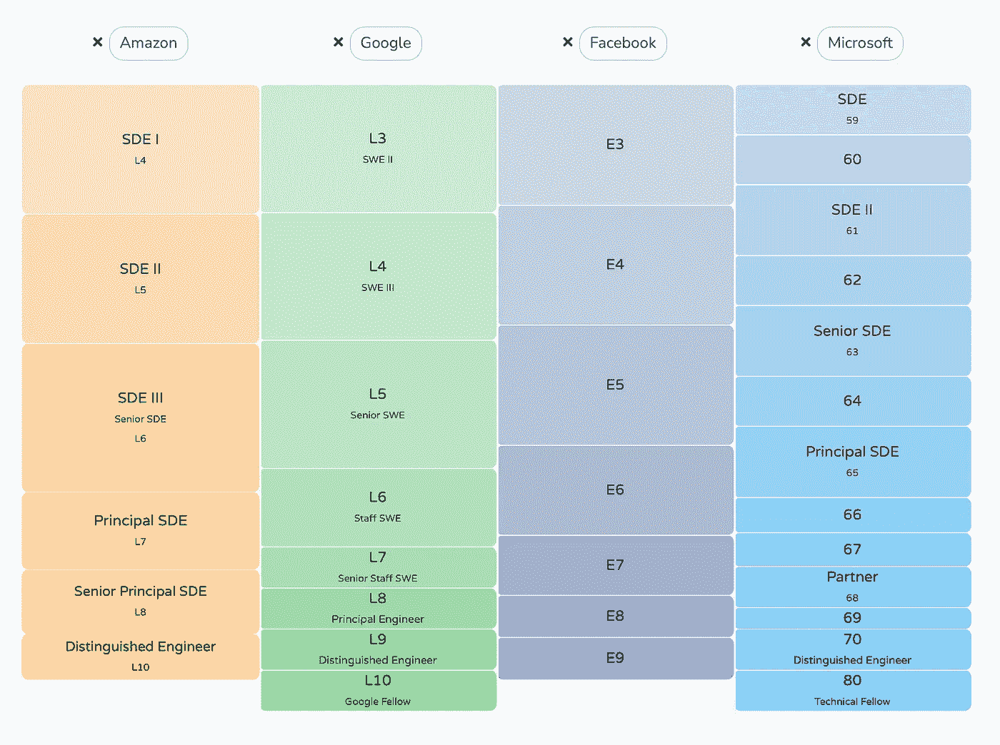

# 初级工程师对高级工程师对员工工程师

> 原文：<https://blog.devgenius.io/junior-vs-senior-vs-staff-engineer-eaecea01440c?source=collection_archive---------0----------------------->

对于软件工程师来说，职场晋升是一个常青的话题，因为它直接影响到 [**收入**](https://www.levels.fyi/?compare=Amazon,Google,Facebook,Microsoft&track=Software%20Engineer) 。在这篇笔记中，我将分享我个人对初级(E3-4)、高级(E5)和职员(E6)工程师之间差异的看法。

# 初级工程师

在这个级别，工程师主要关注于展示编码能力的**和熟悉工程实践。**

在技术方面，这个级别的工程师应该能够:

*   **理解代码库并推动分配的请求以改进它，例如将其迁移到现代框架并添加缺失的测试**
*   **设计组织良好的代码**
*   **独立完成中大型功能**

在“人际技能”方面，没有太多的要求。最重要的是展示与其他学科(设计、PM、分析师)完成任务的能力。

来自[级别的 img . FYI](https://www.levels.fyi)

# 高级工程师

这位高级工程师还打电话给亚马逊的 SDEIII 和谷歌的 L5。在这个层次上，工程师应该把他/她自己确立为“一个特性或系统的所有者”,对它有一个专家级的端到端的理解。

在技术方面，高级工程师应该:

*   **能够设计、分解和完成一个大规模的项目，并具有高水平的生产力**
*   **在没有指导的情况下，主动发现现有系统/产品的问题，并提供解决方案**
*   能够带领一小组人进行一个项目，例如主持周会，以书面形式与其他伙伴沟通

在“人际技能”方面，

*   **为改善工程团队做出贡献。例如，面试或指导等活动**
*   **能够向同事提供及时可行的反馈**
*   **能够建立 X 团队和 XFN 关系，这将促进正在进行的项目**

# 高级工程师

通常，每个工程团队会有 1-2 名职员级别的工程师，他们被认为是“**技术负责人**”。他/她与工程经理共同拥有团队的成功。

在技术方面，最大的区别是一个普通工程师能够识别和解决一个很少有人能解决的技术问题。具体来说:

*   **能够实现系统/产品最难的部分**
*   **能够交付具有最佳实践的高质量工作，如适当的测试、精心计划的展示和监控**
*   **能够带领团队努力设定方向，比如新赛季路线图**
*   **能够发现系统/产品/组织的最大痛点，并提出解决方案。一个具有清晰的交付内容和里程碑的解决方案，可能需要多年时间来实施。**
*   **最重要的是，除了展示利用 XFN 同事的能力(DS/design/PM/etc..).员工工程师也应该能够评估&验证他们的输出。**

在“人员技能”方面，一名员工工程师应该:

*   **以口头和书面形式成为一个强有力的沟通者**
*   **能够利用未分配给团队的资源**
*   **能够招聘新的团队成员，包括初级和高级人员**
*   **能够影响组织的工程文化，比如采用最新/最佳的编码实践**

# 总之

公司使用层级是因为它提供了结构。尽管公司的平衡系统可能略有不同，但基本思想是相同的。通过了解它，你可以制定出推进你事业的最佳策略。

**下一篇阅读:** [**首席工程师是做什么的？**](https://bobi-pu.medium.com/what-does-a-principal-engineer-do-2e6af918ff28)