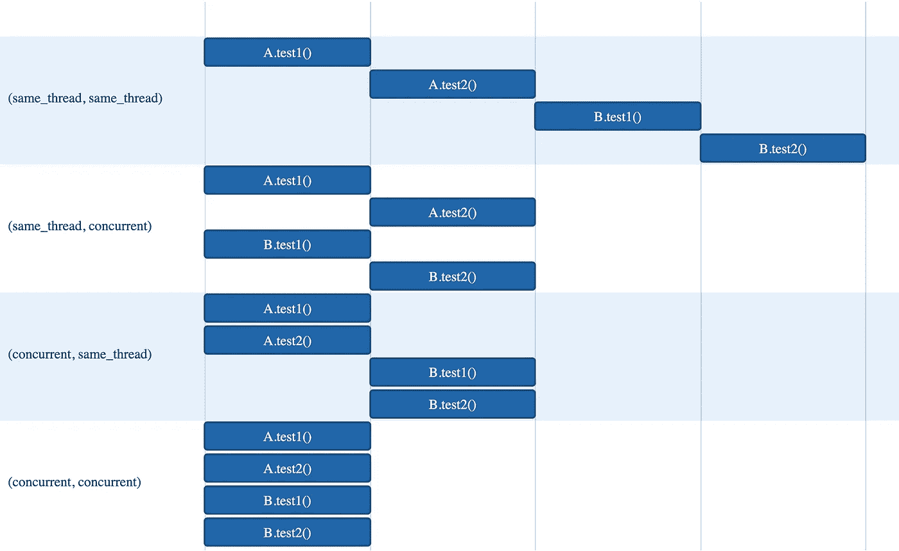

# JUnit5:参数化测试的并行化(仅限)

> 原文：<https://blog.devgenius.io/junit5-parallelization-of-parameterized-tests-only-57ddb00233fa?source=collection_archive---------4----------------------->

亲爱的读者，你好！今天，我将向您展示一篇关于如何并行化 JUnit5 参数化测试的快速文章(仅限于)。

# 语境

最近，我需要提高我的 JUnit 集成测试用例的效率，因为这些测试用例由于其顺序性质而在运行时花费了大量时间，因此，通过延迟最新功能进入生产环境，损害了我们的 CI/CD 管道部署并最终损害了我们的最终客户。

作为我尝试提高测试用例效率和性能的一部分，我决定使用最近 JUnit5 的一个实验特性:[并行执行](https://junit.org/junit5/docs/snapshot/user-guide/#writing-tests-parallel-execution)。这个特性的目标是允许客户轻松地管理他们的测试用例的执行顺序，允许他们有选择地并行运行，从而降低测试执行的速度。

请注意，对于我的特定用例，这样的测试用例在相同的实体上对不同的测试执行情况有效，因此必须只对参数化的测试实现并发性(而不是对一个类的所有测试方法)。因此，提高性能的一个要求是只并发运行参数化测试的测试用例，每个测试用例仍然必须按顺序运行。

# 履行

既然已经知道了需求，那就让我们动手吧！

为了在您的应用中启用并行化特性，第一步是在您的包的`/src`文件夹中创建一个`junit-platform.properties`配置文件，以便启用并行化特性，如下所示:

JUnit 并行性的配置

俗话说*“一张图片胜过百万字”*，在这种情况下，它非常适合如何解释 JUnit 关于两个可用并发配置属性的并发性(`junit.jupiter.execution.parallel.mode.default`、`junit.jupiter.execution.parallel.mode.classes.default`，摘自[文档](https://junit.org/junit5/docs/snapshot/user-guide/#writing-tests-parallel-execution)):

JUnit5 并行性—可能的配置

如前所述，我们案例中使用的配置支持并行化特性以及测试执行的默认行为规范按顺序运行(`same_thread` - bucket 1)。这将满足我们按顺序运行测试用例和测试类的需求。

使用当前的配置，我们将会看到执行将会顺序运行所有的测试方法(包括参数化测试)。等等…但这不是我们想要的！是的，为了同时运行选定的参数化测试，需要实现一个变通方法:使用 JUnit5 嵌套类，其目标是对内部非静态类的测试用例进行分组，以便可以与父实例(顶级类)共享状态。为此，必须指定`[@Nested](https://junit.org/junit5/docs/5.4.1/api/org/junit/jupiter/api/Nested.html)`注释。

为了实现我们只并行化参数化测试的目标，我们将需要用`[@Execution](https://junit.org/junit5/docs/5.3.0/api/org/junit/jupiter/api/parallel/Execution.html)`注释来注释嵌套类参数化测试方法，说明这样的测试方法应该如何运行，也称为*执行模式* : `CONCURRENT`(并行)或`SAME_THREAD`(顺序)。

这种方法的思想是使用嵌套类作为测试类的子组，其中包含的测试方法都应该并行运行(用`CONCURRENT`执行模式注释)。因此，在一个类中可以有不同的参数化测试方法(细分为嵌套类),并且可以对如何运行这些方法进行细粒度的控制。

为了更好地理解这是如何实现的，下面是一个简单的 JUnit 测试类的粘贴，它遵循了建议的方法。

并行测试用例

根据上面的要点，很明显在顶级测试类中创建了两个嵌套类。每个类都有自己的参数化测试方法，用`@Execution(ExecutionMode.CONCURRENT)`标注，这意味着嵌套类中的方法应该并行运行。

请记住，我们运行测试的默认配置是顺序的，因此默认情况下，嵌套类将按顺序实例化(顺序执行)。有了`CONCURRENT`执行模式注释的规范，在每个内部类中定义的参数化测试将并行运行，从而实现预期的目标。下面的要点给出了上述代码的执行结果。

并行测试执行结果

如前所述，很明显，对于每个嵌套类(顺序执行)，有两个独立的容器*旋转* *上升*，对于嵌套类内部的每个参数化测试运行，并发性得到了保证，正如日志所证明的。因此，目标达到了:混合执行解决方案的实现关注于使用参数化测试的细粒度并发模式顺序运行测试方法。

# 结论

在本文中，我们展示了如何轻松地执行参数化测试的并发测试用例，同时顺序运行一个类的其余测试方法。这对于那些想要在保证高度可靠的测试基础设施的同时改进他们的测试用例执行的团队来说可能是有用的。

我们的管道中使用了所提出的方法，自部署以来，我们已经看到测试执行时间从大约 330000 毫秒显著减少到大约 73000 毫秒(～-78%)！

我希望这篇文章是有价值的和翔实的。如果这对你有用，请随时告诉我。下次再见！

# 参考

*   【https://junit.org/junit5/docs/current/user-guide/ 
*   [https://www.baeldung.com/junit-5-parallel-tests](https://www.baeldung.com/junit-5-parallel-tests)
*   [https://stack overflow . com/questions/39470022/running-JUnit-parameterized-tests-not-class-in-parallel](https://stackoverflow.com/questions/39470022/running-junit-parameterized-tests-not-classes-in-parallel)