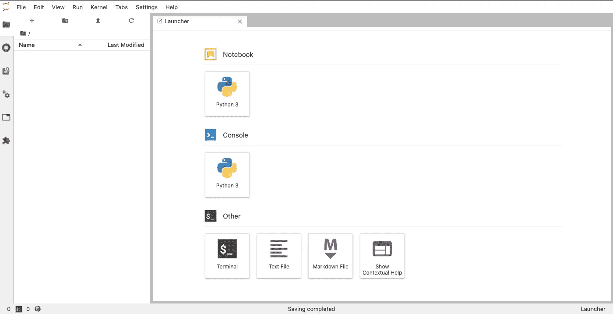
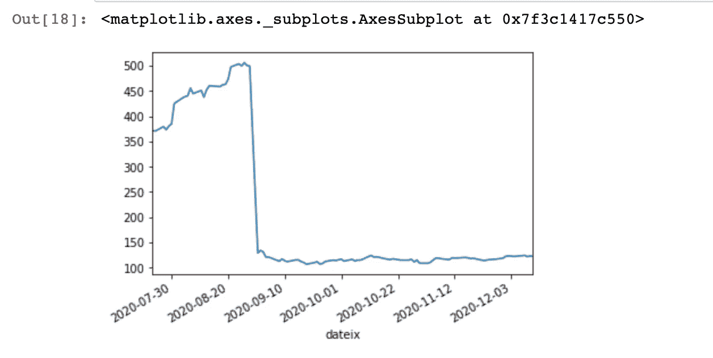
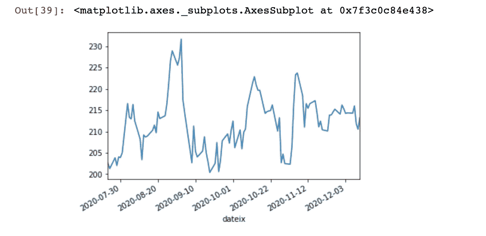
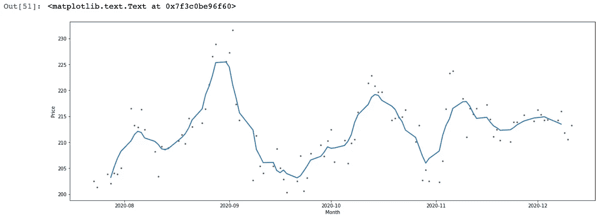

# Jupyter 和 Puzl 在云中

> 原文：<https://blog.devgenius.io/jupyter-in-the-cloud-with-puzl-5cf111853f77?source=collection_archive---------6----------------------->

## 在 Kubernetes 上运行 Jupyter 的股票市场分析


之前，我写过关于[如何让 Jupyter 进入云端](https://medium.com/better-programming/how-to-get-jupyter-in-the-cloud-49f7ff5262da)。我发现了另一种通过 Jupyter 使用[云服务](https://puzl.ee/gpu-cloud)的方法。Puzl 提供了一种强大的基于 Kubernetes 的方法来开发、部署和扩展在 CPU 或 GPU 上执行繁重计算的软件。这是一种按使用付费的服务，没有免费层，但它只对你的 pod 运行时收费。花费大量时间学习数据科学可能不是一个好的选择，但如果你需要每周租用几个小时的 GPU，这可能比传统的云服务更便宜。

我不是数据科学家，所以这不是关于数据科学、ML 或统计学的教程。我假设你已经知道你想要解决的问题，只是需要一个地方来解决它们。我还将介绍如何使用 API 来获得您需要的数据。即使您正在处理的数据来自您工作的公司，它也可能位于另一个部门，祝您好运，让他们帮助您开发“API”。

我将与股票市场数据打交道，但首先让我说，我不是一名财务顾问，所以对我在这里提出的任何数字都要有所保留。如果你知道如何战胜市场，这对你有好处，我相信你到月底就会成为亿万富翁。如果我持有本文中提到的任何一只股票，那只是因为我持有的共同基金(我不持有指数基金，请点击这里了解更多信息

让我们从注册 Puzl 开始吧。浏览到[https://puzl.ee/](https://puzl.ee/)，点击注册链接。输入电子邮件和密码，它将向您发送一封确认电子邮件。确认你的电子邮件，然后你就可以开始配置你的系统。

## 设置 Puzl

我将按照这些[说明](https://puzl.ee/blog/running-jupyter-notebook-in-cloud-with-gpu-in-30-seconds)做一些小的调整来设置我的吊舱。根据这篇文章，我从市场上用默认的 CPU 和 RAM 设置了一个 Jupyter pod。我使用 PyTorch image，运行 Python 3.8，Jupyter 实验室接口，并将卷容量设置为 10gb，这对于我将要展示的示例来说应该足够了。点击安装按钮，它会在几分钟内旋转起来。这将带你到 Jupyter 实验室主页



我还跳过了 how-to 中提到的关于使用 SSH 上传数据的部分，因为在我的例子中，我们将从 API 获取数据。同样，因为这是一个现收现付的服务，所以在本地预取数据，然后使用 SSH 上传可能是一个更好的选择。此外，我将跳过添加 GPU 的部分，因为我的例子中没有 GPU。

单击 Python 3 图标打开一个新笔记本。

## 获取市场数据

我将从 Market Stack 中获取数据，它确实有一个空闲层。浏览到[https://marketstack.com/](https://marketstack.com/)，点击“免费注册”链接。输入电子邮件和密码，他们会给你一个 API 密匙，这个密匙适用于每月 1000 次的日终数据请求。把你的钥匙放在某个地方。现在，在我们打开的笔记本中我们可以得到一些数据:

```
import requests
import pandas as pd
import jsonurl = '[http://api.marketstack.com/v1/eod?access_key=<your-access-key&symbols=AAPL'](http://api.marketstack.com/v1/eod?access_key=ab9e95603c3fe5ce60636fffe06d9cf2&symbols=AAPL')
resp = requests.get(url)
resp
```

这应该会给你一个 200 的响应。首先要注意的是，他们将密钥放在 URL 上，请求是不安全的(HTTP)。你必须为 HTTPS 付出代价。但是，使用 HTTP，这是一项免费服务，如果有人偷了你的密钥，他们所能做的就是获得你一个月的剩余请求。

接下来，我们可以以 JSON 的形式获取内容。

```
data = json.loads(resp.content)
data
```

输出应该是 JSON 格式的一个季度的日终数据:

```
{'data': [{'adj_close': 122.41,
   'adj_high': 122.76,
   'adj_low': 120.55,
   'adj_open': 122.43,
   'adj_volume': 86939786.0,
   'close': 122.41,
   'date': '2020-12-11T00:00:00+0000',
   'exchange': 'XNAS',
   'high': 122.76,
   'low': 120.55,
   'open': 122.43,
   'symbol': 'AAPL',
   'volume': 86939786.0},
  {'adj_close': 123.24,
...
```

现在，我们可以对数据进行时间序列分析，方法是将数据转换成 Pandas 数据帧，并将日期字段设置为索引:

```
from pandas import json_normalize
df = json_normalize(data,'data')
df['dateix'] = pd.to_datetime(df['date'])
df = df.set_index(['dateix'])
del df['date']
df
```

这将为您提供一个格式良好的按日期索引的表格。现在我们可以绘制数据:

```
import matplotlib.pyplot as plt
%matplotlib inline
df['close'].plot()
```

这应该给你:



哇！8 月 31 日发生了什么？苹果的股票分割比例为 4:1，因此每股价格相应降低。这是数据可视化的一个很好的例子。让我们用一个不同的符号来试试，比如 MSFT。这是图表:



让我们得到一个 7 天的滚动平均值:

```
rolling = df[['close']].rolling(window = 7, center=True).mean()
rolling
```

现在用滚动平均值的折线图制作一个散点图:

```
import matplotlib.ticker as ticker 
fig, ax = plt.subplots(figsize= (20, 7))
ax.plot(df['close'], marker = '.', markersize=5, color='0.4',
       linestyle='None',label='Daily')
ax.plot(rolling['close'], linewidth=2, label='7 day rolling average')
ax.set_xlabel('Month')
ax.set_ylabel('Price')
```

由此产生的图表:



这里介绍的数字处理都不需要太多的能量，只是作为一个例子。但我敢肯定，你想出的击败市场的人工智能将需要大量的权力，所以花几个欧元来建立这笔财富。

感谢 [Rashida Nasrin Sucky](https://medium.com/u/8a36b941a136?source=post_page-----5cf111853f77--------------------------------) 关于数据科学，尤其是时间序列数据的精辟文章；我在这方面的很多知识都来自于她。

[](https://towardsdatascience.com/an-ultimate-guide-to-time-series-analysis-in-pandas-76a0433621f3) [## 熊猫时间序列分析终极指南

### 在 Pandas 中执行时间序列分析所需的所有 Pandas 功能。您也可以将此用作备忘单。

towardsdatascience.com](https://towardsdatascience.com/an-ultimate-guide-to-time-series-analysis-in-pandas-76a0433621f3)