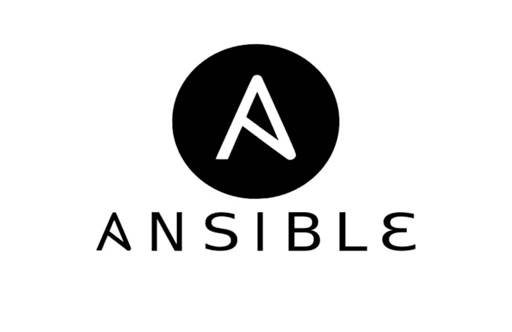
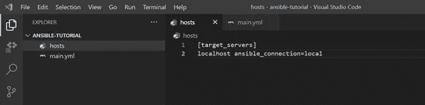
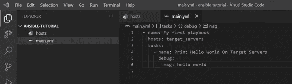
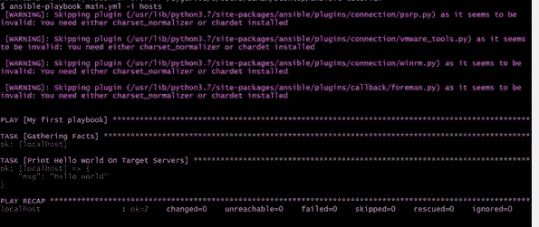
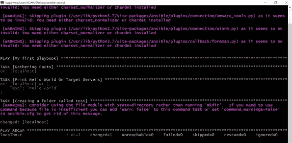
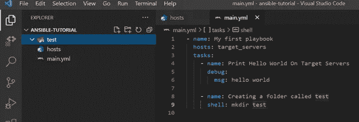

# 只要回答它

> 原文：<https://blog.devgenius.io/just-ansible-it-55156e1cdec8?source=collection_archive---------6----------------------->

你可能听说过自动化和随之而来的力量。Ansible 是自动化本地机器或环境机器的一部分。

那么什么是 Ansible 呢？

Ansible 是一个开源的自动化工具，用于供应、配置管理、应用程序部署和基础设施，也称为基础设施即代码(IaC)。Ansible 的出现是为了解决多台服务器上的冗余工作问题，例如为 java 运行时环境准备生产虚拟机，在一台机器上准备它需要相当长的时间，那么如果您需要在 10 台以上的虚拟机上准备，会发生什么情况呢？

Ansible 用它的“剧本”来解决这个问题，剧本的任务是在目标服务器上做一些动作

任务(1)安装 java。

任务(2)将 java 设置为环境路径。等等。

当您开始编写 yaml 行动手册时，您需要定义您想要执行的任务和目标服务器，它们被称为“hosts”ini 文件和 hosts 文件，在 Ansible 文档中通常被称为“inventory”。

Ansible 带有内置任务，例如“git”任务，您可以在其中克隆一个 repo。Ansible 入门文档中还提供了 yum、debug、file、sync 等许多内置任务。如果您有一个定制的任务，您可以使用 shell 任务来满足您的需求。

Ansible 支持条件操作。如果您有 web 服务器，那么您可能希望在启动 apache 之前检查它是否正在运行，这样您就可以在启动 apache web 服务器时使用条件关键字“when”来创建一个条件。

除了条件，Ansible 还支持循环。修复循环或通过清单中的目标服务器进行循环。

Ansible 是无代理的。这意味着您只需要将它安装在主机上，而不需要安装在目标服务器上。

值得一提的是，Ansible 可用于应用程序部署，但这不是我们的首选。要快速部署您的应用程序，最好采用 CICD 的实践，使用 Git 和 CI 工具(如 Jenkins)以及 CD 工具(如 ArgoCD)来应用 CICD 管道。

现在，我将带您看一个简单的例子，看看如何在本地主机上使用 Ansible，使用内置任务和带有 shell 脚本的定制任务。

首先，确保在你的机器上安装 Ansible。对于 Linux，如果你使用 RHEL 或 CentOS，你可以运行“yum install Ansible ”,但如果你是 Debian，运行“apt-get install Ansible”。

对于 mac，运行“brew install Ansible”。对于 windows，您应该安装 Cygwin，并从 UI 安装 Ansible 和 Ansible-doc。

现在您的 Ansible 环境已经准备好了，创建一个具有以下文件结构的文件夹:

-主机

- main.yml

hosts 文件将保存您想要在其上应用任务的所有服务器，出于这个示例的原因，我们将只保存 localhost。

现在，要开始编写您的剧本，请转到 main.yml 并定义任务以及应用这些任务的主机。

现在我们的主机和行动手册都已完成，我们可以使用以下命令运行该行动:

ansi ble-playbook main . yml–I 主机

现在，我们将使用内置的任务 shell 创建一个名为“test”的文件夹。

这是输出

关于 ansible 入门的更多资源，我推荐这篇文章:

[https://spacelift.io/blog/ansible-tutorial](https://spacelift.io/blog/ansible-tutorial)