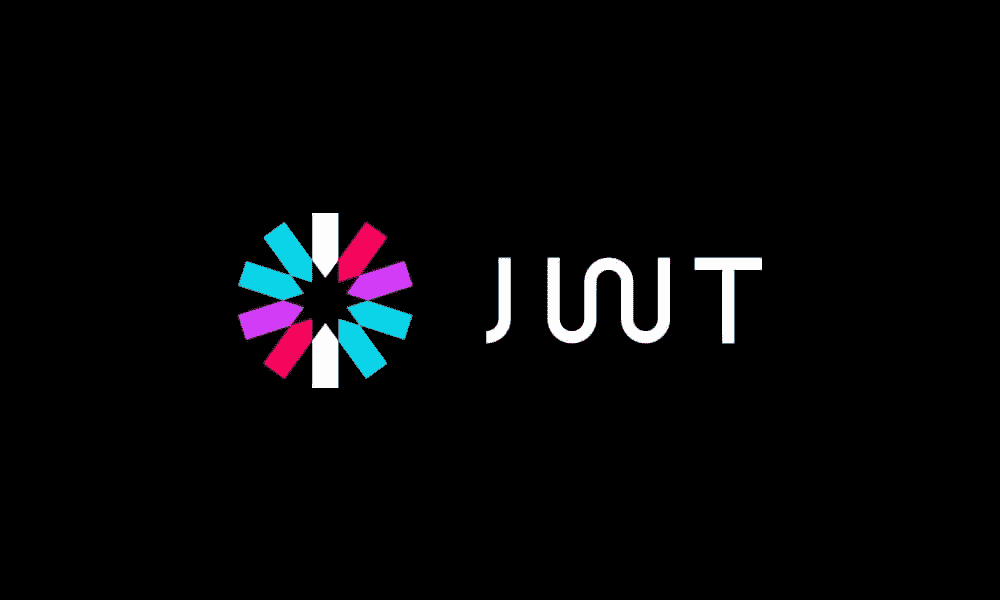

# ASP.NET 核心中的 JWT 对称和非对称密钥认证

> 原文：<https://blog.devgenius.io/jwt-authentication-in-asp-net-core-e67dca9ae3e8?source=collection_archive---------0----------------------->

我们将会看到

👉 **JWT 用对称密钥签名**

👉 **JWT 用 RSA 非对称私钥签名**

在 ASP.NET 核心中对用户进行身份验证时，通常会使用`AddCookie()`或任何一种`AddSomeSocialMedia()`方法将他们签入默认方案。将用户注册到一个方案中基本上意味着向他们的浏览器发送一个身份验证 cookie，该 cookie 会在每个后续请求中被传递和验证。

然而，这与 jwt 不同。JWT 通常不存储为 cookie——相反，它在“授权”头中，并且应该在您想要授权的每个请求上传递。

🔔[想要更多这样的文章？在这里签名。](https://nmillard.medium.com/subscribe)

# 🔑使用 dotnet 用户机密存储您的机密

我们需要对称密钥和非对称私钥使用的秘密。对于本地开发，我们将总是使用`dotnet user-secrets`,而不是错误地将 appsettings.json 中的秘密检查到源代码中。

让你的 appsettings.json 列出你的应用程序将需要的所有必需的配置设置是一个好习惯，即使你从 KeyVault 或 secrets manager 加载设置。

让我们设置 Jwt:Symmetric:Key 和 Jwt:Asymmetric:PrivateKey。

使用终端将目录更改为 ASP.NET 核心 web 客户端项目，并运行以下命令。

`dotnet user-secrets init`

`dotnet user-secrets set “Jwt:Symmetric:Key" "1234567890123456"`

`dotnet user-secrets set “Jwt:Asymmetric:Key" "some_private_rsa_key"`

## 如何生成 RSA 密钥

您可以使用下面的代码片段生成 RSA 私钥和公钥。

# **JWT 用对称密钥签名**

## 在 Startup.cs 中配置承载认证

首先，将`Microsoft.AspNetCore.Authentication.JwtBearer`添加到 ASP.NET 核心 web 客户端项目中。

其次，配置`ConfigureServices()`使用`AddJwtBearer`，就像代码片段中那样。

🔔想要更多这样的文章吗？在这里签名。

## 在控制器动作中生成和验证

生成对称签名的 jwt 只是一个简单的问题:

1.  使用对称密钥创建签名凭据
2.  用您希望它包含的任何声明来编写令牌
3.  在令牌上签名

HTTP GET 端点`/api/authorization/generatetoken``返回一个签名的令牌。

调用`/api/authorization/validatetoken``将 JWT 传入`authorization: Bearer <jwt>``你将得到 200 OK 响应。

📢记住签名和验证的`SymmetricSecurityKey`必须基于同一个秘密。

# 使用非对称 RSA 密钥对的 JWT

设置 json web 令牌的非对称签名和验证与对称签名非常相似。

## 在 Startup.cs 中配置承载认证

主要的区别在于，您需要向您的依赖框架注册 RSA 安全密钥的创建。否则，你会遇到一些欺骗性的 401 未经授权的反应。

在我的例子中，你会看到我使用了一个不同的方案“非对称”来验证非对称签名的令牌。考虑到这一点，您将使用“非对称”方案以同样的方式保护您的资源。

## 在控制器动作中生成和验证

请注意，我使用私钥对令牌进行签名。通过这样做，您可以创建一个可以生成密钥的服务，并且能够发布您的公钥，让其他服务验证用您的私钥签名的密钥。

🔔[想要更多这样的文章？在这里签名。](https://nmillard.medium.com/subscribe)

# 让我们保持联系！

[通过在此](https://nmillard.medium.com/subscribe)注册时事通讯获得类似文章的通知，并查看 [*YouTube 频道(@Nicklas Millard)*](https://www.youtube.com/channel/UCaUy83EAkVdXsZjF3xGSvMw) *。*

[在 LinkedIn 上连接](https://www.linkedin.com/in/nicklasmillard/)。