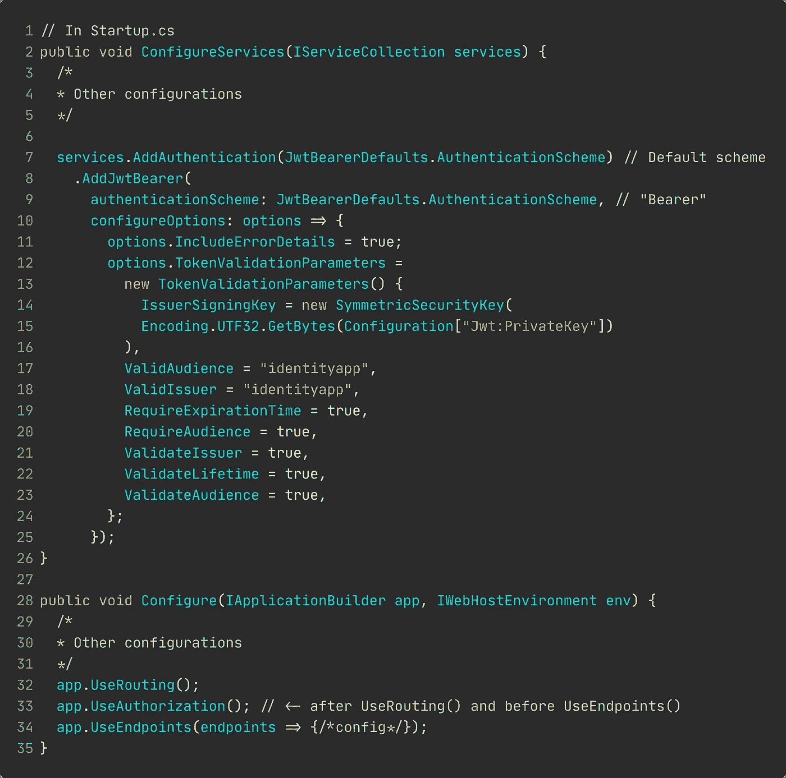
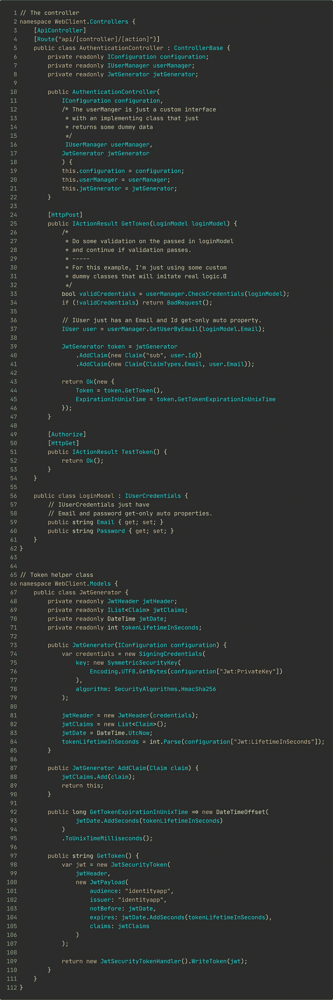

# 在 ASP.NET 核心网建立 JWT 承载认证

> 原文：<https://blog.devgenius.io/jwt-bearer-authentication-for-machine-to-machine-and-single-page-applications-1c8ba1211a90?source=collection_archive---------0----------------------->

## 顾问指南

如果你需要一个关于设置 JWT 载体认证的快速指南，请阅读这篇文章。
我不会详细讨论 JWT 是如何工作的，甚至不会讨论你应该如何配置你的 TokenValidationParameters。

 [## 认证简介

### ASP.NET 核心认证的基本概念。

medium.com](https://medium.com/@nmillard/brief-overview-of-asp-net-core-authentication-451e630bc42d) 

## 注册 JWT 承载认证处理器

1.  将`Microsoft.AspNetCore.Authentication.JwtBearer`添加到您的 ASP.NET 核心项目中。
2.  生成一个 32 个字符长的密钥(如果你打算使用 256 位加密)并保存在你的 user-secrets、KeyVault 或 appsettings.json 中
3.  按照下面的代码片段配置您的启动类

调用`AddAuthentication(JwtBearerDefaults.AuthenticationScheme)`只是启用认证，并将“承载”设置为默认方案。这意味着，当您使用`[Authorize]`而没有指定认证方案时，默认情况下，它将使用为“载体”配置的处理程序来询问用户。

在第 7 行，您添加并配置了一个身份验证处理程序，当向用户显示“Bearer”的质询时，将使用这个处理程序。

第 33 行的方法将允许你在控制器和动作上使用`[Authorize]`。

## 生成 JSON Web 令牌

花点时间通读下面的代码。

如上所示设置身份验证控制器后，您将能够生成签名的 jwt 并使用`[Authorize]`属性保护端点。

当您收到令牌时，将它存储在客户机应用程序稍后可以检索到的地方，并在后续请求中将它传递给授权头。