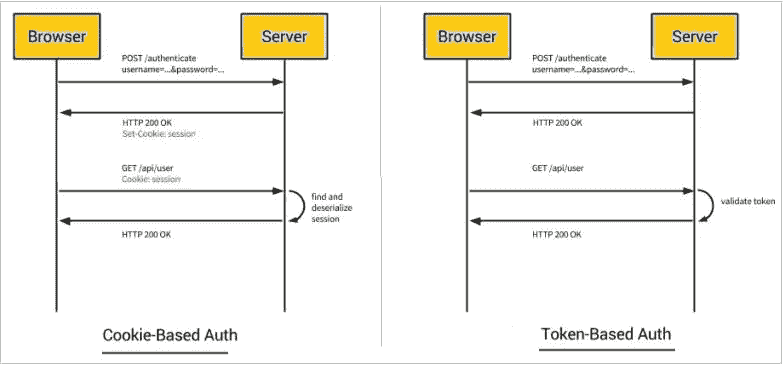
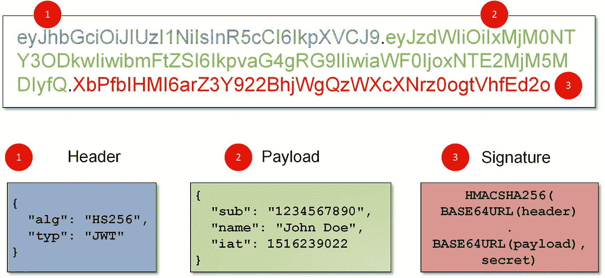
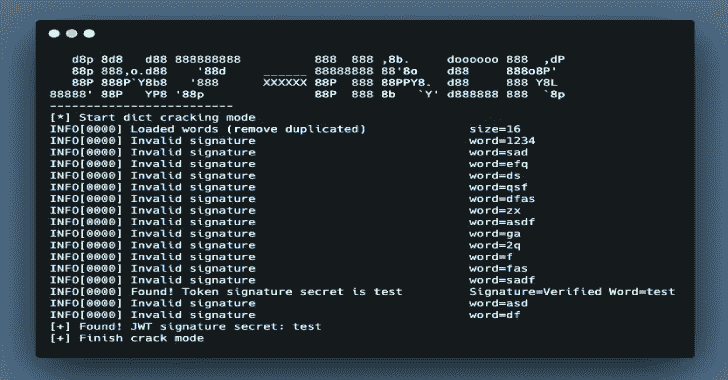

# JWT 常见攻击

> 原文：<https://blog.devgenius.io/jwt-common-attacks-b41de384113e?source=collection_archive---------1----------------------->

# 什么是 JWT🤔？

JSON Web 令牌(JWT)用于授权登录的用户，因此在用户登录后，有时 Web 服务器需要检查该用户是否被授权(有权访问)该特定系统/信息。

JWT 在授权中不使用传统的 cookies 和会话，而是使用 JSON web 令牌



饼干与代币

## **JWT 结构**

JWT 由三个主要部分组成:


JWT 示例令牌

1.  **报头**
    -报头是 JWT 令牌的最上面部分，它指定了将在签名部分使用哪种算法来生成签名(更多信息请参见签名)
    算法可以是以下之一:无(无编码)、HS256、RS256。

2. **Payload**
这是令牌中的主要消息，其中包含关于将被授权或未被授权的用户/组织的重要信息。
有效载荷的静态字段之一是“iat ”,它是生成的 JWT 的时间戳，其他有效载荷元素根据使用的 web 应用程序而变化。

`{
"sub": "1234567890",
"name": "John Doe",
"admin": true
}`

3.**签名**base64 格式的标头。
2。base64 格式的有效负载。
3。用于生成签名的秘密密钥(根据标题中规定的算法)，对于 RS256 等不对称算法，有时是 2 个密钥(私有+公共)。



JWT 令牌(已解码)

也许你现在正在挠头，想知道像 RS256 这样的强非对称算法会造成什么类型的攻击，但事实上我们有许多方法可以绕过签名部分。

我们将解释可以用 jwt 进行的 4 大攻击。

# 1.RSA 对 HMAC 攻击

正如我们提到的，我们有两种主要的加密算法，RS256 和 HS256，当然我们都知道 RS256 是不对称的，因此很难破解，因为它使用私钥/公钥组合。

-参考此链接了解更多 RSA vs HMAC:[https://connect 2 id . com/products/nimbus-Jose-jwt/algorithm-selection-guide](https://connect2id.com/products/nimbus-jose-jwt/algorithm-selection-guide)

*   使用(Burpsuite)或您熟悉的任何代理截取请求，并将其发送给中继器以更改请求。
*   第一步是将报头算法从“RS256”更改为“HS256”。
*   获取网站的公钥(可以在他们的证书中找到或在互联网上泄露),您可以查找类似的目录。知名或常用的目录或 jks.json 文件
    也指这个神奇的网站:[https://connect 2 id . com/products/nimbus-Jose-jwt/examples/jwk-retrieval](https://connect2id.com/products/nimbus-jose-jwt/examples/jwk-retrieval)
*   保存公钥后，我们需要用相同的密钥(公钥)生成新的签名，因为记住现在我们使用的是 HS256，它使用相同的密钥进行签名/加密。
*   要生成新签名，请参考以下代码片段:

```
import hashlib
import base64
import hmacfile=open('key.pem')

key = file.read()

#Change Header and payload to the one you intercepted and alter it#
header = '{"alg":"HS256",
           "typ": "jwt"}'
payload = '{
  "sub": "1234567890",
  "name": "John Doe",
  "admin": true
}'

#encoding Header
encodedHBytes = base64.urlsafe_b64encode(header.encode("utf-8"))
encodedHeader = str(encodedHBytes, "utf-8").rstrip("=")

#Encoding payload
encodedPBytes = base64.urlsafe_b64encode(payload.encode("utf-8"))
encodedPayload = str(encodedPBytes, "utf-8").rstrip("=")

complete_jwt = (encodedHeader + "." + encodedPayload)

#Creating the whole Signature#try:
signature = base64.urlsafe_b64encode(hmac.new(bytes(key, "UTF-8"),complete_jwt.encode('utf-8'),hashlib.sha256).digest()).decode('UTF-8').rstrip("=")

print(complete_jwt + "." + signature)
```

*   将签名更改为您刚刚生成的签名，并使用 burp 发送更改后的请求，希望一切顺利。

__ 免责声明:这种方法仅在后端服务器存在允许改变算法的 RS-HS 漏洞时有效，尽管这种攻击非常有名，但它现在只在少数网站上有效😢。

# 2.无效签名攻击

这种攻击比第一种容易得多，你只需截取消息，发送给中继器，猜猜是什么删除了整个签名，然后期待最好的结果。
*这种攻击是一种严重的安全错误配置，通常只能在安全实践较差的中小型组织中发现。

# 3.无算法攻击

这种类型的攻击与第一种和第二种非常相似。

*   您截获了消息，这次通过将“algorithm”值更改为“none ”,并将有效负载更改为您想要的任何值(您可以保持签名不变)来更改消息头。
*   一些 web 服务器没有不接受除一个算法之外的任何算法的规则(弱治理实践)。
*   这种攻击在过去几年非常有名，直到我写这篇文章的时候，许多顶级公司都有这种攻击。
*   参考我这里的朋友提炼出来的非算法攻击:[https://blog . pentesteacademy . com/hacking-jwt-tokens-the-None-algorithm-67c 14 bb 15771](https://blog.pentesteracademy.com/hacking-jwt-tokens-the-none-algorithm-67c14bb15771)

# 4.强力签名

*   虽然这不被认为是一个漏洞，您也不会因此获得任何奖励，但它有时对发现其他漏洞很有用
*   这种攻击只对 HS256 有效，对非对称加密无效(除非你有量子计算机)。
*   说到后端，一些加密密钥并不像它们应该的那样好，所以它并不是完全随机的，我自己也看到过由于生成的密钥缺乏随机性，签名在很短的时间内被破解。
*   有很多工具可用，但是我建议你先自己检查签名，然后决定应该使用什么工具，不管怎样，这些是我最喜欢使用的工具(你也可以使用 burp extension)。
    [【https://github.com/lmammino/jwt-cracker】](https://github.com/lmammino/jwt-cracker)
    [**https://github.com/x1sec/gojwtcrack**](https://github.com/x1sec/gojwtcrack)



JWT 蛮力在行动


# 参考文献

1.  [https://www . the hacker . recipes/web/inputs/secure-JSON-web-tokens](https://www.thehacker.recipes/web/inputs/insecure-json-web-tokens)
2.  [https://www.youtube.com/watch?v=4V3GXPViXxQ&t = 2024s](https://www.youtube.com/watch?v=4V3GXPViXxQ&t=2024s)
3.  [https://blog . intigriti . com/2021/07/27/hacker-tools-jwt _ tool/](https://blog.intigriti.com/2021/07/27/hacker-tools-jwt_tool/)
4.  [https://infosecwriteups . com/attacks-on-JSON-we b-token-jwt-278 a 49 a1 ad2e](https://infosecwriteups.com/attacks-on-json-web-token-jwt-278a49a1ad2e)