# k-均值聚类在商场客户细分中的应用

> 原文：<https://blog.devgenius.io/k-means-clustering-for-mall-customer-segmentation-5dfd356fcd02?source=collection_archive---------3----------------------->

Python 中聚类分析的快速指南

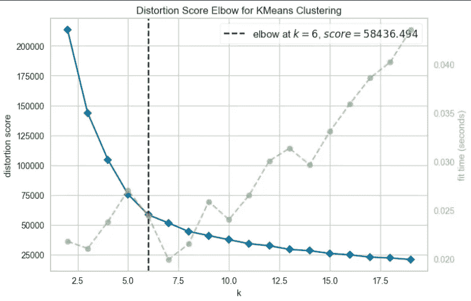

**K-means 聚类**是一种无监督学习技术，通过按特征而不是预定义的类别对未标记的数据进行分组来对其进行分类。变量 K 代表创建的组或类别的数量。目标是将数据分成 K 个不同的组，并报告每个组的质心位置。然后，可以基于封闭的质心为新的数据点分配一个聚类(类)。这种方法的最大优势是人类的偏见被排除在外。机器不是让研究人员创建分类组，而是根据经验证据而不是假设创建自己的聚类。

使用的数据集是干净的，就其大小而言很小。当然，这是一个虚拟的。因为数据集足够干净，所以分析可以快速完成。然而，原始比例尺数据并非如此，原始比例尺数据的复杂程度更高，并允许使用其他方法。

1.  **加载数据集**

```
import pandas as pd
import numpy as np
import seaborn as sns
from pandas.api.types import is_string_dtype, is_numeric_dtype*# set max cullumns to none* pd.set_option("display.max_columns",None)*# set colwidth high* pd.set_option("display.max_colwidth",100)*# missing values* import missingno as msno
*# (EDA) importing sweetviz* import sweetviz as svfrom sklearn.cluster import KMeans
from sklearn.metrics import silhouette_samples, silhouette_score
import matplotlib.pyplot as plt
import matplotlib.cm as cm
import numpy as np
import matplotlib.style as style
from sklearn import metrics
from yellowbrick.cluster import KElbowVisualizerdataset = pd.read_csv('Mall_Customers.csv')df = dataset.copy()
df.info()
```

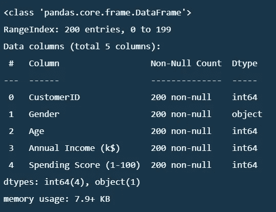

**2。EDA(探索性数据分析)**

```
*#analyzing the dataset*advert_report = sv.analyze(df)*#display the report*advert_report.show_html('Mall_clustering.html')
```

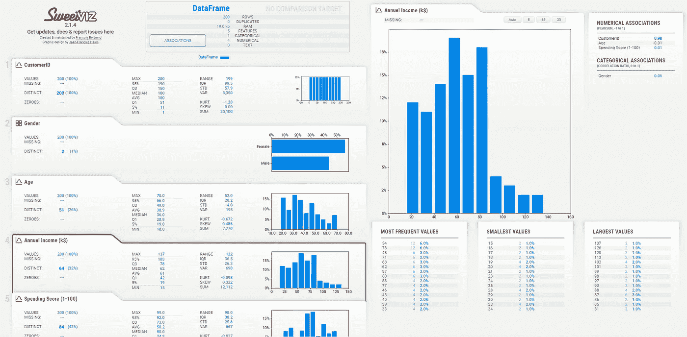

另一种方法是使用 Sweetfiz 库快速浏览所有数据。

```
#to look at the sumirize
df.describe()
```

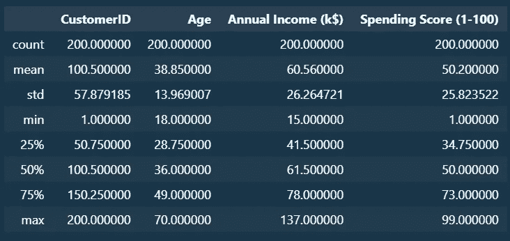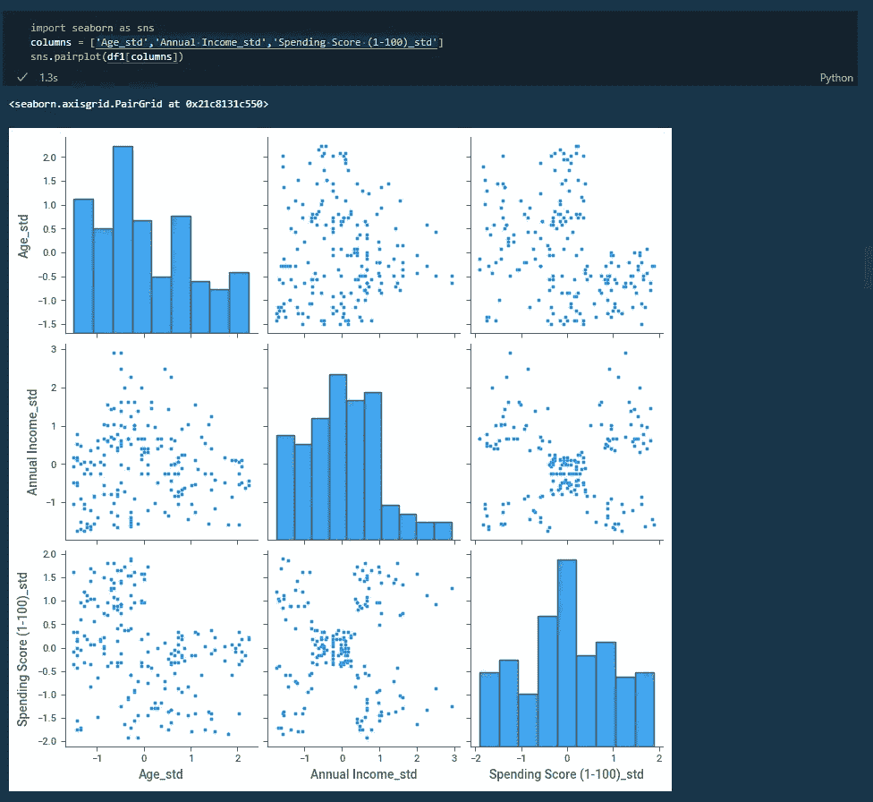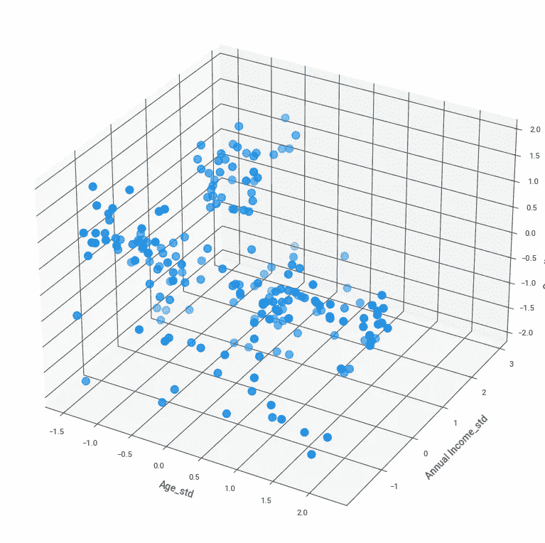

**3。数据预处理**

既然我们已经定义了目标并对数据有了更好的理解，我们需要对数据进行预处理以满足模型需求。
标准 k 均值算法不能直接应用于分类数据。更具体地说，分类变量(例如，本例中的性别)的搜索空间是离散的(男性或女性)，因此不能直接与连续空间组合并以同样的方式进行测量。因此，我删除了“性别”和“客户 ID”字段。

```
df1 = df [['Age','Annual Income (k$)','Spending Score (1-100)']]df1.head()
```


```
sns.kdeplot(df1['Spending Score (1-100)'])
sns.kdeplot(df1['Annual Income (k$)'])
sns.kdeplot(df1['Age'])
```

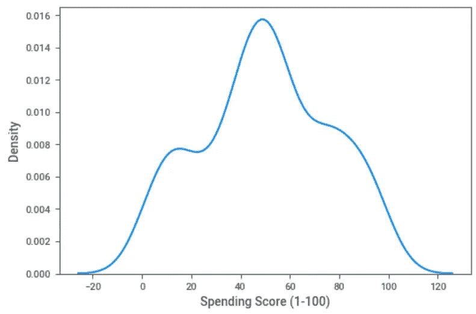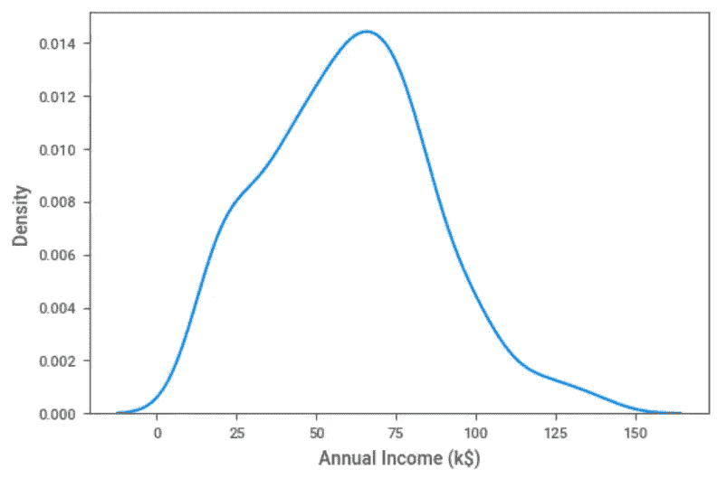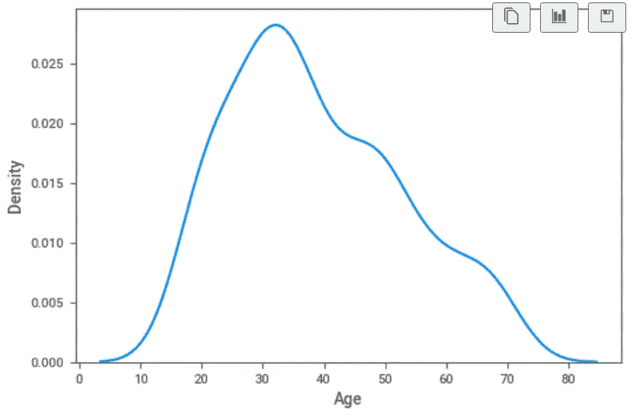

从前面的单变量分析中我们可以看出，这些变量既不符合正态分布，也不符合法律分布。因此，我使用 MinMaxScaler 将数据范围缩小到 0 到 1 之间，同时保持分布形状。

```
from sklearn.preprocessing import MinMaxScaler, StandardScalerdf1['Age_std'] = StandardScaler().fit_transform(df1['Age'].values.reshape(len(df1), 1))df1['Annual Income_std'] = StandardScaler().fit_transform(df1['Annual Income (k$)'].values.reshape(len(df1), 1))df1['Spending Score (1-100)_std'] = StandardScaler().fit_transform(df1['Spending Score (1-100)'].values.reshape(len(df1), 1))
```

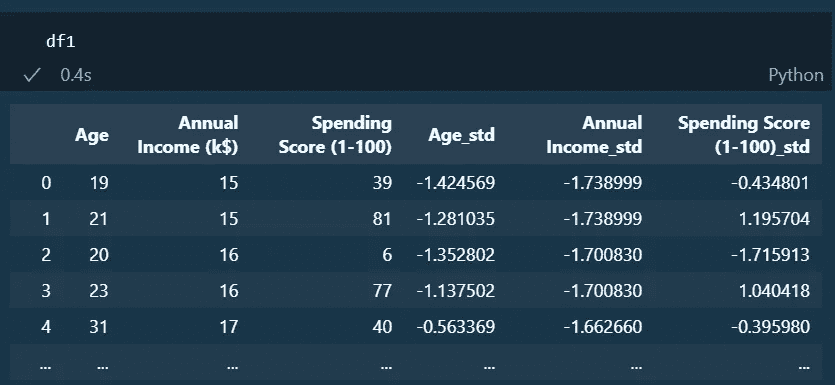

**4。k-均值聚类**

```
from sklearn.cluster import KMeans
X = df1
*# X = dataset_scaled[numerical_features].copy()* inertia = []for i in range(2, 20):
kmeans = KMeans(n_clusters=i, random_state=42)
kmeans.fit(X.values)
inertia.append(kmeans.inertia_)
print(inertia)
plt.figure(figsize=(20, 10))
plt.title('Elbow Method of K-means Clustering')*# plt.plot(inertia)*sns.lineplot(x=range(2, 20), y=inertia, color='#000087', linewidth = 4)sns.scatterplot(x=range(2, 20), y=inertia, s=300, color='#800000',  linestyle='--')
```

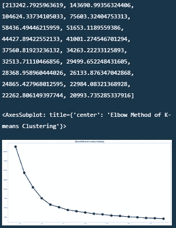

我采取了不同的方法，因为集群的数量“K”仍然是不可见的，我仍然不确定。

```
*# Import ElbowVisualizer* model = KMeans(n_clusters=i, random_state=42)*# k is range of number of clusters.* visualizer = KElbowVisualizer(model, k=(2,20), timings= True)
visualizer.fit(X.values)        *# Fit data to visualizer* visualizer.show()        *# Finalize and render figure*
```

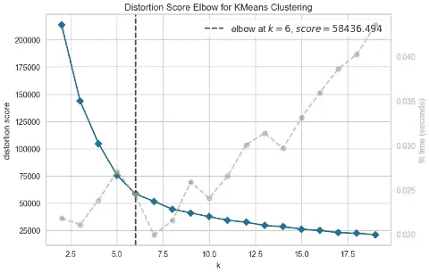

字母“K”可以在这里的第 6 组中看到。

作为 EDA 过程的结果，我们在图表中发现了几个不同的集群。让我们仔细看看该模型是否能如预期的那样将客户细分为不同的细分市场。代码类似于上面的代码，比例年收入与比例支出分数。

```
*# Spending vs. Age vs. Annual Income by different number of clusters*X3_inertia_values = []
X3_silhouette_scores = []
fig = plt.figure(figsize=(15,15))for i in range (2,11):
X3_inertia, X3_label, X3_centroids, X3_silhouette = KMeans_Algorithm(X3, i)
X3_inertia_values.append(X3_inertia)
X3_silhouette_scores.append(X3_silhouette)
centroids_df = pd.DataFrame(X3_centroids, columns =['X', 'Y', 'Z'])
ax = fig.add_subplot(330 + i - 1, projection='3d')
ax.scatter(df1["Age_std"],df1["Annual Income_std"],df1["Spending Score (1-100)_std"], s = 30, c = df1["label"], cmap = "viridis")
ax.scatter(centroids_df['X'], centroids_df['Y'], centroids_df['Z'], s = 90, marker= ",", color = "r")
ax.set_xlabel("Age")
ax.set_ylabel("Annual Income(k$)")
ax.set_zlabel("Spending Score (1-100)")*# plot inertia values against number of clusters* plt.figure(11 , figsize = (15 ,6))
plt.plot(np.arange(2 , 11) , X3_inertia_values , '-')
plt.xlabel("Number of Clusters")
plt.ylabel("Inertia Values")*# plot inertia values against number of cluster* plt.figure(12, figsize=(15,6))
plt.plot(np.arange(2,11) , X3_silhouette_scores, '-')
plt.xlabel("Number of Clusters")
plt.ylabel("Silhouette Score")
```

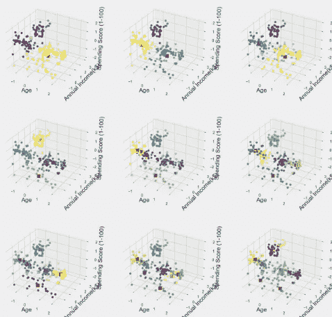

**5。数据集的实现**

```
from sklearn.cluster import KMeanskmeans = KMeans(n_clusters=6, random_state=42)
kmeans.fit(X)
X['cluster'] = kmeans.labels_
df['cluster'] = kmeans.labels_
```

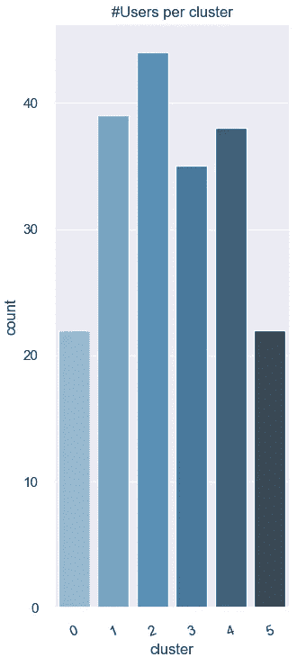

```
df.groupby('cluster')['Age','Annual Income (k$)','Spending Score (1-100)'].describe()
```

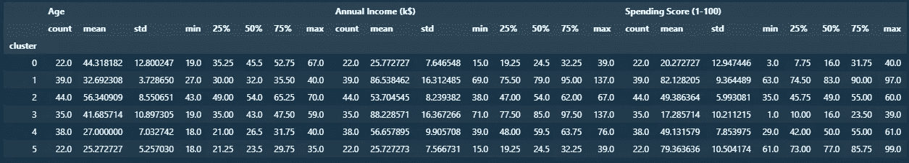

在“K”之后，下一个分类将“cluster”应用于它所拥有的数据集。可以看出，群组 3 的年收入最高，但支出得分最低，尽管其平均年龄为 41 岁。而聚类 5，平均年收入 25，消费分高达 79，平均年龄 22 岁，则成反比。如果我们看上面的条形图，它显示了集群数量的分布，我们可以看到集群 2 有 44 个，集群 0 和 5 有 22 个。第二类对年收入的贡献平均为 53。最高 67，最低 38。支出得分平均为 49，最高为 60，最低为 35。很明显，经常购物和光顾的大多数购物中心顾客属于第二类，也就是中产阶级，他们只在平均消费分数为 55 分和高消费分数的地方购物。