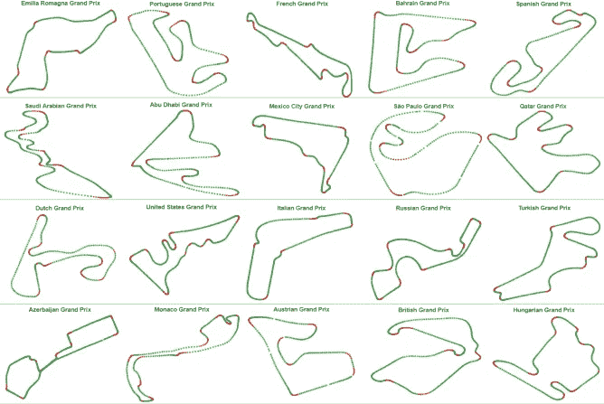

# k-表示使用 Python 从遥测数据中获得的 2021 条方程式赛道

> 原文：<https://blog.devgenius.io/k-means-formula-1-2021-tracks-from-telemetry-data-with-python-52a4263ddd6c?source=collection_archive---------5----------------------->

根据资格赛的最佳成绩对 Formula 1 2021 赛道进行聚类。

F1 2021 首曲目

## 无监督机器学习

无监督机器学习是一种从无目标数据中学习的算法。例如，我可以将我的客户分为多少个类别，或者有多少种不同的司机行为。这一类别中的一些算法是 K-均值聚类、主成分分析、层次聚类。为了聚类 F1 赛道，我们将使用 K-Means。

## k 均值

K-Means 算法通过尝试将样本分成 n 个方差相等的组来对数据进行聚类，从而最小化一个称为*惯性*或类内平方和的标准。K-means 算法旨在选择最小化**惯性**或**类内平方和标准的质心。**

尽管要应用 K-Means，首先需要对聚类数进行分类。为了做到这一点，人们使用了肘法。elbow 方法对数据集中的 k 值范围(比如从 1 到 10)运行 k 均值聚类，然后对 k 的每个值计算所有聚类的平均分数。默认情况下，计算失真分数，即从每个点到其指定中心的平方距离的总和。

## 数据

已经使用 python 中的 fastf1 包检索了用于运行此操作的数据。

每场比赛的流程:

1.  正在检索合格的会话圈速
2.  选择最佳驱动程序
3.  用遥测数据检索最佳单圈
4.  不包括潮湿条件下的单圈时间
5.  计算每条赛道的具体 KPI

*   全速
*   平均速度(距离/圈速)
*   轨道的距离
*   全油门百分比(油门≥95 时的遥测数据计数/遥测数据计数)
*   基于最小速度的弯道数量，按 50 公里/小时分组
*   基于最大速度的直道数量，按 50 公里/小时分组

代码示例

## 数据预处理

实现上述步骤后，代码生成下表。

在应用肘方法和 K-Means 算法之前，我们用一个热编码器为列“cor_50”、“cor_100”、“cor_150”、“cor_200”、“cor_250”、“cor_300”、“str_150”、“str_200”、“str_250”、“str_300”、“str_350”和最小最大缩放器转换数据。

## 肘法

使用[**yellow brick**](https://www.scikit-yb.org/en/latest/index.html)**API 的最佳簇数是 8。**

****

**肘法**

## **k-均值结果**

**使用 Python 中的 scikit-learn，下图显示了聚类的最终结果。**

****

**在第一组中，我们可以看到阿布扎比、墨西哥和法国，这三条赛道都有高速直道和低速弯角。**

**第二个，沙特阿拉伯，意大利，奥地利，那里有平均速度为 251 公里/小时的快速赛道。不要忘记蒙扎**“速度圣殿”**。**

**第三组是卡塔尔、荷兰、艾米利亚-罗马涅，在 6 条直道上，所有弯道中的最小速度都高于 100km/h。超过 250 公里/小时**

**巴西、美国、葡萄牙和巴林位于第四组，弯道和直道各不相同。**

**第五类是土耳其、俄罗斯和阿塞拜疆。所有这三条赛道的弯道最多，最小速度在 50 公里/小时-150 公里/小时之间**

**第六类的特征与第四类非常接近。但是 150km/h-200km/h 的速度下弯道比较多。**

**第七个集群包含银石。我个人的期望是和蒙扎在一起，但不是。比蒙扎赛道要慢一点，所以算法会用这条赛道做出一个独特的集群。**

**对摩纳哥来说，我认为这不需要任何解释。**同类之一**。**

**感谢您阅读这篇文章。最终的代码可以在参考文献中找到。**

**参考资料:**

** [## 2.3.使聚集

### 可以使用 modulesklearn.cluster 对未标记的数据进行聚类。每种聚类算法都有两种…

scikit-learn.org](https://scikit-learn.org/stable/modules/clustering.html#k-means)  [## 快速 F1 文档-快速 F1 2.2.0 文档

### 请注意，需要 Python 3.8 或更高版本。(实时计时客户端不支持 Python 3.10，因此完全…

theoehly . github . io](https://theoehrly.github.io/Fast-F1/)  [## 弯头方法- Yellowbrick v1.3.post1 文档

### KElbowVisualizer 实现了“肘”的方法，以帮助数据科学家选择最佳数量的集群…

www.scikit-yb.org](https://www.scikit-yb.org/en/latest/api/cluster/elbow.html)  [## GitHub-dimitrisnismo/formula 1 _ track analytics

### 此时您不能执行该操作。您已使用另一个标签页或窗口登录。您已在另一个选项卡中注销，或者…

github.com](https://github.com/dimitrisnismo/Formula1_TrackAnalytics)**