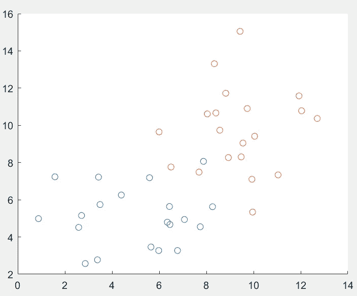
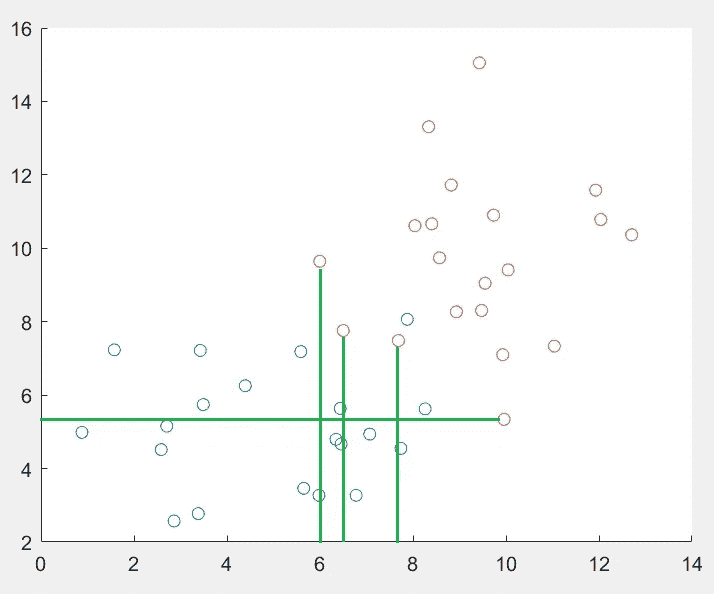
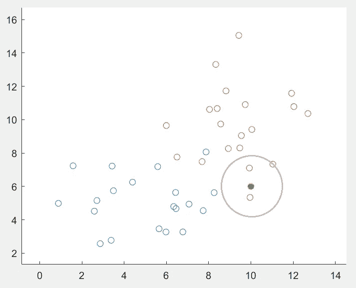

# K-最近邻分类

> 原文：<https://blog.devgenius.io/k-nearest-neighbours-classification-4af034bc7691?source=collection_archive---------14----------------------->

在这一系列的统计监督分类技术中，我们将从学习 K 近邻分类(也称为 KNN)开始。让我们了解一下这种分类技术的基础。首先，我们必须熟悉输入特征空间，然后进入算法的基础。

为了理解特征空间、距离和算法本身，让我们举一个简单的例子。我们将以一维特征向量为例，尝试找到一种方法对其进行正确分类。

假设我们必须对两种不同类型的水果进行分类——假设我们有一台对水果的外观视而不见的机器，它只能测量这些水果的重量。假设我们的机器必须区分苹果和猕猴桃，现在基本逻辑告诉我们，苹果平均比猕猴桃重，所以假设我们已经有一些关于苹果和猕猴桃重量的数据，这将被视为我们的训练数据

猕猴桃重量(克)= [90，80，85，75，82，71，88，91，85，81]
苹果重量(克)= [140，145，143，160，135，142，150，173，150，155]

因此，我们有 10 个苹果样本和 10 个猕猴桃样本用于我们的训练集。
现在，我们将绘制一维图——即重量


猕猴桃和苹果重量的 1D 表示法

正如我们所看到的，左边聚类上的点(绿色)代表猕猴桃的重量，右边聚类上的点(红色)代表苹果的重量。

现在，假设机器要对一个重量为 130 克的水果进行分类，那么它将如下图所示(测试水果用蓝色标记)。


未知水果的测试分类(蓝色)

从上图可以看出，我们可以直观地说，水果的重量更接近苹果，因此应该归类为苹果。

在本例中，我们使用距离作为|x -xₜ|，其中 x 是一个新的输入，xₜ是一个我们想要计算其距离的点。通常，当实现 KNN 时，我们使用欧几里德距离或马哈拉诺比斯距离，因为它们更一般化，并且可以用于不同大小的输入特征向量。[注—欧几里德距离= SQRT( (x -xₜ) ) ]。

KNN 算法简要说明—

1.  加载训练数据(将这些点放在我们的向量空间上)
2.  加载测试向量(将其放在地图上)，然后计算每个训练点与测试特征向量点的距离(可以是不同的类型—欧几里德、马哈拉诺比斯等)。
3.  按升序排列距离。
4.  决定有多少邻居应该决定测试点的类别。KNN 中的“K”代表邻居的数量，所以假设 K = 3，那么我们将根据与测试向量最近的前 3 个点来决定测试向量的类别。该决定可以是简单的投票(例如，如果两个最接近的点属于“A”类，一个属于“B”类，则我们将其分类为 A 类),或者该决定可以基于加权投票(点越接近，其投票的权重越大)
5.  基于 K-最近邻，我们对测试向量进行分类，即，我们预测它在某一类中。

现在，回到我们上面的例子，让我们用 KNN 算法对重 130 克的水果进行分类

步骤 1)已经完成，因为我们已经表示了这些点(不需要计算)。
对于步骤 2——我们计算我们的点 130 与所有其他训练数据点的欧几里德距离。

3)假设我们使用(k=3)作为我们的 KNN(3-最近的邻居),我们选择 3 个最近的邻居，它们是 135g、140g 和 142g，所有 3 个最近的邻居都属于类别“Apple”

4)因此，我们预测重量为 130 克的未知水果应该是苹果。


测试向量的最近邻表示

现在，我们将加强游戏，并增加模型的复杂性。我们将尝试使用 2D 特征向量和标签有点难以区分的数据集。

假设我们的数据是基于两种不同类型的叶子(大叶和小叶)的分类，为了更好地区分叶子，我们将它们的长度和重量记录为 2D 向量— (x 单位，y 单位)，其中 x 单位是指叶子的重量，y 单位是指它的长度。



蓝色=小叶“A”，红色=大叶“B”

增加记录输入数据的维度可以提高我们的分类准确性(从下图的散点图中可以看出)，如果我们只根据体重或只根据身高进行记录和分类，那么我们的模型将不够稳健，因为我们在 x 轴和 y 轴上取一些点的投影，错误类的点可能更接近测试向量。



如果只使用 1D，问题点的投影

现在，假设我们要测试一片叶子，它的长度和重量是(10 个单位，6 个单位)，所以我们把测试向量表示为(10，6)

然后，我们计算测试向量与所有训练点的欧氏距离，并找出与测试向量最近的邻居

从下图中，我们看到测试向量(绿色)最接近红点(大叶的特征向量)，并且 3 个最接近的邻居是“大叶”，因此我们将测试向量分类/预测为属于“大叶”家族。



测试向量(绿色)更接近大叶的特征向量

现在让我们使用 scikit-learn 来完成一个简单的基于 python 的 KNN 分类实现。

1.  我们获取输入数据，并将训练数据集与测试数据集分开，以便检查我们的模型是否能够处理之前未训练过的数据—在下面的示例中，我们使用测试数据作为总数据的 20%，这意味着总数据的 80%将用作训练数据

```
from sklearn.model_selection import train_test_split# input_data = [<<data : Extracted Feature Vectors>>]
# input_labels = [<<corresponding data class labels >>]training_data, test_data, training_labels, test_labels = train_test_split(input_data,input_labels,test_size=0.2)
```

2.在获得训练和测试数据后，我们训练我们的分类器(KNN 没有训练过程，它只是在特征向量空间中映射输入训练向量)，然后我们使用我们的分类器预测测试数据，如下所示—

```
from sklearn.neighbors import KNeighborsClassifierknn_classifier = KNeighborsClassifier(n_neighbors=3)
knn_classifier.fit(training_data, training_labels)
```

3.现在，在测试预测完成后，我们将计算准确度分数和混淆矩阵，如下所示

```
from sklearn import metrics
from sklearn.metrics import confusion_matrixaccuracy_percentage = 100*metrics.accuracy_score(test_labels, predictions)
conf_matrix = confusion_matrix(test_labels, predictions)# Print out the resultsprint(" Accuracy percentage is - {}".format(accuracy_percentage))
print(" Confusion Matrix is - \n")
print(conf_matrix)
```

瞧啊。我们有结果了

在本文中，我们学习了 KNN 的基本概念以及如何实现这一技术。享受学习和尝试这些机器学习技术的乐趣吧！

如果你喜欢这篇文章，请留下“掌声”!