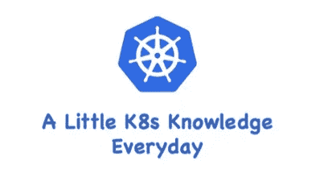
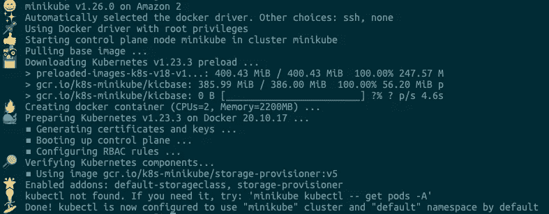

# K8s —使用 Minikube 构建 K8s 集群

> 原文：<https://blog.devgenius.io/k8s-build-k8s-cluster-using-minikube-50a1566ad8aa?source=collection_archive---------6----------------------->

## 每天一点 K8s 知识！



# 容器编排

容器技术的核心概念是容器、图像和存储库。利用这三个基本要素，我们可以轻松完成应用的打包和分发，实现“一次开发，处处运行”。

然而，当我们熟练掌握容器技术，并自信地在服务器集群中大规模实现时，我们会发现，容器技术的创新只是解决了运维部署中的一个小问题。

实际生产环境的复杂程度太高。除了最基本的安装，还会有各种需求，比如服务发现、负载均衡、状态监控、健康检查、扩展和收缩、应用程序迁移、高可用性等等。

容器技术虽然开启了云原生时代，但也只是迈出了一小步，没有什么可以做的事情继续前进，因为这已经不是孤立一两个进程的普遍问题，而是无数个进程的问题。

对这些容器的管理和调度工作是这几年最流行的术语:“**容器编排**”。

# K8s

现在大家谈容器都说是 Docker，但其实早在 Docker (cgroup 由 Google 开发，然后提交到 Linux 内核)之前，Google 就在公司内部使用了类似的技术，但不叫容器。

作为世界上最大的搜索引擎，谷歌拥有数量庞大的服务器集群。为了提高资源利用率和部署、运维效率，它专门开发了一个集群应用管理系统，代号为 Borg，在底层支撑整个公司的运行。

2014 年，谷歌内部系统“升级”，从原来的 Borg 切换到 Omega，于是照例谷歌会发表公开论文，K8s 就这样诞生了。

因为 K8s 有十几年的 Borg 系统生产环境经验支撑，技术背景深厚，理论水平高，一经推出就引起了轰动。随后在 2015 年，谷歌和 Linux 基金会成立了 CNCF(Cloud Native Computing Foundation，云原生基金会)，并捐赠 K8s 作为种子项目。

K8s 是一个生产级的容器编排平台和集群管理系统，不仅可以创建和调度容器，还可以监控和管理服务器。公司还可以拥有轻松运营和维护海量计算节点的能力——也就是“云计算”。

# 迷你库贝

K8s 一般运行在大规模计算集群上，管理非常严格，对我们个人造成了一定的障碍。没有实际的操作环境，怎么才能学好用好呢？

好在 K8s 充分考虑了这种需求，提供了一些工具来快速搭建一个 K8s 环境。官网上有两个推荐([https://kubernetes.io/zh/docs/tasks/tools/](https://kubernetes.io/zh/docs/tasks/tools/)):`kind`和`minikube`，都可以原生运行一个完整的 K8s 环境。

`kind`基于 Docker，意为“Docker 中的 Kubernetes”。功能少，好用，所以运行快，好用。但它缺少 K8s 的很多标准特性，比如仪表盘、网络插件等，定制难度大，更适合有经验的 K8s 用户做快速开发和测试，不适合学习和研究。

`Minikue`是 K8s 的“迷你”版。自 2016 年发布以来一直在积极开发和维护，紧跟 Kubernetes 的版本更新，同时也兼容老版本(最多只能兼容之前的 6 个小版本)。

minikube 最大的特点就是“小而美”。可执行文件只有不到 100MB，运行镜像只有 1GB。但在这么小的空间里，它集成了 K8s 的大部分功能和特性，不仅有核心的容器编排功能，还有丰富的插件，比如 Dashboard、GPU、Ingress、Istio、Kong、Registry 等。，都很全面。

# 使用 Minikube

`minikube`支持三大主流平台:Mac、Windows、Linux。可以在它的官网上找到详细的安装说明([https://minikube . sigs . k8s . io](https://minikube.sigs.k8s.io))。在本文中，我们将使用 Linux。

我已经把官网上的 Linux 系统安装命令复制到这里了，你可以直接复制安装:

```
# Intel x86_64
$ curl -Lo minikube [https://storage.googleapis.com/minikube/releases/latest/minikube-linux-amd64](https://storage.googleapis.com/minikube/releases/latest/minikube-linux-amd64)# Apple arm64
$ curl -Lo minikube [https://storage.googleapis.com/minikube/releases/latest/minikube-linux-arm64](https://storage.googleapis.com/minikube/releases/latest/minikube-linux-arm64)$ sudo install minikube /usr/local/bin/
```

安装后，我们可以检查它的版本:

```
$ minikube version
minikube version: v1.26.0
commit: f4b412861bb746be73053c9f6d2895f12cf78565
```

但是，`minikube`只能搭建一个 K8s 环境。要操作 K8s，需要另一个特殊的客户端工具`kubectl`。

`kubectl`是一个独立于 K8s 和 minikube 的项目，所以不包含在`minikube`中，但是`minikube`提供了一个简化的安装方式，你只需要执行以下命令:

```
$ minikube kubectl
    > kubectl.sha256: 64 B / 64 B [--------------------------] 100.00% ? p/s 0s
    > kubectl: 43.59 MiB / 43.59 MiB [-----------] 100.00% 624.39 MiB p/s 300ms
kubectl controls the Kubernetes cluster manager.Find more information at: [https://kubernetes.io/docs/reference/kubectl/overview/](https://kubernetes.io/docs/reference/kubectl/overview/)
```

它将下载与当前 K8s 版本匹配的`kubectl`，并将其存储在内部目录中。

所以在 minikube 环境下，我们会使用两个客户端:`minikube`管理 K8s 集群环境，`kubectl`操作实际的 K8s 功能，比 Docker 复杂一点。

# 设置 Minikube 环境

使用命令`minikube start`从 Docker Hub 获取镜像，并使用最新版本的 K8s 启动集群。但是为了保证实验环境的一致性，我们可以在后面加一个参数— `kubernetes-version`来明确指定要使用的 K8s 版本(v1.23.3)。

```
$ minikube start --kubernetes-version=v1.23.3
```

输出将类似于:



现在 K8s 集群正在本地运行，您可以使用`minikube status`和`minikube node list`命令来检查集群的状态:

```
$ minikube status
minikube
type: Control Plane
host: Running
kubelet: Running
apiserver: Running
kubeconfig: Configured$ minikube node list
minikube 192.168.49.2
```

从截图中可以看到，Kubernetes 集群中只有一个节点，名称为“minikube”，类型为“控制平面”，有三个服务，host、kubelet、apiserver，IP 地址为 192.168.49.2。

也可以用`minikube ssh`命令登录这个节点，虽然是虚拟的，但和真机没什么区别:

```
$ minikube ssh
docker@minikube:~$ uname -a
Linux minikube 5.10.118-111.515.amzn2.x86_64 #1 SMP Wed May 25 22:12:19 UTC 2022 x86_64 x86_64 x86_64 GNU/Linux
docker@minikube:~$ exit
logout
```

也可以使用`kubectl`:

```
$ minikube kubectl -- version
Client Version: version.Info{Major:"1", Minor:"23", GitVersion:"v1.23.3", GitCommit:"816c97ab8cff8a1c72eccca1026f7820e93e0d25", GitTreeState:"clean", BuildDate:"2022-01-25T21:25:17Z", GoVersion:"go1.17.6", Compiler:"gc", Platform:"linux/amd64"}
Server Version: version.Info{Major:"1", Minor:"23", GitVersion:"v1.23.3", GitCommit:"816c97ab8cff8a1c72eccca1026f7820e93e0d25", GitTreeState:"clean", BuildDate:"2022-01-25T21:19:12Z", GoVersion:"go1.17.6", Compiler:"gc", Platform:"linux/amd64"}
```

我们可以为`Kubectl`命令做一个别名，将以下内容添加到`~/.bashrc`文件中:

```
alias kubectl="minikube kubectl --"
```

现在，我们可以愉快地使用`kubectl`:

```
$ kubectl version
Client Version: version.Info{Major:"1", Minor:"23", GitVersion:"v1.23.3", GitCommit:"816c97ab8cff8a1c72eccca1026f7820e93e0d25", GitTreeState:"clean", BuildDate:"2022-01-25T21:25:17Z", GoVersion:"go1.17.6", Compiler:"gc", Platform:"linux/amd64"}
Server Version: version.Info{Major:"1", Minor:"23", GitVersion:"v1.23.3", GitCommit:"816c97ab8cff8a1c72eccca1026f7820e93e0d25", GitTreeState:"clean", BuildDate:"2022-01-25T21:19:12Z", GoVersion:"go1.17.6", Compiler:"gc", Platform:"linux/amd64"}
```

让我们在 K8s 中运行一个 Nginx 应用程序。命令和 Docker 一样，也是 run，只是形式略有不同。你需要用`--image`指定镜像，然后 K8s 会自动拉运行:

```
$ kubectl run ngx --image=nginx:alpine
pod/ngx created$ kubectl get pod
NAME   READY   STATUS    RESTARTS   AGE
ngx    1/1     Running   0          18s
```

命令执行后，可以看到 K8s 集群中运行着一个名为 ngx 的 Pod，说明我们的单节点`minikube`环境已经成功构建。