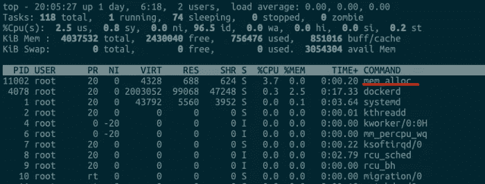

# K8s —容器内存

> 原文：<https://blog.devgenius.io/k8s-container-memory-87c6a2a98bef?source=collection_archive---------1----------------------->

## 容器内存使用情况深度调查


# 运行容器神奇地消失了？

你在使用容器时遇到过这种情况吗？一个容器在系统中运行一段时间后，突然消失了。即使你看了日志文件但里面什么也没有。集装箱就这么消失了。

很多时候，当一个正在运行的容器被系统杀死，原因只有一个:“**容器中的进程使用了太多的内存**”。具体来说，容器中所有进程使用的内存量超过了容器所在的`Memory Cgroup`中的内存限制。这时候 Linux 系统会主动杀死容器中的一个进程，往往会导致整个容器的退出。

让我们做一个实验。为了模拟 OOM(内存不足)杀戮，我为您准备了这个 docker 映像——Docker hub link:[tonylixu:OOM](https://hub.docker.com/repository/docker/tonylixu/oom)

刚刚拉下的图像:

```
$ docker pull tonylixu/oom:v1
v1: Pulling from tonylixu/oom
8a29a15cefae: Already exists
3e9f54602a54: Pull complete
Digest: sha256:632fdf51af051c336f21a9722327716ee984809a8592ab1ae51b2bdfccdb2a29
Status: Downloaded newer image for tonylixu/oom:v1
docker.io/tonylixu/oom:v1
```

使用以下 shell 脚本运行:

```
#!/bin/bash
# Stop existing oom_test, if any
$ docker stop oom_test;docker rm oom_test# Start container as daemon
$ docker run -d --name oom_test tonylixu/oom:v1# Sleep for two seconds
sleep 2
CONTAINER_ID=$(sudo docker ps --format "{{.ID}}\t{{.Names}}" | grep -i oom_test | awk '{print $1}')
echo $CONTAINER_ID# Get Container memory Cgroup path
CGROUP_CONTAINER_PATH=$(find /sys/fs/cgroup/memory/ -name "*$CONTAINER_ID*")
echo $CGROUP_CONTAINER_PATH# Set memory limit to 1GB
echo 1073741824 > $CGROUP_CONTAINER_PATH/memory.limit_in_bytes
cat $CGROUP_CONTAINER_PATH/memory.limit_in_bytes
```

当容器运行时，使用另一个终端并使用`top`命令来监控进程:



你会发现一个叫做`mem_alloc`的进程一直在请求内存。当请求的内存超过`1GB`时，就会消失。

如果您使用`docker inspect <container_id>`进行检查，您会看到集装箱状态为`exited`和`OOMKilled`为`true`:


# 什么是 OOM 黑仔？

OOM 代表“内存不足”，顾名思义，就是内存不足的意思，黑仔在这里的意思是需要杀死一个进程。那么 OOM 黑仔就意味着如果 Linux 系统内存不足，就需要杀死一个正在运行的进程来释放一些内存。

所以你可能会问，既然 Linux 系统中的进程是用`malloc()`来申请新内存的，那么如果内存不足，我们为什么不简单的为`malloc()`返回一个失败，而不是杀死一个正在运行的进程呢？

其实这和 Linux 进程的内存应用策略有关。Linux 允许一个进程在申请内存时**过量使用**。

这是什么意思？也就是说，允许进程申请超过实际物理内存上限的内存。例如，如果一个服务器只有 1GB 内存，但是如果一个进程使用`malloc()`请求 1.5GB 内存，该请求仍然会通过(因为`malloc()`实际上是请求虚拟内存)。在物理内存确实不足的某个时候，Linux 内核就会开始查杀。

# OOM 黑仔如何选择杀死哪个进程？

Linux 内核有一个函数叫做`oom_badness()`，这个函数选择杀死哪个进程。基于以下内容:

1.  进程使用的物理内存页数。
2.  OOM 校准值`oom_score_adj`。在`/proc`目录下，每个进程都有一个`/proc/<pid>oom_score_adj`文件。该文件中的值在`-1000 to 1000`之间

当`oom_badness`进行计算时:**它将系统中可用页面的总数乘以 OOM 校准值 oom_score_adj，再加上进程已使用的物理页面数。计算值越大，进程被 OOM 杀死的概率就越大。**

# 容器内存组

所以现在我们明白了，容器 OOM 击杀是由容器`Memory Cgroup`控制/限制的。`Memory Cgroup`是如何工作的？

`Memory Cgroup`也是 Linux Cgroups 子系统之一，它的作用是限制一组进程的内存使用量。`Memory Cgroup`虚拟文件系统的挂载点一般在目录“ **/sys/fs/cgroup/memory** ”下，与`CPU Cgroup`类似。我们可以在`Memory Cgroup`的挂载点目录下创建一个子目录作为控制组。像下面这样:


每个控制组下有许多参数。这里，我们将只讨论与 OOM 最相关的 3 个参数:

*   **memory . limit _ in _ bytes:***每个控制组中最重要的参数。这是因为控制组中所有进程可以使用的最大内存直接受到该参数值的限制。*
*   **memory . oom _ control:***决定当控制组中进程的内存使用达到极限时，是否触发 OOM 黑仔。*
*   **memory . usage _ in _ bytes:***存储当前控制组中所有进程实际使用的内存总和。*

**注意:**如果设置`memory.oom_control`为 1，则不会触发 OOM 黑仔。

所以总结一下:

1.  `Memory Cgroup`中的每个控制组可以限制一组进程的内存使用。一旦所有进程使用的内存总量达到限制，将默认触发 OOM 黑仔。这样，对照组中的“某个进程”就会被杀死。
2.  “某个进程”定义为控制组中可用页面总数乘以该进程的`oom_score_adj`，加上该进程已经使用的物理内存页面，值最大的进程将被系统选择并杀死。

我希望现在您能理解为什么有时您的运行容器会突然消失。大多数容器云平台，比如 Kubernetes，都会对容器的内存使用量设置上限。该内存的上限将被写入 Cgroup，具体是容器对应的`Memory Cgroup`控制组中的参数`memory.limit_in_bytes`。

# 如何确认集装箱被 OOM 杀死？

你可以使用系统命令`journalctl -k`来验证一个容器是否被 OOM 杀死

```
$ journalctl -kSep 13 20:05:55 devops101 kernel: Memory cgroup stats for /docker/9aa53161a9f95c6be87e448980332a151b0aeeb840ea4ca92dc96a64a03e3d33: cache:0KB rss:1045824KB rss_huge:0KB shmem:0KB mapped_file:0KB dirty:0KBSep 13 20:05:55 devops101 kernel: [ pid ]   uid  tgid total_vm      rss nr_ptes nr_pmds swapents oom_score_adj nameSep 13 20:05:55 devops101 kernel: [11002]     0 11002   262708   261750     519       4        0             0 mem_allocSep 13 20:05:55 devops101 kernel: Memory cgroup out of memory: Kill process 11002 (mem_alloc) score 1000 or sacrifice childSep 13 20:05:55 devops101 kernel: Killed process 11002 (mem_alloc) total-vm:1050832kB, anon-rss:1045716kB, file-rss:1284kB, shmem-rss:0kB
```


从上面的截图我们可以看到`mem_alloc`有 261750 个`rss`，每个`rss`页面大约 4KB，所以`261750 x 4KB` = `1GB`。这是我们为此容器内存设置的确切限制。