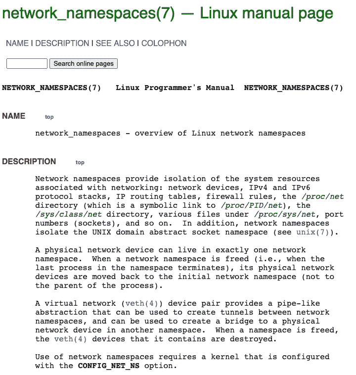
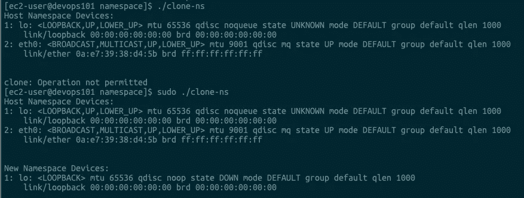
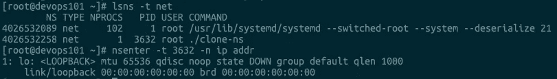
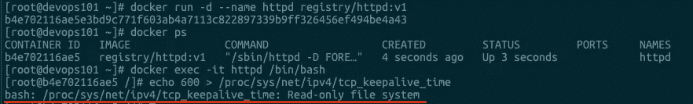
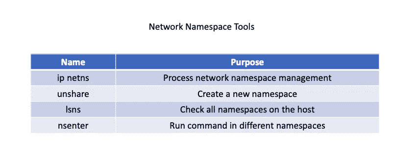

# K8s —容器网络命名空间

> 原文：<https://blog.devgenius.io/k8s-container-network-df1a6c23c0c3?source=collection_archive---------2----------------------->

## 容器网络名称空间深入探讨


# 了解容器网络名称空间

关于网络命名空间，如果从字面上理解，我们知道它是网络在一个 Linux 节点上的隔离，但是它具体隔离了网络资源的哪一部分呢？

先说`Linux Programmer's Manual`。在本手册中，它有一个简短的描述，并列出了网络名称空间的一些主要资源。



# 网络命名空间资源

*   **网络设备:** *指* `*lo*` *、* `*eth0*` *等网络设备。你可以通过* `*ip link*` *命令看到它们。*
*   **IPv4 和 IPv6 协议栈:** *从协议栈我们知道，上面的 IP 层和 TCP、UDP 协议栈也是为每个命名空间独立工作的。因此，对于 IP、TCP 和 UDP 等许多协议，它们的相关参数也独立于每个名称空间。这些参数大多在* `*/proc/sys/net/*` *目录下，也包括 TCP 和 UDP 端口资源。*
*   **IP 路由表:** *这个资源也比较好理解。可以在不同的网络命名空间运行* `*ip route*` *命令，查看不同的路由表。*
*   **防火墙规则:** *其实我说的是* `*iptables*` *规则，* `*iptables*` *规则可以在各个命名空间独立配置。*
*   **网络状态信息:** *您可以从* `*/proc/net*` *和* `*/sys/class/net*` *中获得这些信息。这里的状态基本包括前面四种资源的状态信息。*

# 如何创建网络命名空间？

我们可以通过调用`clone()`或`unshare()`函数来创建一个新的网络名称空间。

## clone()函数

当创建新进程时，随着新进程的创建，也创建了新的网络名称空间。这个方法实际上是通过将`CLONE_NEWNET`标志附加到`clone()`系统调用上来实现的。以防您对源代码感兴趣:

```
int new_netns(void *para)
{
            printf("New Namespace Devices:\n");
            system("ip link");
            printf("\n\n");

            sleep(100);
            return 0;
}

int main(void)
{
            pid_t pid;

            printf("Host Namespace Devices:\n");
            system("ip link");
            printf("\n\n");

            pid =
                clone(new_netns, stack + STACK_SIZE, CLONE_NEWNET | SIGCHLD, NULL);
            if (pid == -1)
                        errExit("clone");

            if (waitpid(pid, NULL, 0) == -1)
                        errExit("waitpid");

            return 0;
}
```

## unshare()函数

我们可以调用`unshare()`系统调用来直接改变当前进程的网络名称空间。同样，我贴出了您感兴趣的源代码:

```
int main(void)
{
            pid_t pid;

            printf("Host Namespace Devices:\n");
            system("ip link");
            printf("\n\n");

            if (unshare(CLONE_NEWNET) == -1)
                        errExit("unshare");

            printf("New Namespace Devices:\n");
            system("ip link");
            printf("\n\n");

            return 0;
}
```

**注意:**不仅是网络命名空间，其他命名空间也是通过`clone()`或`unshare()`函数调用建立的。甚至容器创建程序，比如`runC`，也使用`unshare()`为新创建的容器创建名称空间。`runC`是一个 CLI 工具，用于根据 OCI 规范([https://github.com/opencontainers/runc](https://github.com/opencontainers/runc))在 Linux 上生成和运行容器。

创建网络名称空间后，我们可以在主机上运行命令`lsns -t net`来查看系统中现有的网络名称空间。当然，`lsns`也可以用来查看其他名称空间。

让我们快速运行一个示例:

```
$ gcc -o clone-ns clone-ns.c
$ ls
clone-ns.c clone-ns
$ ./clone-ns
Host Namespace Devices:
1: lo: <LOOPBACK,UP,LOWER_UP> mtu 65536 qdisc noqueue state UNKNOWN mode DEFAULT group default qlen 1000
    link/loopback 00:00:00:00:00:00 brd 00:00:00:00:00:00
2: eth0: <BROADCAST,MULTICAST,UP,LOWER_UP> mtu 9001 qdisc mq state UP mode DEFAULT group default qlen 1000
    link/ether 0a:e7:39:38:d4:5b brd ff:ff:ff:ff:ff:ffclone: Operation not permitted
[ec2-user@devops101 namespace]$ sudo ./clone-ns
Host Namespace Devices:
1: lo: <LOOPBACK,UP,LOWER_UP> mtu 65536 qdisc noqueue state UNKNOWN mode DEFAULT group default qlen 1000
    link/loopback 00:00:00:00:00:00 brd 00:00:00:00:00:00
2: eth0: <BROADCAST,MULTICAST,UP,LOWER_UP> mtu 9001 qdisc mq state UP mode DEFAULT group default qlen 1000
    link/ether 0a:e7:39:38:d4:5b brd ff:ff:ff:ff:ff:ffNew Namespace Devices:
1: lo: <LOOPBACK> mtu 65536 qdisc noop state DOWN mode DEFAULT group default qlen 1000
    link/loopback 00:00:00:00:00:00 brd 00:00:00:00:00:00
```

截图:



# 如何设置集装箱网络参数？

现在我们对`Network Namespace`有了更多的了解，让我们看看如何设置容器网络参数。

但首先你需要明白，容器中的`Network Namespace`的网络参数并不是完全继承自主机的主机命名空间，也不是在建立新的`Network Namespace`时完全重新初始化。

让我们以`httpd`容器为例，尝试更新这个容器中的网络设置，看看会发生什么:



啊哈，我们做不到，因为`/proc/sys`被安装为`read-only`。我们可以通过运行以下命令进行验证:

```
[root@b4e702116ae5 /]# cat /proc/mounts | grep "proc/sys"
proc /proc/sys proc ro,nosuid,nodev,noexec,relatime 0 0
proc /proc/sysrq-trigger proc ro,nosuid,nodev,noexec,relatime 0 0
```

为什么`/proc/sys`在容器中是只读挂载？出于安全考虑，`runC`默认情况下将容器中所有与/proc 和/sys 相关的目录作为只读挂载来处理。

那我们怎么做？如果您在主机上拥有 root 权限。最简单粗暴的方法就是使用我们前面提到的`nsenter`命令来修改容器中的网络参数。但是，**这种方法在**生产环境中显然是不允许的，因为我们不会允许用户拥有主机的登录权限。

一般来说，这样的更改应该只在容器中的应用程序启动之前进行。否则许多 tcp 链接将已经建立，所以即使新的参数被改变，已建立的链接也不会生效。这需要重新启动应用程序。我们都知道在生产环境中通常会避免应用程序重启，这显然是不合适的。

所以改变网络参数的最佳时机显然是刚启动的容器，而容器中的应用程序还没有启动的时候。

# 码头系统

其实`runC`在对`/proc/sys`目录做只读挂载之前也预留了一个修改接口，用来修改容器中“/proc/sys”下的参数，也是`sysctl`的参数。

例如:

```
[root@devops101 ~]# docker run -d --name httpd --sysctl net.ipv4.tcp_keepalive_time=600 registry/httpd:v1
bbba53b0deb4ca3c4221fbf6e8bd82aee4678da2c80844f5260a4c427e441ce9
[root@devops101 ~]# docker exec httpd cat /proc/sys/net/ipv4/tcp_keepalive_time
600
```

# 结论

我在下图中总结了用于网络命名空间参数更新的工具/命令:

