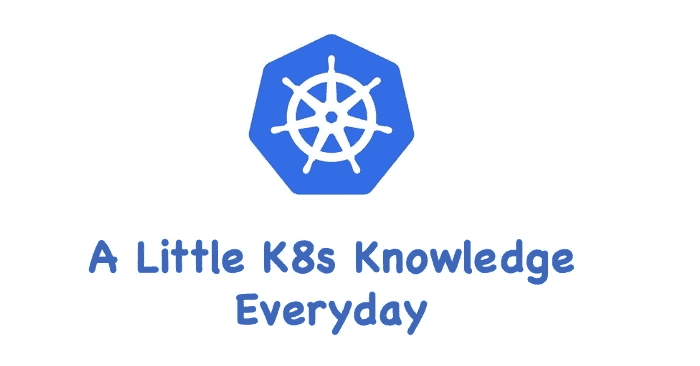
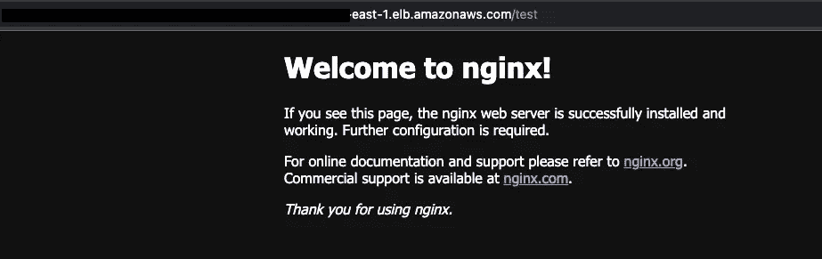

# k8s—AWS EKS 站的入口演示

> 原文：<https://blog.devgenius.io/k8s-ingress-demo-in-aws-eks-2be7d6d8ea95?source=collection_archive---------4----------------------->

## 日常一点 K8s 知识！



在我的上一篇文章中我谈到了 K8s `Ingress Resource`、`Ingress Class`和`Ingress Controller`概念([https://tonylixu . medium . com/K8s-ingress-ingress-class-and-controller-b 278396 e 94d 9](https://tonylixu.medium.com/k8s-ingress-ingress-class-and-controller-b278396e94d9))，让我们在本文中做一些实践。

# 安装 Nginx 入口

要安装 Nginx 入口控制器:

```
$ kubectl apply -f https://raw.githubusercontent.com/kubernetes/ingress-nginx/controller-v1.2.0/deploy/static/provider/cloud/deploy.yaml
```

输出将类似于:

```
$ kubectl apply -f [https://raw.githubusercontent.com/kubernetes/ingress-nginx/controller-v1.2.0/deploy/static/provider/cloud/deploy.yaml](https://raw.githubusercontent.com/kubernetes/ingress-nginx/controller-v1.2.0/deploy/static/provider/cloud/deploy.yaml)
namespace/ingress-nginx created
serviceaccount/ingress-nginx created
serviceaccount/ingress-nginx-admission created
role.rbac.authorization.k8s.io/ingress-nginx created
role.rbac.authorization.k8s.io/ingress-nginx-admission created
clusterrole.rbac.authorization.k8s.io/ingress-nginx created
clusterrole.rbac.authorization.k8s.io/ingress-nginx-admission created
rolebinding.rbac.authorization.k8s.io/ingress-nginx created
rolebinding.rbac.authorization.k8s.io/ingress-nginx-admission created
clusterrolebinding.rbac.authorization.k8s.io/ingress-nginx created
clusterrolebinding.rbac.authorization.k8s.io/ingress-nginx-admission created
configmap/ingress-nginx-controller created
service/ingress-nginx-controller created
service/ingress-nginx-controller-admission created
deployment.apps/ingress-nginx-controller created
job.batch/ingress-nginx-admission-create created
job.batch/ingress-nginx-admission-patch created
ingressclass.networking.k8s.io/nginx created
validatingwebhookconfiguration.admissionregistration.k8s.io/ingress-nginx-admission created
```

让我们检查 Nginx `Ingress Controller`的状态

```
$ kubectl get po -n ingress-nginx
NAME                                        READY   STATUS      RESTARTS   AGE
ingress-nginx-admission-create-5mmd6        0/1     Completed   0          5m29s
ingress-nginx-admission-patch-fk7zs         0/1     Completed   0          5m29s
ingress-nginx-controller-5849c9f946-qrxpv   1/1     Running     0          5m29s
```

和服务:

```
$ kubectl get svc -n ingress-nginx
NAME                                 TYPE           CLUSTER-IP       EXTERNAL-IP                                                               PORT(S)                      AGE
ingress-nginx-controller             LoadBalancer   10.100.234.130   xxxx.us-east-1.elb.amazonaws.com   80:31293/TCP,443:30989/TCP   6m26s
ingress-nginx-controller-admission   ClusterIP      10.100.233.17    <none>                                                                    443/TCP                      6m26s
```

和`IngressClass`资源:

```
$ kubectl get ingressClass nginx -o yaml
apiVersion: networking.k8s.io/v1
kind: IngressClass
metadata:
  annotations:
    kubectl.kubernetes.io/last-applied-configuration: |
      {"apiVersion":"networking.k8s.io/v1","kind":"IngressClass","metadata":{"annotations":{},"labels":{"app.kubernetes.io/component":"controller","app.kubernetes.io/instance":"ingress-nginx","app.kubernetes.io/name":"ingress-nginx","app.kubernetes.io/part-of":"ingress-nginx","app.kubernetes.io/version":"1.2.0"},"name":"nginx"},"spec":{"controller":"k8s.io/ingress-nginx"}}
  creationTimestamp: "2022-05-06T20:31:26Z"
  generation: 1
  labels:
    app.kubernetes.io/component: controller
    app.kubernetes.io/instance: ingress-nginx
    app.kubernetes.io/name: ingress-nginx
    app.kubernetes.io/part-of: ingress-nginx
    app.kubernetes.io/version: 1.2.0
  managedFields:
  - apiVersion: networking.k8s.io/v1
    fieldsType: FieldsV1
    fieldsV1:
      f:metadata:
        f:annotations:
          .: {}
          f:kubectl.kubernetes.io/last-applied-configuration: {}
        f:labels:
          .: {}
          f:app.kubernetes.io/component: {}
          f:app.kubernetes.io/instance: {}
          f:app.kubernetes.io/name: {}
          f:app.kubernetes.io/part-of: {}
          f:app.kubernetes.io/version: {}
      f:spec:
        f:controller: {}
    manager: kubectl-client-side-apply
    operation: Update
    time: "2022-05-06T20:31:26Z"
  name: nginx
  resourceVersion: "2089"
  uid: 2247255c-b36f-476e-b99d-1ebed234ecfd
spec:
  controller: k8s.io/ingress-nginx
```

# 安装 Pod 和服务

现在让我们创建测试`Pod`和`Service`。定义以下 YAML:

```
---
apiVersion: apps/v1
kind: Deployment
metadata:
  name: nginx-deploy
  namespace: default
spec:
  replicas: 1
  selector:
    matchLabels:
      app: nginx-demo
      release: canary
  template:
    metadata:
      name: my-nginx
      labels:
        app: nginx-demo
        release: canary
    spec:
      containers:
      - name: my-nginx
        image: nginx
        imagePullPolicy: IfNotPresent
        ports:
        - name: http
          containerPort: 80---
apiVersion: v1
kind: Service
metadata:
  name: nginx-svc
  namespace: default
spec:
  selector:
    app: nginx-demo
    release: canary
  ports:
  - name: http
    port: 80
    targetPort: 80
```

让我们运行`kubectl create -f nginx-demo.yml`:

```
$ kubectl create -f nginx-demo.yml
deployment.apps/nginx-deploy created
service/nginx-svc created
```

检查盒:

```
$ kubectl get pod 
NAME                            READY   STATUS    RESTARTS   AGE nginx-deploy-549cb5c7ff-65fbb   1/1     Running   0          21s
```

# 安装 Nginx 入口

现在我们来定义 Nginx `Ingress`:

```
apiVersion: networking.k8s.io/v1
kind: Ingress
metadata:
  name: ingress-nginx
  annotations:
    nginx.ingress.kubernetes.io/rewrite-target: /
spec:
  ingressClassName: nginx
  rules:
  - host: 
    http:
      paths:
      - path: /test 
        pathType: Prefix
        backend:
          service:
            name: nginx-svc
            port:
              number: 80
```

然后创建入口:

```
$ kubectl create -f nginx-ingress.yml
ingress.networking.k8s.io/ingress-nginx create
```

现在检查我们刚刚创建的入口的状态:

```
$ kubectl describe ingresses ingress-nginx
Name:             ingress-nginx
Namespace:        default
Address:
Default backend:  default-http-backend:80 (<error: endpoints "default-http-backend" not found>)
Rules:
  Host        Path  Backends
  ----        ----  --------
  *
              /test   nginx-svc:80 (192.168.35.217:80)
Annotations:  nginx.ingress.kubernetes.io/rewrite-target: /
Events:
  Type    Reason  Age   From                      Message
  ----    ------  ----  ----                      -------
  Normal  Sync    10s   nginx-ingress-controller  Scheduled for sync
```

最后，您可以访问我们在`rules`(使用外部 IP)中定义的 Nginx HTTP(s)端点`/test`:

