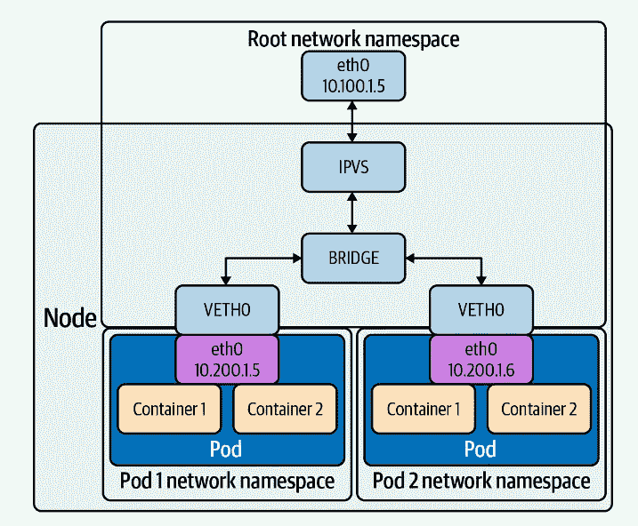

# K8s — ipvs 模式介绍

> 原文：<https://blog.devgenius.io/k8s-ipvs-mode-introduction-6457a02cd91a?source=collection_archive---------2----------------------->

## K8s ipvs 模式详细介绍


# 什么是 ipvs

`ipvs`代表 IP 虚拟服务器，它构建在 Netfilter 之上，充当第 4 层(传输)Linux 连接负载平衡器。

`ipvs`集成在 LVS (Linux 虚拟服务器)中，它可以将基于 TCP 和 UDP 的服务请求定向到真实服务器，并使真实服务器的服务在单个 IP 地址上表现为虚拟服务。

# ipvs 负载平衡模式

`ipvs`模式使用 IPVS 代替`iptables`，用于连接负载平衡。`ipvs`支持六种负载均衡模式，用`--ipvs-scheduler`指定:

*   **rr** :循环调度，向循环中的下一个主机发送请求
*   **lc** :最小连接，向最小打开连接服务器发送请求
*   **dh** :目的散列，根据连接的目的地址发送请求。
*   **sh** :源哈希，根据连接的源地址发送请求。
*   **sed** :最短的预期延迟，向连接与权重比最低的主机发送请求。
*   **nq** :从不排队，发送连接到任何没有现有连接的主机
    循环调度(rr)是默认的负载平衡模式。

下图显示了 IPVS 在 Linux 数据包路由中的角色:



图片来自詹姆斯·斯特朗

# ipvs 数据包转发模式

IPVS 支持以下三种数据包转发模式:

*   **NAT** 重写源地址和目的地址。
*   DR 将 IP 数据报封装在 IP 数据报中。
*   **IP** 隧道通过用所选后端服务器的 MAC 地址重写数据帧的 MAC 地址，将数据包直接路由到后端服务器。

# 为什么使用 ipv 而不是 iptables？

您可能考虑从默认`iptables`模式切换到`ipvs`模式有三个原因:

*   **可伸缩性**:使用 iptables 的 kube-proxy 是将 K8s 集群扩展到 5000 个节点的瓶颈。一个例子是，在一个 5，000 节点的集群中有一个 NodePort 服务，如果我们有 1，000 个服务，每个服务有 10 个 pods，这将导致每个 worker 节点上至少有 10，000 个 iptables 记录，这会使内核在刷新 iptables 时非常繁忙。
*   **时间**:当有 5000 个服务(40000 个规则)时，添加一个规则所花费的时间是 11 分钟。对于 20，000 个服务(160，000 条规则)，它是 5 个小时(参考:网络和 Kubernetes，詹姆斯·斯特朗)。
*   **路由延迟**:访问一个服务有延迟；每个数据包都必须遍历 iptables 列表，直到匹配成功。添加/删除规则会有延迟，在大量列表中插入和删除规则是大规模的密集操作。

# IPVS 演示

## 安装 ipvsadm

首先我们需要安装`ipvsadm`，这是一个与`ipvs`交互的命令行工具。要安装它:

*   Ubuntu:

```
$ apt-get install -y ipvsadm
```

*   CentOS/亚马逊 Linux 2

```
$ yum install -y ipvsadm
```

安装后，您可以通过运行以下命令进行验证:

```
$  ipvsadm -v
ipvsadm v1.27 2008/5/15 (compiled with popt and IPVS v1.2.1)
$ ipvsadm -L
IP Virtual Server version 1.2.1 (size=4096)
Prot LocalAddress:Port Scheduler Flags
  -> RemoteAddress:Port           Forward Weight ActiveConn InActConn
```

## 准备容器

创建以下两个 HTML 文件，以便我们能够区分两个 Nginx 容器:

```
$ mkdir -p /tmp/nginx-{1,2}
$ echo "nginx 1" > /tmp/nginx-1/index.html
$ echo "nginx 2" > /tmp/nginx-2/index.html
```

运行两个容器:

```
$ docker run -d -v "/tmp/nginx-1:/usr/share/nginx/html" --name nginx-1 nginx:1.23.2
ef894ee7a7a252db64e3f0ab89b31063d7471e601458dd182089ecd6a51a3981$ docker run -d -v "/tmp/nginx-2:/usr/share/nginx/html" --name nginx-2 nginx:1.23.2
5749c75342cb29aa65d105c0719ec45fea8a200dab9ca69f792d944f070268f5
```

获取两个容器的 IP 地址:

```
$ docker inspect nginx-1 | jq ".[0].NetworkSettings.IPAddress"
"172.17.0.2"
$ docker inspect nginx-2 | jq ".[0].NetworkSettings.IPAddress"
"172.17.0.3"
```

验证两个容器:

```
$ curl 172.17.0.2
nginx 1
 curl 172.17.0.3
nginx 2
```

## 创建 ipvs 服务

此时，我们有两个 Nginx 容器运行在同一台主机上，现在让我们创建一个新的`ipvs`服务，出于演示目的，我们将使用默认的循环负载平衡方法:

```
$ ipvsadm -A -t 10.229.36.106:80 -s rr
$ ipvsadm -l -n
IP Virtual Server version 1.2.1 (size=4096)
Prot LocalAddress:Port Scheduler Flags
  -> RemoteAddress:Port           Forward Weight ActiveConn InActConn
TCP  10.229.36.106:80 rr
```

现在将两个 Nginx 容器与`ipvs`服务关联起来:

```
$ ipvsadm -a -t 10.229.36.106:80 -r 172.17.0.2 -m
$ ipvsadm -a -t 10.229.36.106:80 -r 172.17.0.3 -m
$ ipvsadm -L
IP Virtual Server version 1.2.1 (size=4096)
Prot LocalAddress:Port Scheduler Flags
  -> RemoteAddress:Port           Forward Weight ActiveConn InActConn
TCP  ip-10-229-36-106.ec2.interna rr
  -> ip-172-17-0-2.ec2.internal:h Masq    1      0          3
  -> ip-172-17-0-3.ec2.internal:h Masq    1      0          3
```

现在让我们向服务发送一些请求:

```
$ curl 10.229.36.106
nginx 2
[root@ctcloud-ide ~]*# curl 10.229.36.106*
nginx 1
[root@ctcloud-ide ~]*# curl 10.229.36.106*
nginx 2
[root@ctcloud-ide ~]*# curl 10.229.36.106*
nginx 1
```

您可以看到，在这一点上，我们成功地创建了一个`ipvs`服务，它在 nginx-1 和 nginx-2 服务之前充当循环负载平衡器。