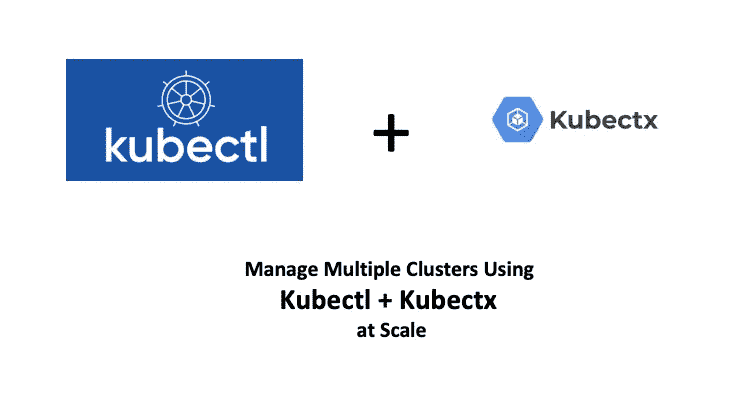
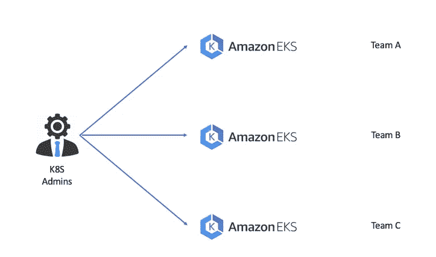
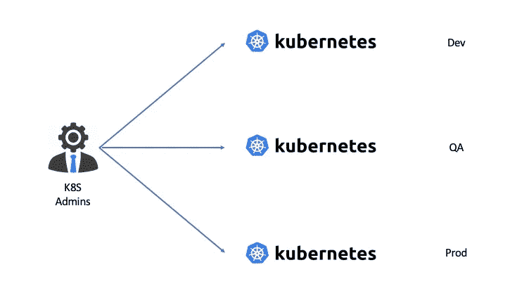
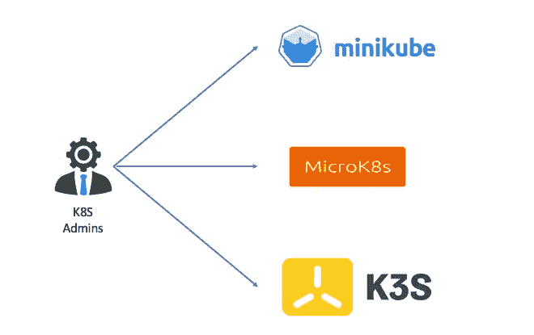

# K8s —使用 kubectl 大规模管理多个集群

> 原文：<https://blog.devgenius.io/k8s-manage-multiple-clusters-using-kubectl-at-scale-9f200c692099?source=collection_archive---------1----------------------->

## 使用 kubectl 高效管理多个 K8s 集群



有时，您需要为不同的用例场景设置多个 K8s 集群，例如需要隔离的法规遵从性、增加的可用性、开发/生产环境或希望消除供应商锁定，..等等。

多个 K8s 群集的三种常见使用情形是:

*   如果您提供的是托管 K8s 服务，比如 AWS EKS，您将需要管理多个 EKS 集群，允许客户端管理工作节点。虽然您的客户不会为管理他们的主节点而烦恼，但您的团队将需要访问它们来管理诸如扩展、可用性和备份之类的事情。



*   您的组织需要多个内部集群来隔离应用运行环境。例如，开发阶段的应用程序应该部署在开发集群中，而测试阶段的应用程序应该部署在测试集群中，生产就绪的应用程序应该部署在生产集群中。这种方法限制了对生产集群的访问，并在生产集群上创建了强大的安全性。



*   K8s 管理员也可以创建虚拟集群。虚拟集群是从现有的 Kubernetes 集群派生出来的，并使用集群的资源。创建虚拟集群的好处是提高安全性和降低成本。



​

# 管理多个 K8s 集群

K8s 命令行工具`kubectl`，是 K8s 管理员最好的朋友。它允许您对 K8s 集群运行管理命令。对于配置，`kubectl`在`$HOME/.kube`目录中查找名为 config 的文件。您可以通过设置`KUBECONFIG`环境变量或设置`--kubeconfig`标志来指定其他 kubeconfig 文件。

来自 K8s 官方文档:“配置对多个集群的访问”([配置对多个集群的访问| Kubernetes](https://kubernetes.io/docs/tasks/access-application-cluster/configure-access-multiple-clusters/) )，它描述了配置对多个 K8s 集群的访问的两种方式。

## 单一配置文件

在这种方法中，您使用一个配置文件为所有 K8s 集群定义`clusters`、`users`和`contexts`，例如:

```
# config-demo file
apiVersion: v1
clusters:
- cluster:
    certificate-authority: fake-ca-file
    server: [https://1.2.3.4](https://1.2.3.4)
  name: development
- cluster:
    insecure-skip-tls-verify: true
    server: [https://5.6.7.8](https://5.6.7.8)
  name: scratch
contexts:
- context:
    cluster: development
    namespace: frontend
    user: developer
  name: dev-frontend
- context:
    cluster: development
    namespace: storage
    user: developer
  name: dev-storage
- context:
    cluster: scratch
    namespace: default
    user: experimenter
  name: exp-scratch
current-context: ""
kind: Config
preferences: {}
users:
- name: developer
  user:
    client-certificate: fake-cert-file
    client-key: fake-key-file
- name: experimenter
  user:
    password: some-password
    username: exp
```

上面的配置文件定义了两个集群:`development`和`scratch`，两个用户和三个上下文。要在不同的集群之间切换，您可以使用下面的`kubectl`命令:

```
$ kubectl config --kubeconfig=config-demo use-context dev-frontend
```

将使用`dev-frontend`中定义的集群(即开发集群)。

这种方法的问题是，并不总是这样配置 kubeconfig 文件。如果你有很多 K8s 集群，这个文件很快就会变得混乱。每次你想切换的时候，你必须设置上下文。​

## 多个配置文件

第二种方法是为每个集群创建一个单独的配置文件。所以上面的单个配置文件可以分为:

*   配置开发文件

```
# config-development
apiVersion: v1
clusters:
- cluster:
    certificate-authority: fake-ca-file
    server: [https://1.2.3.4](https://1.2.3.4)
  name: development
contexts:
- context:
    cluster: development
    namespace: frontend
    user: developer
  name: dev-frontend
- context:
    cluster: development
    namespace: storage
    user: developer
  name: dev-storage
current-context: ""
kind: Config
preferences: {}
users:
- name: developer
  user:
    client-certificate: fake-cert-file
    client-key: fake-key-file
```

*   配置-暂存文件

```
# config-scratch
apiVersion: v1
clusters:
- cluster:
    insecure-skip-tls-verify: true
    server: [https://5.6.7.8](https://5.6.7.8)
  name: scratch
contexts:
- context:
    cluster: scratch
    namespace: default
    user: experimenter
  name: exp-scratch
current-context: ""
kind: Config
preferences: {}
users:
- name: experimenter
  user:
    password: some-password
    username: exp
```

然后您可以使用`$KUBECONFIG`环境变量的一个很酷的功能，它允许您指定多个用冒号分隔的`kubeconfig`文件。当您有多个配置文件时，应该是这样的:

```
$KUBECONFIG=/$HOME/.kube/contexts/config-development:/$HOME/.kube/contexts/config-scratch
```

然后你可以使用`kubectl config use-context <context_name>`在不同的上下文之间切换。这解决了允许我们有多个配置文件的问题，但仍然相当手动，因为每次你重启终端或如果有一个新的 kubeconfig(或删除一个旧的)，你必须更新该环境变量。

这就是`kubectx`和`kubens`发挥作用的地方！它允许您轻松地检查所有可用的上下文、名称空间，并通过键入`kubectx context-name`或`kubens namespace`在它们之间切换，就是这样！

# 库贝克斯和库本斯

`kubectx`是一个在`kubectl`上更快切换上下文(集群)的工具。`kubens`是一个在 Kubernetes 名称空间之间轻松切换(并为`kubectl`配置它们)的工具。

## 安装 kubectx 插件

```
$ kubectl krew install ctx
Updated the local copy of plugin index.
Installing plugin: ctx
Installed plugin: ctx
\
 | Use this plugin:
 |      kubectl ctx
 | Documentation:
 |      [https://github.com/ahmetb/kubectx](https://github.com/ahmetb/kubectx)
 | Caveats:
 | \
 |  | If fzf is installed on your machine, you can interactively choose
 |  | between the entries using the arrow keys, or by fuzzy searching
 |  | as you type.
 |  | See [https://github.com/ahmetb/kubectx](https://github.com/ahmetb/kubectx) for customization and details.
 | /
/
```

## 安装 kubens 插件

```
$ k krew install ns
Updated the local copy of plugin index.
Installing plugin: ns
Installed plugin: ns
\
 | Use this plugin:
 |      kubectl ns
 | Documentation:
 |      [https://github.com/ahmetb/kubectx](https://github.com/ahmetb/kubectx)
 | Caveats:
 | \
 |  | If fzf is installed on your machine, you can interactively choose
 |  | between the entries using the arrow keys, or by fuzzy searching
 |  | as you type.
 | /
/
```

# 常见用法

```
**# List all the contexts**
$ kubectl ctx
cluster-dev
**cluster-prd**
cluster-test**# Switch to another cluster that's in kubeconfig**
$ kubectl ctx cluster-dev
Switched to context "cluster-dev".**# Switch back to previous cluster**
$ kubectl ctx -
Switched to context "cluster-prd".**# Create an alias for the context**
$ kubectl ctx dublin=gke_ahmetb_europe-west1-b_dublin
Context "dublin" set.
Aliased "gke_ahmetb_europe-west1-b_dublin" as "dublin".**# List all namespace**
$ kubectl ns
kube-system
namespace1
namespace2
...**# Change the active namespace on kubectl**
$ kubectl ns kube-system
Context "test" set.
Active namespace is "kube-system".**# Go back to the previous namespace**
$ kubectl nss -
Context "test" set.
Active namespace is "default".
```

# 结论

我希望有了`kubectx`和`kubens`插件，你的日常 K8s 管理工作会更有效率，你的生产力会更高。感谢阅读，我会在我的下一篇文章中看到你！