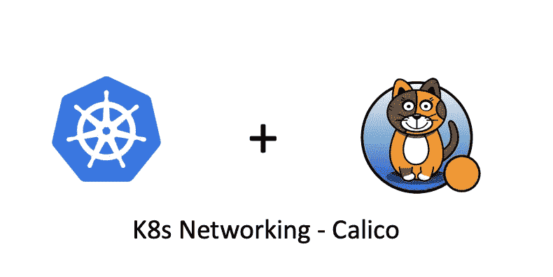
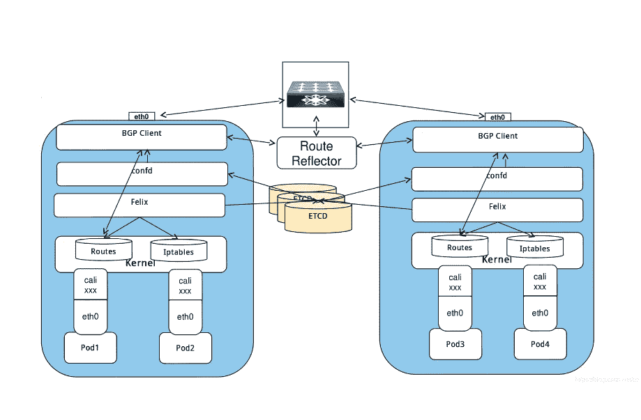
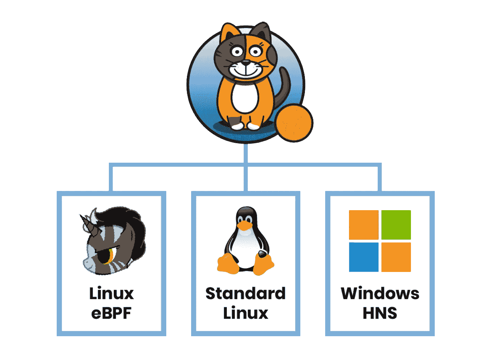
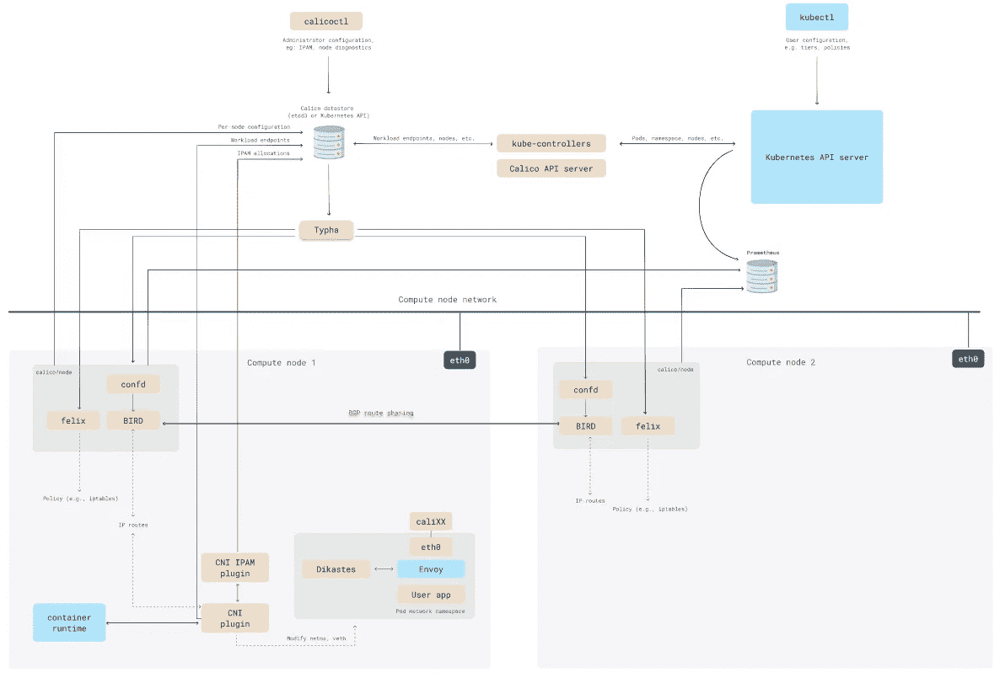
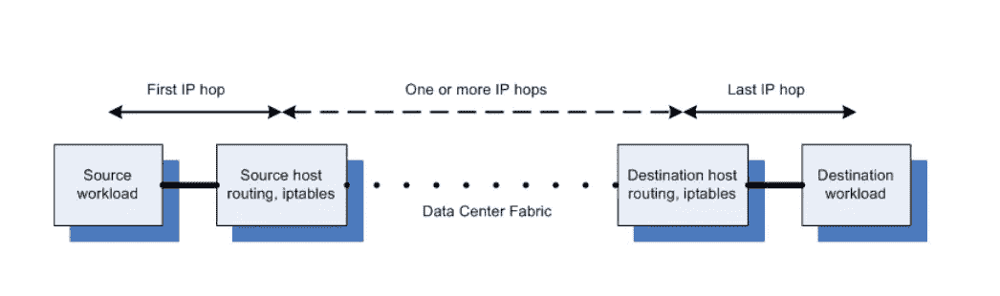
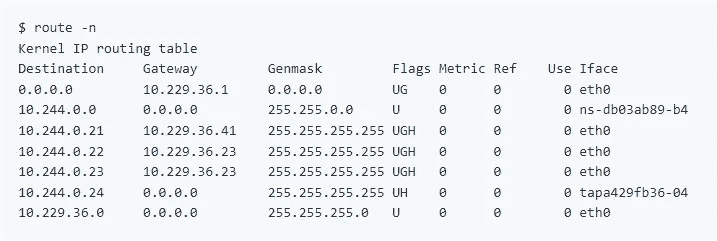

# K8s 网络— Calico(第一部分)

> 原文：<https://blog.devgenius.io/k8s-networking-calico-part1-7f74395b6fe2?source=collection_archive---------0----------------------->

## 印花布简介



# 什么是印花棉布

Calico ( [项目 Calico 文档](https://projectcalico.docs.tigera.io/))是一个针对容器、虚拟机和基于本地主机的工作负载的开源网络和网络安全解决方案。

Calico 支持广泛的平台，包括 K8s、OpenShift、MKE、OpenStack 和裸机服务。Calico 提供超快的性能和真正的云原生可扩展性。它还为开发人员和集群运营商提供了一致的体验和一系列功能，无论是在公共云中还是在本地、在单个节点上还是在数千个节点的集群中运行。

Calico 是一个纯第三层(网络层)协议，为虚拟机和容器提供多主机通信。它不使用绒布、libnetwork 等覆盖网络覆盖网络驱动程序，而是使用虚拟路由代替虚拟交换，每个虚拟路由器通过 BGP 协议向其余数据中心传播可达性信息(路由)。



来自 csdn 的图片

# 印花布特征

与其他 K8s 网络产品相比，Calico 具有以下特点:

## 多个数据平面

使用 Calico 时，您可以选择许多不同的数据平面，如下图所示:



图片来自[https://projectcalico.docs.tigera.io/](https://projectcalico.docs.tigera.io/)

无论您喜欢 Linux eBPF、标准 Linux 还是 Windows HNS 数据面板的先进特性，您都可以使用 Calico，并获得相同的网络体验。​

## 网络安全性

利用 Calico 丰富的网络策略模型，很容易锁定网络通信，因此只有所需的流量通过。Calico 还内置了对 wireguard 加密的支持，这使得 pod 通信安全。

## 网路性能

Calico 利用 Linux 内核的优化标准网络管道来提供高性能网络。It 控制平面和策略引擎已经过微调，可最大限度地降低整体 CPU 使用率和占用率。

## 可量测性

Calico 在其核心应用了云原生设计原则和模式。无论您是拥有 10 个节点的 K8s 集群、100 个节点的 K8s 集群，还是拥有数千个节点的 K8s 集群，Calico 都可以随您的集群动态安装和扩展。

# 印花布建筑

Calico 的整体架构如下所示:



图片来自[https://projectcalico.docs.tigera.io/](https://projectcalico.docs.tigera.io/)

让我们逐一查看每个核心组件。

## Calico API 服务器

Calico API 服务器让您可以使用`kubectl`直接管理 Calico 资源。

## 菲力克斯(男子名)

Felix 是 Calico 的核心组件，作为代理守护进程运行在每个节点上。Felix 编程路由和 ACL，以及主机上需要的任何东西，以便为该主机上的端点提供所需的连接。它负责:

*   **接口管理**:将关于接口的信息编程到内核中，以便内核能够正确处理来自该端点的流量。特别是，它确保主机使用主机的 MAC 来响应来自每个工作负载的 ARP 请求，并为其管理的接口启用 IP 转发。
*   **路由编程**:将到其主机上端点的路由编程到 Linux 内核 FIB(转发信息库)中。这可以确保到达主机的目的地为这些端点的数据包得到相应的转发。
*   **ACL 编程**:将 ACL 编程到 Linux 内核中，以确保只有有效的流量才能在端点之间发送，并且端点无法绕过 Calico 安全措施。
*   **状态报告**:提供网络健康数据。特别是，它在配置其主机时会报告错误和问题。这些数据被写入数据存储，因此对网络的其他组件和运营商是可见的。

YAML 定义示例:

```
apiVersion: projectcalico.org/v3
kind: FelixConfiguration
metadata:
  name: default
spec:
  ipv6Support: false
  ipipMTU: 1400
  chainInsertMode: Append
```

## 鸟

BIRD 是一个开源的互联网路由守护程序。它从 Felix 获取路由信息，并分发到网络上的 BGP 对等体，用于主机间路由。它在每个托管 Felix 代理的节点上运行。伯德负责:

*   **路由分发**:当 Felix 将路由插入 Linux 内核 FIB 时，BGP 客户端将它们分发到部署中的其他节点。这确保了部署的高效流量路由。
*   **BGP 路由反射器配置** : BGP 路由反射器通常针对大型部署而非标准 BGP 客户端进行配置。它们充当连接 BGP 客户端的中心点。

## Confd

Confd 监控 Calico 数据库中 BGP 配置的变化，这是一个开源的轻量级配置管理工具。Confd 根据数据存储中的数据更新动态生成 BIRD 配置文件。当配置文件改变时，confd 触发 BIRD 加载新文件。

## CNI 插件

CNI 插件为 Kubernetes 集群提供 Calico 网络。它必须安装在 K8s 集群中的每个节点上。Calico CNI 插件允许您为任何使用 CNI 网络规范的管弦乐队使用 Calico 网络。

## etcd

etcd:分布式键值存储，主要负责网络元数据的一致性，保证 Calico 网络状态的准确性。

## 香蒲

Typha 通过减少每个节点对数据存储的影响来增加规模。它作为数据存储和 Felix 实例之间的守护程序运行。默认安装，但未配置。

Typha 代表其所有客户端(如 Felix 和 confd)维护单个数据存储连接。它缓存数据存储状态并对事件进行重复数据删除，以便将它们分散到许多侦听器中。

因为一个 Typha 实例可以支持数百个 Felix 实例，所以大大降低了数据存储的负载。因为 Typha 可以过滤掉与 Felix 无关的更新，所以它也减少了 Felix 的 CPU 使用率。在大规模(100 多个节点)K8s 集群中，这一点至关重要，因为 API 服务器生成的更新数量与节点数量成比例。

# Calico 数据路径

在 Calico 中，进出工作负载的 IP 数据包由 Linux 路由表和`iptables`进行路由和`firewalled`。对于数据包发送，Calico 确保主机始终作为下一跳 MAC 地址返回。对于数据包接收，最后一个 IP 跃点是从目标工作负载的主机到工作负载本身。



图片来自[https://projectcalico.docs.tigera.io/](https://projectcalico.docs.tigera.io/)

例如，假设您的 K8s 集群 Pod cidr 块是 10.244.0.0/16，主机 IP 是 10.229.36.12，在您安装 Calico 后，您将看到以下路由:



在上面的输出中，这个主机上有一个 IP 地址为`10.244.0.24`的 pod，可以通过 TAP(或 veth 等)从主机访问。)名为`tapa429fb36–04`的接口。

因此，从`10.244.0.24`到`tapa429fb36–04`有一条直达路线。具有`.21`、`.22`和`.23`地址的其他 pod 托管在另外两台主机(`10.229.36.41`和`.23`)上，因此这些工作负载地址的路由是通过这些主机的。

当一个名为 Felix 的 Calico 代理被要求为一个特定的 pod 提供连接时，它会建立直接路由。然后，BGP 客户端(如 BIRD)会注意到这些内容，并将它们分发给运行在其他主机上的 BGP 客户端。