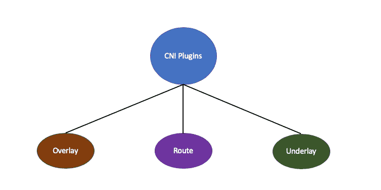
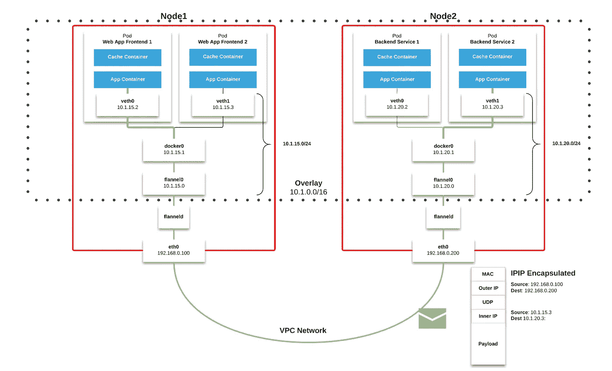
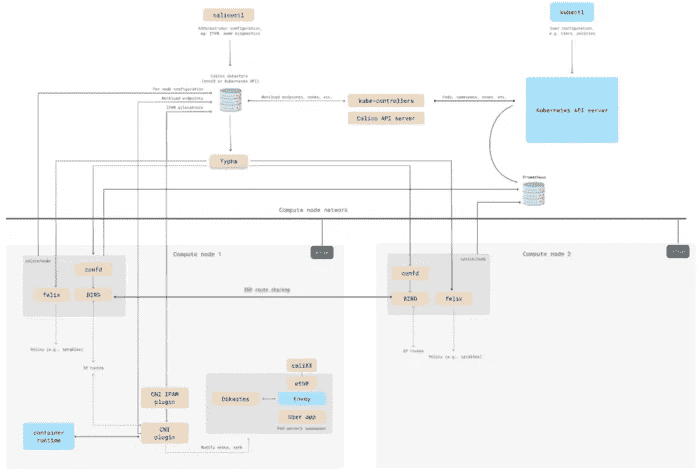
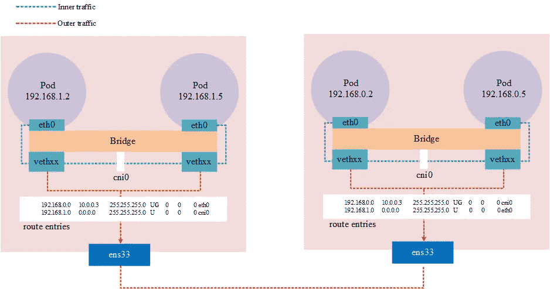
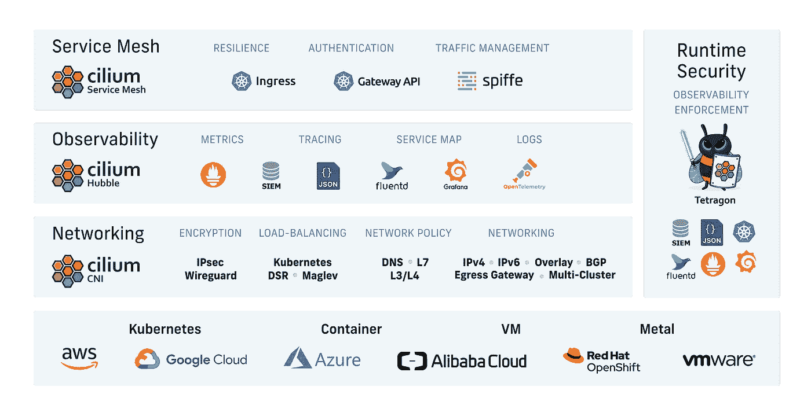
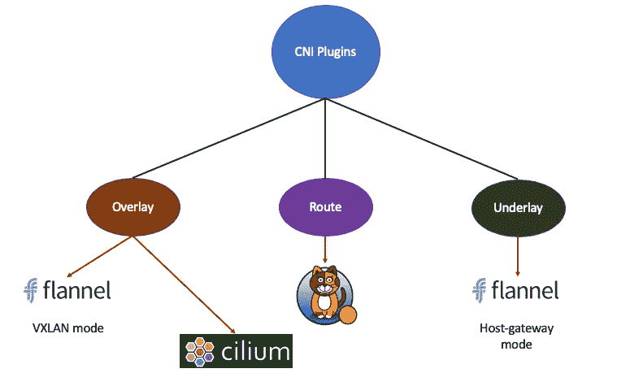

# K8s 网络— CNI 第二部分

> 原文：<https://blog.devgenius.io/k8s-networking-cni-part-2-e3bde1b639ba?source=collection_archive---------6----------------------->

## K8s 容器网络接口介绍

在我上一篇文章《 [K8s CNI 简介](https://medium.com/geekculture/k8s-network-cni-introduction-b035d42ad68f)》中，我讲过什么是 CNI，它的工艺流程和主要部件。让我们继续我们的 K8s 网络之旅。

我们已经知道，CNI 为网络插件定义了一系列公共接口。只要开发人员遵循这个规范，他们就可以访问 K8s，为 pod 创建虚拟网卡，分配 IP 地址，设置路由规则，并最终实现“每个 pod 一个 IP”的网络模型。

然而，根据实现机制的不同，CNI 插件可以分为三种不同的类型:

# 覆盖网络

`overlay`网络驱动程序在多个节点之间创建一个分布式网络。该网络位于(覆盖)特定于主机的网络之上，允许连接到它的容器在启用加密时安全地通信。

K8s Pod 网络通常是主机上的私有网络。比如`10.244.0.0/16`就是典型的私有 NAT 网络。跨主机连接私有 NAT 网络中的 pod 的最简单方法是简单路由。只有当主机本身位于同一子网时，这种方法才有效。

“[法兰绒](https://github.com/flannel-io/flannel/)是一个`overlay`模式的 CNI 插件(VXLAN 模式中的**)。它最初是由 CoreOS 创建的，是为 K8s 配置第 3 层网络的一种非常简单的方法。它所做的很简单:它在主机网络之上创建一个平面网络，这就是所谓的`overlay`网络。在这个`overlay`网络中，所有的吊舱都将被分配一个 ip 地址，它们通过直接调用彼此的 ip 地址来相互通信。**

来自[堆栈溢出](https://stackoverflow.com/questions/62145066/how-to-see-the-pod-and-veth-relationship-in-kubernetes)的图片

*   数据从源容器发出后，通过所在主机的`docker0`虚拟网卡转发到`flannel0`虚拟网卡。这是一个 P2P 虚拟网卡，`flanneld`服务监听网卡的另一端
*   法兰绒直接使用 K8s API 或`etcd`来存储网络配置、分配的子网和任何辅助数据
*   **源**主机的`flanneld`服务将原始数据内容封装在 UDP 中，并根据自己的路由表传递给**目的**节点的`flanneld`服务
*   数据到达后解包，然后直接进入目的节点的`flannel0`虚拟网卡，再转发到目的主机的`flanneld`服务，再到`docker0`虚拟网卡，最后`docker0`路由就像本地容器通信一样到达目的容器。

# 路线网络

`route`工作在底层网络之上，利用系统内置的路由功能实现 Pod 跨节点通信。它的优势是高性能，但是对底层网络有很强的依赖性。如果底层网络不支持，它将无法工作。

[Calico](https://github.com/projectcalico/calico) 是路由模式下的网络插件。它使用 BGP 协议(边界网关协议)来维护路由信息。其性能优于法兰绒，支持多种网络策略。数据加密、安全隔离、流量整形等功能。

印花布建筑看起来像:

图片来自[https://projectcalico.docs.tigera.io/](https://projectcalico.docs.tigera.io/)

在 Calico 中，进出工作负载的 IP 数据包由 Linux 路由表和`iptables`进行路由和`firewalled`。对于数据包发送，Calico 确保主机始终作为下一跳 MAC 地址返回。对于数据包接收，最后一个 IP 跃点是从目标工作负载的主机到工作负载本身。

# 底层网络

`underlay`直接利用底层网络实现 CNI，也就是说，Pod 和主机在同一个网络中。它对底层硬件和网络的依赖是三种类型中最强的，所以不是很灵活，但性能是最高的。

顾名思义，网络设备基础设施(如交换机、路由器、 *DWDM* 等)链接到物理网络拓扑，使用网络介质负责网络之间的数据包传输。

底层网络可以是第 2 层或第 3 层；第 2 层底层网络的典型例子是以太网，第 3 层底层网络的典型例子是因特网。

在法兰绒**host-gw** 模式下，每个节点需要在同一个二层网络中，节点作为路由器，通过路由表完成跨节点通信。这样，网络被建模为**底层网络**。

图片来自 [sobyte](https://www.sobyte.net/post/2022-08/k8s-network/)

# 纤毛

[Cilium](https://github.com/cilium/cilium) 是一个比较新的网络插件，同时支持`Overlay`模式和`Route`模式。其特点是深度使用 Linux eBPF 技术，在内核级操作网络数据，所以性能很高，可以灵活实现各种功能。2021 年，它作为一个孵化项目加入了 CNCF，并且是一个非常有前途的 CNI 插件。

Cilium 提供了一个简单的平面第 3 层网络，能够以本地路由或覆盖模式跨越多个集群。它支持 L7 协议，可以使用与网络寻址分离的基于身份的安全模型在 L3-L7 上实施网络策略。

图片来自[纤毛](https://github.com/cilium/cilium)

# 结论

*   K8s 采用“IP-per-pod”网络模型，每个 pod 都有一个唯一的 IP 地址，因此易于管理。
*   CNI 插件可以分为三种类型:“覆盖”、“路由”和“底层”。

