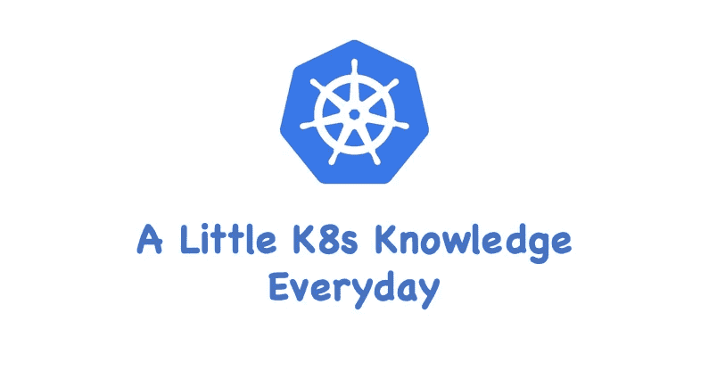

# K8s — Nginx 入口控制器

> 原文：<https://blog.devgenius.io/k8s-nginx-ingress-controller-36bb06f95ac2?source=collection_archive---------3----------------------->

## 如何部署和使用 Nginx 入口控制器



从我以前的“ [K8s — Ingress](https://tonylixu.medium.com/k8s-ingress-introduction-part-one-696deeff6908) ”文章中，我们了解到 Ingress 实际上是从 K8s 集群外部进入集群的入口，并将外部请求转发到集群中的不同服务。

实际上相当于一个`nginx`、`haproxy`之类的负载均衡代理服务器。你可能认为我们可以直接使用`nginx`来实现。，但是只使用`nginx`有一个很大的缺点。

如何在每次添加新服务时更改`nginx`配置？我们不可能手动更改或滚动更新前端`nginx`吊舱，对吗？那么我们添加一个服务发现工具，比如`consul`，怎么样？Ingress 其实就是这样实现的，只是服务发现功能是自己实现的，不需要使用第三方服务，然后增加一个域名规则定义。路由信息的刷新由入口控制器提供。

入口控制器可以理解为一个监听器。通过不断的监控`kube-apiserver`，它可以**实时感知后端**`**Service**`**`**Pod**`**的变化。****

****当信息发生变化时，入口控制器结合入口的配置更新反向代理负载均衡器，实现服务发现的作用。事实上，这与服务发现工具 consul 和 consul-template 非常相似。如下图所示:****

********

****有很多入口控制器大家都可以用，比如`traefik`、`nginx-controller`、`K8s Ingress Controller for Kong`、`HAProxy Ingress controller`。当然，你也可以自己实现一个入口控制器。****

****在本文中，我们将重点介绍`nginx-controller`和`traefik`的用法。****

# ****NGINX 入口控制器****

****Nginx 入口控制器是使用 K8s 入口资源对象构建的入口控制器实现，使用`ConfigMap`存储 Nginx 配置。****

****要使用 Ingress 向外界公开服务，需要提前安装一个 Ingress 控制器。我们将首先安装 NGINX 入口控制器。****

****由于`nginx-ingress`所在的节点需要能够访问外网，域名可以解析到这些节点，直接使用，所以需要将`nginx-ingress`绑定到节点的 80 和 443 端口，这样就可以使用 hostPort 访问了。****

## ****装置****

****安装 Nginx 入口控制器的最佳方式是使用 Helm3，如果您有 Helm3，可以使用以下命令安装:****

```
**$ helm upgrade --install ingress-nginx ingress-nginx   --repo [https://kubernetes.github.io/ingress-nginx](https://kubernetes.github.io/ingress-nginx)   --namespace ingress-nginx --create-namespace
Release "ingress-nginx" does not exist. Installing it now.
NAME: ingress-nginx
LAST DEPLOYED: Sat Sep 17 19:12:21 2022
NAMESPACE: ingress-nginx
STATUS: deployed
REVISION: 1
TEST SUITE: None
NOTES:
The ingress-nginx controller has been installed.
...**
```

****检查安装:****

```
**$ helm list -n ingress-nginx
NAME          NAMESPACE     REVISION UPDATED                                STATUS   CHART               APP VERSION
ingress-nginx ingress-nginx 1        2022-09-17 19:12:21.98451221 +0000 UTC deployed ingress-nginx-4.2.5 1.3.1**
```

******飞行前检查******

****一些豆荚应该从`ingress-nginx`命名空间开始:****

```
**$ kubectl get pods --namespace=ingress-nginx**
```

****过一会儿，他们应该都在跑。以下命令将等待入口控制器盒启动、运行并就绪:****

```
**$ kubectl wait --namespace ingress-nginx   --for=condition=ready pod   --selector=app.kubernetes.io/component=controller   --timeout=120s
pod/ingress-nginx-controller-7bf78659d-zp4s2 condition met**
```

******本地测试******

****让我们创建一个简单的 web 服务器和相关的服务:****

```
**$ kubectl create deployment demo --image=httpd --port=80
$ kubectl expose deployment demo**
```

****然后创建一个入口资源。以下示例使用映射到 localhost 的主机:****

```
**$ kubectl create ingress demo-localhost --class=nginx --rule="demo.localdev.me/*=demo:80"
ingress.networking.k8s.io/demo-localhost created**
```

****现在，将本地端口转发到入口控制器:****

```
**$ kubectl port-forward — namespace=ingress-nginx service/ingress-nginx-controller 8080:80**
```

****此时，如果你访问[http://demo.localdev.me:8080/](http://demo.localdev.me:8080/)，你应该会看到一个 HTML 页面告诉你“它工作了！”。****

```
**$ curl [http://demo.localdev.me:8080/](http://demo.localdev.me:8080/)
<html><body><h1>It works!</h1></body></html>**
```

****这证明 Nginx 入口控制器已经成功安装。****

## ****请求流程****

****下图显示了客户端通过入口控制器连接到其中一个 pod 的过程。客户端首先执行`demo.localdev.me`，获取入口控制器所在节点的 IP。****

****然后客户端向入口控制器发送 HTTP 请求，然后根据入口对象描述匹配域名，找到对应的服务对象，获得关联的端点列表，将客户端的请求转发到其中一个 Pods。****

********

## ****URL 重写****

****NGINX Ingress 控制器的很多高级用法都可以`annotation`，比如常用的 URL 重写功能。例如，我们有一个演示前端应用程序，对应的入口资源对象如下:****

```
**apiVersion: extensions/v1beta1
kind: Ingress
metadata:
  name: test
  namespace: default
  annotations:
    kubernetes.io/ingress.class: "nginx"
spec:
  rules:
  - host: demo.localdev.com
    http:
      paths:
      - backend:
          serviceName: test
          servicePort: 3000
        path: /**
```

****它是一个非常常规的`Ingress`物体。部署对象后，解析域名后可以正常访问应用程序。****

# ****演示应用程序****

****让我们做一个完整的演示应用程序。首先，让我们准备以下 3 个 YAML 文件。****

## ****部署. yml****

```
**kind: Deployment
metadata:
  name: hello
spec:
  selector:
    matchLabels:
      app: hello
  replicas: 1
  template:
    metadata:
      labels:
        app: hello
    spec:
      containers:
      - name: hello
        image: "gcr.io/google-samples/hello-app:2.0"**
```

## ****service.yml****

```
**apiVersion: v1
kind: Service
metadata:
  name: hello
  labels:
    app: hello
spec:
  type: ClusterIP
  selector:
    app: hello
  ports:
  - port: 80
    targetPort: 8080
    protocol: TCP**
```

## ****ingress.yml****

```
**apiVersion: networking.k8s.io/v1
kind: Ingress
metadata:
  name: hello
spec:
  ingressClassName: nginx
  rules:
  - host: "demo.hello-localdev.com"
    http:
      paths:
        - pathType: Prefix
          path: "/"
          backend:
            service:
              name: hello
              port:
                number: 80**
```

****现在让我们创建所有三个对象:****

```
**$ k create -f hellodeployment.yml
deployment.apps/hello created$ k create -f hello-service.yml
service/hello created$ k create -f hello-ingress.yml
ingress.networking.k8s.io/hello created**
```

****让我们检查入口状态:****

```
**$ kubectl describe ing hello
Name:             hello
Labels:           <none>
Namespace:        default
Address:
Ingress Class:    nginx
Default backend:  <default>
Rules:
  Host                     Path  Backends
  ----                     ----  --------
  demo.hello-localdev.com
                           /   hello:80 (10.244.137.85:8080)
Annotations:               <none>
Events:
  Type    Reason  Age   From                      Message
  ----    ------  ----  ----                      -------
  Normal  Sync    9s    nginx-ingress-controller  Scheduled for sync**
```

****可以看到主机`demo.hello-localdev.com`指向后端`hello:80`。****

****现在让我们进行端口转发，这样我们就可以进行本地测试:****

```
**$ kubectl port-forward --namespace=ingress-nginx service/ingress-nginx-controller 8080:80**
```

****尝试访问服务:****

```
**$ curl --resolve demo.hello-localdev.com:8080:127.0.0.1 [http://demo.hello-localdev.com:8080](http://demo.hello-localdev.com:8080)
Hello, world!
Version: 2.0.0
Hostname: hello-8987f46f8-z5vhn**
```

# ****结论****

****在本文中，我向您展示了如何设置 Nginx 入口控制器。入门非常容易。然而，对于项目实施来说，要确保你已经完成了所有 Nginx 配置，并根据需求对它们进行了**调优。******

****我希望你喜欢这篇文章。****