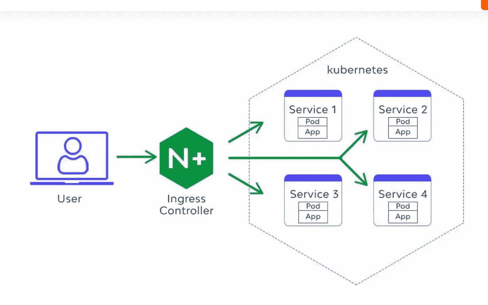

# K8 的笔记本电脑:第一个代理

> 原文：<https://blog.devgenius.io/k8s-on-laptop-first-proxy-f0413145c9d1?source=collection_archive---------5----------------------->

这篇博客是我们从零开始讨论 **Devops** 概念的系列文章的一部分，面向的是入门知识有限的读者。重述这个系列的前三篇博客，来自*初级*。这篇文章属于中级系列，因为它涉及到 K8 和 Dockers，并带有一小段代码演练。

[**Ansible**](https://amit894.medium.com/ansible-hello-world-8d37627758a9)[**宋承宪**](https://amit894.medium.com/ssh-what-not-to-do-92c266ca430f)[**第一静态网站**](https://amit894.medium.com/public-cloud-first-static-website-7d6f7c6f794)



## 代理人

代理是客户端和应用层之间的中间服务器，充当安全性、可伸缩性和性能的护栏。开源世界里有各种技术-[**Nginx**](https://www.nginx.com/resources/wiki/)**[**Apache**](https://en.wikipedia.org/wiki/The_Apache_Software_Foundation)等可以帮助实现功能。**

## **库伯内特斯**

**[Kubernetes](https://kubernetes.io/) 或 k8 的开源管理和编排工具，用于在云和本地设置上运行应用程序容器。对于本地设置，有一些工具如[*Minikube*](https://github.com/kubernetes/minikube)*[*种类*](https://kind.sigs.k8s.io/docs/user/quick-start/) 与 Docker 一起帮助*控制平面*和*节点组件*进行设置。***

## ***创建本地代理***

***出于本练习的目的，我们将使用 *Minikube* 和 *Nginx 入口控制器*作为本练习的目的。Nginx 还用于 Docker/pods 设置，冗余层可以针对生产工作负载移除，并用于*pod/服务/部署*级别的任何调试。***

*****安装和配置 Minikube*****

***在运行 minikube 之前，应该在笔记本电脑上运行 Docker 守护进程。另一个选择是 VirtualBox***

```
*brew install minikube
minikube start 
minikube status**Output**type: Control Plane
host: Running
kubelet: Running
apiserver: Running
kubeconfig: Configured*
```

*****创建部署。*****

***用 k8 的无状态词来说，每个部署都为 docker 映像创建 pod(容器)。下面是一个使用单个副本的部署示例。***

```
*kubectl apply -f .*
```

## ***创建服务***

***这些部署可以作为服务公开给内部/外部网络空间。k8 中的服务有各种类型 [*NodePort、ClusterIp、负载平衡器*](https://kubernetes.io/docs/concepts/services-networking/service/) 等，这取决于整体部署架构的性质。这里是一个服务的例子，该服务选择所有名为*静态网站-1* 的应用，并在端口 *80* 上运行。***

```
*kubectl apply -f .*
```

## ***创建入口***

***入口控制器是一个网络层，用于向主机虚拟机提供服务。这里有一个 nginx 控制器的例子，它用于将静态网站作为本地主机域上的路径公开。***

```
*kubectl apply -f .*
```

## ***在 Minikube 上启用入口***

```
*minikube tunnel*
```

## ***验证部署***

```
*curl -H “Host: rgate” “http://localhost/static-1/"*
```

## ***额外资源***

*   ***[https://github.com/amit894/simple-proxy](https://github.com/amit894/simple-proxy)***