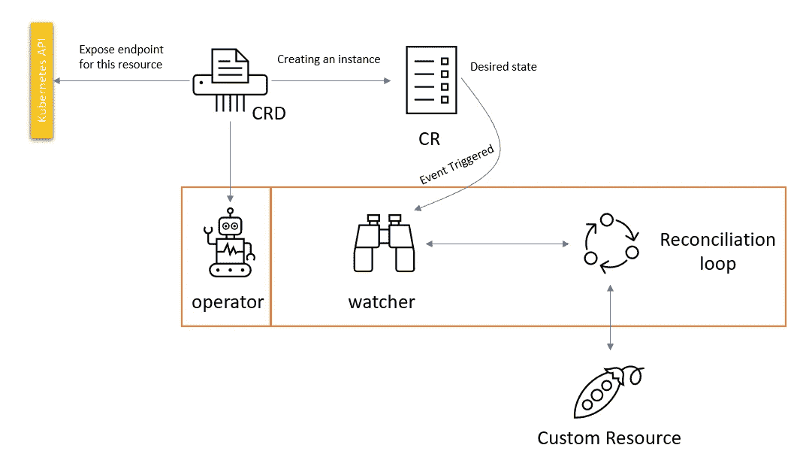
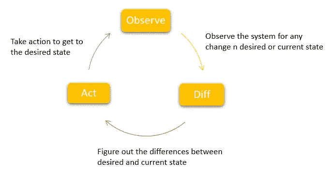
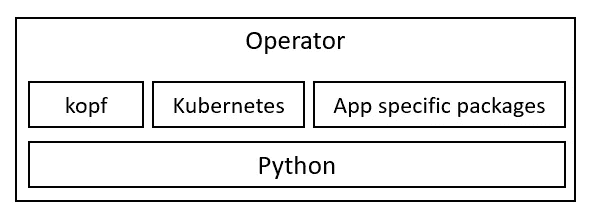
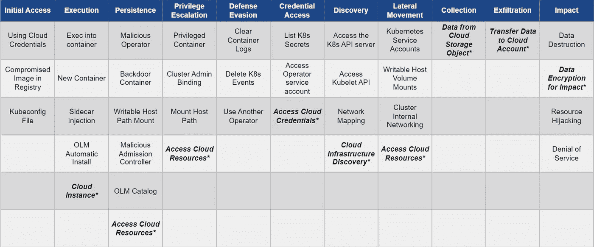

# K8s 运算符—理解

> 原文：<https://blog.devgenius.io/k8s-operators-understanding-6137ff811efb?source=collection_archive---------2----------------------->


由 [ShareGrid](https://unsplash.com/@sharegrid?utm_source=unsplash&utm_medium=referral&utm_content=creditCopyText) 在 [Unsplash](https://unsplash.com/s/photos/operator?utm_source=unsplash&utm_medium=referral&utm_content=creditCopyText) 上拍摄的照片

操作符的基础知识以及如何用 python 编写操作符

操作符使我们能够将应用程序视为单个对象，该对象仅向用户公开特定于应用程序的配置，而不是 K8s 原语的集合(例如 pod、部署、服务或配置映射)。操作员的目标是将操作知识输入到软件中，因此这些操作员还执行第 0 天(安装、配置)、第 1 天(更新、备份)、第 2 天(故障转移和恢复)操作。这些主要用于有状态的应用。

> *操作员是 Kubernetes API 的客户，充当定制资源的控制者。*

让我们举一个例子，我们想在 K8s 上部署一个高度可用的 MySQL 数据库。你可能会问为什么要在容器上运行 DB。

*   按需供应
*   CI/CD 友好
*   便携式(红外线不可知)
*   成本效益

现在回到部署。为了实现这一点，我们需要声明服务、路由器、有状态集、PV、PV 声明和 sidecars。除此之外，我们还需要添加备份和故障转移逻辑。如果我们有一个 MySQL 操作符，所有这些设置都是抽象的。它会自动完成所有繁重的工作。

# 经营者



## 自定义资源定义

资源是 Kubernetes API 中的一个端点，它存储了某种 API 对象的集合。自定义资源是 Kubernetes API 的扩展。使用 CRD，我们可以扩展 K8s API。CRD 使用名称和指定的架构创建新的自定义资源。这是在 YAML 写的。

```
**apiVersion**: apiextensions.k8s.io/v1
**kind**: CustomResourceDefinition
**metadata**:
  *# <plural>.<group>*
  **name**: innodbclusters.mysql.oracle.com
**spec**:
  *# group name to use for REST API: /apis/<group>/<version>*
  **group**: mysql.oracle.com
  *# list of versions supported by this CustomResourceDefinition*
  **versions**:
    - **name**: v1
      *# Each version can be enabled/disabled by Served flag.*
      **served**: **true**
      *# only one version must be marked as the storage version.*
      **storage**: **true**
      **schema**:
        **openAPIV3Schema**:
          **type**: object
          **properties**:
            **spec**:
              **type**: object
              required: ["secretName"]              
              properties:
                secretName:
                  type: string
                  .
                  .
                  . 
       **subresources**:
         status: {} *# either Namespaced or Cluster*
  **scope**: Namespaced
  **names**:
    *# plural name*
    **plural**: innodbclusters
    *# singular name to be used as an alias*
    **singular**: innodbcluster
    *# kind is normally the CamelCased singular type.* 
    **kind**: InnoDBCluster
    *# shorter string to match your resource on the CLI*
    **shortNames**:
    - ic
    - ics
```

## 控制器



*   观察—状态
*   差异—检查期望状态与当前状态
*   行动—将资源置于所需状态

> 运算符组合了自定义资源和自定义控制器。

操作者是一个控制器，它扩展 API 的功能并为用户管理应用程序的复杂实例。

## 经营者

操作员负责执行我们特定于应用程序的逻辑。它还创建了一个协调器(类似于上面的控制器)。该控制器处理资源的状态变化。运算符是为一种类型编写的，添加所有者引用，并监视状态更改事件。

编写自定义运算符(用 python)



## Kubernetes 算子 Pythonic 框架(Kopf)

kopf 是一个使 Kubernetes 操作符开发更容易的框架和库，只需几行 Python 代码。它允许我们只使用两个文件构建一个全功能的操作符:一个`Dockerfile` +一个 Python 文件(*)。

```
├───customoperator
     └───Dockerfile
     └───requirements.txt
     └───src
          └───operator.py
```

Dockerfile 文件的内容

```
FROM python:3.9
COPY requirements.txt .
RUN pip install -r requirements.txt 
ADD . /src
CMD kopf run /src/operator.py --verbose
```

和 python 文件。

```
import kopf
import logging@kopf.on.startup()
def on_startup(kopf.OperatorSettings, logger, *args, **_):
    // completet the function@kopf.on.create("<group>", "<version>", "<plural>")
def create_fn(spec, **kwargs):
    // complete the function@kopf.on.update("", "v1", "secrets"):
def on_secret_update(name, namespace, logger, **kwargs):
    // complete the function@kopf.on.event("", "v1", "pods")
def on_pod_event(event, body, logger, **kwargs):
    // complete the function@kopf.on.delete("<group>", "<version>", "<plural>")
def delete_fn(spec, **kwargs):
    // complete the function@kopf.on.cleanup()
def on_shutdown(Logger, *args, **kwargs):
    // complete the function
```

一旦操作代码准备就绪，就需要部署它。为此，我们需要创建一个部署和先决条件 K8s 对象(服务帐户、集群角色绑定)。

```
├───kubernetes
     └───crb.yaml
     └───crd.yaml
     └───operator.yaml
     └───sa.yaml
```

operator.yaml 的内容

```
apiVersion: apps/v1
kind: Deployment
metadata:
  name: mysql-operator
  namespace: mysql-operator
  labels:
    version: "1.0"
    app.kubernetes.io/name: mysql-operator
    app.kubernetes.io/version: latset
    app.kubernetes.io/component: controller
    app.kubernetes.io/managed-by: mysql-operator
    app.kubernetes.io/created-by: mysql-operator
spec:
  replicas: 1
  selector:
    matchLabels:
      name: mysql-operator
  template:
    metadata:
      labels:
        name: mysql-operator
    spec:
      containers:
        - name: mysql-operator
          image: mysql-operator:latest
          imagePullPolicy: IfNotPresent
          securityContext:
            runAsUser: 2
            allowPrivilegeEscalation: false
            privileged: false
            readOnlyRootFilesystem: true
      volumes:
        - name: mysqlsh-home
          emptyDir: {}
        - name: tmpdir
          emptyDir: {}
      serviceAccountName: mysql-operator-sa
```

在应用上面的清单时，我们将运行一个 pod，它将充当自定义控制器，并将监听特定资源类型的事件，然后按照代码库中的定义采取行动。

部署群集:

```
apiVersion: mysql.oracle.com/v1
kind: InnoDBCluster
metadata:
  name: mycluster
spec:
  secretName: mypwds
  tlsUseSelfSigned: true
  instances: 3
  router:
    instances: 1
```

## 运营商最佳实践

*   除非你有迫切的需求，否则不要写操作符，没那么容易
*   如果可能，使用社区中可用的操作符
*   为每个应用开发一个操作员
*   运算符逻辑应该是无状态的，使用 CRD 来维护状态
*   运算符运算应该是幂等的
*   针对不同功能的不同控制器
*   CRD 应该版本化并向后兼容
*   对操作员实施监控和记录

## 编写/评估运算符时的安全考虑:

*   仅授予服务帐户所需的权限
*   为操作者的容器配置适当的安全上下文
*   检查恶意操作员代码
*   检查映像依赖关系的漏洞
*   限制资源范围



[https://github.com/controlplaneio/operator-threat-matrix](https://github.com/controlplaneio/operator-threat-matrix)

## 一些著名的社区运营商:

*   普罗米修斯
*   ArgoCD
*   关系型数据库
*   波特沃克斯
*   Mongodb

更多参考:【https://operatorhub.io/ 

关于 K8s 运营商的资源请参考此 [GitHub repo](https://github.com/calvin-puram/awesome-kubernetes-operator-resources)

文章中的所有代码都是从这个 repo [Mysql 操作符](https://github.com/mysql/mysql-operator)中获得灵感或取得的。

快乐阅读！！