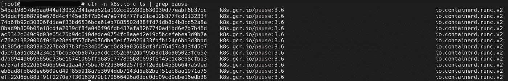
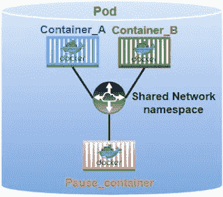
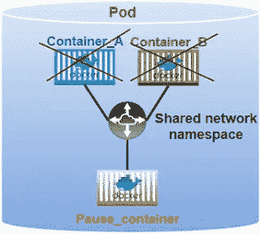

# K8s —暂停容器

> 原文：<https://blog.devgenius.io/k8s-pause-container-f7abd1e9b488?source=collection_archive---------0----------------------->

## 为什么我们在 K8s 吊舱中有暂停容器？


当您检查 K8s 集群上运行的容器时，您经常会看到`pause`容器，例如下面的例子:

你有没有想过为什么会有`pause`容器？当我们创建 pod 时，我们不记得我们曾经创建过这些`pause`容器，那么它们来自哪里呢？你可能会想，既然这些容器不是我们自己创建的，也许是 K8s 集群自动创建的？

没错，这些`pause`容器是 K8s 创建的，你可以认为是 K8s 给的免费容器。例如:



K8s 中所谓的`pause`容器有时被称为`infra`容器。它与用户容器“捆绑”在一起，在同一个 Pod 中运行。

`pause`容器是 Pod 网络模型的精髓。了解`pause`容器可以更好的帮助你理解 K8s Pod 设计的初衷。

# 暂停容器

创建 Pod 时，`kubelet`进程首先调用 CRI 接口`RuntimeService.RunPodSandbox`创建沙盒环境，设置网络等基本操作环境。

一旦 Pod 沙箱建立起来，`kubelet`就可以在其中创建用户容器。当需要删除一个容器时，`kubelet`将首先移除容器沙箱，然后停止里面的所有容器。

`pause`容器是存在于**每个** pod 中的一个容器，它就像一个模板或父容器，pod 中的所有新容器都从其继承名称空间。`pause`容器启动，然后进入“睡眠”。

它是一个“模板”容器，保留了 pod 中所有容器共享的名称空间。



来自[的图片手动打开](https://www.ithands-on.com/)

从下面的`pause.c` [源代码](https://github.com/kubernetes/kubernetes/blob/master/build/pause/linux/pause.c)可以看出:

```
#include <signal.h>
#include <stdio.h>
#include <stdlib.h>
#include <string.h>
#include <sys/types.h>
#include <sys/wait.h>
#include <unistd.h>#define STRINGIFY(x) #x
#define VERSION_STRING(x) STRINGIFY(x)#ifndef VERSION
#define VERSION HEAD
#endifstatic void sigdown(int signo) {
  psignal(signo, "Shutting down, got signal");
  exit(0);
}static void sigreap(int signo) {
  while (waitpid(-1, NULL, WNOHANG) > 0)
    ;
}int main(int argc, char **argv) {
  int i;
  for (i = 1; i < argc; ++i) {
    if (!strcasecmp(argv[i], "-v")) {
      printf("pause.c %s\n", VERSION_STRING(VERSION));
      return 0;
    }
  }if (getpid() != 1)
    /* Not an error because pause sees use outside of infra containers. */
    fprintf(stderr, "Warning: pause should be the first process\n");if (sigaction(SIGINT, &(struct sigaction){.sa_handler = sigdown}, NULL) < 0)
    return 1;
  if (sigaction(SIGTERM, &(struct sigaction){.sa_handler = sigdown}, NULL) < 0)
    return 2;
  if (sigaction(SIGCHLD, &(struct sigaction){.sa_handler = sigreap,
                                             .sa_flags = SA_NOCLDSTOP},
                NULL) < 0)
    return 3;for (;;)
    pause();
  fprintf(stderr, "Error: infinite loop terminated\n");
  return 42;
}
```

您可以看到`pause`容器做了以下两件事。

1.  注册各种信号处理函数，主要处理两类信息:退出信号和子信号。当它接收到`SIGINT`或`SIGTERM`时，直接退出。当收到`SIGCHLD`信号时，调用`waitpid`并回收退出的进程。
2.  循环的主进程调用`pause()`函数，让进程休眠，直到它被终止或收到信号。

因此，即使 Pod 中的最后一个容器崩溃，共享的名称空间仍然存在，因为`pause`容器持有名称空间。



来自[的图片手动打开](https://www.ithands-on.com/)

# **暂停容器演示**

当您在 Linux 系统上运行一个新进程时，该进程从父进程继承其名称空间。在命名空间中运行进程的方法是通过取消与父进程共享的命名空间来创建一个新的命名空间。以下是使用`unshare`工具在新的 PID、UTS、IPC 和 mount 名称空间中运行 shell 的示例。

```
$ unshare --pid --uts --ipc --mount -f chroot rootfs /bin/sh
```

一旦一个流程正在运行，您可以将其他流程添加到该流程的名称空间中以形成一个 Pod，其中 Pod 中的容器共享该名称空间。

以`docker`为例，让我们看看如何使用`pause`容器和共享名称空间从头开始创建一个 Pod。

## 创建暂停容器

```
$ docker run -d --name pause gcr.io/google_containers/pause-amd64:3.0
Unable to find image 'gcr.io/google_containers/pause-amd64:3.0' locally
3.0: Pulling from google_containers/pause-amd64
a3ed95caeb02: Pull complete
f11233434377: Pull complete
Digest: sha256:163ac025575b775d1c0f9bf0bdd0f086883171eb475b5068e7defa4ca9e76516
Status: Downloaded newer image for gcr.io/google_containers/pause-amd64:3.0
aa603afaba05b18f8e53844f216d965fb2487feddd32937f56611499af24c0a1
```

## 运行 nginx 容器

接下来我们运行一个`nginx`容器:

```
$ docker run -d --name nginx --net=container:pause  --pid=container:pause nginx
```

## 检查网络名称空间

首先让我们获得`pause`和`nginx`容器的 PID:

```
$ ps -ef | grep pause
root      9377  9353  0 15:47 ?        00:00:00 /pause$ ps -ef | grep nginx
root      9932  9910  0 15:53 ?        00:00:00 nginx: master process nginx -g daemon off;
```

现在让我们检查网络命名空间 ID:

```
$ lsns | grep pause | grep net
4026532388 net         4  9377 root   /pause
```

如您所见，`pause`容器的网络名称空间 ID 是`4026532388`。

现在让我们找出`nginx`的网络名称空间 ID。

```
$ readlink /proc/9932/task/9932/ns/net
net:[4026532388]
```

因此，我们可以确认`nginx`容器与`pause`容器共享同一个网络名称空间。