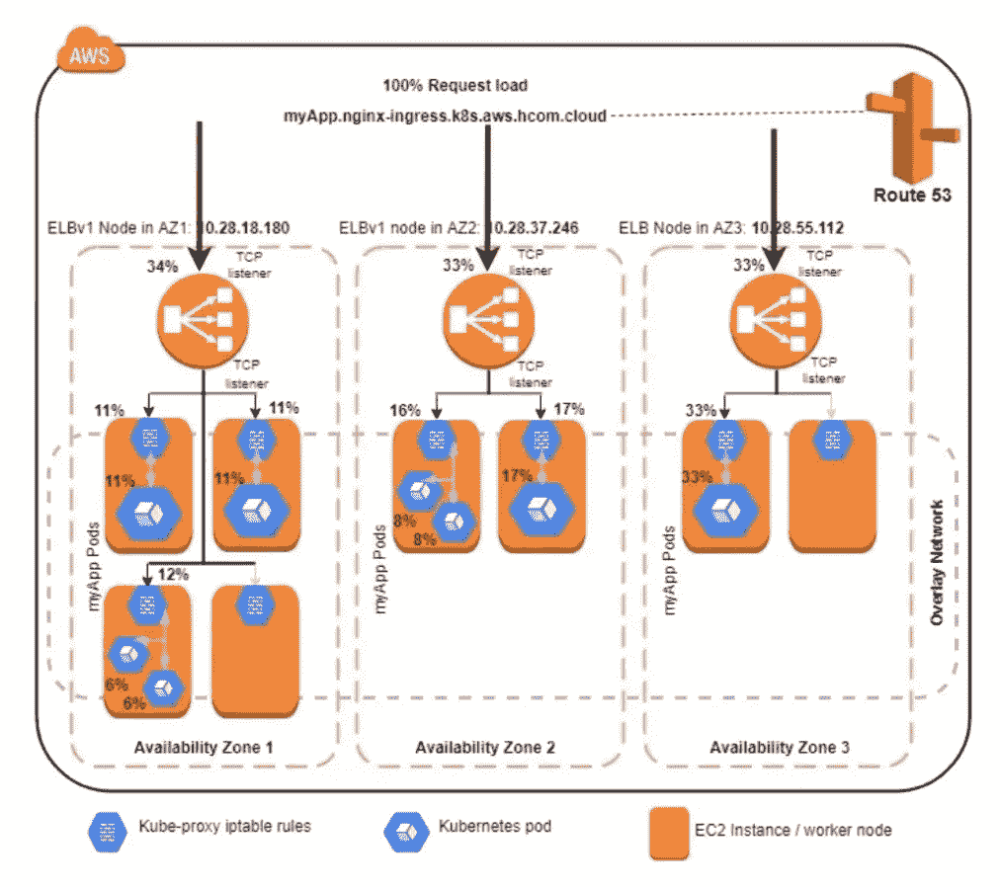
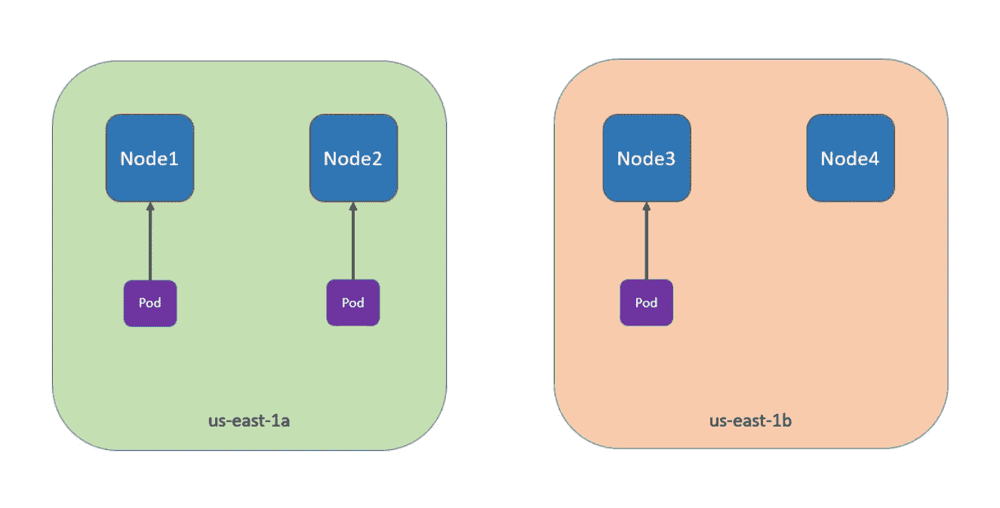

# K8s — Pod 拓扑

> 原文：<https://blog.devgenius.io/k8s-pod-topology-6639cc2b34cc?source=collection_archive---------2----------------------->

## 多节点/区域/地区 Pod 分布


在大规模 K8s 集群中，例如 50 多个工作节点，或者工作节点位于不同的区域或地区，您可能希望将工作负载单元分布到不同的节点、区域甚至地区。

这使您的工作负载能够受益于高可用性和集群利用率。例如:



图片来自 k8s.io

管理集群中的 pod 分布并不容易。K8s 的 Pod `affinity`和`anti-affinity`功能允许对 Pod 放置进行一些控制。然而，这些特性只能解决部分 Pods 分发用例。

为了在集群中均匀分布 pod 以实现高可用性和高效的集群资源利用，引入了`PodTopologySpread`调度插件。这个插件的第一个稳定版本是在 K8s v1.19。

# 拓扑扩展约束字段

这个`topologySpreadConstraints`字段依赖于节点标签来识别每个工作节点所在的拓扑域。您可以定义一个或多个`topologySpreadConstraints`条目来指示`kube-scheduler`如何相对于集群中现有的 Pod 放置每个传入的 Pod。

当一个 Pod 定义了多个 topologySpreadConstraint 时，这些约束使用逻辑`AND`操作进行组合:`kube-scheduler`为满足所有配置约束的传入 Pod 寻找一个节点。

`topologySpreadConstraints`的模板看起来像:

```
---
apiVersion: v1
kind: Pod
metadata:
  name: example-pod
spec:
  # Configure a topology spread constraint
  topologySpreadConstraints:
    - maxSkew: <integer>
      minDomains: <integer> # optional; beta since v1.25
      topologyKey: <string>
      whenUnsatisfiable: <string>
      labelSelector: <object>
      matchLabelKeys: <list> # optional; alpha since v1.25
      nodeAffinityPolicy: [Honor|Ignore] # optional; alpha since v1.25
      nodeTaintsPolicy: [Honor|Ignore] # optional; alpha since v1.25
  ### other Pod fields go here
```

## maxSkew

它描述了豆荚分布不均匀的程度。您必须指定此字段，并且数字必须大于零。

如果您设置了`whenUnsatisfiable: DoNotSchedule`，那么`maxSkew`将定义目标拓扑中匹配 pod 数量与全局最小值之间的最大允许差值(合格域中匹配 pod 的最小数量，或者如果合格域的数量小于 MinDomains，则为零)。

例如，在一个 3 区集群中，`MaxSkew`被设置为 1，并且具有相同`labelSelector`分布的 pod 为 1/1/0:us-east-1a/us-east-1b/us-east-1c，如果`MaxSkew`为 1，则进入的 pod 只能被调度到 us-east-1c 以变成 1/1/1；将其安排在 us-east-1a 或 us-east-1b 上会使 us-east-1a(us-east-1b)上的实际不对称(2-0)违反 max skew(1)；如果`MaxSkew`为 2，可以将进入的 pod 安排到任何区域。

当`whenUnsatisfiable=ScheduleAnyway`时，用于给予满足它的拓扑更高的优先级。这是必填字段。默认值为 1，不允许为 0。

## minDomains

这表示合格域的最小数量。该字段是可选的。域是拓扑的一个特殊实例。合格域是其节点与节点选择器匹配的域。这是一个测试字段，默认情况下在`K8sv1.25`中启用。

## 地形关键

这是节点标签的关键。具有带有此关键字和相同值的标签的节点被视为处于同一拓扑中。我们将拓扑的每个实例(换句话说，一个<key value="">对)称为一个域。</key>

调度程序将尝试在每个域中放置平衡数量的 pod。同样，我们将合格域定义为其节点满足`nodeAffinityPolicy`和`nodeTaintsPolicy`要求的域。

例如，在您的 Pod 模板中，您可以定义以下内容:
topologySpreadConstraints:

```
maxSkew: 1
topologyKey: topology.kubernetes.io/zone
```

如果你的工人节点有标签:`topology.kubernetes.io/zone=us-east-1a/b/c/d`。

> 注意，`K8sv1.21`中有一个 bug，cluster-autoscaler 不能正确响应`topology.kubernetes.io/zone`的新标签，你需要使用`failure-domain.beta.kubernetes.io/zone`。

## 当无法满足时

这表明如何处理不满足展开限制的 Pod:

*   **DoNotSchedule** (默认)告诉调度程序不要调度它。
*   **schedule anway**告诉调度器仍然对其进行调度，同时对使偏差最小化的节点进行优先级排序。

## 标签选择器

它用于查找匹配的 pod。对匹配此标签选择器的 pod 进行计数，以确定其对应拓扑域中的 pod 数量。

## matchLabelKeys

这是一个窗格标签键列表，用于选择要计算展开的窗格。这些键用于从 pod 标签中查找值，这些键值标签与`labelSelector`进行 and 运算，以选择一组现有的 pod，在该组 pod 上，将为即将到来的 pod 计算分布。pod 标签中不存在的键将被忽略。null 或空列表意味着只匹配标签选择器。

有了`matchLabelKeys`，用户不需要在不同版本之间更新`pod.spec`。控制器/操作员只需要为不同版本的相同标签键设置不同的值。调度程序将根据`matchLabelKeys`自动假定这些值。

例如，如果用户使用`Deployment`，他们可以使用由`Deployment`控制器自动添加的以 pod-template-hash 为关键字的标签来区分单个部署中的不同修订。

例如:

```
topologySpreadConstraints:
  - maxSkew: 1
    topologyKey: kubernetes.io/hostname
    whenUnsatisfiable: DoNotSchedule
    matchLabelKeys:
      - app
      - pod-template-hash
```

注意，`matchLabelKeys`字段是在 1.25 中添加的 alpha 字段。您必须启用 MatchLabelKeysInPodTopologySpread 特征门才能使用它。

## 无亲缘关系策略

它表明在计算 pod 拓扑分布偏差时，我们将如何处理 Pod 的`nodeAffinity/nodeSelector`。有两种选择:

*   **Honor** :只有与 nodeAffinity/nodeSelector 匹配的节点才包含在计算中。
*   **忽略**:忽略 nodeAffinity/nodeSelector。所有节点都包括在计算中。
    如果该值为空，则该行为等同于荣誉策略。
    在 v1.25 中，该字段是一个 alpha 级别字段。

## 无污点政策

它表明在计算 pod 拓扑分布偏差时，我们将如何处理节点污染。与 nodeAffinityPolicy 类似，有两个选项:

*   **荣誉**:包括没有污点的节点，以及传入的 pod 可以容忍的污点节点。
*   **忽略**:忽略节点污点。包括所有节点。如果该值为 null，则该行为等同于忽略策略。
    在 v1.25 中，该字段是一个 alpha 级别字段。

# Pod 拓扑演示

假设您有一个 4 节点集群，其中 3 个标有 foo: bar 的 pod 分别位于节点 1、节点 2 和节点 3:



对于第 4 个 pod，如果您想将其安排到 us-east-1b 中的节点 4，可以按如下方式进行配置:

```
kind: Pod
apiVersion: v1
metadata:
  name: myapp
  labels:
    foo: bar
spec:
  topologySpreadConstraints:
  - maxSkew: 1
    topologyKey: zone
    whenUnsatisfiable: DoNotSchedule
    labelSelector:
      matchLabels:
        foo: bar
  containers:
  - name: nginx
    image: nginx:1.21.1
```

从上面的例子来看，配置`topologyKey: zone`意味着平均分布将只应用于标签为`zone: <any value>`的节点，没有`zone`标签的节点将被跳过。字段`whenUnsatisfiable: DoNotSchedule`告诉调度程序，如果调度程序找不到满足约束的方法，就让进来的 Pod 保持挂起。