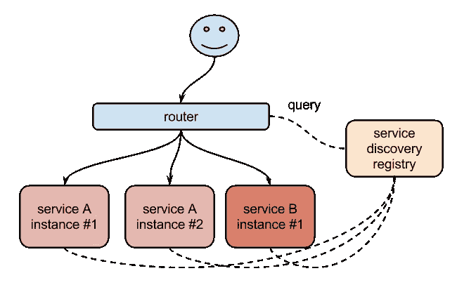
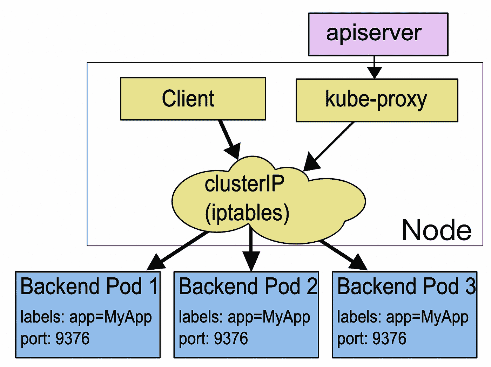
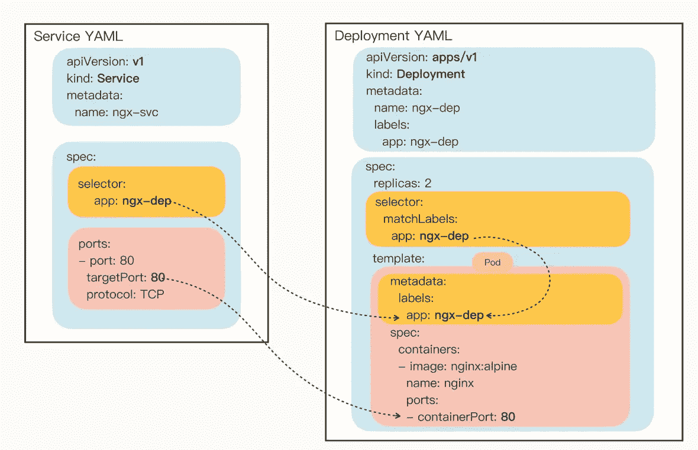

# K8s —服务介绍

> 原文：<https://blog.devgenius.io/k8s-service-introduction-b1197f5d0ab4?source=collection_archive---------6----------------------->

## K8s 服务介绍


之前，我谈到了两个 API 对象，[部署](/k8s-controller-deployment-b1434f17fc9d)和 [DaemonSet](https://medium.com/geekculture/k8s-controller-daemonset-226b2ea15088) 。它们都是在线服务，但是使用不同的策略部署应用程序。部署创建任意数量的实例，守护进程为每个节点创建一个实例。

这两个 API 对象可以部署各种形式的应用，在云原生时代，微服务无疑是应用的主流形式。

为了更好地支持`microservices`、`service meshes`等应用架构，K8s 专门定义了一个新的对象:`Service`，这是一种集群内的负载均衡机制，用于解决服务发现的关键问题。

# 为什么选择 K8s 服务

有了部署和守护进程，我们在集群中发布应用程序的工作就容易多了。借助 K8s 强大的自动化运维能力，我们可以将应用更新和在线应用的频率从以前的每月和每周级别提高到每天和每小时级别，将服务质量提升到一个新的水平。

然而，在应用对快速版本进行迭代的同时，另一个问题也逐渐显现出来，那就是“服务发现”。

K8s 集群中一个 Pod 的生命周期比较“短”。虽然 Deployment 和 DaemonSet 可以维持吊舱整体数量的稳定，但在运行过程中不可避免地会出现吊舱被破坏和重建的情况，这就造成了吊舱集合处于动态状态。

这种“动态稳定”对于现在流行的`microservice`架构是非常致命的。试想一下，后台 Pod 的 IP 地址总是在变，客户端应该怎么访问？如果不处理好这个问题，Pod 的部署和 DaemonSet 管理就一文不值。

其实这个问题并不难。对于这种“不稳定”的后端服务，业界早已有解决方案，即“**负载均衡**”。典型的应用包括 LVS、Nginx 等等。

他们在前端和后端之间增加了一个“中间层”，屏蔽后端的变化，为前端提供稳定的服务。

但是 LVS 和 Nginx 毕竟不是云原生技术，所以 K8s 按照这个思路定义了一个新的 API 对象: **Service** 。



所以你可以想象 Service 的工作原理和 LVS、Nginx 差不多。K8s 会给它分配一个静态 IP 地址，然后它会自动管理和维护后面动态变化的那组 pod。当客户端访问服务时，它会根据一定的策略，将流量转发到一个 Pod。

下图清楚地显示了 K8s 中服务的工作方式:



来自 [k8s.io](https://kubernetes.io/zh-cn/docs/concepts/services-networking/service/) 的图片

如您所见，该服务在这里使用了`iptables`技术。每个节点上的`kube-proxy`组件自动维护`iptables`规则。客户不再关心 Pod 的具体地址。

只要访问到服务的固定 IP 地址，就会按照`iptables`规则转发服务。请求多个 pod 进行管理是一种典型的负载平衡架构。

然而，服务并不仅仅使用`iptables`来实现负载均衡。它还有另一个名为`**ipvs**`的实现，性能更好。

# 服务演示

让我们做一个快速的服务演示来帮助您更好地理解。在以下 YAML 文件中，我定义了一个典型的 K8s 服务:

```
apiVersion: v1
kind: Service
metadata:
  name: hostnames
spec:
  selector:
    app: hostnames
  ports:
  - name: default
    protocol: TCP
    port: 80
    targetPort: 9376
```

在上面的例子中，我使用了选择器字段来声明这个服务只代理标签为`app=hostnames`的 pod。此外，该服务的端口 80 正在代理 Pod 的端口 9376。

应用程序部署 YAML 看起来像这样:

```
apiVersion: apps/v1
kind: Deployment
metadata:
  name: hostnames
spec:
  selector:
    matchLabels:
      app: hostnames
  replicas: 3
  template:
    metadata:
      labels:
        app: hostnames
    spec:
      containers:
      - name: hostnames
        image: k8s.gcr.io/serve_hostname
        ports:
        - containerPort: 9376
          protocol: TCP
```

该应用程序每次访问端口 9376 时都会返回自己的主机名。选择器选择的 Pods 称为服务的**端点，您可以使用`kubectl get ep`命令查看它们，如下所示:**

```
$ kubectl get endpoints hostnames
NAME        ENDPOINTS
hostnames   10.244.0.5:9376,10.244.0.6:9376,10.244.0.7:9376
```

应该注意，只有处于运行状态并通过`readinessProbe`检查的 pod 才会出现在服务的端点列表中。而且，当 Pod 出现问题时，K8s 会自动将其从服务中删除。

此时，通过服务`10.0.1.175,`的 VIP 地址，您可以访问它所代理的 Pod:

```
$ kubectl get svc hostnames
NAME        TYPE        CLUSTER-IP   EXTERNAL-IP   PORT(S)   AGE
hostnames   ClusterIP   10.0.1.175   <none>        80/TCP    5s$ curl 10.0.1.175:80
hostnames-0uton$ curl 10.0.1.175:80
hostnames-yp2kp$ curl 10.0.1.175:80
hostnames-bvc05
```

此 VIP 地址由 K8s 为服务自动分配。而且和上面一样，通过连续三次访问服务的 VIP 地址和代理端口 80，它依次为我们返回三个 pod 的主机名。这也证实了服务提供的负载平衡是循环法。对于这种方法，我们称之为:ClusterIP 模式下的服务。

# 使用 YAML 描述服务

了解了服务的基本工作原理，让我们来看看如何为服务编写一个 YAML 描述文件。

像往常一样，我们仍然可以使用命令`kubectl api-resources`查看它的基本信息，我们可以知道它的缩写是`svc`,`apiVersion`是`v1`。

注意，这意味着它和 Pod 一样，属于 K8s 的核心对象，不与业务应用关联，与 Job 和 Deployment 不同。

让我们看一个真实的例子。假设我们想为 ngx-dep 应用程序生成一个服务，该命令应该写成这样:

```
$ kubectl expose deploy ngx-dep --port=80 --target-port=80 --dry-run=client -o yaml
```

输出将类似于:

```
apiVersion: v1
kind: Service
metadata:
  creationTimestamp: null
  labels:
    app: ngx-dep
  name: ngx-dep
spec:
  ports:
  - port: 80
    protocol: TCP
    targetPort: 80
  selector:
    app: ngx-dep
status:
  loadBalancer: {}
```

你会发现服务的定义很简单，在“spec”中只有两个关键字段，`selector`和`ports`。

选择器的作用与 Deployment/DaemonSet 中的作用相同，用于筛选出那些要代理的 pod。因为我们指定了代理部署，所以 K8s 会自动为我们填充 ngx-dep 标签，并且这个部署对象部署的所有 pod 都会被选中。

从这里也可以看出，K8s 的标签机制虽然很简单，但是非常强大有效，很容易让人联想到部署的 Pod。

端口很好理解。里面的三个字段代表外部端口、内部端口和使用的协议。在这里，内部和外部都使用端口 80，协议是 TCP。

当然，也可以将端口改为“8080”等其他端口，这样外部服务看到的是服务给定的端口，并不知道 Pod 真正的服务端口。

下图应该有助于您清楚地了解服务和 Pod 之间的关系:



当我们定义服务时，我们可以指定我们需要的服务类型。如果我们不指定，默认是`ClusterIP`类型。

我们可以使用的服务类型如下:

*   **ClusterIP** :通过集群内部 IP 公开服务。如果选择此值，则只能在群集内访问服务，这也是默认的服务类型。
*   **NodePort** :通过每个节点 Node 上的 IP 和静态端口(NodePort)公开服务。NodePort 服务被路由到自动创建的 ClusterIP 服务。通过请求`NodeIp:NodePort`，可以从集群外部访问节点端口服务。
*   **负载平衡器**:使用云提供商的负载平衡器向外界公开服务。外部负载平衡器可以路由到 NodePort 服务和 ClusterIP 服务，这些服务需要与特定的云供应商一起操作。
*   **ExternalName** :通过返回`CNAME`及其值，服务可以映射到`externalName`字段的内容(例如 foo.bar.example.com)。

# 结论

我们在这篇文章中讨论了 K8s 服务的基础，接下来我们将讨论 K8s 中服务的具体工作方式，以及`iptables`和`ipvs`之间的区别。