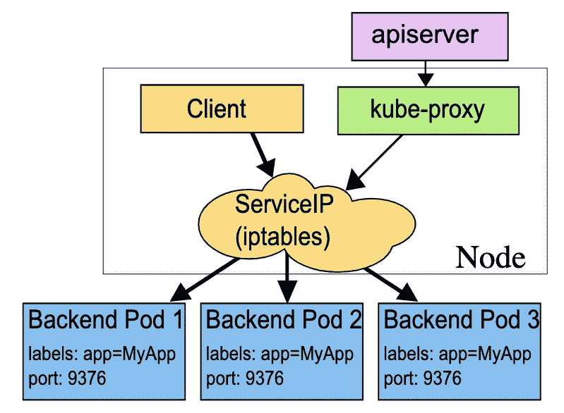
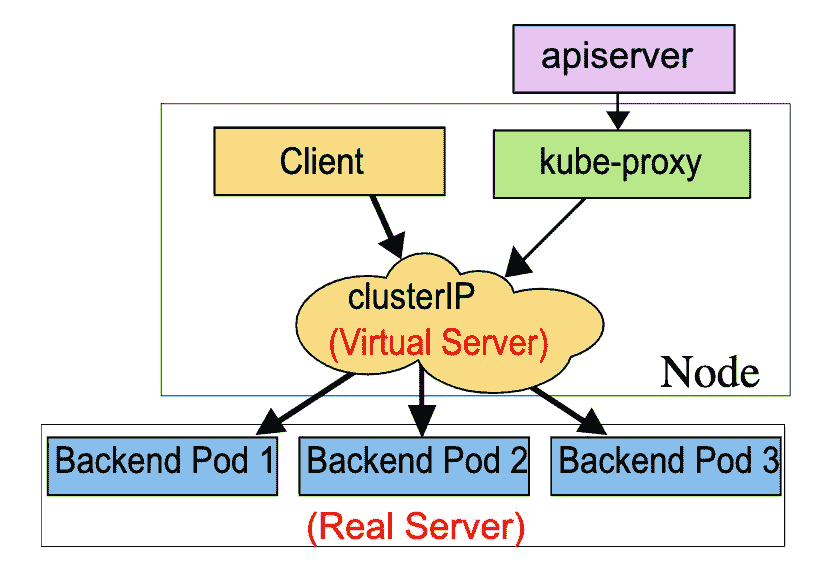

# K8s 服务— iptables 和 ipvs 实施

> 原文：<https://blog.devgenius.io/k8s-service-iptables-and-ipvs-implementation-1d52260c25c3?source=collection_archive---------0----------------------->

## iptables 和 ipv 如何实现 K8s 服务


在我的“ [K8s —服务介绍](/k8s-service-introduction-b1197f5d0ab4)”一文中，我提到 K8s 服务使用`iptables`和`ipvs`来实现负载均衡。让我们来谈谈本文中的`iptables`和`ipvs`是如何实现的。

# 主机名应用演示摘要

让我们回顾一下我们在上一篇文章中创建的名为“主机名”的服务。

```
apiVersion: v1
kind: Service
metadata:
  name: hostnames
spec:
  selector:
    app: hostnames
  ports:
  - name: default
    protocol: TCP
    port: 80
    targetPort: 9376
```

在此“主机名”服务背后，有三个单元，由以下部署控制:

```
apiVersion: apps/v1
kind: Deployment
metadata:
  name: hostnames
spec:
  selector:
    matchLabels:
      app: hostnames
  replicas: 3
  template:
    metadata:
      labels:
        app: hostnames
    spec:
      containers:
      - name: hostnames
        image: k8s.gcr.io/serve_hostname
        ports:
        - containerPort: 9376
          protocol: TCP
```

该应用程序每次访问端口 9376 时都会返回自己的主机名。服务 VIP 是 10.0.1.175:

```
$ kubectl get svc hostnames
NAME        TYPE        CLUSTER-IP   EXTERNAL-IP   PORT(S)   AGE
hostnames   ClusterIP   10.0.1.175   <none>        80/TCP    5s$ curl 10.0.1.175:80
hostnames-0uton$ curl 10.0.1.175:80
hostnames-yp2kp$ curl 10.0.1.175:80
hostnames-bvc05
```

# iptables 规则

## 服务规则

引擎盖下，服务一提交给 K8s，`kube-proxy`就能通过服务告密者感知到这样一个服务对象的加入。作为对此事件的响应，它在主机上创建了这样一个`iptables`规则(您可以通过 iptables-save 看到它)，如下所示:

```
-A KUBE-SERVICES -d 10.0.1.175/32 -p tcp -m comment --comment "default/hostnames: cluster IP" -m tcp --dport 80 -j KUBE-SVC-NWV5X2332I4OT4T3
```

上面的`iptables`规则告诉 K8s:任何目的地址为 10.0.1.175，目的端口为 80 的 IP 包都要跳转到另一个名为**KUBE-SVC-nwv5x 2332 i4 ot 4 T3**的`iptables`链进行处理。

而正如我们之前看到的，10.0.1.175 是这个服务的 VIP。所以这个规则为这个服务设置了一个固定的入口地址。而且，由于 10.0.1.175 只是一个`iptables`规则上的配置，并没有真正的网络设备，所以如果 ping 这个地址，也不会有响应。

那么，这个链条"**KUBE-SVC-nwv5x 2332 i4 ot 4t 3 "**长什么样呢？事实上，它是如下规则的集合:

```
-A KUBE-SVC-NWV5X2332I4OT4T3 -m comment --comment "default/hostnames:" -m statistic --mode random --probability 0.33332999982 -j KUBE-SEP-WNBA2IHDGP2BOBGZ-A KUBE-SVC-NWV5X2332I4OT4T3 -m comment --comment "default/hostnames:" -m statistic --mode random --probability 0.50000000000 -j KUBE-SEP-X3P2623AGDH6CDF3-A KUBE-SVC-NWV5X2332I4OT4T3 -m comment --comment "default/hostnames:" -j KUBE-SEP-57KPRZ3JQVENLNBR
```

如你所见，这套规则实际上是一套随机模式的`iptables`链(`–mode random`)。随机转发目的地是

*   KUBE-九月-WNBA2IHDGP2BOBGZ
*   KUBE-SEP-X3P2623AGDH6CDF3
*   KUBE

这三条链指向的最终目的地实际上是服务代理的**三个吊舱。因此，这组规则是服务实现负载平衡的地方。**

需要注意的是，`iptables`规则的匹配是自上而下一条一条进行的，所以为了保证上述三条规则中的每一条都有相同的被选中概率，我们要将它们的概率字段的值设置为`1/3 (0.333 …)`、`1/2`和`1`。

这个设置的原理很简单:第一个规则被选中的概率是 1/3；而如果第一条规则没有被选中，那么此时就只剩下两条规则了，所以第二条规则被选中的概率必须设为 1/2；同样，最后一个条目必须设置为 1。

## Pod 规则

通过查看以上三个链条的细节，我们很容易理解业务转发的具体原理，如下图所示:

```
-A KUBE-SEP-57KPRZ3JQVENLNBR -s 10.244.3.6/32 -m comment --comment "default/hostnames:" -j MARK --set-xmark 0x00004000/0x00004000
-A KUBE-SEP-57KPRZ3JQVENLNBR -p tcp -m comment --comment "default/hostnames:" -m tcp -j DNAT --to-destination 10.244.3.6:9376-A KUBE-SEP-WNBA2IHDGP2BOBGZ -s 10.244.1.7/32 -m comment --comment "default/hostnames:" -j MARK --set-xmark 0x00004000/0x00004000
-A KUBE-SEP-WNBA2IHDGP2BOBGZ -p tcp -m comment --comment "default/hostnames:" -m tcp -j DNAT --to-destination 10.244.1.7:9376-A KUBE-SEP-X3P2623AGDH6CDF3 -s 10.244.2.3/32 -m comment --comment "default/hostnames:" -j MARK --set-xmark 0x00004000/0x00004000
-A KUBE-SEP-X3P2623AGDH6CDF3 -p tcp -m comment --comment "default/hostnames:" -m tcp -j DNAT --to-destination 10.244.2.3:9376
```

可以看出，这三条链其实就是三条 DNAT 规则。但是在 DNAT 规则之前，`iptables`还会在传入的 IP 数据包上设置一个“标记”(`--set-xmark`)。

DNAT 规则的作用是在预路由检查点之前，即在路由之前，将传入 IP 数据包的目的地址和端口更改为由`–-to-destination`指定的新目的地址和端口。如您所见，目的地址和端口正是代理 Pod 的 IP 地址和端口。

这样，访问服务 VIP 的 IP 包经过上述`iptables`处理后，就变成了访问特定后端 Pod 的 IP 包。不难理解，这些端点对应的`iptables`规则是由`kube-proxy`通过监控 Pod 变化事件在主机上生成和维护的。

流程图如下所示:



# ipv

通过上面的`iptables`解释，可以看到`kube-proxy`通过`iptables`处理服务的过程实际上需要在主机上设置大量的`iptables`规则。另外，`kube-proxy`需要在控制循环中不断刷新这些规则，以确保它们总是正确的。

不难想象，当你的主机上有大量的 pod 时，成百上千的`iptables`规则不断刷新，会占用主机大量的 CPU 资源，甚至会让主机“卡”在进程中。

所以`iptables-based`服务实现一直是制约 K8s 项目承载更多 pod 的主要障碍。

`ipvs`模式的服务是解决这一问题的有效方法。`ipvs`模式的工作原理与`iptables`模式类似。在我们创建了前面的服务之后，`kube-proxy`将首先在主机上创建一个虚拟网卡(名为: **kube-ipvs0** )，并为其分配服务 VIP 作为 IP 地址，如下所示:

```
# ip addr
  ...
  73：kube-ipvs0：<BROADCAST,NOARP>  mtu 1500 qdisc noop state DOWN qlen 1000
  link/ether  1a:ce:f5:5f:c1:4d brd ff:ff:ff:ff:ff:ff
  inet 10.0.1.175/32  scope global kube-ipvs0
  valid_lft forever  preferred_lft forever
```

接下来，`kube-proxy`将通过 Linux IPVS 模块为该 IP 地址设置三个`ipvs`虚拟主机，并将这三个虚拟主机之间的轮询模式(rr)设置为负载均衡策略。我们可以通过`ipvsadm`查看该设置，如下所示:

```
# ipvsadm -ln
 IP Virtual Server version 1.2.1 (size=4096)
  Prot LocalAddress:Port Scheduler Flags
    ->  RemoteAddress:Port           Forward  Weight ActiveConn InActConn     
  TCP  10.102.128.4:80 rr
    ->  10.244.3.6:9376    Masq    1       0          0         
    ->  10.244.1.7:9376    Masq    1       0          0
    ->  10.244.2.3:9376    Masq    1       0          0
```

可以看到，三个 IPVS 虚拟主机的 IP 地址和端口对应于三个代理的 pod。

此时，发送到 10.102.128.4:80 的任何请求都将被 IPVS 模块转发到后端 Pod。

流程图如下所示:



# iptables 与 ipv

与`iptables`相比，`ipvs`在内核中的实现实际上是基于 Netfilter 的 NAT 模式，所以在转发层，理论上`ipvs`并没有显著的性能提升。

而 IPVS 不需要在主机上为每个 Pod 设置`iptables`规则，而是把这些“规则”的处理放到内核状态，大大降低了维护这些规则的成本。

不过需要注意的是，`ipvs`模块只负责上述负载均衡和代理功能。然而，一个完整的服务流程正常工作所需的操作，如包过滤和 SNAT，仍然依赖于`iptables`。

但是这些辅助`iptables`规则在数量上是有限的，并不随着吊舱数量的增加而增加。因此，在大规模集群中，我强烈建议您将`--proxy-mode=ipvs`设置为`kube-proxy`来启用这个特性。它给 K8s 集群规模带来的提升还是巨大的。