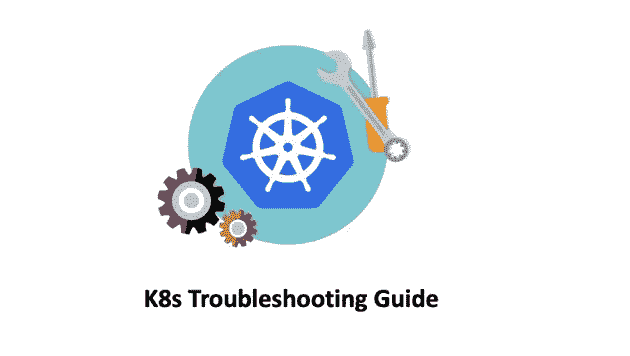
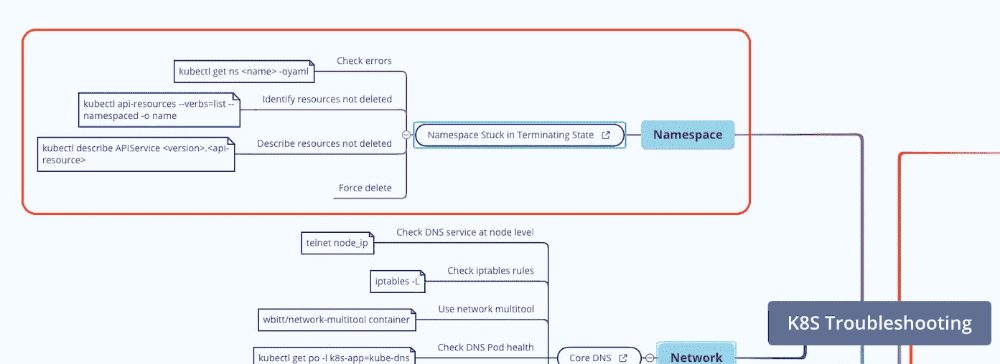

# K8s 故障排除—命名空间卡在终止状态

> 原文：<https://blog.devgenius.io/k8s-troubleshooting-namespace-stuck-in-terminating-state-b91ab6fa8948?source=collection_archive---------0----------------------->

## K8s 故障排除手册



> N ***注，完整的“K8s 故障排除”思维导图可在:*** [***K8s 故障排除思维导图***](https://github.com/metaleapca/metaleap-k8s-troubleshooting/blob/main/metaleap-k8s-troubleshooting.pdf)

*有时，当您尝试删除 K8s 集群中的一个`namespace`时，它会卡在“终止”状态，如下所示:*

```
*$ kubectl get ns | grep -i "terminating"
ingress-nginx2                Terminating   4h47m*
```

*本文展示了您对停留在“终止”状态的`namespace`的故障诊断步骤。*

# *第一步:理解为什么*

*在进入任何其他步骤之前，你首先需要弄清楚为什么`namespace`处于“心狠手辣”状态。*

*您可以运行`kubectl get ns <namespace_name> -oyaml`来查看是否有任何错误信息:*

```
*$ kubectl get ns ingress-nginx2 -oyaml
apiVersion: v1
kind: Namespace
metadata:
  creationTimestamp: "2022-09-02T14:55:32Z"
  deletionTimestamp: "2022-09-02T15:00:07Z"
...
spec:
  finalizers:
  - kubernetes
status:
  **conditions:
  - lastTransitionTime: "2022-09-02T15:00:12Z"
    message: 'Discovery failed for some groups, 1 failing: unable to retrieve the
      complete list of server APIs: metrics.k8s.io/v1beta1: an error on the server
      ("Internal Server Error: \"/apis/metrics.k8s.io/v1beta1\": the server could
      not find the requested resource") has prevented the request from succeeding'
    reason: DiscoveryFailed
    status: "True"**
    type: NamespaceDeletionDiscoveryFailure
  - lastTransitionTime: "2022-09-02T15:00:12Z"
    message: All legacy kube types successfully parsed
    reason: ParsedGroupVersions
    status: "False"
    type: NamespaceDeletionGroupVersionParsingFailure
  - lastTransitionTime: "2022-09-02T15:00:12Z"
    message: All content successfully deleted, may be waiting on finalization
    reason: ContentDeleted
    status: "False"
    type: NamespaceDeletionContentFailure
  - lastTransitionTime: "2022-09-02T15:00:20Z"
    message: All content successfully removed
    reason: ContentRemoved
    status: "False"
    type: NamespaceContentRemaining
  - lastTransitionTime: "2022-09-02T15:00:12Z"
    message: All content-preserving finalizers finished
    reason: ContentHasNoFinalizers
    status: "False"
    type: NamespaceFinalizersRemaining
  phase: Terminating*
```

*正如你所看到的，上面的例子在`conditions`字段中显示了一个“NamespaceDeletionDiscoveryFailure ”,消息是“**/APIs/metrics . k8s . io/v1beta 1”**服务器上找不到资源。*

*其他可能的错误有:*

```
*spec:
  finalizers:
  - kubernetes
...
- lastTransitionTime: "2022-01-19T19:05:31Z"
 **message: 'Some content in the namespace has finalizers remaining: tackles.tackle.io/finalizer in 1 resource instances'
 reason: SomeFinalizersRemain** status: "True"
 type: NamespaceFinalizersRemaining*
```

*或者*

```
*spec:
  finalizers:
  - kubernetes
...
- lastTransitionTime: "2022-01-19T19:05:31Z"
 **message: 'unable to retrieve the complete list of server APIs: custom.metrics.k8s.io/v1beta1: the server is currently unable to handle the request'
 reason: SomeFinalizersRemain
** status: "True"
 type: NamespaceFinalizersRemaining*
```

*注意，在上面的输出中，这些名称空间有一个在`spec`下定义的`finalizer`。在 K8s 中，`finalizer`是一个特殊的元数据键，它告诉 K8s 在完全删除一个资源之前等待，直到满足特定的条件。*

*因此，当您运行类似于`kubectl delete namespace`的命令时，K8s 会检查`metadata.finalizers`字段中的`finalizer`。如果`finalizer`中定义的资源由于某种原因无法删除，那么`namespace`也不会被删除。这将`namespace`置于终止状态，等待资源的移除，这永远不会发生。*

# *第二步:识别未删除的资源*

*一旦您找到了`namespace`未被删除的原因，您应该尝试解决该问题，以下是一些推荐步骤:*

*   *查找未删除的资源:*

```
*$ kubectl api-resources --verbs=list --namespaced -o name | xargs -n 1 kubectl get --show-kind --ignore-not-found -n <namespace-name>*
```

*   *如果之前的命令返回以下错误消息:`unable to retrieve the complete list of server APIs: <api-resource>/<version>: the server is currently unable to handle the request`，请使用您收到的信息继续运行以下命令:*

```
*$ kubectl get APIService <version>.<api-resource>*
```

*   *描述 API 服务以继续故障排除:*

```
*$ kubectl describe APIService <version>.<api-resource>*
```

*   *确保问题得到解决，然后检查`namespace`是否被删除。*

# *第三步:强制删除名称空间*

*如果`namespace`仍然处于“终止”状态或者无法解决 API 资源问题，可以尝试强制删除`namespace`。*

*   *将命名空间的内容转储到临时 JSON 文件中:*

```
*$ kubectl get namespace <terminating-namespace> -o json > tmp.json$ cat tmp.json
{
    "apiVersion": "v1",
    "kind": "Namespace",
    "metadata": {
        ...
    },
    "spec": {
        "finalizers": [
            "kubernetes"
        ]
    },
    "status": {
        "conditions": [
            {
                "lastTransitionTime": "2022-09-02T15:00:12Z",
                "message": "Discovery failed for some groups, 1 failing: unable to retrieve the complete list of server APIs: metrics.k8s.io/v1beta1: an error on the server (\"Internal Server Error: \\\"/apis/metrics.k8s.io/v1beta1\\\": the server could not find the requested resource\") has prevented the request from succeeding",
                "reason": "DiscoveryFailed",
                "status": "True",
                "type": "NamespaceDeletionDiscoveryFailure"
            }
        ],
        "phase": "Terminating"
    }
}*
```

*   *编辑您的`tmp.json`文件。从`finalizers`字段中删除`kubernetes`值并保存文件。*

```
*$ cat tmp.json
{
    "apiVersion": "v1",
    "kind": "Namespace",
    "metadata": {
        ...
    },
    "spec": {
        "finalizers": []
    },
    "status": {
        "phase": "Terminating"
    }
}*
```

*   *设置临时代理 IP 和端口，确保您的终端窗口保持打开，直到您删除卡住的名称空间:*

```
*$ kubectl proxy
...
Starting to serve on 127.0.0.1:8001*
```

*   *打开一个新的终端窗口，运行以下命令:*

```
*$ curl -k -H "Content-Type: application/json" -X PUT --data-binary @tmp.json http://127.0.0.1:8001/api/v1/namespaces/<namespace>/finalize*
```

*   *验证终止命名空间是否已删除:*

```
*$ kubectl get namespaces*
```

## *单线版本*

*如果上面的`tmp.json`文件不起作用，还有一个单行命令:*

```
*$ kubectl patch ns <Namespace_to_delete> -p '{"metadata":{"finalizers":null}}'*
```

# *结论*

**