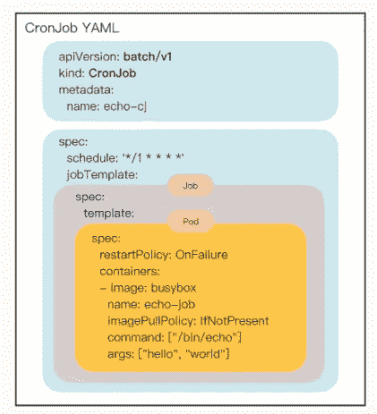
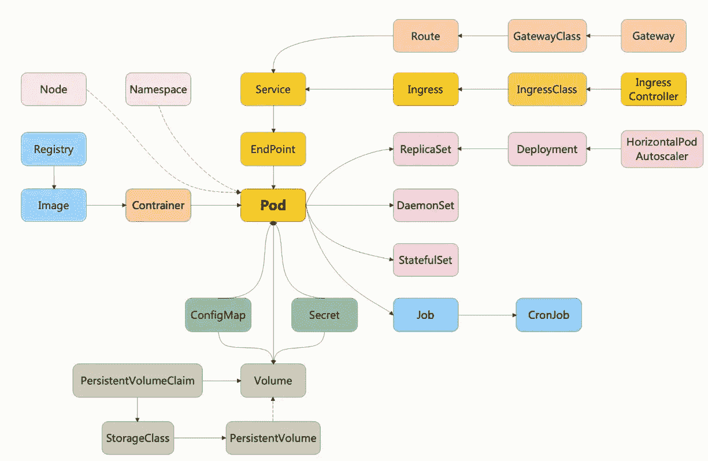
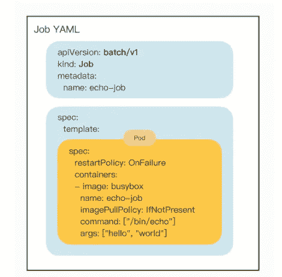

# K8s —为什么直接使用作业而不是 Pod？

> 原文：<https://blog.devgenius.io/k8s-why-use-job-instead-of-pod-directly-48cf4e24a0df?source=collection_archive---------2----------------------->

## 每天一点 K8s 知识！



在我的上一篇文章中，我们学习了 Pod，这是 K8s 的核心对象，“[K8s——核心概念:Pod](/k8s-core-concept-pod-8af4fe19f7a6) ”。我们还了解到，因为 Pods 比容器更能代表实际的应用程序，K8s 不在容器级别编排服务，而是使用 Pods 作为集群中调度操作和维护的最小单元。

我们还看到了 K8s 的资源对象关系图，Pod 是中心，扩展了许多其他资源对象，代表了不同的业务。让我们再看看:



您可能会问这样一个问题:Pod 的功能已经足够完整了，为什么要定义这些额外的对象？为什么不在 Pod 中添加一些功能来处理业务需求呢？

这个问题反映了谷歌对大规模计算集群管理的深刻思考。今天，我们来谈谈 K8s 基于 Pod 的设计概念，从最简单的两个对象开始——Job 和 CronJob。

# 为什么不直接使用豆荚呢

现在您应该知道 K8s 使用 RESTful API，它将集群中的各种业务抽象成 HTTP 资源对象。然后在这个层次上，我们可以使用面向对象的方法来解决问题。

如果你有一些编程经验，你知道面向对象编程(OOP)，它把所有的东西都当作高度内聚的对象，并强调对象之间相互通信以完成任务。

面向对象设计有很多基本原则，我认为其中两个更恰当地描述了 K8s 对象设计，一个是“**单一责任”**，另一个是“**组合优先于继承**”。

**单一责任**表示目标只专注于做好一件事，不要贪得无厌。保持足够小的粒度更便于重用和管理。

**组合胜于继承**“意味着在运行时应该尽可能多地连接对象以保持松散的耦合，而不是硬编码对象之间的关系。

应用这两个原则，我们将非常清楚地看到 k8 的资源对象。因为 Pod 已经是一个相对完整的对象，专门负责管理容器，那么我们就不应该再盲目地为它扩展函数，而是要保持它的独立性，容器外的函数需要定义其他的函数对象，将 Pod 作为它的成员之一“组成”它。

# 为什么选择工作/CronJob

在我之前的文章中，我们运行了两个 pod:`Nginx`和`busybox`，它们代表了 K8s 中的两种主要业务类型。一种是像`Nginx`这样长期运行的“线上业务”，一种是像`busybox`这样短期运行的“线下业务”。

这里有很多“在线商务”类型的应用，如`Nginx`、`Node.js`、`MySQL`、`Redis`等。他们一旦在跑，基本上就不会停下来，也就是一直在线。

而“离线商务”应用并不少见。它们一般不直接服务于外部用户，只对内部用户有意义，比如日志分析、数据建模、视频转码等。“线下业务”的特点是必须退出，不会无限期运行，所以调度策略很不一样。

这些业务特性不一定与容器管理相关。如果由 Pod 实施，则承担了不必要的义务，违反了“单一责任”。因此，我们应该把这部分功能单独交给另一个对象来实现，让这个对象来控制吊舱的运行并完成额外的工作。

“线下商业”也可以分为两种。一种是“临时任务”，跑完就完了，下次有需要的时候再重新安排；另一种是“定时任务”，不需要太多干预就可以按时周期性运行。

对应 K8s，“临时任务”是 API 对象 **Job** ，“定时任务”是 API 对象 **CronJob** 。使用这两个对象，您可以在 K8s 中安排和管理任何离线业务。

至此，你应该很清楚为什么 K8s 有 **Job** 和 **CronJob** 对象了。

# 用 YAML 描述工作

让我们先来看一个 YAML 工作的例子:

```
apiVersion: batch/v1
kind: Job
metadata:
  name: echo-jobspec:
  template:
    **spec:
      restartPolicy: OnFailure
      containers:
      - image: busybox
        name: echo-job
        imagePullPolicy: IfNotPresent
        command: ["/bin/echo"]
        args: ["hello", "world"]**
```

> 注意，你总是可以使用`kubectl explain job`或`kubectl create job echo-job --dry-run=client -oyaml`来生成一个 YAML 样板文件。

从上面的 YAML 中，你会注意到对**工作**的描述与 Pod 非常相似，但有一点点不同。主要区别是在“spec”字段，有一个额外的模板字段，然后是另一个“spec”，有点奇怪。

它实际上在作业对象中应用了合成模式。模板字段定义了一个**“应用模板”**，其中嵌入了一个 Pod，因此作业可以从该模板创建一个 Pod。

而且因为这个 Pod 是在作业的管理和控制下，不直接处理`apiserver`，所以不需要重复`apiVersion`之类的“头字段”。它只需要定义关键规范并清楚地描述与容器相关的信息。它可以说是一个“无头”的荚状物体。

为了帮助您理解，我重新组织了作业对象，并使用不同的颜色来区分字段，这样您就可以很容易地看到，在这个“echo-job”中并没有太多的附加功能，只是 Pod 做了一个简单的包装:



一般来说，这里的 Pod 定义非常简单，在容器中写入名称和图像，执行命令`/bin/echo`，输出“hello world”。

但是由于 Job 业务的特殊性，我们还需要在 spec 中增加一个额外的字段`restartPolicy`来确定 Pod 运行失败时的策略。

现在让我们创建作业对象并运行这个简单的离线作业，再次使用`kubectl apply`:

```
$ kubectl apply -f job.yml$ kubectl get job
NAME             COMPLETIONS         DURATION     AGE
echo-job         1/1                 2s           75s$ kubectl get pod
NAME             READY    STATUS       RESTARTS       AGE
echo-job-pb5de   0/1      Completed    0              80s
```

可以看到，由于 Pod 是由作业管理的，所以不会重复重启和报错，而是显示为`Completed`表示任务完成，作业也会列出已经运行成功的作业数量。这里只有一个工作，所以是`1/1`。

还可以看到，Pod 是自动关联一个名称的，使用的是作业的名称(echo-job)加上一个随机字符串(pb5de)，当然这也是作业管理的“功劳”，省去了我们手动定义的麻烦，所以我们可以使用命令`kubectl logs`得到 Pod 的运行结果:

```
$ kubectl logs echo-job-pb5de
hello world
```

以下是控制离线作业的几个重要字段。有关其他更详细的信息，请参考工作文档:

*   **activeDeadlineSeconds** ，设置 Pod 运行的超时时间。
*   **backoffLimit** ，设置 Pod 重试失败的次数。
*   **完成**，作业需要运行多少个 pod 才能完成，默认为 1。
*   **与完成相关的并行度**表示允许并发运行的 pod 数量，以避免过度使用资源。

# 用 YAML 描述克朗乔布

学完“临时任务”的 Job 对象，再学“定时任务”的 CronJob 对象就比较容易了。我直接使用命令`kubectl create`创建一个 CronJob 模板。

应该注意两点。一是因为 CronJob 的名字有点长，K8s 提供了简写`cj`，使用命令`kubectl api-resources`也可以看到；其次，CronJob 需要定期运行，因此我们还需要在命令行上指定参数— schedule。

```
$ kubectl create cj echo-cj --image=busybox --schedule="" --dry-run=client -o yaml
```

然后我们编辑这个 YAML 样板文件来生成 CronJob 对象:

```
apiVersion: batch/v1
kind: CronJob
metadata:
  name: echo-cjspec:
  schedule: '*/1 * * * *'
  jobTemplate:
    spec:
      template:
        spec:
          restartPolicy: OnFailure
          containers:
          - image: busybox
            name: echo-cj
            imagePullPolicy: IfNotPresent
            command: ["/bin/echo"]
            args: ["hello", "world"]
```

我们仍然关注它的 spec 字段，您会发现它在一行中有三个级别的 spec 嵌套:

*   第一个规范是 CronJob 自己的对象规范声明
*   第二个规范属于“jobTemplate”，它定义了一个作业对象。
*   第三个规范属于“模板”，它定义了作业中运行的 pod。


CronJob 除了定义 Job 对象的“ **jobTemplate** ”字段之外，还有一个新的字段“schedule”，用来定义周期性运行任务的规则。

它使用标准的 Cron 语法，指定分钟、小时、天、月和周，与 Linux 上的 crontab 相同。例如，这里我指定每分钟运行一次。关于格式的具体含义，可以在课后参考 Kubernetes 官网文档。

除了名称不同，CronJob 和 Job 的用法基本相同，使用`kubectl apply`创建 CronJob，使用`kubectl get cj`、`kubectl get pod`查看状态:

```
$ kubectl apply -f cronjob.yml
$ kubectl get cj
$ kubectl get pod
```

# 结论

*   Pod 是 Kubernetes 中最小的调度单元，但是为了保持其独立性，不应该向它添加多余的功能。
*   K8es 为线下业务提供了两个 API 对象，Job 和 CronJob，分别处理“临时任务”和“定时任务”。
*   Job 的关键字段是`spec.template`，它定义了用于运行业务的 Pod 模板。其他重要的领域包括完成、并行等。
*   CronJob 的关键字段是`spec.jobTemplate`和`spec.schedule`，分别定义了作业模板和定时操作的规则。