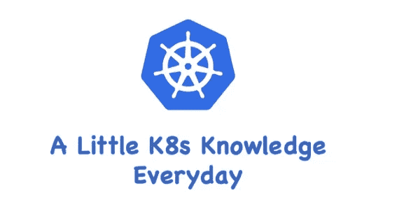
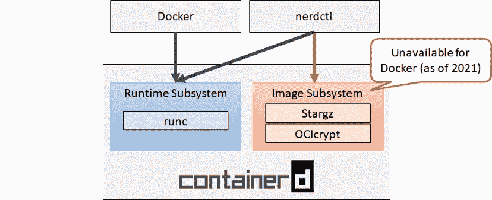

# K8s —为什么对 containerd 使用 nerdctl

> 原文：<https://blog.devgenius.io/k8s-why-use-nerdctl-for-containerd-f4ea49bcf900?source=collection_archive---------1----------------------->

## 什么是 nerdctl？



在我的 K8s 文章——《[为什么弃用 Docker](https://medium.com/nerd-for-tech/k8s-why-deprecating-docker-5d1eccde0775) 》中，我解释了为什么 K8s 从 v1.24 开始弃用`Docker`(准确的说是`dockershim`)，而`containerd`是新的默认容器运行时。因此，`Docker`命令行工具不再起作用，需要一个新的工具来进行容器级故障排除。

# 为什么 Docker CLI 不再工作？

`containerd`支持容器运行时级别的名称空间。这些名称空间与 K8s 名称空间完全不同。`containerd`名称空间用于隔离可能使用`containerd`的不同应用程序，如 docker、kubelet 等。下面是两个众所周知的名称空间。

*   K8s.io :包含 kubelet 从 CRI 插件启动的所有容器，与 Kubernetes 中的名称空间无关
*   **moby** :包含 docker 启动的所有容器

由于`containerd`允许不同的应用使用不同的名称空间，所以在直接与`containerd`交互时，必须提供`k8s.io`作为名称空间。所有启动的容器都被添加到`k8s.io`名称空间中。因此，CLI 无法再看到这些容器。

# 为什么不是 CTR？

`containerd`已经有了自己的名为`ctr`的 CLI，但是`ctr`仅用于测试目的，用于测试`containerd`的底层功能。`ctr`的设计不太用户友好，缺少很多`docker`的 CLI 特性，如`docker run`、`docker pull`、`docker logs`等。如果你看一下`ctr`的参数，你会发现它非常有限:

```
containerd CLI USAGE:
   ctr [global options] command [command options] [arguments...]VERSION:
   v1.6.8DESCRIPTION:ctr is an unsupported debug and administrative client for interacting
with the containerd daemon. Because it is unsupported, the commands,
options, and operations are not guaranteed to be backward compatible or
stable from release to release of the containerd project.COMMANDS:
   plugins, plugin            provides information about containerd plugins
   version                    print the client and server versions
   containers, c, container   manage containers
   content                    manage content
   events, event              display containerd events
   images, image, i           manage images
   leases                     manage leases
   namespaces, namespace, ns  manage namespaces
   pprof                      provide golang pprof outputs for containerd
   run                        run a container
   snapshots, snapshot        manage snapshots
   tasks, t, task             manage tasks
   install                    install a new package
   oci                        OCI tools
   shim                       interact with a shim directly
   help, h                    Shows a list of commands or help for one command
```

甚至在它的帮助手册中也提到“ **ctr 是一个不支持的调试和管理客户端，用于与 containerd 守护进程**交互”。所以不建议使用`ctr`作为生产`containerd`故障排除工具，除非真的不得已。

# 为什么不是克里特？

`crictl`是一个符合 CRI 接口规范的命令行工具，通常用于检查和管理 kubelet 节点上的容器运行时和映像。

一般来说，你[在主机](/install-k8s-v1-25-on-amazon-linux-2-e2a717444736)上安装 k8s 后，命令行会有`crictl`命令。而`ctr`与 k8s 无关，你可以在你的主机上安装好`containerd`服务后操作`ctr`命令。

与`ctr`相比，`crictl`肯定更好，但是它的功能和 UI/UX 有类似于`ctr`的限制。它与 Docker CLI 不兼容，对用户不友好，并且不支持非 CRI 功能。`critcl`的帮助手册如下:

```
NAME:
   crictl - client for CRIUSAGE:
   crictl [global options] command [command options] [arguments...]VERSION:
   v1.25.0COMMANDS:
   attach              Attach to a running container
   create              Create a new container
   exec                Run a command in a running container
   version             Display runtime version information
   images, image, img  List images
   inspect             Display the status of one or more containers
   inspecti            Return the status of one or more images
   imagefsinfo         Return image filesystem info
   inspectp            Display the status of one or more pods
   logs                Fetch the logs of a container
   port-forward        Forward local port to a pod
   ps                  List containers
   pull                Pull an image from a registry
   run                 Run a new container inside a sandbox
   runp                Run a new pod
   rm                  Remove one or more containers
   rmi                 Remove one or more images
   rmp                 Remove one or more pods
   pods                List pods
   start               Start one or more created containers
   info                Display information of the container runtime
   stop                Stop one or more running containers
   stopp               Stop one or more running pods
   update              Update one or more running containers
   config              Get and set crictl client configuration options
   stats               List container(s) resource usage statistics
   statsp              List pod resource usage statistics
   completion          Output shell completion code
   checkpoint          Checkpoint one or more running containers
   help, h             Shows a list of commands or help for one command
```

# 为什么选择 NERDCTL？

`nerdctl`是一个兼容 Docker 的 CLI，用于`containerd`。`nerdctl`的目标是方便试验`containerd`的尖端特性，这些特性在 Docker 中是没有的。这种特性包括但不限于延迟拉取(stargz)和图像加密(ocicrypt)。



图片来自[须田昭宏](https://miro.medium.com/max/828/1*LmweG-X0gfcWHjHJ-A-W3w.png)

快速浏览`nerdctl`帮助手册:

```
nerdctl is a command line interface for containerdConfig file ($NERDCTL_TOML): /etc/nerdctl/nerdctl.tomlUsage: nerdctl [flags]Management commands:
  apparmor   Manage AppArmor profiles
  builder    Manage builds
  container  Manage containers
  image      Manage images
  ipfs       Distributing images on IPFS
  namespace  Manage containerd namespaces
  network    Manage networks
  system     Manage containerd
  volume     Manage volumesCommands:
  build       Build an image from a Dockerfile. Needs buildkitd to be running.
  commit      Create a new image from a container's changes
  completion  Generate the autocompletion script for the specified shell
  compose     Compose
  cp          Copy files/folders between a running container and the local filesystem.
  create      Create a new container. Optionally specify "ipfs://" or "ipns://" scheme to pull image from IPFS.
  events      Get real time events from the server
  exec        Run a command in a running container
  help        Help about any command
  history     Show the history of an image
  images      List images
  info        Display system-wide information
  inspect     Return low-level information on objects.
  internal    DO NOT EXECUTE MANUALLY
  kill        Kill one or more running containers
  load        Load an image from a tar archive or STDIN
  login       Log in to a container registry
  logout      Log out from a container registry
  logs        Fetch the logs of a container. Currently, only containers created with `nerdctl run -d` are supported.
  pause       Pause all processes within one or more containers
  port        List port mappings or a specific mapping for the container
  ps          List containers
  pull        Pull an image from a registry. Optionally specify "ipfs://" or "ipns://" scheme to pull image from IPFS.
  push        Push an image or a repository to a registry. Optionally specify "ipfs://" or "ipns://" scheme to push image to IPFS.
  rename      rename a container
  restart     Restart one or more running containers
  rm          Remove one or more containers
  rmi         Remove one or more images
  run         Run a command in a new container. Optionally specify "ipfs://" or "ipns://" scheme to pull image from IPFS.
  save        Save one or more images to a tar archive (streamed to STDOUT by default)
  start       Start one or more running containers
  stats       Display a live stream of container(s) resource usage statistics.
  stop        Stop one or more running containers
  tag         Create a tag TARGET_IMAGE that refers to SOURCE_IMAGE
  top         Display the running processes of a container
  unpause     Unpause all processes within one or more containers
  update      Update one or more running containers
  version     Show the nerdctl version information
  wait        Block until one or more containers stop, then print their exit codes.
```

# 要安装 nerdctl:

你可以从 github repo 下载`nerdctl`二进制:[https://github.com/containerd/nerdctl/releases](https://github.com/containerd/nerdctl/releases)。但是，在开始使用它之前，应该满足以下先决条件:

*   `containerd`已安装并正在运行
*   `cni`为使用`nerdctl run`而安装的插件(https://github.com/containernetworking/plugins)
*   build kit(https://github . com/Moby/build kit):如果您想构建图像

```
*# Download binary*
$ wget https://github.com/containerd/nerdctl/releases/download/v1.0.0/nerdctl-1.0.0-linux-amd64.tar.gz*# Unzip*
$ mkdir nerdctl-source
$ mv nerdctl-1.0.0-linux-amd64.tar.gz nerdctl-source/
$ cd nerdctl-source
$ tar -xzvf nerdctl-1.0.0-linux-amd64.tar.gz
$ mv nerdctl /usr/local/bin
```

# 命令参考

下面列出了一些`docker`类似的命令参考，完整列表请访问[https://github.com/containerd/nerdctl.](https://github.com/containerd/nerdctl.)

*   **nerdctl run** :在新容器中运行命令
*   nerdctl exec :在运行容器中运行命令
*   创建一个新的容器
*   **nerdctl 日志**:获取容器日志
*   **nerdctl start** :启动一个或多个正在运行的容器。
*   **nerdctl stop** :停止一个或多个正在运行的容器。
*   **nerdctl 重启**:重启一个或多个正在运行的容器。
*   nerdctl rm/rmi :移除一个或多个容器/映像。
*   **nerdctl 容器清理**:移除所有停止的容器。
*   **nerdctl 构建**:从 Dockerfile 文件构建一个映像。
*   **nerdctl 拉/推**:从注册表中拉/推图像。