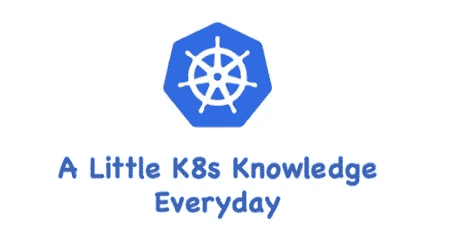

# K8s — YAML 格式

> 原文：<https://blog.devgenius.io/k8s-yaml-format-93a6ccbc691e?source=collection_archive---------2----------------------->

## 每天一点 K8s 知识！



要在 K8s 中处理对象，你需要很好地理解 YAML，无论是创建/更新/删除对象，你都需要编写一些 YAML 文件，而当你尝试使用`HELM`部署你的应用时，你还需要编写 YAML 文件，说实话，一个 K8s 工程师就是一个“YAML”工程师:)。

我们先简单了解一下 YAML 文件在 K8s 中的工作原理，然后使用 YAML 文件定义一个 K8s Pod 作为演示。

# YAML 基础知识

它的基本语法规则如下:

*   区分大小写
*   使用缩进来表示层次
*   缩进时不允许使用 Tab 键，只允许使用空格。
*   只要同一级别的元素左对齐，缩进的空格数并不重要
*   `#`表示注释，解析器从该字符开始忽略该注释，直到行尾。

在 K8s 上下文中，您只需要两种结构类型:

*   **列表**
*   **地图**

也就是说，你可能会遇到**地图列表**和**地图列表**等等。不过不用担心，只要你掌握了这两个结构，其他更复杂的我们就不讨论了。

# 地图

首先，让我们来看看地图。我们都知道地图是一本字典，是一对`key:value`。地图可以让我们更容易地编写配置信息，例如:

```
---
apiVersion: v1
kind: Pod
```

第一行`---`是分隔符，可选。在单个文件中，可以用三个连续的连字符`---`来区分多个文件。这里可以看到我们有两个键:`kind`和`apiVersion`，它们对应的值是:v1 和 Pod。如果上面的 YAML 文件被转换成 JSON 格式，它将看起来像:

```
{
    "apiVersion": "v1",
    "kind": "pod"
}
```

让我们创建一个相对复杂的 YAML 文件，创建一个对应于一个值的键不是一个字符串而是一个映射:

```
---
apiVersion: v1
kind: Pod
metadata:
  name: kube100-site
  labels:
    app: web
```

在上面的 YAML 文件中，`metadata`键对应的值是一个 Map，嵌套标签的键的值是一个 Map，你可以根据自己的情况进行多次嵌套。

我们在上面也提到了 YAML 文件的语法规则。YAML 处理器根据行缩进知道内容之间的关系。

例如，在我们上面的 YAML 文件中，**我使用了两个空格来缩进。空格数无所谓，但是你得一致，要求至少一个空格**(有些行不缩进两个空格，那就换成 4 个空格)。

我们可以看到名字和标签是同一级别的缩进，所以 YAML 处理器知道它们属于同一个地图，app 是标签的值因为 app 更缩进。

> *注意:不要在 YAML 文件中使用 tab 键。*

同样，我们可以将上面的 YAML 文件转换成一个 JSON 文件:

```
{
  "apiVersion": "v1",
  "kind": "Pod",
  "metadata": {
    "name": "kube100-site",
    "labels": {
      "app": "web"
    }
  }
}
```

也许你更熟悉上面的 JSON 文件，但你不得不承认 YAML 文件更有语义性？

# 列表

列表是一个列表，换句话说，是一个数组。在 YAML 文件中，我们可以这样定义它:

```
args
  - Cat
  - Dog
  - Fish
```

列表中可以有任意数量的项目，每个项目的定义都以破折号(-)开头，父元素可以直接缩进一个空格。对应的 JSON 格式如下:

```
{
    "args": ["Cat", "Dog", "Fish"]
}
```

当然 list 的孩子也可以是 map，map 的孩子也可以是 list，如下:

```
---
apiVersion: v1
kind: Pod
metadata:
  name: kube100-site
  labels:
    app: web
spec:
  containers:
    - name: front-end
      image: nginx
      ports:
        - containerPort: 80
    - name: flaskapp-demo
      image: jcdemo/flaskapp
      ports:
        - containerPort: 5000
```

例如，在这个 YAML 文件中，我们定义了一个名为容器的列表对象。每个子项由名称、图像和端口组成。每个端口都有一个映射，其关键字是 containerPort。同样，我们可以将其转换成以下 JSON 格式的文档:

```
{
    "apiVersion": "v1",
    "kind": "Pod",
    "metadata": {
        "name": "kube100-site",
        "labels": {
            "app": "web"
        }
    },
    "spec": {
        "containers": [{
            "name": "front-end",
            "image": "nginx",
            "ports": [{
                "containerPort": 80
            }]
        }, {
            "name": "flaskapp-demo",
            "image": "jcdemo/flaskapp",
            "ports": [{
                "containerPort": 5000
            }]
        }]
    }
}
```

# 演示

现在我们对 YAML 档案有了一个大致的了解，相信你应该不会像以前那样迷茫了吧？让我们使用 YAML 文件创建一个部署。

## 创建 Pod

```
---
apiVersion: v1
kind: Pod
metadata:
  name: kube100-site
  labels:
    app: web
spec:
  containers:
    - name: front-end
      image: nginx
      ports:
        - containerPort: 80
    - name: flaskapp-demo
      image: jcdemo/flaskapp
      ports:
        - containerPort: 5000
```

这是我们上面定义的一个普通的 POD 文件。让我们简单分析一下文件的内容:

*   **apiVersion:** 其中它的值是 v1，这个版本号需要根据我们安装的 K8s 版本和资源类型进行更改，记住不是硬编码的
*   **种类:**我们在这里创建一个 Pod。当然，根据你的实际情况，这里的资源类型可以是部署、作业、入口、服务等待。
*   **元数据:**包含我们定义的 Pod 的一些元信息，比如名称、命名空间、标签等等。
*   **spec:** 包括一些容器、存储、卷，或者 K8s 需要知道的其他参数，以及容器失效时是否重启容器等属性。您可以在特定的 Kubernetes API 中找到完整的 Kubernetes Pod 属性。

在理解了 pod 的定义之后，我们将上面创建的 POD 的 YAML 文件保存为 pod.yaml，然后使用 to `kubectl`来创建 POD:

```
$ kubectl create -f pod.yaml
pod "kube100-site" created
```

然后我们可以使用我们更熟悉的 kubectl 命令来查看 POD 的状态:

```
$ kubectl get pods
NAME           READY     STATUS    RESTARTS   AGE
kube100-site   2/2       Running   0          1m
```

至此，我们的 POD 已经成功创建。

至此，我们已经完成了使用 YAML 文件创建 K8s Pod 的过程。理解了 YAML 文件的基础之后，定义 YAML 文件实际上非常简单。最重要的是根据实际情况定义 YAML 文件，所以查一下 Kubernetes 文档。非常重要。

> 你可以用[http://www.yamllint.com/](http://www.yamllint.com/)来验证 YAML 文件的合法性。