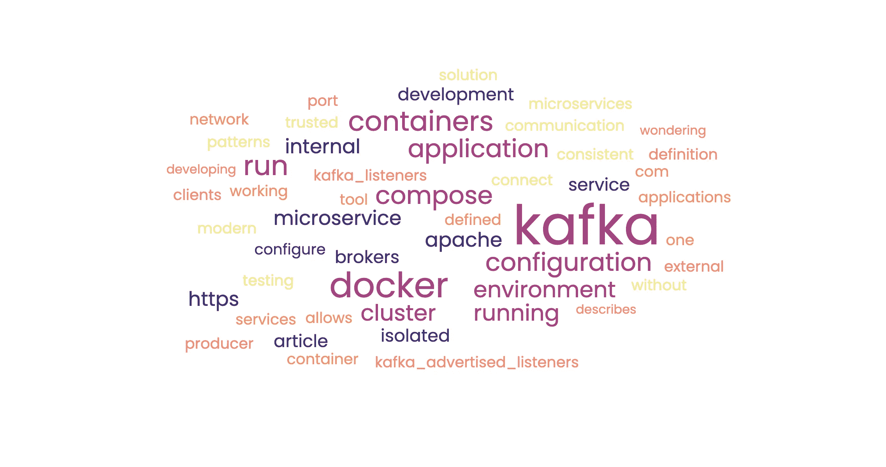

# Docker Compose 上的卡夫卡集群

> 原文：<https://blog.devgenius.io/kafka-cluster-on-docker-compose-dae9fcc8c092?source=collection_archive---------6----------------------->


照片由[杜凡](https://unsplash.com/@miinyui?utm_source=medium&utm_medium=referral)在 [Unsplash](https://unsplash.com?utm_source=medium&utm_medium=referral) 上拍摄

本文描述了如何在可信、一致和隔离的环境中配置和运行 Kafka 集群。如果您正在开发或测试一个微服务应用程序，并且想知道如何在没有任何依赖性的情况下运行它，那么这篇文章就是为您准备的。

**简介**

毫无疑问，微服务架构模式的使用正在快速增长。

采用这些模式带来了较小组件(微服务)之间有效通信通道的问题。

Apache Kafka 为微服务之间的通信提供了一个简单的解决方案，并且是现代应用程序架构的关键组件。在生产中，Apache Kafka 可以在您的本地环境中运行。

[](https://kafka.apache.org/quickstart) [## 阿帕奇卡夫卡

### Apache Kafka:分布式流媒体平台。

kafka.apache.org](https://kafka.apache.org/quickstart) 

或者您可以连接到云 Kafka 服务:

[](https://aws.amazon.com/msk/) [## 完全托管的阿帕奇卡夫卡-亚马逊 MSK -亚马逊网络服务

### Amazon Managed Streaming for Apache Kafka(MSK)消除了运营开销，包括资源调配…

aws.amazon.com](https://aws.amazon.com/msk/) 

为代码开发和单元测试提供一个可信的、一致的、隔离的环境是非常重要的。这种环境应该有在任何地方运行的好处。另一个优势是易于设置——它允许您立即开始项目工作。

集装箱化是实现机动性、可重复性、灵活性和模块化的有效方式。所有这些都促进了发展中的生产力。

Docker 容器作为隔离运行时环境的基础设施带来了巨大的改进。Docker 容器使得创建、部署和运行应用程序变得更加容易。

因此，作为一个开发环境选项，Apache Kafka 可以在容器中运行。已经有大量的操作指南。这里有一个我发现很有用的:[https://registry.hub.docker.com/r/wurstmeister/kafka#!](https://registry.hub.docker.com/r/wurstmeister/kafka#!)

现代微服务应用是服务的组合。下一步是考虑多个容器的编排和组织。我们应该能够定义和运行多容器 Docker 应用程序，包括应用程序微服务容器以及 Kafka 集群容器。



**解决方案**

Docker Compose 是一个工具，它可以让您根据定义的配置，用一个命令运行所有的服务。该工具允许您从同一个应用程序中同时管理多个容器。

**配置**

Docker Compose 创建了一个内部网络，容器使用它来相互通信。容器通过它们的服务名相互引用。例如，一个 Kafka 集群正在 Docker Compose 中的端口 9092 上运行。Kafka producer 应用程序(运行在同一个 Docker Compose 上)可以通过内部 Docker Compose 网络向 Kafka 集群发送消息到 host="kafka "和 port="9092 "。生产者的引导服务配置将被定义为“kafka:9092”

另一个必须完成的有意义的配置是为每种客户端类型(内部和外部)配置一个(至少)监听器:KAFKA_LISTENERS 和 KAFKA_ADVERTISED_LISTENERS。

使用这样的配置运行 Kafka 代理将允许内部和外部客户端访问 Kafka 代理。您应该配置这两个参数。

KAFKA _ LISTENERS—KAFKA 绑定到的接口的定义。

KAFKA_ADVERTISED_LISTENERS —客户端可以连接到的运行 KAFKA 代理的定义。

更详细的解释，可以看这篇[文章](https://www.confluent.io/blog/kafka-listeners-explained/)

[](https://www.confluent.io/blog/kafka-listeners-explained/) [## 卡夫卡听众-解释|汇合

### 您需要将 advertised.listeners(或者 KAFKA_ADVERTISED_LISTENERS，如果您使用 Docker 图像的话)设置为外部…

www.confluent.io](https://www.confluent.io/blog/kafka-listeners-explained/) 

这是一个 docker-compose。yml 文件工作示例:

```
version: '3'

services:

  zookeeper:

    image: 'bitnami/zookeeper:latest'

    ports:

      - '2181:2181'

    environment:

      - ALLOW_ANONYMOUS_LOGIN=yes

  kafka:

    image: 'bitnami/kafka:latest'

    environment:

      - KAFKA_BROKER_ID=1

      - KAFKA_ZOOKEEPER_CONNECT=zookeeper:2181

      - KAFKA_LISTENER_SECURITY_PROTOCOL_MAP=PLAINTEXT:PLAINTEXT

      - KAFKA_LISTENERS=PLAINTEXT://:9092

      - KAFKA_ADVERTISED_LISTENERS=PLAINTEXT://kafka:9092

      - ALLOW_PLAINTEXT_LISTENER=yes

  your-application:

    image: <YOUR APPLICATION IMAGE>

volumes:

  zookeeper_data:

    driver: local

  kafka_data:

    driver: local
```

**方案验证**

使用以下方式启动容器:

```
docker-compose up -d
```

您可以编写 Kafka 生产者和消费者应用程序，也可以运行以下脚本:

```
kafka-console-producer.sh — broker-list kafka:9092 — topic <topic name>kafka-console-consumer.sh — bootstrap-server kafka:9092 — topic <topic name> — from-beginning
```

本文将为您提供运行完全隔离的开发环境的足够知识。

快乐编码