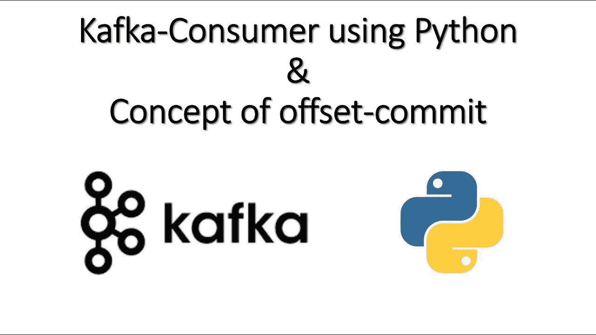
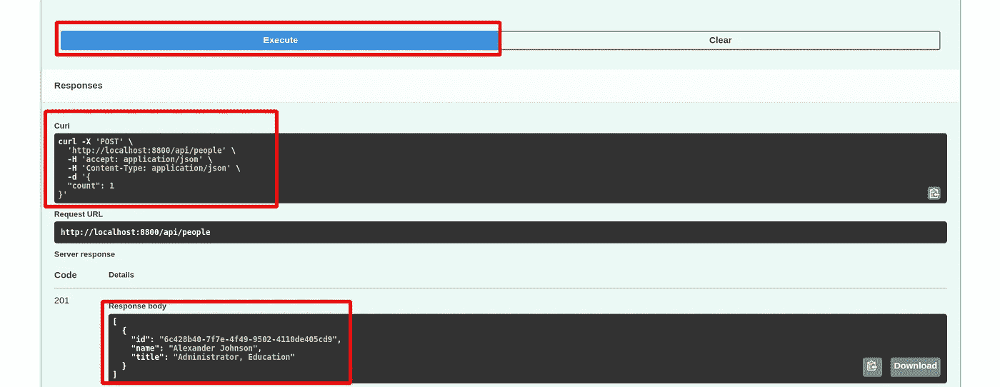
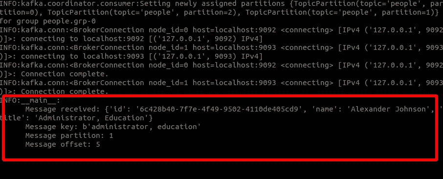

# 使用 Python 的卡夫卡消费者

> 原文：<https://blog.devgenius.io/kafka-consumers-with-python-76b495a053b4?source=collection_archive---------6----------------------->



# 使用 Python 的卡夫卡消费者

这是一个如何将 Kafka 消费者与 Python 结合使用的简单示例。

# 先决条件

1.  Kafka-installations-and-Kafka-topics:[https://medium . com/dev-genius/Kafka-installations-and-Kafka-topics-f0b7c 81754 D8](https://medium.com/dev-genius/kafka-installtions-and-kafka-topics-f0b7c81754d8)
2.  Kafka-with-python-fast-API:[https://medium . com/dev-genius/Kafka-with-python-fast-API-b 1622 EB 7 F9 d 0](https://medium.com/dev-genius/kafka-with-python-fast-api-b1622eb7f9d0)
3.  Kafka-with-python-Producer:[https://medium . com/dev-genius/producing-message-to-Kafka-using-CLI-6bd 22 fc 51 D5 c](https://medium.com/dev-genius/producing-message-to-kafka-using-cli-6bd22fc51d5c)

让我们首先启动 Zookeeper 和 Kafka 服务器。您可以使用以下命令来启动 Zookeeper 和 Kafka 服务器。

```
docker-compose up -d
```

# 查看主题列表

使用以下命令查看主题列表。如果你没有主题，那么你必须创造一个。

```
docker exec -it cli-tools kafka-topics --list --bootstrap-server broker0:29092,broker1:29093,broker2:29094
```

# 创建一个主题

使用以下命令创建一个主题。

```
docker exec -it cli-tools kafka-topics --create --topic people --bootstrap-server broker0:29092 --partitions 2
```

# 创建 Python 生成器

使用以下命令创建 python 生成器。

Kafka-with-python-Producer:[https://medium . com/dev-genius/producing-message-to-Kafka-using-CLI-6bd 22 fc 51 d5c](https://medium.com/dev-genius/producing-message-to-kafka-using-cli-6bd22fc51d5c)

[或者]用这个饭桶让卡夫卡制作人[https://github.com/SohaibAnwaar/Produce-Messages-To-Kafka](https://github.com/SohaibAnwaar/Produce-Messages-To-Kafka)

# 创建 Python 消费者

我们将编写一个 python 消费者来使用我们在上一步中创建的主题中的消息。

# 创造。环境文件

```
BOOTSTRAP_SERVER="localhost:9092"
TOPICS_PEOPLE_BASIC_NAME="people"
CONSUMER_GROUP="people.grp-0"
```

# 创建一个 python 文件

创建文件`consumer.py`

导入下列库

```
import logging
import os
import json
```

```
from dotenv import load_dotenv
from kafka.consumer import KafkaConsumerload_dotenv(verbose=True)
logging.basicConfig(level=logging.INFO)
logger = logging.getLogger(__name__)
```

创造一个消费者阶层

```
def main():
  print("Starting consumer", os.environ["BOOTSTRAP_SERVER"])
  consumer = KafkaConsumer( 
    bootstrap_servers=[os.environ["BOOTSTRAP_SERVER"]],
    auto_offset_reset="earliest",
    enable_auto_commit=True,
    group_id=os.environ["CONSUMER_GROUP"],
    key_deserializer=lambda x: json.loads(x.decode("utf-8")),
    value_deserializer=lambda x: json.loads(x.decode("utf-8"))
  )
```

```
 consumer.subscribe([os.environ["TOPICS_PEOPLE_BASIC_NAME"]]) for message in consumer:
    message = f"""
    Message received: {message.value}
    Message key: {message.key}
    Message partition: {message.partition}
    Message offset: {message.offset} """
    logger.info(message) passif __name__ == "__main__":
  main()
```

现在让我们使用下面的命令运行消费者。

```
python consumer.py
```

现在，您可以从生产者发送消息，并在消费者中查看消息。

# 从生成器生成消息

按照以下链接从生成器生成消息。[https://medium . com/dev-genius/producing-message-to-Kafka-using-CLI-6bd 22 fc 51 d5c](https://medium.com/dev-genius/producing-message-to-kafka-using-cli-6bd22fc51d5c)



# 来自消费者的消费信息



# 查看 GitHub 上的代码:

[https://github.com/SohaibAnwaar/Kafka-Consumer-Python](https://github.com/SohaibAnwaar/Kafka-Consumer-Python)

# 作者

*   索海卜·安瓦尔:[https://www.sohaibanwaar.com](https://www.sohaibanwaar.com/)
*   Gmail:[sohaibanwaar36@gmail.com](mailto:sohaibanwaar36@gmail.com)
*   LinkedIn: [在这里进行一些专业的谈话](https://www.linkedin.com/in/sohaib-anwaar-4b7ba1187/)
*   堆栈溢出:[来这里寻求我的帮助](https://stackoverflow.com/users/7959545/sohaib-anwaar)
*   卡格尔:[在这里查看我的杰作](https://www.kaggle.com/sohaibanwaar1203)
*   GitHub: [在这里查看我的代码](https://github.com/SohaibAnwaar)