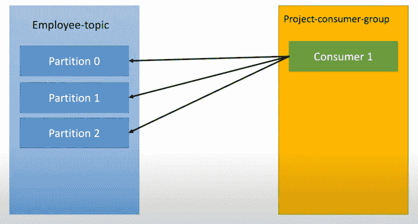
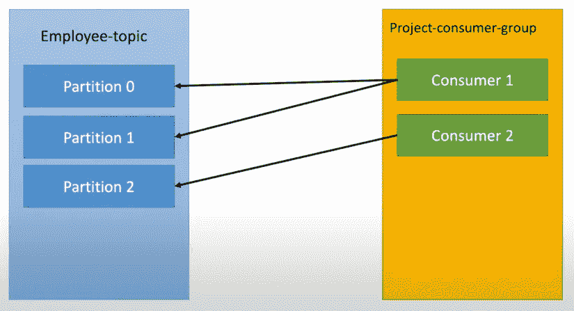
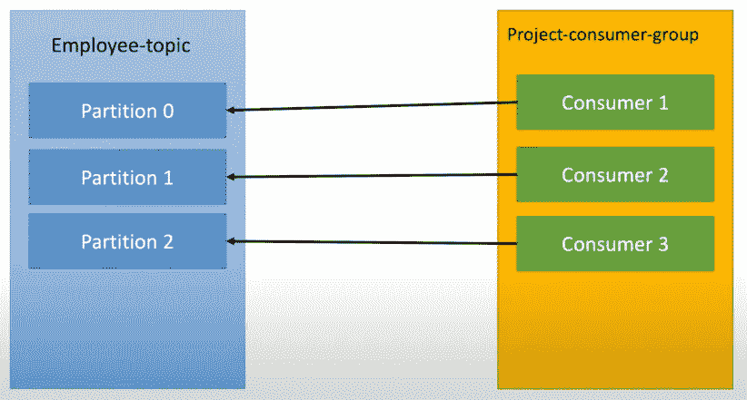
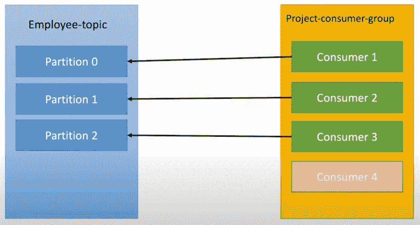
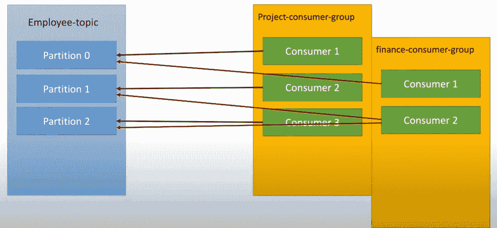

# 卡夫卡:你需要知道的一切

> 原文：<https://blog.devgenius.io/kafka-everything-you-need-to-know-4a29aeb4fb72?source=collection_archive---------0----------------------->

读者们好，

当我们在读学位课程时，我们学习数据结构的基本原理，如队列、列表、堆栈……我们也在学习这些结构之间的区别。当我们进入行业时，有像 Kafka、RabbitMQ、ActiveMQ 和 HiveMQ 消息代理这样的软件在工作。现在，我们正在尝试将您所学到的知识运用到该产品中。因此，我们没有获得该产品的全部信息。因为我知道如何使用这个产品。因为我们试图将我们的基本面映射到这些产品上。现在，当您扩展这个应用程序时，我们会遇到一个问题，因为您的主题或队列有多个使用者。现在我们有点麻烦了。

## 什么是消息代理？

消息代理(也称为集成代理或接口引擎)是一个中间计算机程序模块，它将消息从发送方的正式消息协议转换为接收方的正式消息协议。消息代理是电信或计算机网络中的元素，其中软件应用程序通过交换正式定义的消息进行通信。

## 卡夫卡是什么？

Kafka 比 RabbitMQ 这样的消息代理提供了更高的性能。它使用顺序磁盘 I/O 来提高性能，使其成为实现队列的合适选择。它可以用有限的资源实现高吞吐量(每秒数百万条消息)，这是大数据用例所必需的。

让我们考虑以下用例。

## 用例 01

在卡夫卡中，我们可以有一个主题和多个分区。上图，员工话题和 3 个分区。此外，我们还有一个作为单一消费者的项目消费者群体。这个消费者(消费者 1)从所有这 3 个分区获取消息。现在我们扩展应用程序。

## 用例 02

在用例 2 中，我们多添加了一个消费者。所发生的是消费者 1 监听分区 0 和 1。消费者 2 正在收听分区 2。但这完全是随机的，听众和主题是协调的。让我们再添加一个消费者。

## 用例 03

现在我们分别有 3 个分区和 3 个消费者。让我们再添加一个消费者，看看会发生什么。

## 用例 04

由于我们在主题中有 3 个分区，Kafka 不为消费者 4 发送消息。这意味着消费者 4 是空闲的。如果你增加更多的消费者，他们都会闲置。

> 卡夫卡规则:我们可以有最大数量的消费者在消费群中，消费者的数量取决于你拥有的最大数量的分区

让我们考虑一下，如果消费者 1 或消费者 2 崩溃，那么已经有一个消费者在运行，那么 Kafka 会立即转移到剩余的消费者。还有一个这样的用例。

## 用例 05

如果我们打开另一个消费群体同样的话题。第一个消费者组有 3 个消费者，第二个消费者组有 2 个消费者。所以每个消费者有每个分区。所以消费者如何知道我把信息带到哪里，所以卡夫卡支持保留。所以他们有一个机制叫做消费者抵消

## 什么是消费者抵消？

消费者偏移量是一种跟踪 Kafka 主题接收消息的顺序的方法。跟踪偏移量或位置对于几乎所有 Kafka 用例都很重要，并且在某些情况下可能是绝对必要的，例如金融服务。

根据用户偏移量，卡夫卡知道特定的用户需要分别去指定的分区。

> 规则:使用者组中的使用者数量应该等于或小于主题中的分区数量

参考:[https://youtu.be/wP-FMNuO3D0](https://youtu.be/wP-FMNuO3D0)