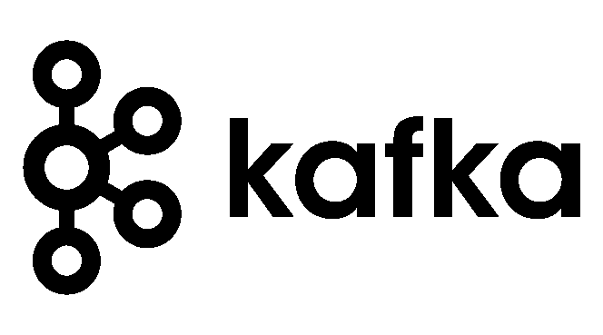

# 卡夫卡基础

> 原文：<https://blog.devgenius.io/kafka-fundamentals-91f4e2b4ca46?source=collection_archive---------2----------------------->

如果你从 Kafka 开始，并且想要一个简单的关于所有基本术语的综合指南，比如代理、分区、集群等等，那么你来对地方了。在从他们开始之前，我们先了解一下卡夫卡到底是什么？根据官方文件:

> Apache Kafka 是一个开源的分布式事件流平台，被数千家公司用于高性能数据管道、流分析、数据集成和任务关键型应用程序。

第一个问题是，在阅读这个重要的定义时，我们脑海中浮现的是，什么是事件流平台？嗯，我们所说的事件流是指与连接的数据库、移动设备或软件相关的任何事件都在 Apache Kafka 上流动，以供检索、操纵或处理。这里的事件可以是任何东西，从用户点击 DOM 元素，或者数据库中添加的条目，所有这些都被称为 Kafka 世界中的事件。唷！现在，我们对这个定义有了一点了解，让我们继续看一些在卡夫卡中常见的术语。

# **主题**

卡夫卡最常用的术语之一是主题，你很可能听说过卡夫卡，而不是主题。主题不过是相似事件的流。这里相似度是怎么定义的？这完全取决于主题创建者。假设您想将数据库中与订单表相关的所有数据放到一个名为“order”的主题中，很好，那么就这么做吧。主题被进一步划分为分区，这就引出了我们的下一个定义。

# 划分

主题被进一步划分为分区，分区实际上存储数据，即消息。在定义主题时，划分是一个不可或缺的属性。分区中的每条消息都有一个增量 id，称为偏移量。偏移量有助于 Kafka 保持消息在一个分区内的顺序，并且在用户或消费者想要检索任何以前的消息的情况下也是有帮助的。您可能会想到的一个问题是，由于一个主题中有许多分区，数据或消息应该放在哪个分区呢？好问题，默认情况下，在分区内存储数据遵循循环法，否则用户也可以定义一个键，使用下面的公式选择分区:
hash(key)% number _ of _ partitions
一旦分区被分配给具有定义的键的消息，该消息将总是被发送到该分区。

# **复制**

由于 Kafka 是一个分布式系统，很明显，分区将具有复制的特性，在机器停机的情况下，系统仍然工作。分区的复制因子取决于用户定义。假设我们有一个复制因子 2，那么分区 1 将有 2 个实例，让我们假设，副本 1 在代理 1 上，副本 2 在代理 2 上，然后，如果由于某些问题，代理 1 关闭，代理 2 上的副本 2 将仍然有数据，并能够为请求提供服务。

# **消费者和生产者**

顾名思义，生产者向卡夫卡主题提供数据，反过来，消费者从这些主题中进行阅读。卡夫卡最好的一点是消费者和生产者是分离的，也就是说，他们不知道彼此的存在，因此扩展我们的系统变得非常容易，也就是说，根据需要添加或删除消费者和生产者。如前所述，生成器生成的数据要到达的分区取决于 hash(key)%number_of_partition，如果没有指定，则采用循环法。
消费者可以一次读取任意数量的分区，保持分区内消息的顺序，而分区间消息的顺序并不固定。例如，如果分区 1 中的消息是‘hello’，‘world’，而分区 2 中的消息是‘welcome’，‘back’，从两个分区中读取的消费者将保持一个分区中的消息顺序，即‘hello’将总是在‘world’之前被读取，但是在分区 1 和 2 之间，消息检索可能是以‘hello’->‘welcome’->‘world’->‘back’，或‘hello’->，‘world’->‘welcome’->的格式进行的

# **消费群体**

我们在与消费者打交道时遇到的另一个常见术语是消费者群体。这是一个有点棘手的问题，至少对我来说是，但这是一个重要的问题。顾名思义一个消费群体就是一群消费者，但是它有什么特别之处呢？消费群体的需求是什么？
我们知道在一个主题中有分区，如果我们有一个消费者，来自所有分区的所有消息将由一个消费者消费，但是对于消费者组，消费者组中的每个消费者被分配一组主题中的分区，消费者从这些分区消费数据。但是谁来决定将哪个分区分配给一个消费者组中的哪个消费者呢？嗯，我们不需要担心这个，它已经被卡夫卡处理好了。

# **消费者补偿**

我们对消费者有了一些了解，消费者的另一个重要部分是我们经常遇到的消费者补偿。当消费者从一个主题中读取数据时，我们需要将信息存储在某个位置，该位置是它上次存储数据的位置，因为如果消费者死亡会发生什么，我们将不得不从头再次读取数据，从而产生大量开销，这就是消费者补偿充当救世主的地方。Kafka 将与消费者相关的补偿存储在一个名为 __consumer_offsets 的主题中，因此当从一个主题开始消费时，消费者将知道从哪里开始。随着消费者消费数据，偏移量将不断增加，但是消费者何时存储偏移量呢？收到一条消息，十条消息，还是什么时候？让我们在下一个主题中更深入地探讨可用的选项。(:p)。有三种消费者交付语义——最多一次、至少一次和恰好一次。

# **券商**

我们谈过话题，但是这些话题存在于哪里呢？它们是存在于太空中的外星实体，还是存在于类似云的云存储中？:p 好吧，分区存在于一个代理中。是的，你没看错，分区不是主题。一个主题的不同部分可能存在于不同的代理上，所以说主题存在于一个代理中可能会引起误解。代理可以被视为类似于服务器。每个代理都有一些本地存储来保存他们正在存储的数据，一组代理组成一个 Kafka 集群。当您连接到 Kafka world 中的一个代理时，您实际上不是连接到一个单独的代理，而是连接到整个相关的集群。

# **动物园管理员**

动物园管理员管理经纪人。它有助于经纪人的领先选举，并在出现任何变化(如添加/删除主题、经纪人宕机等)时向 Kafka 发送通知。它与经纪人、消费者和生产者完全隔离。它还遵循领导者和跟随者机制，其中写操作由领导者处理，读操作由跟随者处理。

# **数据保持**

写入卡夫卡主题的信息是不可变的，也就是说，它们不能被改变，但是它们有一个保留期，因为说实话，你不能永远保存数据，对吧！。Kafka 中的数据默认只保留一周，尽管可以在主题级别或代理级别进行更改。消息的保留期完全取决于用例或业务需求。

希望这篇文章对你有帮助，如果你开心，别忘了拍手:p。