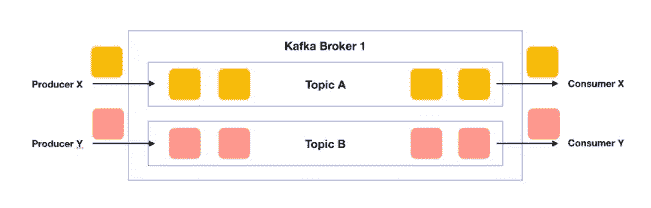
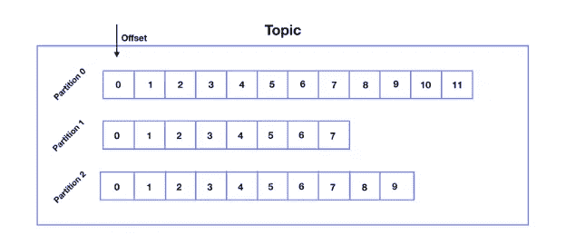
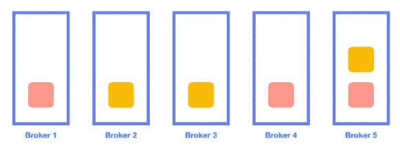
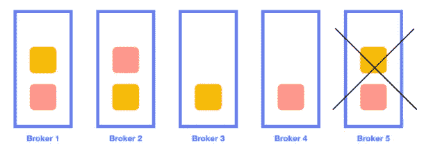
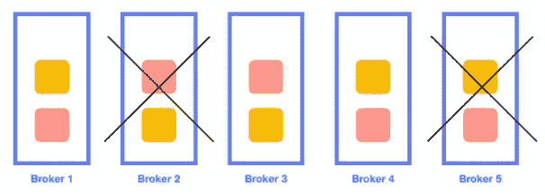
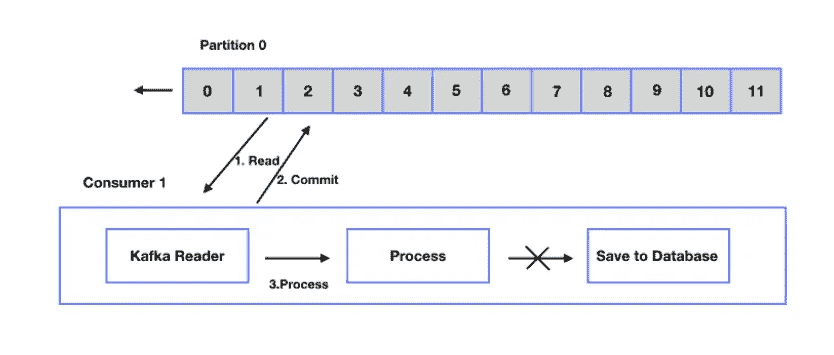
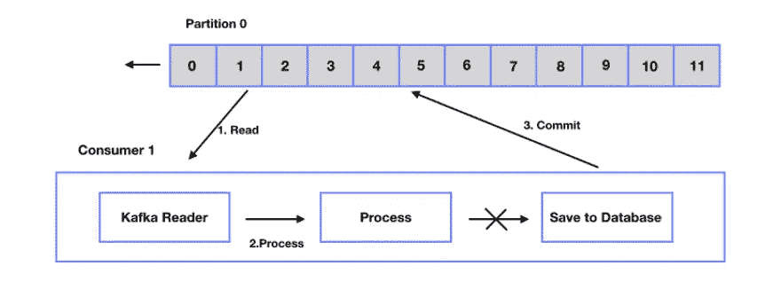
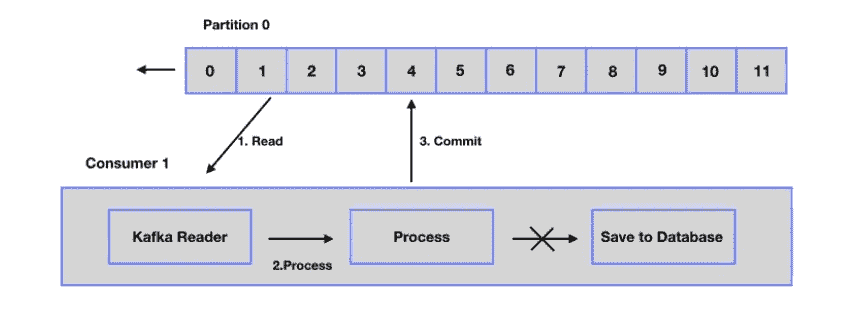

# 卡夫卡指南:第一部分

> 原文：<https://blog.devgenius.io/kafka-guide-part1-85d8426e3004?source=collection_archive---------9----------------------->

Kafka 是作为 LinkedIn 实时处理大量数据的低延迟问题的解决方案开发的，然后作为开源继续开发。这是一个具有发布/订阅结构的消息传递系统。在这些系统中，消息被发送到一个主题，消费者通过订阅一个或多个主题来接收消息。这里聪明的是消费者。

## 为什么是卡夫卡？

*   **可伸缩性**:可以使用多个生产者。它可以轻松扩展，无需停机。
*   **可靠性** : Kafka 可用于分布式、复制和分区。多个消费者可以同时并行读取。
*   **持久性** : Kafka 使用分布式提交日志。有基于磁盘的保留。数据尽可能快地写入磁盘。
*   **高性能**

## 用例

*   信息发送
*   网站活动跟踪
*   韵律学
*   日志聚合
*   流处理
*   活动采购
*   提交日志

## **消息代理 vs 发布/订阅(Pub/Sub)消息系统**

消息代理通过某种协议在应用程序之间提供通信和信息交换，而不管它们是用什么语言编写的。验证、路由和转发给特定的收件人。

另一方面，发布/订阅系统允许制作者按照他们的意愿发布每条消息。它在发布者和消费者之间提供了一对多的关系。

像 RabbitMQ 这样的消息代理是聪明的代理-愚蠢的消费者，而 Kafka 有愚蠢的代理-聪明的消费者逻辑。

## 基础



*   **经纪人**:这些是我们发送给 Kafka 的数据存储和处理的服务器。数据存储在硬盘上。集群由多个相互协作的代理组成。
*   **话题和分区**:经纪人包含话题，话题包含分区。我们写数据的地方实际上是分区。
*   **生产者**:向卡夫卡发送数据。
*   **消费者**:从 Kafka 读取数据。
*   **Zookeeper** :是 Kafka 用来管理经纪人的开源软件。他们负责协调代理，选择领导者分区，注意坏的和新的代理。2.8.0 版本之后，卡夫卡变成了 zookeeperless。

## 我们为什么要创建分区？



*   根据所确定的特征收集生产者的数据(集合)
*   数据的顺序收集(排序-事件源)
*   读取速度更快(并行)
*   更高效地存储数据(效率)

> ！！！Kafka 在同一个分区中写入相同的键值

## 分身术

为了进行健康的复制，代理应该由单数组成(例如 3、5、7)。



让我们考虑一个复制因子= 3 的系统



考虑到代理 5 已经崩溃，这里保存的数据可以转移到代理 1 和代理 2。



如果代理 2 崩溃，这些数据也可以传输到代理 3 和代理 4。如果代理 3 崩溃，系统将失败。因为我们没有任何可以达到复制数量的代理。在这种情况下；

> 代理> =复制因子

每个分区的一个复制副本被指定为领导者。并且数据总是首先被写入这个主分区。主分区还将此数据发送并同步到其他副本。如果由于某种原因，主分区崩溃，Kafka 会立即选择一个新分区作为主分区。

## 生产者确认

当我们向 Kafka 发送数据时，我们指定应该完成发送数据、将数据写入主分区和备份数据以进行复制的哪些阶段。这叫做承认。

*   ack = 0->它作为发送到 Kafka 并继续而不等待回复。这是最快也是最危险的方法，丢失消息的风险很高。
*   acks=1 ->发给卡夫卡，等到写好领导就行了。速度适中且安全，几乎没有丢失消息的风险。
*   acks = all，-1 ->发送给 Kafka，等它写到首领，等首领写到其他分区。最慢最安全，没有信息丢失的风险。

## 消息传递语义

*   **最多一次**



我们阅读了该消息，并在阅读后立即提交。然后，我们将此消息发送给 process。但是在处理过程中，出现了一个问题，我们的消费者崩溃了。由于我们再次运行消费者，我们继续下一个消息。所以我们读到的第一条信息现在丢失了。因为我们一读就犯了。

*   **至少一次**



我们读取消息，调用流程并执行操作。最后，我们将它保存到数据库，并在这里提交。通过这种方式，我们可以确保处理的消息没有错误。如果在处理过程中出现错误，读取器将在重新启动时读取相同的消息。(最优选的方法)

*   **正好一次**



我们阅读消息，并在阅读后立即启动事务。交易执行一次，不重复。即使消息没有了，它也没有丢失，因为它仍然在这个事务中。应该在真正必要的时候使用它，因为它会影响性能。

## 消费者群体

消费者总是存在于一个消费群体中，并给自己起了一定的名字。所以卡夫卡知道是哪个读者，知道它的偏移位置。

> ！！！如果是单个消费者，可以同时读取所有分区，但是这样效率不是很高。Kafka 识别并随着消费者的添加自动分配。只有一个同名的使用者可以读取分区。所以消费者太多，就被动等待。如果其中一个用户崩溃，这个被动的用户会立即变为主动用户。如果我添加一个不同的消费者组，他们也可以从相同的分区中读取数据，并且不会因为名字不同而相互混淆。

## 从 Kafka 删除数据

**基于时间的保留**

*   基于时间—表示在特定时间段内删除数据。标准是 7 天，可以改。
*   基于数据大小—确保数据在达到一定大小时得到清理。(100GB 等。)

**主题压缩:基于关键字的保留**

```
cleanup.policy: compact
```

*   Kafka 主题可以使用压缩清理策略进行配置。这告诉卡夫卡用同一个密钥删除旧消息。
*   必须是同一个分区。即使同一主题有不同的分区，记录也不会被删除。
*   日志压缩不是即时的，它取决于主题设置、大小和处理能力。

## 参考

*   【https://kafka.apache.org/documentation/ 
*   [https://www.confluent.io/blog](https://www.confluent.io/blog)
*   卡夫卡:权威指南——尼哈·纳克希德
*   巴尔·德雷——卡夫卡·埃蒂米(YouTube)
*   [https://www.tutorialspoint.com/apache_kafka](https://www.tutorialspoint.com/apache_kafka)