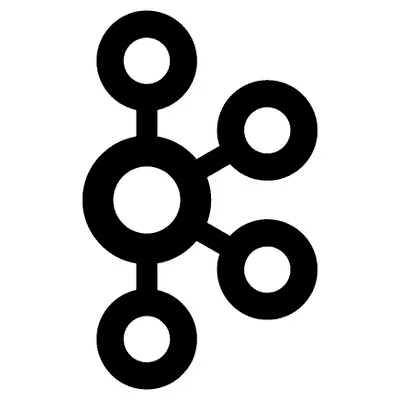
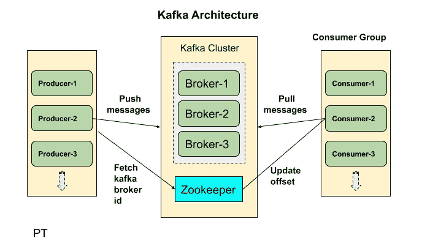
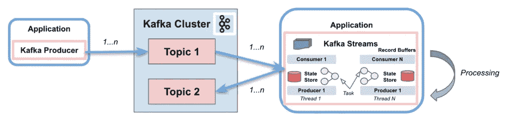
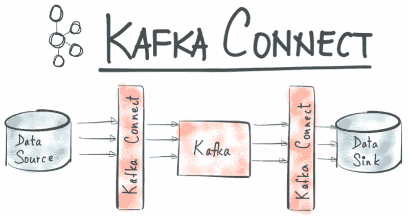
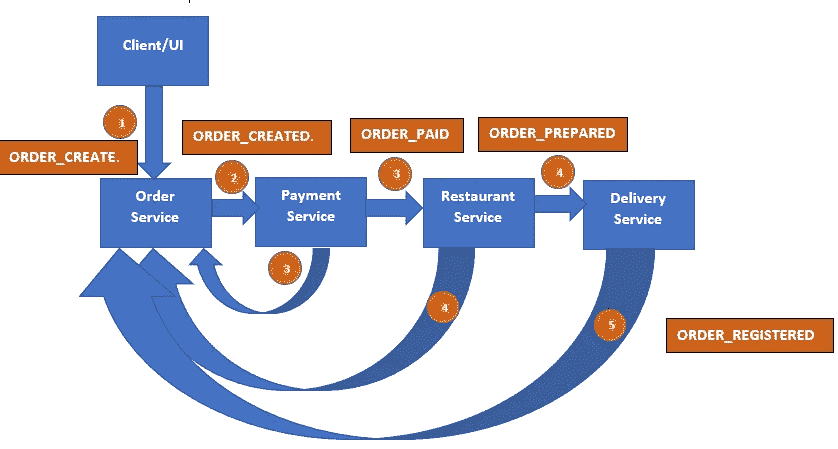
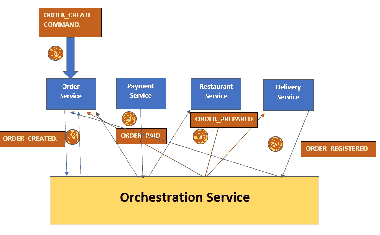

# 《果壳中的卡夫卡》

> 原文：<https://blog.devgenius.io/kafka-in-a-nutshell-8c597d5c9463?source=collection_archive---------5----------------------->

在这个故事中，我将解释什么是**卡夫卡**、**卡夫卡流**和**卡夫卡连接**以及何时使用每一个。

**卡夫卡**

是一个后端应用程序，通过向 Kafka broker 上的主题发送/流式传输消息，提供了一种在应用程序之间共享事件流的方式。

卡夫卡

**卡夫卡溪流**

是用于构建应用程序和微服务的客户端库。它使得从一个 Kafka 主题转换或过滤数据并将其发布到另一个 Kafka 主题变得更加容易。

卡夫卡溪流

**卡夫卡连接**

Kafka Connect 是一个工具，用于在 Apache Kafka 和其他数据系统之间可伸缩和可靠地传输数据。它使得快速定义将大型数据集移入和移出 Kafka 的连接器变得简单。

卡夫卡连接

现在，如果您有一个用例，您希望不经过任何处理就发布和消费，那么您可以将 Kafka 的基本功能用于生产者和消费者。但是如果您的用例需要一些数据转换和复杂的处理，您可能需要流，并且您可以在合流包中用 KSQL 创建流。如果您的用例是同步两个数据库或从源读取并写入目标，那么 Kafka connect 就是您的解决方案。它支持许多源和目标，如 Mysql、SqlServer、postgres、http 等。

**奖金$ $
Kafka 事件驱动架构**

首先，你需要知道 EDA 是一个可以在各种技术中实现的概念，但是为了卡夫卡，我们将使用卡夫卡来完成它。EDA 是一种处理用户发生的事件以及应用程序如何与这些事件交互的方式。它主要用于实时系统中，当数据变化和事件实时发生时，实时系统对其做出响应。

事件可以是用户生成的任何东西，可以是鼠标点击，也可以是键盘上的按键。

当您想要管理响应事件的不同系统，而不必为每个使用者编写自定义代码时，可以使用它。

**事件驱动架构的模式**

1.  冒险故事

在《传奇》中有两种类型:编舞和表演。这里的想法是建立序列事务，提供更大和更高的业务目的来管理跨微服务的数据，然后我们将这些事务链接在一起。每个事务更新数据库并发布一个事件来触发下一个事务。如果交易失败，saga 将运行补偿逻辑，返回并撤销该影响或失败。它们都是这样做的，但是在 orchestration 中有一个 orchestration 服务来管理事件发布。

传奇编舞

Saga orcherstration

2.指挥和查询责任分离(CQRS)

您将应用程序分为两个部分，写和读。它可以连接不同实体的数据片段。

3.活动采购

是一种在一系列事件之后处理数据的方法。这些事件存储充当数据状态变化的历史记录，并通知消费者处理它们。

4.发布-订阅者

应用程序将向对更新感兴趣的消费者发送消息事件。发送方将向输入通道输入一条消息，并将其传递给消费者。消息代理负责复制来自发布者的每条消息，并将其发送给所有订阅者。

**Spring Boot 应用实例**

以下是在业务中使用卡夫卡的回购协议列表:

 [## 喇嘛大师档案/预约

### GitLab.com

gitlab.com](https://gitlab.com/lamoboos223/appointments-booking/-/tree/master)  [## GitHub-lamo boos 223/土地费

### 此时您不能执行该操作。您已使用另一个标签页或窗口登录。您已在另一个选项卡中注销，或者…

github.com](https://github.com/lamoboos223/Land-Fees) 

**参考文献**

 [## Apache Kafka:事件驱动架构和流| Upsolver

### 现在开发软件时使用事件驱动的方法，它也用于实时应用程序，因为它提高了软件开发的效率

www.upsolver.com](https://www.upsolver.com/blog/apache-kafka-event-driven-architecture-streaming)