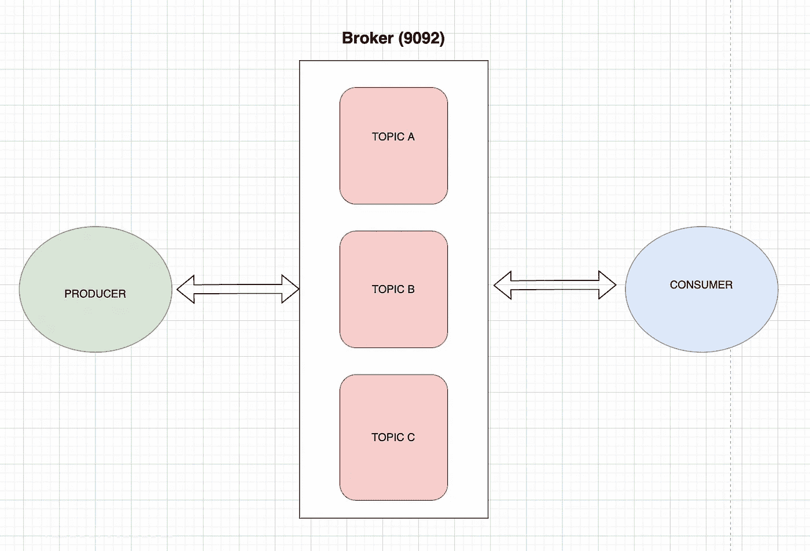
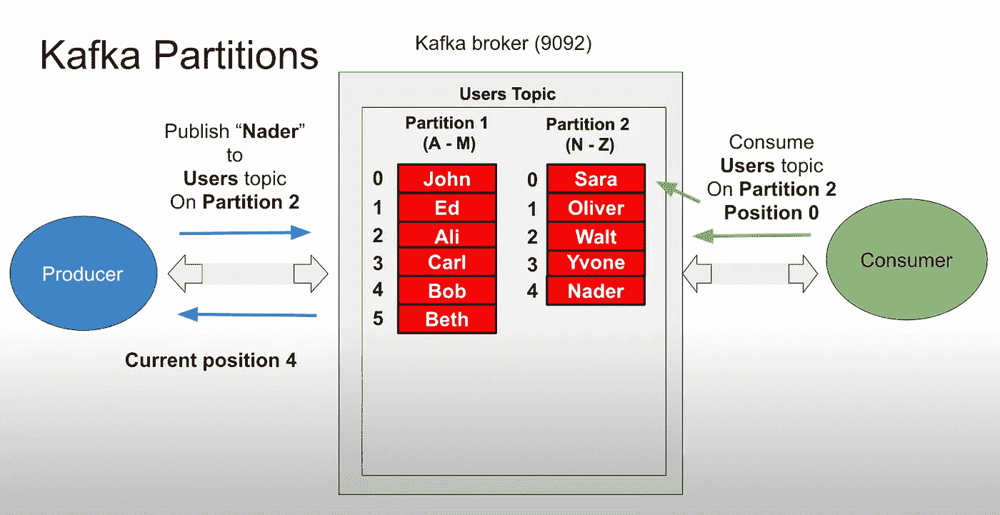
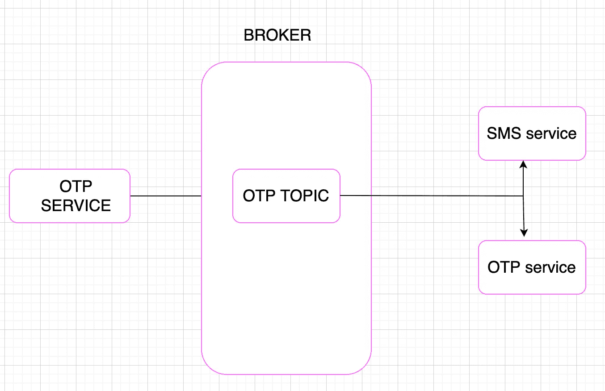
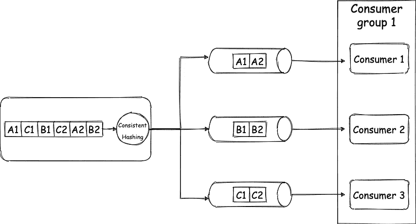
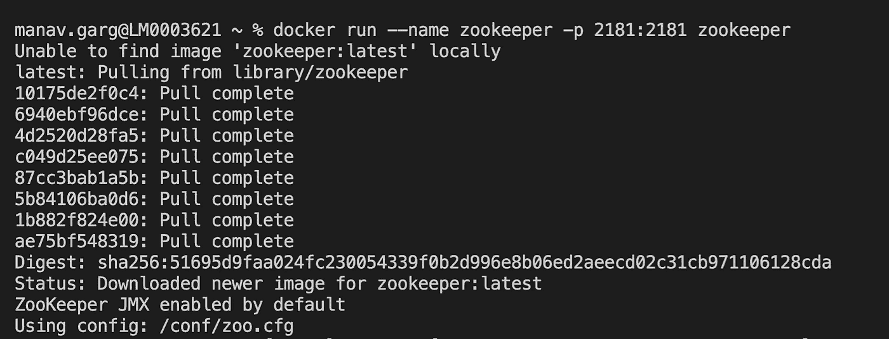

# 卡夫卡在行动:卡夫卡入门实用指南

> 原文：<https://blog.devgenius.io/kafka-in-action-a-practical-guide-to-getting-started-with-kafka-7be5074a30c2?source=collection_archive---------1----------------------->

卡夫卡到底是什么？在过去的一周里，这个问题一直困扰着我，我想我现在已经有足够的知识来写这个神奇的技术了。因此，在这篇博客中，我将分别讨论不同的 **Kafka 组件**，带领我们进入 ***代码演练*** ，最后是它的利弊&。分开理解每一个组件是很重要的，因为我试图把它们放在一起理解，但后来变得混乱了。

要理解任何技术，我们必须理解它为什么被创造/发明。Apache Kafka 最初是在 2010 年由 LinkedIn 开发的，作为处理大容量、高吞吐量、实时数据馈送的一种方式。LinkedIn 正在寻找一种方法来处理其平台上的大量活动，包括用户更新、关系更新和其他需要实时处理的数据。这些活动可以归类为事件，对吗？一个事件可以被称为某件事情发生的时间指示。将事件存储在数据库中有点麻烦，因为数据库不能很好地适应日志。Kafka 是管理这些日志的一种方式。在其中，这些事件被称为主题，它们可以存储很短的一段时间，也可以存储很长的一段时间。主题只是持久存储的事件的有序集合。早期的趋势是使用单一架构来构建服务，但现在开发人员更喜欢**微服务**架构，因此当这些独立的服务需要通信时，Kafka 非常方便。它是一个消息代理，允许生产者将消息发送到中央服务器，以高度分布式和容错的方式存储它们。然后，消费者可以检索消息并实时处理它们。
下面我们会详细了解这一点。

## KAFKA 组件

a)**Kafka Broker:**Kafka Broker 是用户与之交互的第一个服务器。因为它是一个服务器，所以它有一个暴露的端口(默认为 9092)并接受 TCP 连接。卡夫卡中本质上有两组抽象，一组是生产者和消费者，第二组是 TCP 连接。生产者是生产和发布内容给代理和消费它的消费者的人。谈到连接，它们是双向 TCP 连接，因为生产者可以向代理发送内容，也可以从代理接收内容。



卡夫卡

b) **Kafka Topic:** 顾名思义，Topic 就是 Kafka 流中消息(数据)的逻辑划分，数据相同。当生产者写时，它需要指定它想要写到哪个主题，当消费者消费时，它需要指定它想要从哪个主题接收/消费。

c) **分区:**接下来，我们放大看一个题目内部。生产者在一个主题内推送数据，但是它有一个限制，对吗？这是数据库中的一个类似场景；我们对单台服务器可以容纳的数据量有限制。我们最初通过垂直扩展或添加存储来解决这一问题。然而，众所周知，垂直扩展是有限制的。一旦达到这一点，我们必须进行水平扩展，这需要添加更多的节点，并在节点之间划分数据。卡夫卡中这种类似的概念叫做分区。



截图来自侯赛因·纳赛尔的博客

所以在引入分区的时候，如图所示，制作者需要得到要写到哪个主题，写到哪个分区。消费者也是如此；它还需要知道从哪个分区读取。如图所示，如果生产者想要将“Nader”添加到主题“Users”中，它需要使用任何用于创建分区的算法(通常是[一致散列](https://www.toptal.com/big-data/consistent-hashing#:~:text=according%20to%20Wikipedia).-,Consistent%20Hashing%20is%20a%20distributed%20hashing%20scheme%20that%20operates%20independently,without%20affecting%20the%20overall%20system.))并找到正确的分区。因为它找到了正确的“主题”，所以它返回它被添加到生成器的位置。
一个客户订购他们从分区读取的消息。因此，如果将数字 1、2、3 和 4 添加到主题中，消费者仍然会这样理解。每条消息都有一个偏移量，因此一旦消费者阅读了一条消息，它会将偏移量放在 Kafka 上，以表明这是消费者阅读的最新消息。因此，如果消费者节点出现故障，它可以从上次读取后停止的地方重新启动。此外，如果消费者以后需要查看更早的消息，他们可以总是改变偏移位置。

d) **消费群:**消费群是为了从不同分区消费，实现并行而发明的。这可能会令人困惑，所以让我们理解这样做的必要性。

为此，我们需要理解消息队列和发布-订阅(pub-sub)系统的概念。简而言之，如果我说，消息队列是一个消息被发布一次并被消费一次的队列。这样做，我们希望确保工作只执行一次。在发布/订阅的情况下，一条消息可以发布一次，但会被多次使用。**简而言之，我们希望我们所有的消费(订阅)应用程序都能得到*至少一份*我们的发布者发布到交易所的消息的副本。**要了解消息队列和 pub/sub，请阅读本博客:[**链接**](https://www.baeldung.com/pub-sub-vs-message-queues) **。回来后，卡夫卡试图解决同时获得消息队列和发布/订阅的问题。消费群体的概念回答了这个话题的答案。**

这里有几个有趣的概念:

1.  **扇出交换**:这些交换提供了典型的发布-订阅拓扑。发送到扇出交换机的消息将被广播到绑定到该交换机的所有队列和交换机。
    假设您正在开发一个 OTP 服务。您现在必须通过电子邮件和短信发送动态口令。因此，您的动态口令服务可能会将动态口令存储在 Kafka 中，之后，您的短信服务和电子邮件服务用户可以接收消息并根据需要发送短信和电子邮件。



2.**顺序保证:**既然一个主题可以被分割，多个消费者可以从同一个主题消费，那么你如何在消费者端维护消息的顺序呢，有人可能会问。好问题。多个使用者不能读取同一个使用者组中的一个分区。消费者群体使这成为可能；只有一个使用者可以从一个分区中读取数据。我从一篇 [hackernoon](https://hackernoon.com/) 文章中得到以下解释，我将在下面列出。



[https://miro . medium . com/max/1400/1 * qt5 _ 0 yd9 tsmld 3 rywhivra . webp](https://miro.medium.com/max/1400/1*qt5_0YD9TSMLd3RywhivrA.webp)

> 所以你的制作人制作了 6 条信息。每个消息都是一个键-值对，对于键“A”的值是“1”，对于“C”的值是“1”，对于“B”的值是“1”，对于“C”的值是“2”…..“B”值为“2”。(请注意，我所说的键是指我们前面讨论过的消息键，而不是 JSON 或 Map 键)。我们的主题有 3 个分区，并且由于具有相同密钥的一致散列消息总是到达相同的分区，所以所有具有“A”作为密钥的消息将被分组，并且对于 B 和 c 也是如此。现在，由于每个分区只有一个消费者，所以它们只按顺序获得消息。因此，消费者将在 A2 之前收到 A1，在 B2 之前收到 B1，因此订单得以维持，tada🎉。回到我们的日志记录系统示例，关键字是源节点 ID，那么 node1 的所有日志将总是进入同一个分区。由于消息总是进入同一个分区，我们将保持消息的顺序。
> 
> 如果同一个分区在同一个组中有多个用户，这是不可能的。如果您在不同组中的不同消费者中读取相同的分区，那么对于每个消费者组来说，消息也将以 ***排序*** 。
> 
> 因此，对于 3 个分区，您最多可以有 3 个消费者，如果您有 4 个消费者，其中一个消费者将处于闲置状态。但是对于 3 个分区，您可以有 2 个消费者，那么一个消费者将从一个分区读取，一个消费者将从两个分区读取。在这种情况下，如果一个使用者停止工作，最后一个幸存的使用者将从所有三个分区中读取数据，当新的使用者被添加回来时，分区将再次在使用者之间拆分，这称为重新平衡。


> 此图描述了分区的概念，其中一个主题有 4 个分区，所有分区保存不同的数据集。您在这里看到的块是该分区中的不同消息。让我们假设主题是一个数组，现在由于内存限制，我们将单个数组分成 4 个不同的更小的数组。当我们向一个主题写入一条新消息时，相关的分区被选中，然后该消息被添加到数组的末尾。
> 
> 消息的偏移量是该消息在数组中的索引。该图中块上的数字表示**偏移量，**第一块在第 0 偏移量，最后一块在第(n-1)偏移量。系统的性能还取决于您设置分区的方式，我们将在本文的后面对此进行探讨。(请注意，在 Kafka 上，它不是一个实际的数组，而是一个符号数组)

因此，卡夫卡满足了我们两个重要的需求。因此，如果我们希望它像一个消息队列一样，将所有的消费者放在一个组中，他们将消费一条消息并继续前进。如果需求是一个发布/订阅系统，那么将所有想要从同一分区消费的消费者放在不同的组中。这是因为，如上所述，一个分区只能由一个组中的一个消费者使用，但是如果两个消费者是不同的组，他们可以从同一个分区使用。因此，分区是组相关的。那么我们得到了什么结果呢？我们得到并行处理。

**分布式系统(Kafka cluster)** 好了，这是最后一件事，Kafka 是分布式系统。通过这种方式，它遵循某种架构(如主从式或主从式)来提供高可用性和容错能力。它也被称为**集群，即**一群在一起工作的经纪人。集群中的一个代理充当控制器，它基本上为代理分配分区，并监视代理是否未能完成某些管理工作。在卡夫卡那里，有一个领导者，它有追随者，这些追随者拥有与领导者基本相同的数据。所有的数据写入都由领导者完成，并传播给追随者以保持一致性。在卡夫卡那里，还有一个多重领导者的概念，对于一个主题中的一个部分，一个经纪人是领导者，而对于另一个，另一个经纪人是领导者。这很好，因为能够在分区级别进行分发。

> 所以主要问题是生产者如何知道哪一个是领导者。动物园管理员来了。即使我们想与经纪人合作，没有动物园管理员，卡夫卡也无法发挥作用。Zookeeper 是 Kafka 的核心配置和共识管理系统。它跟踪代理、主题、分区分配、领导者选举，基本上是关于集群的所有元数据。

现在我们来看一个例子。下面是我们将要做的:
a)启动一个 zookeeper
b)启动一个 Kafka 集群(来自 docker)
c)在 nodejs (Kafkajs 库)中创建一个主题
d)创建一个生产者(nodejs)和消费者(nodejs)

> 如果以下内容对您不适用，关于使用 docker-compose 文件的另一个工作示例，请访问 Kafkajs 的官方文档:[https://kafka.js.org/docs/running-kafka-in-development](https://kafka.js.org/docs/running-kafka-in-development)
> 
> 开始前你需要有一个码头工人。[安装](https://docs.docker.com/get-docker/)以防你没有。

a)启动 zookeeper:在终端中编写以下命令，它将安装并运行 Zookeeper。在这里，我将我的端口 2181 映射到 zookeeper 的默认端口。



b)构建一个 Kafka 集群:我不会出于演示目的使用多个 Kafka 代理。所以下面是运行 Kafka 集群的命令；很可怕，不是吗？让我们了解一下它们各自的含义。

```
docker run -p 9092:9092 --name kafka -e
 KAFKA_ZOOKEEPER_CONNECT=manavgarg:2181 -e
 KAFKA_ADVERTISED_LISTENERS=PLAINTEXT://manavgarg:9092 -e
 KAFKA_OFFSETS_TOPIC_REPLICATION_FACTOR=1 -d confluentinc/cp-kafka
```

**第 1 行**，我们明白；它只是将我的端口 9092 映射到 Kafka 的默认端口 9092。从第 2 行开始，我们从环境变量(-e)开始。
**第二行**:它需要一个 zookeeper 实例，所以命令必须指定它运行的端口。在我们的例子中，它在同一台机器上；因此提供了系统的名称。
**第 3 行:**我们需要指定监听器，因为可以有多个。此外，我们需要指定连接器将使用的协议。我们有明文和 SSL，用于加密通信。我们将使用明文，并只指定一个监听端口。 **第 4 行:** Zookeeper，默认情况下，假设我们有三个实例，但是因为我们只有一个代理，所以我们需要指定。 **第 5 行:**最后，我们提供图像名称。

c)让我们创建我们的第一个主题:
首先，在一个新文件夹中，我们创建一个新的 nodejs 项目。运行“npm init -y”并安装 kafkajs (npm install kafkajs)后，创建一个名为 topic.js 的新文件。

```
// https://kafka.js.org/
// In topic.js file
const Kafka = require("kafkajs").Kafka;

async function run() {
  const kafka = new Kafka({
    clientId: "myapp",
    brokers: ["manavgarg:9092"], //array since can have multiple brokers
  });
  try {
    const admin = kafka.admin(); //need admin interface to create topics
    console.log("Connecting to kafka");
    await admin.connect(); //to connect
    console.log("Connected!");

    //create topics, it takes a name and number of partitions in each topic

    await admin.createTopics({
      topics: [  //Any number of topics can be created
        {
          topic: "Users",
          numPartitions: 2,
        },
        {
            topic: "Codes",
            numPartitions:3
        }
      ],
    });
    console.log("topic creation done!");
    await admin.disconnect();
  } catch (ex) {
    console.error(`Error occured: ${ex}`);
  } finally {
    process.exit(0);
  }
}
run();
```

d)然后，我们需要一个生产者来生产信息。我将展示一个样本代码。代码中的注释将有助于理解。
要运行，使用“node producer.js <消息>

```
// https://kafka.js.org/
//in producer.js file
const Kafka = require("kafkajs").Kafka

const msg = process.argv[2];
run();
async function run(){
    try
    {
         const kafka = new Kafka({
              "clientId": "myapp",
              "brokers" :["manavgarg:9092"]
         })

        const producer = kafka.producer(); //kafka producer
        await producer.connect()
        console.log("Connected!")

        const partition = msg.length>10 ? 0: 1 //algo to divide it msg to partitions
        const result =  await producer.send({ //send command will publish message to the provided topic
            "topic": "Users",
            "messages": [
                {
                    "value": msg,
                    "partition": partition
                }
            ]
        })

        console.log(`Send Successfully! ${JSON.stringify(result)}`)
        await producer.disconnect();
    }
    catch(ex)
    {
        console.error(`Something bad happened ${ex}`)
    }
    finally{
        process.exit(0);
    }

}
```

e)然后，最终消费者如图所示。请保持运行，并开始从生成器生成消息；它们将在终端上可见。要在新的终端中运行它:编写 node consumer.js。

```
// https://kafka.js.org/
// kafkajs provides long polling behind the scenes
// in consumer.js file

const { Kafka } = require("kafkajs");

run();
async function run() {
  try {
    const kafka = new Kafka({
      clientId: "yourchoice",
      brokers: ["manavgarg:9092"],
    });

    const consumer = kafka.consumer({ groupId: "Users" }); //consume
    await consumer.connect();
    console.log("Connected!");

    await consumer.subscribe({ //There subscribe to the topics
      topic: "Users",
      fromBeginning: true,
    });

    await consumer.run({
      eachMessage: async (result) => {
        console.log(
          `Message received ${result.message.value} on partition ${result.partition}`
        );
      },
    });
    //It will never end like producers and hence will always be connected and consume messages
  } catch (ex) {
    console.error(`error: ${ex}`);
  } finally {
  }
}
```

**优点/ CONS** a) **只附加提交日志**:只附加日志文件通过将每个更改写到文件末尾来记录发生的数据更改。在这一点上，我们知道终点在哪里，我们可以很快到达终点。
b) **性能**:因为日志是只追加的，所以速度非常快。阅读和写作发生得非常快。
c) [**长轮询**](https://ably.com/topic/long-polling#:~:text=Rather%20than%20having%20to%20repeat,available%20or%20a%20timeout%20threshold)
d) **分布式
e)事件驱动架构:**可以同时实现队列和发布/订阅
f) **并行处理**

**CONS:** a)没有动物园管理员就不能使用卡夫卡。
b)安装、配置和管理复杂:我花了整整一个周末来设置和连接 zookeeper，并编写上面的代码。我不明白为什么它和动物园管理员没有联系。

**结论:** Kafka 提供了许多特性，如果没有这些特性，对于许多使用微服务架构的公司来说，实现这些特性将是一场噩梦。

参考资料:
a) [汇流博客](https://www.confluent.io/blog/apache-kafka-intro-how-kafka-works/?ref=hackernoon.com) b)[Youtube](https://www.youtube.com/watch?v=TGKUYoegrDY&list=PLxv3SnR5bZE82Cv4wozg2uZvaOlDEbO67)
c)[Pub/sub vs queue](https://www.baeldung.com/pub-sub-vs-message-queues)

感谢阅读；我希望它有帮助。如果你想讨论更多的话题，请连接超过[*LinkedIn*](https://www.linkedin.com/in/manav-garg-b00963182/)/[*insta gram*](https://www.instagram.com/manav_706/)。