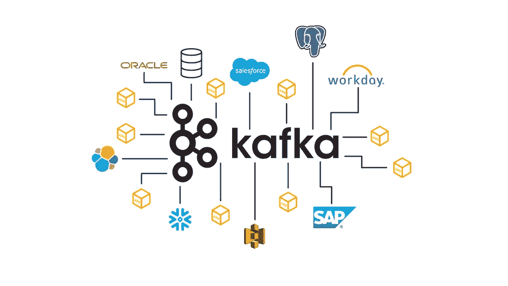
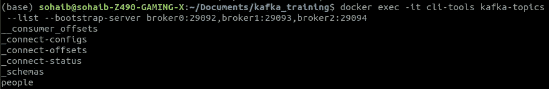
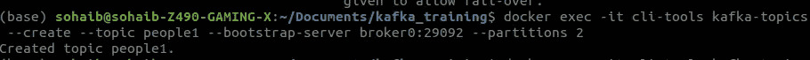
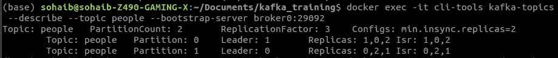
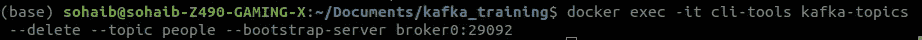
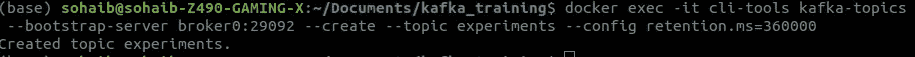
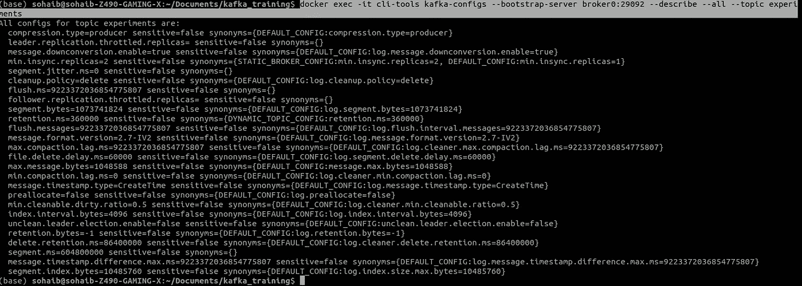
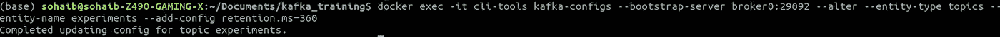
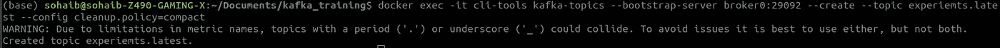

# 卡夫卡装置和卡夫卡主题

> 原文：<https://blog.devgenius.io/kafka-installtions-and-kafka-topics-f0b7c81754d8?source=collection_archive---------4----------------------->



# 卡夫卡启动

Kafka 是一个实时事件驱动的应用程序。如果你想实时观看视频，优步会显示汽车的实时位置，或者你可以在任何电子商务网站上实时查看订单状态。卡夫卡可以用在那里。

# 装置

1.  你需要安装 docker 和 docker-compose，
2.  你只需要下载文件 [docker 文件](https://github.com/SohaibAnwaar/Kafka-KickStart/blob/main/docker-compose.yml)
3.  在终端`docker-compose up -d`输入该命令
4.  要检查您的 Kafka 程序是否正在运行，请输入命令`docker-compose ps`

# 卡夫卡命令

列出卡夫卡主题

```
docker exec -it cli-tools kafka-topics --list --bootstrap-server broker0:29092,broker1:29093,broker2:29094
```



创建卡夫卡主题

```
docker exec -it cli-tools kafka-topics --create --topic people1 --bootstrap-server broker0:29092 --partitions 2
```



获取有关该主题的信息

```
docker exec -it cli-tools kafka-topics --describe --topic people --bootstrap-server broker0:29092
```



删除主题

```
docker exec -it cli-tools kafka-topics --delete --topic people --bootstrap-server broker0:29092
```



# 高级主题创建

在预先主题创建中，我们可以改变我们在 Kafka 中创建的主题的配置，例如消息将在 Kafka 中停留多长时间，这称为保留。

更改保留时间

更改 Kafka 默认保存信息的时间限制为 2 周

```
docker exec -it cli-tools kafka-topics --bootstrap-server broker0:29092 --create --topic experiments --config retention.ms=360000
```



查看主题的所有配置

查看主题配置

```
docker exec -it cli-tools kafka-configs --bootstrap-server broker0:29092 --describe --all --topic experiments
```



更新主题配置如果您想要更新已经创建的主题的配置，您可以通过下面的命令来完成

```
docker exec -it cli-tools kafka-configs --bootstrap-server broker0:29092 --alter --entity-type topics --entity-name experiments --add-config retention.ms=360
```



创建压缩主题如果您想要创建压缩主题，您可以使用此命令

```
docker exec -it cli-tools kafka-configs --bootstrap-server broker0:29092 --alter --entity-type topics --entity-name experiments --add-config retention.ms=360
```



时基保留基于时间的保留是通过设置清除来指定的。删除和设置保留期的策略。毫秒到几毫秒。有了这个设置，事件将至少保留在主题中，直到它们达到时间限制。一旦达到这个限制，它们可能不会被立即删除。这是因为事件删除发生在段级别。一旦其最年轻的事件超过时间阈值，一个段将被标记为删除。

压缩主题与保留策略标准不同，在保留策略标准中，当达到时间或大小时，Kafka 会自动从 Kafka 服务器中删除邮件，您可以借助日志压缩过程手动清理邮件。换句话说，使用日志压缩方法，您可以有选择地从每个主题分区中删除记录被复制或多次出现的通知。

*   索海卜·安瓦尔
*   Gmail:【sohaibanwaar36@gmail.com 
*   LinkedIn : [在这里进行一些专业的谈话](https://www.linkedin.com/in/sohaib-anwaar-4b7ba1187/)
*   堆栈溢出:[在这里获得我的帮助](https://stackoverflow.com/users/7959545/sohaib-anwaar)
*   卡格尔:[在这里查看我的杰作](https://www.kaggle.com/sohaibanwaar1203)
*   GitHub:[https://github.com/SohaibAnwaar](https://github.com/SohaibAnwaar)