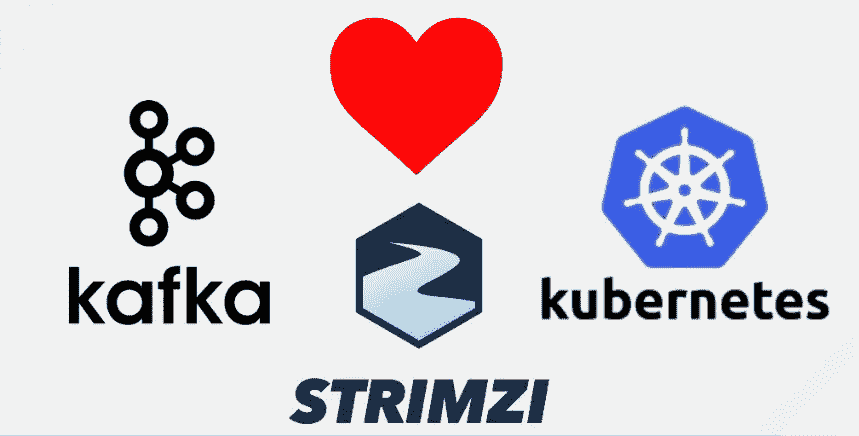
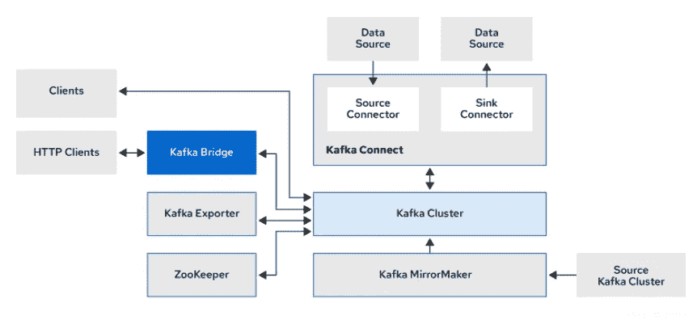
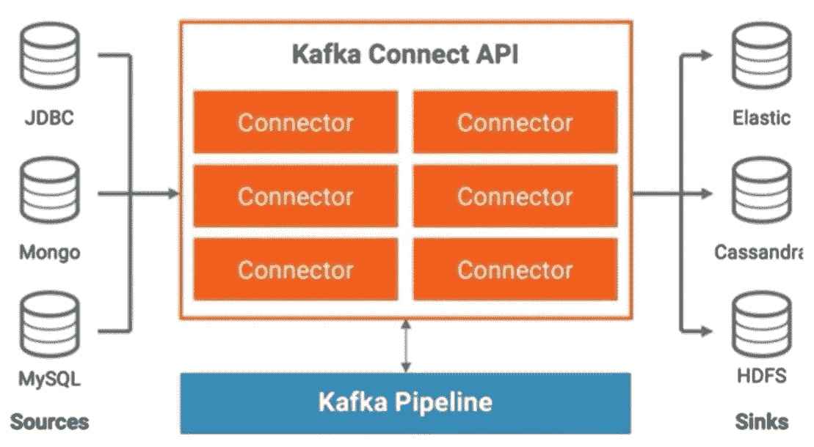
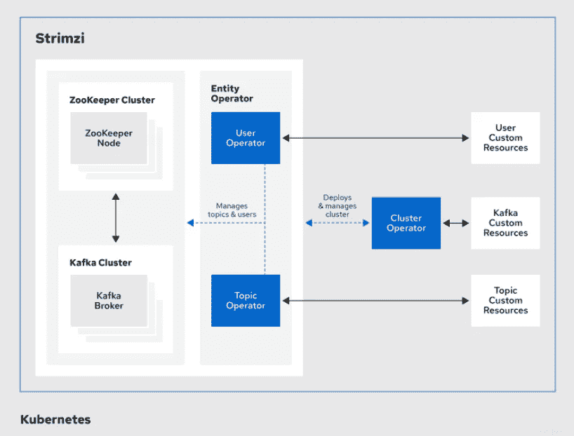

# 库伯内特斯上的卡夫卡:使用斯特里姆齐——第一部分

> 原文：<https://blog.devgenius.io/kafka-on-kubernetes-using-strimzi-part-1-83d74564135e?source=collection_archive---------3----------------------->

来自-[https://www . slide share . net/Paolo pat/strim zi-how-Apache-Kafka-has-fall-in-love-with-kubernetes](https://www.slideshare.net/paolopat/strimzi-how-apache-kafka-has-fallen-in-love-with-kubernetes)

这是博客系列的第一部分， **Kafka on Kubernetes:使用** [**Strimzi**](https://strimzi.io/) 。在这个系列中，我们将讨论以下主题-

1.  ***【Kubernetes 上的 Kafka:使用 Strimzi —第 1 部分*** :这讲的是 Strimzi 提供了哪些操作符来部署和管理 Kubernetes 上的 Kafka 集群。
2.  [***Kafka on Kubernetes:使用 Strimzi —第 2 部分***](https://medium.com/@singh.amarendra/kafka-on-kubernetes-using-strimzi-part-2-71a8ba8e9605)***:***本博客讨论 Kafka 自定义资源的设置和部署选项。
3.  [***Kubernetes 上的 Kafka:使用 Strimzi —第 3 部分***](https://medium.com/@singh.amarendra/kafka-on-kubernetes-using-strimzi-part-3-configuration-options-f8aa027e9ba0)***:***在本文中，我们将讨论如何配置生产就绪的 Kafka 集群以及 Kafka 的高可用性。
4.  [***Kafka on Kubernetes:使用 Strimzi —第 4 部分***](https://medium.com/@singh.amarendra/kafka-on-kubernetes-using-strimzi-part-4-scalability-59da50575fec)***:***这篇文章讨论 Kafka 的可伸缩性以及我们如何使用 [KEDA](https://keda.sh/docs/2.6/concepts/#architecture) (基于 Kubernetes 的事件驱动自动缩放器)进行自动缩放
5.  [***Kafka on Kubernetes:使用 Strimzi —第 5 部分***](https://medium.com/@singh.amarendra/kafka-on-kubernetes-using-strimzi-part-5-security-fc878178cd04)***:***在这一部分中，我们将讨论 Kafka 集群的安全方面，以及如何向资源添加 ACL。
6.  [***【Kafka on Kubernetes:使用 Strimzi —第 6 部分***](https://medium.com/@singh.amarendra/kafka-on-kubernetes-using-strimzi-part-6-monitoring-709a43198bf5)***:***这是系列的最后一部分，它讨论了非常重要的 Kafka 监控部分。

让我们先了解卡夫卡作品的组成部分，以及它们是如何相互作用的-

**卡夫卡组件交互**，来源——[https://strim zi . io](https://strimzi.io/docs/operators/latest/overview.html)

组件简介-

**Zookeeper** — Zookeeper 本质上是一个为[分布式系统](https://en.wikipedia.org/wiki/Distributed_computing)提供分层[键值存储](https://en.wikipedia.org/wiki/Key-value_database)的服务，用于为大型分布式系统提供分布式[配置服务](https://en.wikipedia.org/wiki/Configuration_management)、[同步服务](https://en.wikipedia.org/wiki/Synchronization_(computer_science))和[命名注册表](https://en.wikipedia.org/wiki/Directory_service)。

**卡夫卡中动物园管理员的角色——**

1.  经纪人注册，心跳机制，以保持经纪人名单更新
2.  维护主题列表

*   主题配置(分区、复制因子、附加配置等。)
*   分区的同步副本列表

3.在任何代理关闭的情况下执行领导者选举

4.如果启用了安全性，则存储访问控制列表

*   主题
*   消费者群体
*   用户

5-存储 Kafka 集群 id(第一次代理注册时随机生成)

**Kafka Connect**—Kafka Connect**允许您从外部系统向 Kafka 持续摄取数据，反之亦然。因此，将现有系统与 Kafka 整合起来非常容易。**

*   **一个*源*连接器将外部数据推入 Kafka。**
*   **一个*接收器*连接器从 Kafka 中提取数据**

****

**卡夫卡连接**

****Kafka Exporter—**Kafka Exporter 提取数据作为普罗米修斯指标进行分析，主要是与补偿、消费者群体、消费者滞后和主题相关的数据。**

****Kafka mirror maker—**mirror maker**旨在更容易地将主题从一个 Kafka 集群镜像或复制到另一个集群。它使用 Kafka Connect 框架来简化配置和扩展。****

****MirrorMaker 的主要组件实际上是 Kafka 连接器，如下所示。****

*   *******MirrorSourceConnector***将记录从源集群复制到目标集群，并启用偏移同步。****
*   *******MirrorCheckpointConnector***管理消费者偏移同步，发出检查点，并启用故障转移。****
*   ****最后，***MirrorHeartbeatConnector***提供心跳、复制流监控和复制拓扑的客户端发现。****

****我们现在可以讨论 Strimzi 提供了什么。从 Strimzi 医生那里-****

****Strimzi 简化了在 Kubernetes 集群中运行 Apache Kafka 的过程。它支持 Kafka 使用 [***操作符***](https://kubernetes.io/docs/concepts/extend-kubernetes/operator/) 来部署和管理 Kafka 到 Kubernetes 的组件和依赖关系。Strimzi 操作符扩展了 Kubernetes 的功能，自动化了与 Kafka 部署和可维护性相关的常见和复杂任务。****

********

******Strimzi 运算符**，来源—[https://strimzi.io/](https://strimzi.io/)****

******集群操作符—** Strimzi 集群操作符部署和管理集群，用于:****

*   ****Kafka(包括 ZooKeeper、话题运营、用户运营、Kafka 导出器、巡航控制)****
*   ****卡夫卡连接****
*   ****卡夫卡镜子制造商****
*   ****卡夫卡桥****

****[定制资源](https://kubernetes.io/docs/concepts/extend-kubernetes/api-extension/custom-resources/)用于部署集群。****

******主题操作符** —主题操作符提供了一种通过 Kubernetes 资源管理 Kafka 集群中的主题的方法，反之亦然。****

****具体来说，如果一个`KafkaTopic`是:****

*   ****在 Kafka 集群中，**创建了**、**删除了**或**更新了**，主题操作者对 Kubernetes KafkaTopic 资源做同样的操作，使其与实际的 Kafka 主题保持同步。****

****同样，如果一个主题是:****

*   ******在 Kafka 集群内创建、删除或更新**，操作员对`KafkaTopic`进行相同的操作****

****这允许您声明一个`KafkaTopic`作为应用程序部署的一部分，主题操作者将负责创建和协调主题。****

******用户操作员—** 用户操作员通过监视描述 Kafka 用户的`KafkaUser`资源来管理 Kafka 集群的 Kafka 用户。****

****例如，如果一个`KafkaUser`是:****

*   ****创建、删除或更新用户操作员创建、删除或更新其描述的用户****

****与主题操作符不同，用户操作符不会将 Kafka 集群中的任何更改与 Kubernetes 资源同步。****

******结论** —在博客系列 **Kafka on Kubernetes 的第 1 部分中—使用 Strimzi，**我们讨论了各种 Kafka 组件及其交互，然后讨论了 Strimzi operators 如何管理 Kubernetes 上的 Kafka 集群。在下一部分中，我们将看到如何使用 Strimzi 在 Kubernetes 上设置 Kafka。我们将用默认配置设置一个 Kafka 集群和 Zookeeper。****